# EKS Agent Platform (Agentgateway): Architecture

| | |
|---|---|
| Status | Proposed target architecture. Not selected, not deployed, no pilot results. |
| Version | 0.1 draft, 5 October 2026 |
| Based on | The notes in [`Notes/Infra/AgentGateway/`](../../Notes/Infra/AgentGateway/README.md), the [comparison basis](../../Notes/Infra/README.md) and [`Notes/Applications/`](../../Notes/Applications/README.md), as of 5 October 2026 |
| Upstream documentation checked | 5 October 2026: Agentgateway 1.6.x, kagent 1.0 alpha, Istio 1.31.1, Agentregistry |
| Audience | Architects, leads, developers, DevOps and platform engineers |

This document describes one of two options under evaluation for an internal agent platform. The option builds on the EKS infrastructure we already operate and uses Agentgateway as its connectivity layer. The directory is named for Agentgateway; the option as a whole is called the EKS agent platform, because discovery, hosted execution and delivery are part of it too.

The notes remain the working record. This document turns them into one description of the design, adds diagrams, and collects the open questions in one place. Where the two disagree, treat it as a defect in this document.

## Contents

1. [Summary](#1-summary)
2. [Goals and scope](#2-goals-and-scope)
3. [Constraints and existing environment](#3-constraints-and-existing-environment)
4. [System context](#4-system-context)
5. [Solution strategy](#5-solution-strategy)
6. [Building blocks](#6-building-blocks)
7. [Runtime views](#7-runtime-views)
8. [Deployment view](#8-deployment-view)
9. [Identity and authorization](#9-identity-and-authorization)
10. [Trust boundaries and bypass prevention](#10-trust-boundaries-and-bypass-prevention)
11. [Repositories and configuration authority](#11-repositories-and-configuration-authority)
12. [Release, promotion and rollback](#12-release-promotion-and-rollback)
13. [Building on the platform](#13-building-on-the-platform)
14. [Observability and operations](#14-observability-and-operations)
15. [Cost model](#15-cost-model)
16. [Risks, open decisions and validation](#16-risks-open-decisions-and-validation)
17. [Relationship to the AgentCore option](#17-relationship-to-the-agentcore-option)
18. [Glossary](#18-glossary)
19. [Sources](#19-sources)
20. [Appendix: what the upstream documentation adds to the notes](#20-appendix-what-the-upstream-documentation-adds-to-the-notes)

## How to read this document

| If you are | Start with | Then read |
|---|---|---|
| An architect | Sections 1, 4, 5 and 6 | Sections 9, 10, 16 and 17 |
| A lead | Sections 1, 2 and 13 | Sections 11, 12 and 16 |
| A developer | Sections 13 and 7 | Sections 9.1 to 9.4 and 14.3 |
| A DevOps or platform engineer | Sections 6, 8 and 10 | Sections 11, 12, 14 and 15 |

Every component carries one of four status labels. The diagrams show the same labels by color, border style and badge.

| Label | Meaning |
|---|---|
| **Reused** | Exists in our environment today. The design depends on it, and its version and configuration still have to be inventoried. |
| **New** | Added by this platform. |
| **Optional** | Added only when a stated need appears. |
| **Candidate** | Under evaluation, and labeled alpha or experimental by its own project. |

Three phrases mark how far a statement can be trusted.

| Phrase | Meaning |
|---|---|
| **Working assumption (WA-n)** | A choice this document makes where the notes leave a fork open, so that the rest of the design can be concrete. Each one is listed in [section 3.3](#33-working-assumptions) and has an open decision in [section 16.2](#162-open-decisions). |
| **Documented upstream** | Stated by the component's own documentation on the date above. We have not tested it. |
| **To validate** | Needs a pilot result before anyone relies on it. |

Anything not marked is proposed design from the notes. Nothing in this document has been demonstrated.

## 1. Summary

The platform does three things on the EKS infrastructure we already run:

1. It gives the developer clients people already use governed access to approved tools and models.
2. It lets a service team publish a tool or written guidance for its API without owning the agents that consume it.
3. It hosts agents where a component needs a hosted process.

The first two do not require hosted execution. A team can get value from the platform without deploying an agent.


Five points carry most of the design:

- **Access comes before hosting.** The first deliverable is one existing client, one read-only tool and one approved model, with a debugging path that works for an ordinary developer.
- **The gateway is the control point.** Agentgateway verifies the caller, decides which tools and models that caller may use, holds the model provider's credential and applies budgets. It is a control point only if calls around it are denied, and those controls are not yet selected ([section 10](#10-trust-boundaries-and-bypass-prevention)).
- **Services keep business authorization.** Gateway permission to call a tool never replaces the service's own checks on tenant ownership, limits and idempotency.
- **Delivery reuses what we have.** Components publish immutable artifacts. A merge request (MR) selects an artifact for an environment, and the existing GitLab CI/CD and Helmfile pipeline applies it. Each object has one writer.
- **Maturity is uneven.** Agentgateway is the core. kagent 1.0 is alpha, Istio's Agentgateway integration is experimental, and no cost has been priced.

| | State on 5 October 2026 |
|---|---|
| Selected | Nothing. Neither this option nor AgentCore has been chosen. |
| Working assumptions in this document | A standalone Agentgateway controller, conventional Deployments as the default for hosted agents, and Agentregistry as a catalog only ([section 3.3](#33-working-assumptions)). |
| Still open | The credential a model request carries, the entry point for hosted agents, the bypass controls, the telemetry backend, the secret mechanism and every requirement value ([section 16](#16-risks-open-decisions-and-validation)). |

## 2. Goals and scope

### 2.1 Problems

Developers have no repeatable way to find approved capabilities, authenticate to them, diagnose a failure or publish a service integration. Service teams should own their APIs, tool contracts and guidance without owning every agent that consumes them. Teams that need a hosted agent should get supported execution and persistence, not infrastructure assembled one agent at a time.

### 2.2 The three workflows

| Workflow | The developer changes | The platform provides |
|---|---|---|
| Consume tools or models from an existing client | Client connection settings, and an access request where needed | Supported endpoints, Okta integration, permissions and diagnostics |
| Publish a service capability | The existing service repository: an MCP adapter or service guidance | Packaging, discovery, gateway integration and optional hosting |
| Run a hosted agent | The agent implementation or native declarative configuration | A supported execution profile, identity, telemetry and deployment conventions |

### 2.3 Quality goals

The quality goals are the ten criteria of the scorecard this option shares with AgentCore. The table shows what the design does about each one.

| Criterion | Design response | Section |
|---|---|---|
| Developer value | Existing clients first; three short workflows; a catalog that is not needed per call | [13](#13-building-on-the-platform) |
| Delivery effort | Reuse of existing services; native component APIs; no universal deployment language | [5](#5-solution-strategy), [6](#6-building-blocks) |
| Team autonomy | Guidance published without compute; consumers pin versions and adopt on their own schedule | [7.4](#74-a-service-publishes-guidance-and-a-consumer-adopts-it) |
| Security | Okta-verified identity at every entry; exact entitlements; denied bypass paths; business authorization downstream | [9](#9-identity-and-authorization), [10](#10-trust-boundaries-and-bypass-prevention) |
| Release safety | Immutable artifacts; selection by MR; checks proportional to the change; two defined recovery paths | [12](#12-release-promotion-and-rollback) |
| Reliability | A reliable baseline for the gateway and persistent services; disruption and restore drills | [8](#8-deployment-view) |
| Debugging | One trace from client to service, readable with normal team access | [14](#14-observability-and-operations) |
| Operational burden | A named owner per component; pinned and tested version combinations | [14](#14-observability-and-operations) |
| Cost and performance | Incremental and allocated cost reported side by side; spending controls at the gateway | [15](#15-cost-model) |
| Portability | Protocols as the contracts (MCP, A2A, OTLP); application packages meant to run under either option | [17](#17-relationship-to-the-agentcore-option) |

### 2.4 Deferred

The design defers the following until measurements justify them: a universal deployment language, a custom promotion service, a mandatory catalog approval state machine, additional portals, self-hosted model inference, more than one AI engineering backend, and automated rollback triggered by quality scores.

### 2.5 Roles

These are proposed roles, not assigned people.

| Role | Owns | Does not own |
|---|---|---|
| Platform team | Agentgateway, mandatory gateway restrictions, charts, profiles, CI/CD components, capacity conventions | Component behavior, business authorization |
| Identity team | Okta authorization servers, the claims contract, how entitlement removal takes effect | Tool business rules |
| Security | Review of expanded access, verification of bypass controls, data classification | Day-to-day releases |
| Service teams | APIs, MCP adapters, tool contracts, guidance bundles, business authorization | The agents that consume them |
| Agent teams | Agent behavior, scenarios, content pins, tool selection | Backend rights; they cannot grant these to themselves |
| Observability team | Collectors, vendor export, the telemetry backend | Component instrumentation |
| Runtime owner, if kagent is adopted | kagent, Agent Substrate, worker pools, snapshots | Agent behavior |
| Decision owner | Pilot duration, review date, stop conditions, the architecture decision record (ADR) | |

## 3. Constraints and existing environment

### 3.1 What we reuse

Reuse these before introducing replacements. Their versions, topology, capacity, licensing and configuration have not been inspected.

| Existing capability | Role in this platform | Verify before depending on it |
|---|---|---|
| EKS | Hosts Agentgateway and optional hosted workloads | Kubernetes version, capacity, tenancy and lifecycle |
| Istio | Service networking between workloads | Mode, controller ownership and supported traffic paths |
| Kyverno | Admission restrictions | Enforced rules and permitted exceptions |
| Karpenter | Node provisioning | Compatible pools, disruption behavior and capacity limits |
| CloudNativePG | PostgreSQL for registry, runtime and application state | Privileges, extensions, high availability, backup and connection limits |
| OpenTelemetry | Telemetry collection and export | Authentication, queues, signal coverage and vendor ingestion |
| Helm and Helmfile | Component and environment selection | Chart pinning, dependency order, diff and recovery |
| Terraform, OpenTofu, Terragrunt | AWS additions | Existing state ownership and version compatibility |
| Okta | Corporate authentication | Authorization servers, clients, grants, claims and licensing |
| GitLab.com Ultimate | Source control, MR review and CI/CD on self-hosted runners in the EKS cluster | Runner namespace and node pool, what job pods can reach and assume, how images are built without privileged pods, federated identity to AWS and the cluster |
| ECR | Container images and Helm charts as OCI artifacts; content bundles | Tag immutability, lifecycle rules, scanning and cross-account pulls |

### 3.2 What the inventory must still identify

The supplied environment list does not name these. The delivery, identity and bypass designs depend on them, so the inventory records them first.

| Not yet identified | Needed for | Record |
|---|---|---|
| Object storage | Packages, artifacts and runtime snapshots | Buckets, encryption, access model and lifecycle rules |
| Secret delivery mechanism | Provider keys, database and vendor credentials | Product, rotation behavior and workload integration |
| Network policy enforcement | Bypass prevention and egress restriction | Policy engine, default-deny posture and who can change policy |
| Operational telemetry backend | Debugging and release verification | New Relic or Dynatrace |
| Model providers | Model access through the gateway | Providers, accounts, regions, private connectivity and credential type |

### 3.3 Working assumptions

| ID | Working assumption | Reason | Closed by |
|---|---|---|---|
| WA-1 | Agentgateway runs under its own controller and the `agentgateway` GatewayClass. It is not managed by Istio. | Istio labels its Agentgateway integration experimental and for evaluation only, and Istio's own policy APIs are not applied to that proxy. One controller owns each GatewayClass. | Decision D-1 |
| WA-2 | A hosted agent is a conventional Deployment or Job by default. kagent with Agent Substrate is a candidate track. | kagent 1.0 is alpha and its bring-your-own contract excludes some adapters. The notes require a conventional path in any case. | Decision D-2 |
| WA-3 | Agentregistry, if adopted, is a catalog. It writes no production object. | One writer per object ([section 11.3](#113-configuration-authority)). | Decision D-3 |
| WA-4 | The pilot starts with one gateway endpoint in dev for one domain. Gateways are split later along permission and failure boundaries. | The initial scope is one client, one read-only capability and one model. | Pilot step 2 |
| WA-5 | Pinned guidance and prompts are baked into the consumer's image at build time. | The bytes that were evaluated are the bytes that run. | Decision D-12 |
| WA-6 | Langfuse is not deployed in the initial pilot. | The notes treat it as optional. It adds PostgreSQL, ClickHouse, a cache, blob storage and worker services, and the initial scope defers AI engineering backends until measurements justify them. | Decision D-13 |
| WA-7 | Diagrams show one environment. Dev, stage and prod exist, but whether they share a cluster is unknown. | The notes reuse the organization's current environment and account model without describing it. | Inventory |

Four forks carry no assumption, because nothing in the notes or the upstream documentation favors one side: the credential a model request carries (D-4), the entry point for hosted agents (D-5), whether model traffic is refused or allowed when the rate-limit server is down (D-6), and which controls deny each bypass path (D-7).

## 4. System context

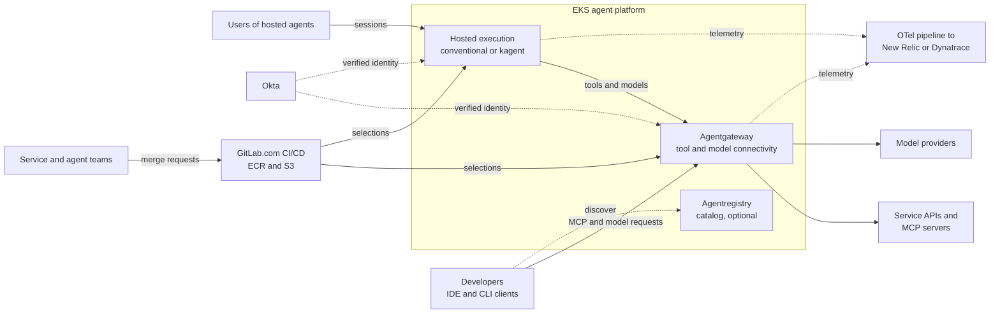

Both client paths require an Okta-verified identity. A hosted entry point that is not a gateway route must authenticate users itself; it does not inherit the gateway's checks. Catalog discovery and CI delivery are outside the runtime request path.

| External system | Interface | Direction |
|---|---|---|
| Developer clients | MCP over HTTP with OAuth; a model endpoint configured as a base URL and bearer credential | Into the gateway |
| Okta | OAuth 2.0 and OpenID Connect; token validation through published keys | Tokens to clients; keys to the gateway |
| Model providers | Provider APIs, called with a credential the gateway holds | Out of the gateway |
| Service APIs and MCP servers | MCP from the gateway; each service's own API behind its adapter | Out of the gateway |
| GitLab.com | MRs and pipelines on self-hosted runners; federation to AWS and the cluster by ID token | Into the cluster and AWS |
| ECR, S3 | Images, charts and bundles by digest; snapshots and packages | Pulled by the cluster and by pipelines |
| New Relic or Dynatrace | OTLP export from existing collectors | Out of the cluster |

## 5. Solution strategy

1. **Access before hosting.** Tool and model access for existing clients is delivered first. Compute is deployed only when a component needs a hosted process.
2. **Reuse before replace.** Existing cluster services are used where they fit. Each addition has an adoption condition ([section 6.1](#61-component-catalog)).
3. **Native APIs over a new abstraction.** Workloads are described with Helm values or the runtime's own resources. A profile is a reviewed example to copy, not a new API, and no universal agent specification or `deployment.yaml` compiler is introduced.
4. **One writer per object.** Each object or field has one owner, including resources that controllers generate ([section 11.3](#113-configuration-authority)).
5. **Immutable artifacts, selected per environment.** The same bytes move from dev to prod. Endpoints, identities and data bindings differ by environment.
6. **Checks proportional to the change.** A compatible change uses a normal rollout. Parallel versions and isolated candidates are used only for an identified contract, state, policy or session risk.
7. **Controls live where a team cannot remove them.** Platform rules are enforced at the gateway, at admission and in the network. A shared library is a convenience, because a team can build without it.
8. **Business authorization stays downstream.** The gateway decides who may call a tool. The service decides whether this payment may be refunded.
9. **Static consumers.** Endpoints and content are resolved when a client is configured or an agent is released. A catalog outage does not stop them.
10. **Evidence before adoption.** A component is added when it solves an observed requirement, and an experiment without an agreed threshold produces an observation, not a pass.

## 6. Building blocks

### 6.1 Component catalog

| Capability | Component | Status | Adoption condition |
|---|---|---|---|
| Tool and model connectivity | Agentgateway | New | Actual clients, protocols, authentication and telemetry work |
| Model credentials and budgets | Agentgateway LLM backends; its rate-limit server for shared token budgets | New | Providers selected; caller authentication, credential custody and budget enforcement demonstrated |
| Corporate identity | Okta | Reused | Required grants, claims and audiences supported |
| Network controls | Istio and the cluster's network policy enforcement | Reused | Each intended path and each bypass restriction demonstrated |
| Infrastructure admission | Kyverno | Reused | Permitted deployment and policy changes enforceable |
| Discovery | Agentregistry | Optional | The catalog reduces onboarding effort and has suitable access controls |
| Trusted hosted application | Conventional EKS Deployment or Job | New convention on reused EKS | Framework and lifecycle meet the workload |
| Declarative and session execution | kagent and Agent Substrate | Candidate | Native management, isolation and density justify operating them |
| Metadata and checkpoints | CloudNativePG | Reused | Application schema, isolation and recovery proven |
| Artifacts and snapshots | ECR, S3, GitLab package registry | Reused | Integrity, reader permissions and retention established |
| Operational telemetry | OTel with New Relic or Dynatrace | Reused | Trace continuity and required signals visible |
| Prompt and evaluation workspace | Langfuse | Optional | Teams need the workflow enough to justify its dependencies |

### 6.2 Agentgateway

Agentgateway mediates configured connections between callers and tools, models and agents.

**Structure (documented upstream).** A Kubernetes controller watches Gateway API resources and Agentgateway custom resources, translates them into the proxy's configuration and serves it over xDS. For each `Gateway` that uses the `agentgateway` GatewayClass, a deployer provisions a proxy Deployment. The proxy handles HTTP, gRPC, MCP, A2A and LLM traffic.

| Resource | API | Purpose |
|---|---|---|
| `Gateway`, `HTTPRoute`, `GRPCRoute` | Kubernetes Gateway API | Listeners and routing |
| `AgentgatewayBackend` | `agentgateway.dev/v1alpha1` | A destination: an MCP server, a model provider, an agent runtime |
| `AgentgatewayPolicy` | `agentgateway.dev/v1alpha1` | Traffic, security and transformation rules |
| `AgentgatewayParameters` | Agentgateway custom resource | Listed upstream with the other two; its fields were not checked for this document |

**For tools.** The gateway terminates MCP from clients and agents, authenticates the caller with Okta, filters the tool list to what the caller may use and forwards permitted calls with its own identity. Documented upstream: static, dynamic and virtual MCP backends, where virtual MCP federates several servers behind one endpoint; stateful or stateless session routing; and tool access rules written as CEL expressions over token claims and the tool name.

**For models.** The gateway holds the provider credential, restricts callers to approved models and applies budgets. Documented upstream: the credential can be inline in configuration, in a Kubernetes Secret that the backend references, or passed through from the client. This design references a secret or uses workload identity where the provider backend supports it, keeps keys out of inline configuration, and allows passthrough only where a caller is meant to hold its own provider account.

**Policy model (documented upstream).** A policy has frontend, traffic and backend sections. Each attaches at a different set of targets: frontend at the Gateway; traffic at Gateway, ListenerSet, HTTPRoute or GRPCRoute; backend additionally at a Service or `AgentgatewayBackend`. When several policies apply, sections merge field by field. For traffic policies the more specific target wins, in the order Gateway, Listener, Route, Route rule, and the oldest policy wins a tie. A platform policy is therefore not automatically a restriction that teams cannot override ([section 9.5](#95-gateway-policy-ownership)).

**Rate-limit server.** Shared token budgets depend on global rate limiting, which needs a separately deployed rate-limit server. Documented upstream: local rate limiting counts requests, not model tokens, so it cannot act as a token budget, and only global limiting supports day-long budgets. Rate limiting is evaluated before prompt guards, so a request that a guardrail rejects still consumes quota. A token limit is also not a currency budget across models with different prices. If budgets are adopted, this server joins the baseline with an owner.

**What it is not.** Agentgateway does not replace downstream business authorization, application state or a workflow engine. Shared endpoints follow permission and failure boundaries: not a gateway per agent, and not one universal proxy for every environment.

### 6.3 Agentregistry

Agentregistry is a catalog of MCP servers, agents, skills and prompts, with a server, the `arctl` CLI, a web UI and a PostgreSQL database (documented upstream). Publication makes a capability discoverable. Deployed selections and service permissions remain independent of it, and a registry outage does not stop agents whose dependencies are already resolved.

Agentregistry also documents a deployment integration: `arctl` applies its own `ar.dev/v1alpha1` `Deployment` resource, which produces kagent `Agent` and `MCPServer` resources and pods. That page names no kagent version and none of the kagent 1.x resources, so it appears to target the 0.x model. That is an inference from the page, not a documented statement. Under WA-3 the integration is not used for production, because it would be a second writer. A dedicated sandbox may use it for local development.

### 6.4 Hosted execution: conventional workloads

Conventional Deployments suit trusted applications that serve requests and keep session state outside the process. Jobs or workers suit bounded asynchronous work. The platform chart supplies the conventions: workload identity, resources, telemetry and gateway bindings. The application sets request concurrency, tool and model timeouts, maximum iterations and tokens, and graceful shutdown. A gateway request timeout alone does not stop downstream execution.

### 6.5 Hosted execution: kagent and Agent Substrate

kagent is a candidate for declarative agents and isolated sessions. Its 1.0 documentation is labeled alpha and replaces the 0.x Deployment-based `Agent` with a new resource model. Use one pinned generation in the pilot and do not mix resource examples across generations.

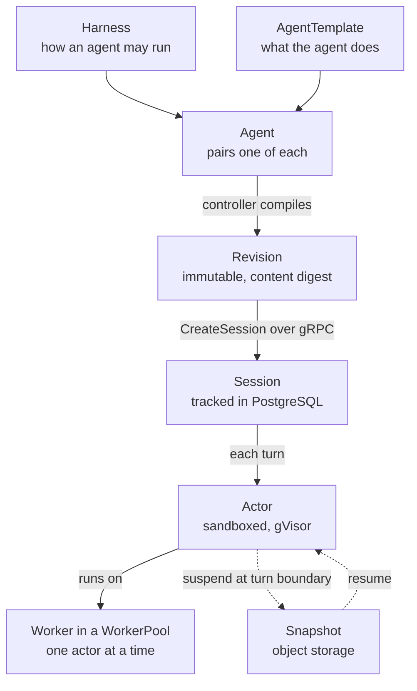

All of the following is documented upstream and to validate.

| Topic | What the kagent 1.0 documentation states |
|---|---|
| Resources | `Harness`, `AgentTemplate` and `Agent` are `api.kagent.dev/v1alpha3` resources. A Revision is the compiled, immutable output of one Agent. A Session is not a Kubernetes resource: it is created through kagent's gRPC API and tracked in PostgreSQL. |
| Session access | `CreateSession` is governed by kagent's own authentication and authorization, not by Kubernetes RBAC. A caller then addresses the Agent over A2A with the session ID as the context ID. |
| Execution | A worker is a pre-started sandboxed pod that hosts at most one actor at a time, and only while a turn runs. kagent suspends the actor at every turn boundary and frees the worker. A pool is sized for concurrent turns, not for the number of agents or sessions. |
| Isolation | kagent compiles every actor to the `gvisor` sandbox class. Workers in a microVM pool accept no kagent actor. |
| Egress | An actor reaches the network only through Agent Substrate's egress gateway, which authorizes each connection against a per-actor policy. The policy is default-deny, and kagent derives the allowlist from the AgentTemplate. A session keeps the allowlist of the revision it was created from. |
| Snapshots | The Harness names the snapshot location. A development installation uses an in-cluster object store with well-known credentials and is not durable. Production needs a real bucket, credentials that are not shared defaults, and a backup policy. |
| Sizing | Generated worker pods carry no resource requests or limits unless supplied. |
| Node dependencies | Nodes fetch sandbox runtime assets from a public Google Cloud Storage URL named in the SandboxConfig. A cluster with restricted egress needs a path to it or a hosted copy. |

**Bring-your-own images.** An arbitrary agent image does not run unchanged. The container must serve the A2A service over gRPC on port 80 and answer `GET /readyz` on port 8081, and the Harness sets the command. The `kagent-adk` Python package and the Go helper meet the contract. The `kagent-langgraph` and `kagent-crewai` adapters do not, because they serve A2A as JSON-RPC with no gRPC server. An image that listens on the wrong port still reports ready, and the mismatch appears only when an invocation fails. Check the pilot agent against this contract before planning to run one image on both execution paths.

**What kagent could save, and what it costs.** The native model could avoid building a custom agent specification and session controller. It adds a controller, the Substrate control plane, worker pools, a snapshot store and an alpha upgrade path. Decide whether gVisor meets the execution-trust requirement before testing density.

### 6.6 Persistence and artifacts

| Store | Holds | Rule |
|---|---|---|
| CloudNativePG | Registry, runtime and application state | Separate databases, credentials and migration ownership. Sharing PostgreSQL is not a reason to share a database. |
| S3 | Runtime snapshots, packages, artifacts | Encryption, tenant access, retention and restore procedures defined per use |
| ECR | Images, Helm charts and content bundles as OCI artifacts | Pinned by digest. Anything a running pod or the cluster pulls stays in ECR or S3, where workload IAM applies. |
| GitLab package registry | Packages that only pipelines read, such as internal libraries | Duplicates turned off, package protection rules added, recorded hash still verified |

Runtime snapshots, SQL session metadata and external side effects are three different recovery boundaries. Restoring only one may not restore a usable conversation.

### 6.7 Versions and maturity

No version is pinned. The pilot records the tested combination in a compatibility inventory; this table records only what the documentation showed on 5 October 2026.

| Component | Documented version | Documented maturity | Status here |
|---|---|---|---|
| Agentgateway on Kubernetes | 1.6.x | Custom resources at `v1alpha1`; no maturity label on the pages checked | New |
| Istio integration of Agentgateway | Istio 1.31.1 | Experimental, for evaluation only | Not used (WA-1) |
| kagent | 1.0 | Alpha; resources at `v1alpha3` | Candidate |
| Agent Substrate | Documented within kagent 1.0 | Covered by the same alpha documentation | Candidate |
| Agentregistry | Not shown on the pages checked | Deployment API at `v1alpha1`; no maturity statement found | Optional |
| Langfuse, self-hosted | Not checked | Not checked | Optional, not in the pilot |
| EKS, Istio, Kyverno, Karpenter, CloudNativePG, OTel | Not inspected | | Reused |

The compatibility inventory records: Kubernetes and EKS version, Istio mode, gateway controller and GatewayClass, Gateway API channel and version, Agentgateway chart, proxy and CRDs, the rate-limit server, kagent generation, API and CLI, Substrate worker and sandbox version, registry integration, database requirements, and OTel instrumentations and exporters. Two separately documented capabilities are not proof that they integrate.

## 7. Runtime views

The sequences show intended behavior. Client compatibility, token handling and each denial are experiments, not established results.

### 7.1 A developer client calls a tool

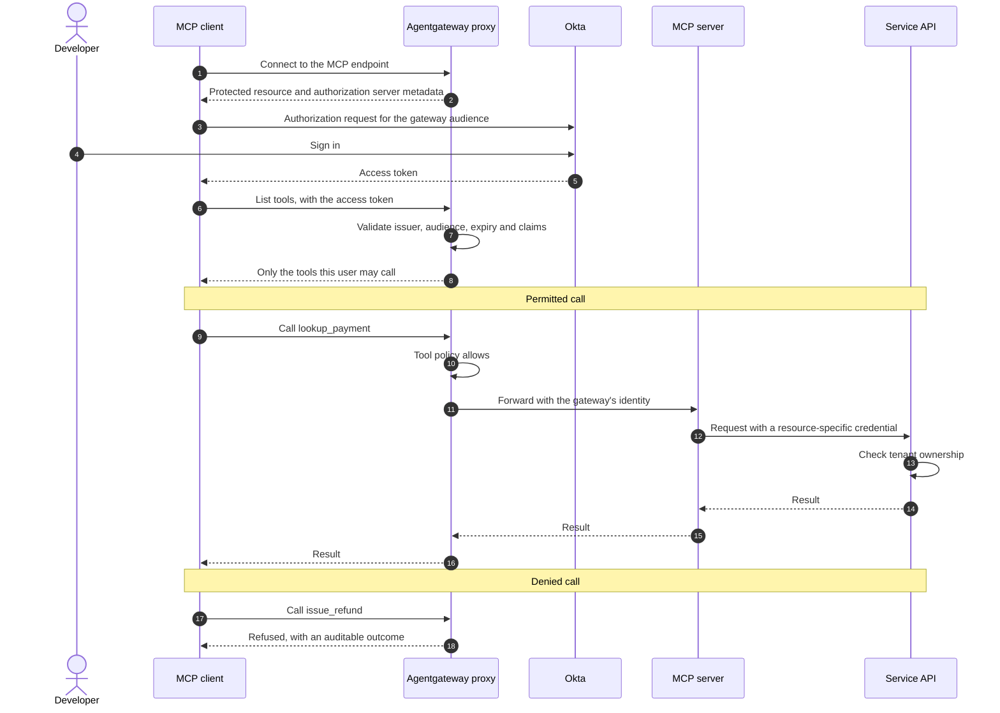

Documented upstream: Agentgateway serves the protected resource metadata itself and has a native Okta provider that bridges three gaps. It serves authorization server metadata from Okta's OpenID Connect discovery document, adds the configured audience to the authorization request because Okta does not support resource indicators, and proxies dynamic client registration. Pre-registering the client ID is recommended, because Okta's registration endpoint usually needs an API token that MCP clients do not have.

Tools the caller may not use are hidden from the list, and a call to one is refused (documented upstream). The service still enforces tenant ownership on a permitted call.

No agent workload, session database or worker pool exists for this developer.

### 7.2 A model request

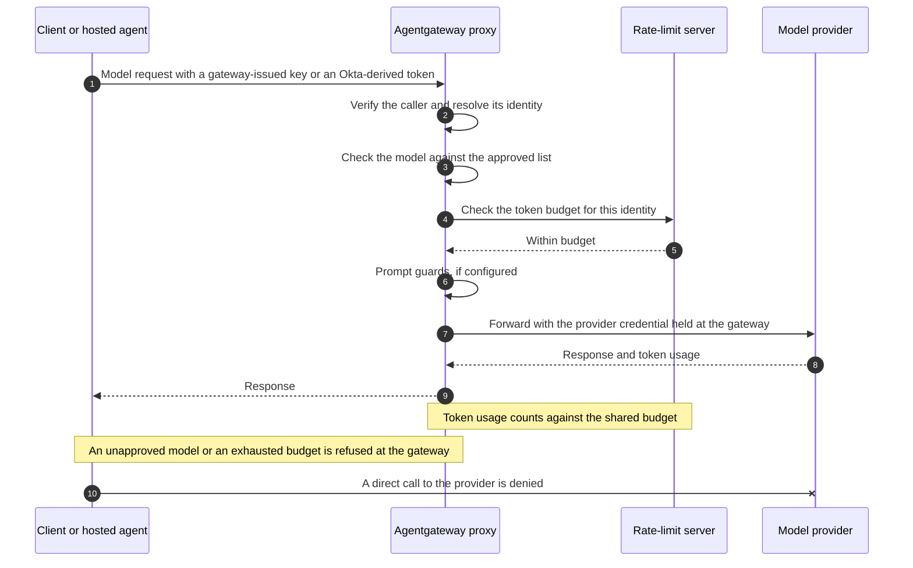

Clients usually configure a model endpoint as a base URL and a bearer credential, not through the MCP OAuth flow. The Okta MCP provider therefore does not by itself cover model requests, and each supported client needs an established way to carry a verified identity (decision D-4). The developer never holds the provider's key. Usage is attributed from the verified identity, not from a header the caller supplies.

### 7.3 A hosted agent acts for a user

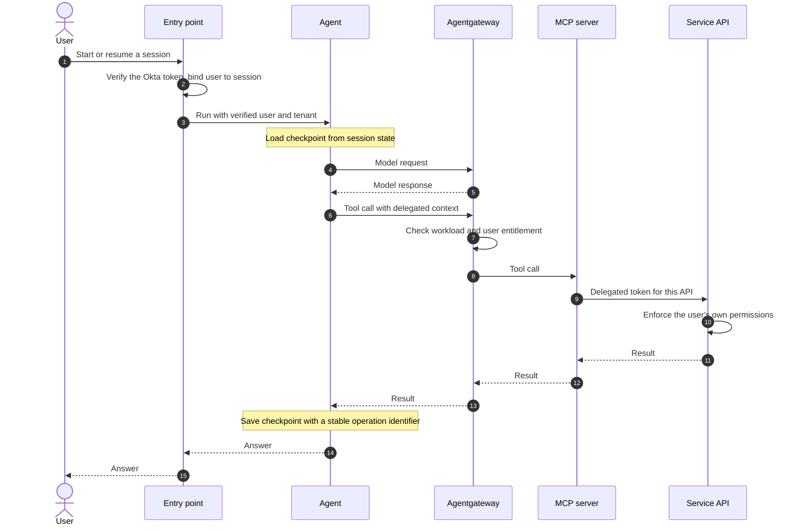

Three rules sit behind this sequence:

- The agent runs under its own workload identity. It does not inherit a broad platform execution role.
- When an operation must follow the human's permissions, the tool path obtains a resource-specific delegated credential. If that flow is unavailable, the capability is limited or uses a separately approved machine operation. It never falls back silently to a privileged service credential.
- A batch job has no user. It calls tools as a named machine identity whose autonomous permissions are granted explicitly.

Whether the entry point is a gateway route or the runtime's own API is open (D-5).

### 7.4 A service publishes guidance and a consumer adopts it

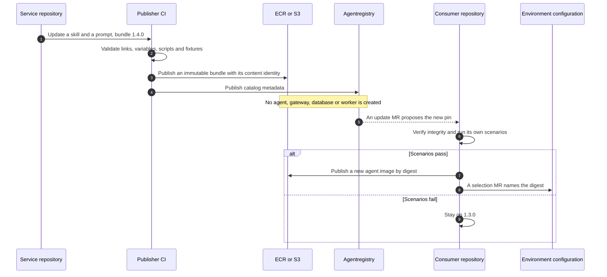

Publication and adoption are separate releases with separate owners. A consumer stays on its pinned version until its owner updates the pin and evaluates the composed behavior. If catalog publication fails after upload, the metadata step is retried without rebuilding the bytes. Guidance cannot grant a tool permission or create an authenticated connection, and a bundle that ships scripts is a code dependency that runs with the consumer's credentials.

### 7.5 Behavior when a dependency fails

| Failure | Intended behavior | State |
|---|---|---|
| Agentregistry unavailable | Statically configured consumers keep working; new discovery pauses | To validate |
| Rate-limit server unavailable | Model traffic is either refused or allowed. Not decided, and not stated on the upstream budget page. | Open, D-6 |
| Gateway proxy or controller outage | Known effect on clients, agents and in-flight sessions; recovery without manual repair | To validate |
| Telemetry export fails | Bounded queues. A telemetry failure does not silently invalidate a mandatory release check. | To validate |
| Worker or node interruption | Session loss and recovery are observed; side effects are handled by idempotent operations | To validate |
| Tool or service API outage | Bounded retries and a clear "capability unavailable" response | Proposed |
| Agent crashes after an external write | The retry carries the same operation identifier, and the backend deduplicates or reconciles | Proposed |

## 8. Deployment view

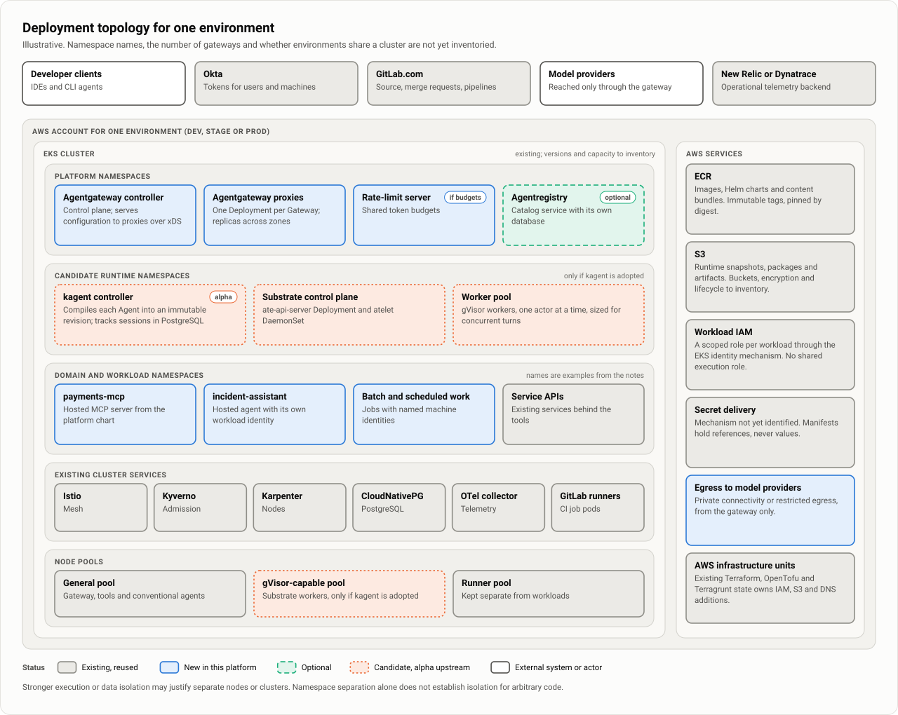

The picture is illustrative. The notes define no namespace names, no gateway count and no statement on whether environments share a cluster (WA-7). The example workloads `payments-mcp` and `incident-assistant` come from the worked examples.

### 8.1 Gateway controller

One controller owns each GatewayClass and resource scope. A standalone Agentgateway controller and an Istio-managed Agentgateway are different integrations, and their policy examples are not interchangeable.

| | Standalone controller (WA-1) | Istio-managed |
|---|---|---|
| GatewayClass | `agentgateway` | `istio-agentgateway` for ingress, `istio-agentgateway-waypoint` for waypoints |
| Maturity | No experimental label on the pages checked | Experimental, for evaluation only; enabled by a feature flag on istiod; documented under ambient mode |
| Istio policy on the proxy | Not applicable | `AuthorizationPolicy`, `RequestAuthentication`, `PeerAuthentication` and Istio's other configuration APIs are not applied to the Agentgateway proxy |
| Open point | How the proxy presents an identity that mesh backends accept, given the cluster's Istio mode | Whether the experimental status is acceptable |

In both cases Istio's policy APIs may still protect backend workloads in the mesh. Mesh egress settings are not a boundary where a workload can avoid its proxy; pair them with network policy.

### 8.2 Network paths

| Path | Treatment |
|---|---|
| User client to gateway | TLS and supported Okta authentication |
| Client or agent to model endpoint | Gateway-issued or Okta-derived credential; approved models only |
| Gateway to MCP server or backend | Explicit backend identity and TLS or mesh configuration |
| Gateway to model provider | Provider credential held by the gateway; private connectivity or restricted egress where available |
| Agent to approved tools and models | The governed endpoint, or an explicitly equivalent approved path |
| Workload to AWS | Scoped workload IAM through the supported EKS identity mechanism |
| Workload to internal API | Existing private networking plus service authorization |
| Collector to vendor | Authenticated OTLP export |

Document DNS, connection limits, streaming timeouts and private endpoint requirements from the actual call graph. A route in the gateway is not proof that a workload cannot connect directly to a backend or a provider.

### 8.3 Capacity and scaling

- Keep a reliable baseline for the gateway, its controller and the persistent services.
- Workload scaling creates pod or worker demand, and Karpenter supplies node capacity. Karpenter does not decide how many agent or session replicas exist.
- CPU alone under-represents agents that wait on model and tool I/O. Scale on concurrent work, queue depth or supported runtime metrics, and bound maximum concurrency and node spend.
- Keep warm capacity where latency requires it and measure its idle cost.
- Use dedicated node pools where compatibility or trust requires them. Evaluate Spot for retryable work only after interruption behavior is proven.
- For Agent Substrate, set explicit worker requests and limits and size the pool for concurrent turns. Confirm that node images and Kyverno rules permit gVisor workers before sizing a pool.
- The GitLab runners draw on the same cluster capacity.

### 8.4 Availability and recovery

Multiple replicas or availability zones do not by themselves establish end-to-end availability. Before production, demonstrate access boundaries, secret rotation, database and object restore, gateway failure handling and node replacement. Backups need restore drills; a successful snapshot is not proof of recoverability. Availability, recovery time and the rollback window are requirements still to agree.

Stronger execution or data isolation may justify separate nodes or clusters, decided from workload trust and impact. Namespace separation alone does not isolate arbitrary code.

## 9. Identity and authorization

The model separates three parties: the human requesting work, the workload performing it, and the downstream service that authorizes the operation. Every supported connection needs a positive and a negative test.

### 9.1 Connection matrix

| Connection | Credential | Who authorizes |
|---|---|---|
| Developer client to MCP gateway | Okta access token through the supported MCP OAuth flow | The gateway validates issuer and audience and matches exact entitlements |
| Client or hosted agent to model endpoint | Gateway-issued key or Okta-derived token; never the provider's own key | The gateway validates the caller, then applies approved models and budgets |
| Gateway to model provider | Provider credential held by the gateway through the secret mechanism or workload identity | Provider account policy; the gateway limits models and usage |
| User to hosted agent | Supported user authentication at the entry point | The entry point or runtime binds the user to a permitted agent and session |
| Hosted agent to tools | Verified delegated context or a scoped machine credential | The gateway and the downstream service |
| Batch job to tools | Named machine identity | The gateway and the service grant autonomous permissions explicitly |
| Gateway or MCP service to API | Resource-specific delegated token or application credential | The backend checks its own permissions and tenant data |
| Workload to AWS | Scoped EKS workload IAM | IAM and resource policies |
| Application to stored state | Database credential plus trusted application identity | The application enforces user and tenant access |
| Client to catalog | Supported authenticated catalog access | The catalog restricts visibility and publication separately |
| GitLab CI to cluster and AWS | ID token federation into scoped IAM roles, or the GitLab agent for Kubernetes. Not the runner pod's service account or node role. | RBAC and IAM restrict project, protected ref and environment scope |
| Collector to telemetry backend | Vendor ingest credential | The observability platform |

This table defines intended paths, not proven integration support. The pilot records the actual credential, verified principal, audience and authorization decision at each hop. Token forwarding respects the destination's audience: an Okta token is not forwarded to an unrelated API merely because that API accepts bearer authentication.

### 9.2 Okta and the claims contract

A claims contract defines issuer, audience, subject, expiry, user versus machine identity, tenant membership and tool entitlements. Identity owners decide how groups and permissions become issuer-controlled claims and how entitlement removal takes effect. The environment configuration repository holds reviewed entitlement configuration under `access/`. The notes do not yet define its format or how it reaches Okta.

Three rules apply to every check:

- An authenticated user may still lack permission for a tool.
- A machine client is not treated as a human because its token validates.
- Tenant and session identifiers come from verified context. A header or prompt text cannot replace them.

"Tenant" means the boundary that data and permissions must not cross. Whether that is an internal team, a customer organization or both is a requirement still to agree.

### 9.3 Tool authorization

Entitlements are matched exactly. Documented upstream: tool access rules are CEL expressions in an `AgentgatewayPolicy`, such as `jwt.sub == "alice" && mcp.tool.name == "get_me"`. All tool access is allowed by default. In the documented example, once rules exist, a caller who matches none of them sees no tools and has calls refused. A new MCP backend therefore needs its rules in place before it is exposed, and the behavior for unmatched tools needs its own test.

Test missing claims, unexpected claim types, similarly named scopes, stale tokens and alternate route matches. Any rule on tool arguments must be validated against parsed protocol data. The page checked does not show argument inspection.

### 9.4 Model access

| Question | Position |
|---|---|
| Who holds the provider credential? | The gateway, by secret reference or workload identity. Never inline; passthrough only where a caller is meant to hold its own provider account. |
| What does the caller present? | A gateway-issued key or an Okta-derived token. Open, D-4. |
| How are models restricted? | Each caller is limited to approved models. Which providers and models are approved is a requirement to agree. |
| How is usage attributed? | From the verified identity, not from a caller-supplied header. |

If gateway keys are used, define who issues them, how each maps to an Okta user or a named workload, and how rotation and revocation work. A long-lived key keeps working after an Okta entitlement is removed unless something revokes it.

The upstream budget example keys its limit on a request header, `x-user-id`. Under this design the key must come from the verified identity, so confirm that a budget can be keyed on a validated claim before relying on it.

### 9.5 Gateway policy ownership

| Party | May do |
|---|---|
| Platform owners | Control authentication and mandatory restrictions |
| Service and tool owners | Propose narrower access configuration in their assigned scope |
| Agent teams | Select from allowed tools; they cannot grant themselves backend rights |

Because more specific policies win and merge field by field ([section 6.2](#62-agentgateway)), a platform rule holds only if RBAC limits who can create or modify routes, backends and policy fields, and admission rules restrict the permitted fields. Inspect effective policy and test attempted overrides.

### 9.6 Delegation and business permissions

Gateway permission to call a tool is one prerequisite. In the worked examples, the payments service itself resolves payment ownership, refund eligibility, cumulative limits and idempotency before `issue_refund` succeeds. For delegated flows, document consent, callback handling, refresh, expiry, revocation and credential storage. Credentials never appear in skills, prompt variables, catalog descriptions or trace payloads.

### 9.7 Sessions and execution isolation

Session access is a separate control from Kubernetes admission. Establish how users create, resume, inspect and delete sessions, and reject cross-user or cross-tenant session identifiers, including through direct runtime APIs and administrative or debug interfaces.

For kagent, the session API has its own authentication and authorization (documented upstream). How it verifies an Okta user and binds that user to a session is not established, and is part of D-5.

For sandboxed execution, test credential, filesystem, network and snapshot separation between actors. A worker hosts one actor at a time and is reused across sessions (documented upstream), so the test is that nothing carries over from one actor to the next. Pod-level policy applies to the worker pod and does not identify which actor it is running; per-actor egress policy comes from Substrate's own egress gateway.

Kyverno enforces infrastructure configuration. Runtime and tool authorization stay at the gateway and the application. Service-account RBAC cannot substitute for end-user business authorization.

### 9.8 Revocation

Measure the time from entitlement removal to denial at every boundary, including any gateway-issued model key. Withdrawing a catalog entry revokes no credential and does not stop a deployed consumer; an incident needs explicit execution and access controls.

## 10. Trust boundaries and bypass prevention


No control is selected. Each row needs a denied-path result in the pilot, and if a path cannot be blocked or equivalently governed with the cluster's controls, that path is not offered as governed.

| Bypass path | Candidate controls | Denied-path check |
|---|---|---|
| A workload calls an MCP or backend service directly | Kubernetes NetworkPolicy from the cluster's policy engine; the backend accepts only the gateway's workload identity, through mesh authorization at the backend or a credential only the gateway holds | A direct call from an agent namespace is refused while the gateway's call succeeds |
| A workload calls a model provider directly | The provider credential exists only at the gateway; egress from workload namespaces is limited to approved destinations; provider-side policy limits which identity or network path may invoke models | A workload without a provider key and one with a smuggled key are both denied |
| A client reaches a hosted runtime API around its entry point | The runtime API is not exposed outside the cluster; the entry point authenticates the user and binds the user to the session | Unauthenticated and wrong-user requests fail at every exposed address |
| A team attaches a more specific gateway policy that weakens a platform rule | RBAC on route, backend and policy resources; Kyverno rules on permitted fields | The attempted override is rejected at admission or has no effect |
| A CI job pod makes the same direct calls | The runner namespace has the same network policy and node separation as untrusted workloads | Direct calls from a job pod are refused |

For kagent actors, the upstream default-deny egress gateway is an additional control on the first two paths, and it is to validate like the others.

**Secrets.** Use the organization's secret delivery mechanism where it is supported, and choose one if none exists. Manifests contain references, not tokens. Inspect Terraform state, rendered manifests, Helm release data, CI logs and debug output for accidental copies. A Kubernetes Secret or a sensitive Terraform variable does not establish absence from other stores.

**CI runners.** The runners are self-hosted in the cluster this option builds on, and job pods run MR code inside that network. Whatever a job pod's service account or node role can do, every job on that runner can do. Deployment rights therefore sit on ID-token roles and protected runners, not on the runner itself.

## 11. Repositories and configuration authority

Two shared homes hold reusable implementation and environment selection. Source code, tool contracts, prompts and skills stay with the teams that own their behavior. The names are proposals; no repository exists.

### 11.1 Layout

```text
agent-platform/                # Reusable platform implementation
├── charts/
│   ├── agent/                 # Conventional application conventions
│   └── mcp-server/            # Hosted tool service conventions
├── profiles/
│   ├── kagent/                # Supported runtime configurations
│   └── gateway/               # Common gateway patterns
├── policies/
│   ├── kyverno/
│   └── agentgateway/
├── packages/                  # Shared libraries; proposed in the application notes
├── templates/                 # GitLab CI/CD components
├── starters/                  # agent, mcp-server, service-assets
├── tests/                     # Platform integration and compatibility
└── docs/

agent-deployments/             # Or these directories in existing cluster config
├── clusters/
│   ├── dev/
│   │   ├── helmfile.yaml
│   │   ├── platform/          # agentgateway, optional registry and runtime
│   │   ├── domains/
│   │   │   └── payments/      # Routes and permitted tool access
│   │   └── workloads/
│   │       ├── payments-mcp/
│   │       └── incident-assistant/
│   ├── stage/
│   └── prod/
├── access/                    # Reviewed entitlement configuration
├── checks/
└── CODEOWNERS
```

A component repository carries only what it needs:

```text
payments-service/              incident-assistant/
├── src/                       ├── src/          # Omit for a declarative agent
├── mcp/                       ├── config/       # Native runtime configuration
├── agent-assets/              ├── prompts/
│   ├── skills/                ├── skills/
│   └── prompts/               ├── evals/
├── tests/                     │   ├── scenarios/
│   ├── contracts/             │   └── expectations/
│   └── authorization/         ├── tests/
└── .gitlab-ci.yml             └── .gitlab-ci.yml
```

Use upstream charts directly where practical. Local charts implement our application conventions; they are not wrappers around every upstream chart. Terraform, OpenTofu and Terragrunt changes stay in the established AWS infrastructure repository.

### 11.2 Who writes what


### 11.3 Configuration authority

| Item | Authority | Restriction |
|---|---|---|
| Component behavior and contracts | Component source repository | CI cannot expand deployment permissions implicitly |
| Released bytes | ECR, S3 or the GitLab package registry | A released reference resolves to immutable content |
| Production version and placement | Environment configuration | The registry or a CLI does not independently change these objects |
| Catalog metadata | Publication workflow | Metadata is not production deployment state |
| Declared Kubernetes resources | The assigned Helm release or existing delivery mechanism | No overlapping Terraform or CLI writer |
| Generated children and status | The selected controller | The pipeline does not patch controller-owned fields |
| AWS infrastructure | Existing Terraform or OpenTofu units | One state owner per resource |
| Business authorization | Downstream service | Gateway permission cannot override it |

### 11.4 Review and CI permissions

Component publishers write their own artifact namespace and propose environment updates. Environment-scoped deployment roles apply only approved configuration. Platform owners review shared components, identity and policy changes; service owners review their integrations.

Three GitLab behaviors bear on these boundaries:

- `CODEOWNERS` approval is enforced only on protected branches where that setting is enabled.
- With dev, stage and prod in one project and branch, the default CI/CD ID token subject is the same for every environment. A role is environment-scoped only once the `sub` claim components or separate projects distinguish them.
- A job pod's service account and node role are available to every job on that runner. Keep deployment rights on ID-token roles and protected runners.

Directory ownership is supplemented by actual RBAC and IAM restrictions. Pin platform commits, CI/CD component references, charts and images. Pinning a chart does not pin every image it deploys, so inspect the rendered output.

## 12. Release, promotion and rollback

### 12.1 Default flow

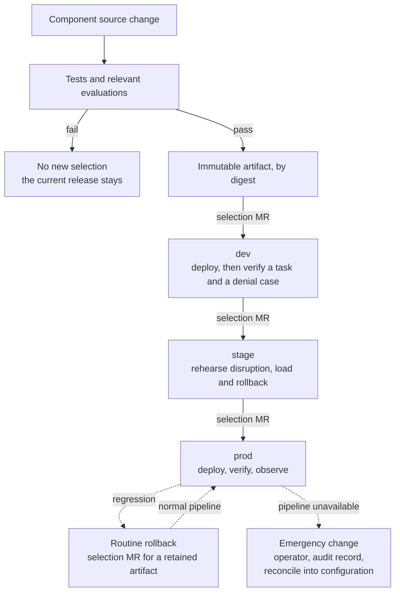

CI records the artifact identity, source commit, platform and chart versions, environment configuration revision, rendered resources and test results. GitLab job artifacts expire, so set retention explicitly or copy the record to durable storage. A bespoke evidence service is deferred until the existing systems cannot meet audit or recovery requirements.

| Environment | Role |
|---|---|
| dev | Shows that the artifact deploys and integrates |
| stage | Rehearses the change against production-shaped identity, policy and data bindings; disruption, load and rollback drills run here |
| prod | Receives only a selection already verified in stage |

Whether every change must pass through stage is part of the approval requirement still to agree. A dev success does not establish production authentication, connectivity or quotas.

### 12.2 Checks proportional to the change

| Change | Checks and release path |
|---|---|
| Service guidance | Publisher validation; consumer tests when adopted |
| Read-only agent behavior | Component checks and representative evaluations; normal rollout |
| Compatible tool implementation | Contract and authorization tests; normal rollout |
| Expanded access or production writes | Permission diff and review; targeted end-to-end tests |
| Breaking tool or session contract | Parallel version and explicit consumer migration |
| Shared gateway, authentication or controller | Affected-consumer compatibility checks and platform review |
| Database or snapshot format | Migration, restore and backward-compatibility procedure |

Tests for authorization and transaction correctness are deterministic. An LLM judge can assess quality but cannot substitute for them. Mandatory approvals and thresholds are requirements to agree.

### 12.3 Concurrency and acceptance

- Deployments to the same workload and environment are serialized, and a stale selection is detected by recording the expected current revision before activation.
- A rerun of a CI job uses the same immutable artifact or goes through a new review. It never resolves `latest` to different bytes under an old approval.
- Controller readiness and Helm success are prerequisites, not acceptance. A deployment is complete after actual route and backend behavior, the selected content and a negative authorization case are verified.

### 12.4 Candidates and sessions

A separate candidate is created only where an ordinary rollout cannot contain the change. Its proxy, worker or database may still be shared, so identify which dependencies could affect active behavior.

For a breaking MCP change, start with versioned endpoints and explicit consumer adoption, and test tool discovery, naming, streaming, session affinity and reconnect. Per-request weighted HTTP routing is not a proven way to promote MCP sessions. Documented upstream: stateful MCP session routing and affinity need selector-based backend targets; with a static target, requests are not guaranteed to reach the same proxy instance.

Before changing an agent or runtime, define what happens to existing sessions: pinned continuation, drain or explicit restart (D-11). For kagent, a session runs the revision it was created from (documented upstream), so test what a new revision means for conversations in progress.

### 12.5 Failure and rollback

| Failure | Handling |
|---|---|
| Source checks fail | No new deployment selection |
| Artifact or catalog publication fails | Keep the current selection; retry the failed operation idempotently |
| Deployment partly succeeds | Inspect actual state and controller status before retrying or rolling back |
| Verification fails | Contain the affected capability and restore a compatible selection |
| Shared policy incident | The platform owner reconciles controls; a workload rollback must not undo a security fix |
| Stateful migration fails | Use the tested migration and restore procedure |

There are two recovery paths and no third, expedited pipeline:

- **Routine rollback.** An ordinary selection change to a retained compatible artifact and configuration. It uses the normal pipeline and its verification, and may be prioritized ahead of other work.
- **Emergency change.** Made outside the pipeline when the pipeline is unavailable or too slow for the incident. It needs an operator, an audit record and immediate reconciliation into configuration before routine delivery resumes. The runners run in the cluster, so a cluster or node-pool fault can take the pipeline down with the workloads; this path must work without them.

Kubernetes reconciliation and Helm upgrades do not make a multi-resource change transactional. An endpoint rollback does not undo external writes or data migrations. CRD and controller upgrades have their own lifecycle: rolling back a chart does not necessarily restore previous CRD schemas or persisted data.

### 12.6 Publication and retention

Catalog metadata is not the release state machine. Consumer-facing endpoint updates are published after deployment verification, or entries are marked unavailable until verified. Previous compatible images, content, tool bindings and runtime dependencies are retained for the agreed rollback window. A fixed count of recent images is not enough while old consumers remain active.

## 13. Building on the platform

### 13.1 Which path do I use?

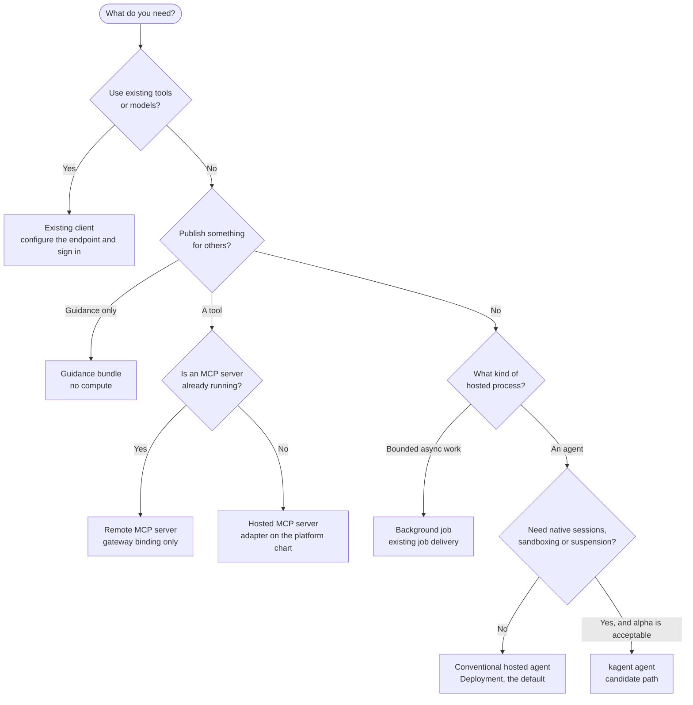

| Path | You own | The platform supplies |
|---|---|---|
| Existing client | Client configuration and selected tools | Endpoints, identity integration, permissions and diagnostics |
| Existing remote MCP server | The service and its protocol contract | Gateway binding and approved access |
| New hosted MCP server | Adapter or server image, and tests | Deployment conventions and gateway exposure |
| Conventional hosted agent | Framework and code, checkpoints and scenarios | EKS workload profile, identity and telemetry |
| kagent agent | Native agent behavior and configuration | A supported Harness, runtime dependencies and operational profile |
| Background work | Job logic and idempotent tool operations | Existing worker and job delivery, bounded capacity |

An existing REST API needs an explicit adapter or a supported transformation before MCP clients can call it as a tool. Registering a URL or publishing a skill does not establish protocol compatibility.

### 13.2 What each path looks like

**Consume tools.** Find a supported endpoint in the catalog or the initial documentation, authenticate with Okta, request permissions where needed and make one example call. For models, point the same client at the gateway's model endpoint with the credential the platform issues.

**Publish a capability.** Develop in the service repository against fixtures. CI tests and publishes an immutable image or package. A deployment update is needed only for hosted compute or changed gateway configuration. Verify through the dev endpoint, then promote.

**Run a hosted agent.** Start from a supported starter, select tools and a model, and run local scenarios against dev endpoints. Publish the image or the native configuration package, propose the dev selection, verify deployed behavior and promote. You do not design node pools or shared databases.

### 13.3 Customization levels

The application conventions in [`Notes/Applications/`](../../Notes/Applications/README.md) sit above the platform and apply to both options. A team goes only as deep as its use case needs.

| Level | The team writes | Image |
|---|---|---|
| 0. Configure | Prompts, skills, scenarios and the choice of model and tools | Built by the pipeline from the base application image; no code or Dockerfile in the repository |
| 1. Publish a capability | An MCP adapter or a guidance bundle in the service repository | Only for a hosted MCP server |
| 2. Compose | A thin application that imports the shared packages and adds hooks, routes, agents or a session store | Its own |
| 3. Replace a piece | Its own implementation of one package behind the same protocol, such as a different UI | Its own |

Where the selected runtime's native declarative agent meets the need, such as a kagent AgentTemplate, use it for level 0 and write no configuration schema of our own. If several teams reach level 3 for the same piece, the package boundary is in the wrong place.

Shared work reaches a component as a pinned reference, and every upstream change arrives as an MR that the owning team merges.

| Shared work | Home | Update arrives as |
|---|---|---|
| Pipeline logic | CI/CD components in the platform repository's `templates/` | A version bump MR |
| Deployment conventions | `charts/agent` and `charts/mcp-server` | A selection MR |
| Runtime behavior | Packages in the GitLab package registry | A lockfile bump MR |
| Base application image | ECR | A digest bump MR |
| Repository plumbing | `starters/`, rendered with Copier | A `copier update` MR |

A running consumer does not change without its own checks. A team that has not merged keeps running its current version.

### 13.4 What every hosted application must do

These obligations are the scope of the shared library. The library makes them easy; the gateway, admission and the network make them mandatory.

| Concern | Obligation | Under this option |
|---|---|---|
| User identity | Verify the caller at the entry point; derive tenant and session from verified context | Okta at a gateway route, or verified by the entry point itself |
| Model access | Never hold a provider key; endpoint and credential come from bindings | The gateway model endpoint |
| Tool access | MCP through the governed gateway; delegated context or a scoped machine credential; a stable operation identifier on every write | Agentgateway |
| Execution bounds | Limits on concurrency, time, iterations and tokens; bounded retries; graceful shutdown | Set in the application |
| Session state | Held outside the process, with declared behavior across a rollout | CloudNativePG where supported |
| Telemetry | OTel instrumentation with release and environment attributes; trace context propagated to tools | The existing collector topology |
| Runtime contract | Health endpoints and one entry protocol | A conventional Deployment, or kagent's contract ([section 6.5](#65-hosted-execution-kagent-and-agent-substrate)) |
| Content | Pinned and integrity-checked | Baked onto the image (WA-5) |
| Deployment selection | One selection per assistant per environment | Helm values under `agent-deployments` |

### 13.5 Worked examples

The notes contain eight journeys with hypothetical names and versions. None has been run.

| Journey | What it shows | Note |
|---|---|---|
| A developer consumes a payments lookup tool | Permitted lookup, denied refund, model access, no hosted compute | [Worked examples](../../Notes/Infra/AgentGateway/worked-examples.md#a-developer-consumes-a-payments-lookup-tool) |
| Payments publishes an MCP capability | Adapter in the service repository, image by digest, gateway binding, catalog entry after verification | [Worked examples](../../Notes/Infra/AgentGateway/worked-examples.md#payments-publishes-an-mcp-capability) |
| Payments publishes only guidance | Bundle `1.4.0` with no compute; a consumer stays on `1.3.0` until it adopts | [Worked examples](../../Notes/Infra/AgentGateway/worked-examples.md#payments-publishes-only-guidance) |
| An incident assistant is hosted | Read-only tools, bounded execution, no cluster-admin | [Worked examples](../../Notes/Infra/AgentGateway/worked-examples.md#an-incident-assistant-is-hosted) |
| A release fails checks | `2.1.0` is blocked; `2.0.0` stays selected | [Worked examples](../../Notes/Infra/AgentGateway/worked-examples.md#a-release-fails-checks) |
| A breaking tool version is introduced | Versioned binding, consumer migration, retirement after the rollback window | [Worked examples](../../Notes/Infra/AgentGateway/worked-examples.md#a-breaking-tool-version-is-introduced) |
| An operator diagnoses and recovers a release | Trace correlation, routine rollback, external writes investigated separately | [Worked examples](../../Notes/Infra/AgentGateway/worked-examples.md#an-operator-diagnoses-and-recovers-a-release) |
| A shared controller is upgraded | Pinned chart, controller and CRD change tested against affected gateways, agents and sessions, independent of component releases | [Worked examples](../../Notes/Infra/AgentGateway/worked-examples.md#a-shared-controller-is-upgraded) |

The application notes add journeys for each customization level and for how an upstream fix reaches every level: [application worked examples](../../Notes/Applications/worked-examples.md).

## 14. Observability and operations

### 14.1 Telemetry topology

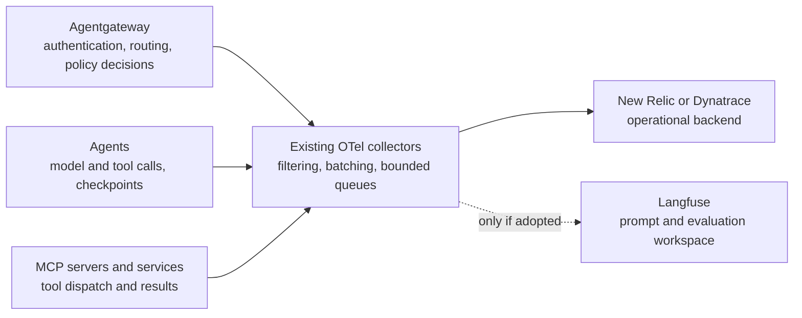

- The pilot runs against one operational backend. Which one is a requirement to agree (D-8).
- Application instrumentation records model and tool calls, checkpoints and workflow outcomes. Proxy telemetry alone cannot explain an agent's internal reasoning and action sequence.
- Trace context is propagated across supported protocols, with release, environment and runtime identity recorded.
- Secret values and sensitive prompt or tool content stay out of telemetry by default. Filter at the source where a separate exporter could bypass collector filtering.
- Bound queues, export retries and metric cardinality.
- Agentgateway documents Prometheus metrics, access logs and OpenTelemetry traces, with span attributes for generative AI and MCP (documented upstream; the attribute list was not checked).

If Langfuse is adopted, New Relic or Dynatrace stays the operational backend, and one authority is defined for deployed prompts. A mutable prompt label in Langfuse must not silently override a source-controlled production selection.

### 14.2 Evaluation responsibilities

| Layer | Checks | Owner |
|---|---|---|
| Service assets | Accurate API guidance, variables, scripts and compatibility | Service team |
| MCP tools | Protocol and schema, backend permissions, idempotency and errors | Tool or service team |
| Agent behavior | Task outcome, selected tools, composed instructions and limits | Agent team |
| Shared platform | Authentication, policy override, session isolation and deployment behavior | Platform and identity teams |

Start with component-owned scenarios and deterministic assertions in CI. Record dataset and evaluator versions, sample counts, model settings, failures, latency and usage. Missing telemetry or an evaluator error is not a pass. Use fixtures and test tenants for operations with side effects.

### 14.3 Debugging

A developer follows one request from the client through gateway authentication and routing, agent execution, tool dispatch and the service result. Every supported starter makes service and version identity and request correlation visible. The pilot must show this with ordinary developer permissions, not cluster-admin.

| Symptom | First evidence to inspect | Owner |
|---|---|---|
| Authentication failure | Issuer, audience and expiry outcome; the client's flow | Identity, platform |
| Tool denied | Verified principal and effective tool policy | Identity, tool owner |
| Gateway cannot reach backend | Route and configuration status, DNS and TLS, backend readiness | Platform, service |
| Agent chooses the wrong tool | Composed configuration, task trace and scenario | Agent team |
| Session cannot resume | Runtime session metadata; snapshot and state availability | Runtime, data owner |
| Model throttling or excess usage | Provider result, concurrency and retry limits | Agent, platform |
| Model request refused or over budget | Verified caller, approved-model policy and rate-limit decision | Platform, agent |
| Missing traces | Instrumentation, collector queues and vendor export | Observability, component |

Logs distinguish a policy denial from a dependency failure without revealing credentials.

### 14.4 Signals, incidents and on-call

Monitor active work, queue wait, request latency and errors, denied access, provider throttling, CPU and memory, worker occupancy, snapshot operations and collector drops, where the signals are supported. Derive alerts from workload requirements and real failure modes, not from a universal dashboard template.

| Situation | Response |
|---|---|
| Unsafe tool | Disable access independently of agent rollback where possible; preserve audit evidence; identify affected consumers |
| Runtime outage | Decide session and state recovery explicitly |
| Tool outage | Bounded retries and a clear unavailable-capability response |
| Unsafe guidance | Stop new adoption, identify deployed consumers, use access and execution controls, publish a corrected immutable version |
| Shared authentication or policy change at fault | The platform incident owner handles that boundary; agents are not rolled back blindly |

Assign on-call and escalation ownership for the proxy and controller, the rate-limit service where budgets are enforced, the runtime, the database, the registry and each downstream service.

### 14.5 Upgrades and drift

Pin chart, controller, CRD and runtime versions and record their tested combination. Upgrade shared components independently of unrelated agent changes, and test CRD migration, persisted sessions, policy semantics and representative consumers. Inspect rendered configuration and actual controller acceptance, not just chart diffs.

Existing infrastructure plans and Helmfile diffs detect configuration changes. Synthetic authentication and task checks detect expired credentials, remote API changes and broken integrations.

## 15. Cost model

No usage has been measured and no price inventory exists for this option. Its cost page lists the lines and prices none of them. An unpriced option is not a cheaper one.

Report two views side by side. Incremental cash cost identifies new spend. Allocated platform cost includes the shared capacity and operating work this platform consumes. State the allocation policy so that comparisons are reproducible.

```text
monthly total = model inference + evaluations
              + compute and warm capacity + storage
              + networking + telemetry + licences/support
              + attributable operating effort

cost per successful task = attributable cost / successful completed tasks
```

Unsuccessful runs and retries count in the numerator. Existing capacity is not free, and open-source software has an operating cost.

| Item | Measure |
|---|---|
| Models | Input, output and cached tokens; provider charges |
| Gateway and controller | Requests, replicas, CPU and memory |
| Rate-limit service | Replicas and backing store, where shared budgets are enforced |
| Conventional agents and tools | Node-hours attributable to placement and replicas |
| Agent Substrate | Warm workers, actor occupancy, snapshots and restore traffic |
| PostgreSQL | Allocated capacity, storage, backups and operations |
| Registry | Service and database footprint, maintenance |
| Langfuse, if adopted | Web and workers, ClickHouse, cache, storage and operations |
| Network | Load balancer, NAT, endpoint and transfer charges |
| Telemetry | Billed ingestion, retention, queries and host monitoring |
| Delivery | Runner pod compute, artifact retention and evaluation runs |
| People | Build, review, on-call, upgrades and support hours, reported separately |

**Hypothesis to test.** This option's cost is mostly fixed baseline at pilot volume and mostly inference at high volume, so its difference from AgentCore lies in execution, platform services and people, not in tokens.

**Shared pricing profile.** Both options are to be priced for the same assumed session: 6 model calls of 8,000 input and 400 output tokens, 12 gateway calls, 1 vCPU and 1 GB with 20 seconds of active CPU, at 5,000, 50,000 and 500,000 sessions a month across three environments, with 20% of sessions evaluated. The pilot replaces the profile with measurements for both options at the same time.

**Spending controls.** Bound agent iterations, tokens, wall time, concurrent work and retries. Restrict approved models. Prevent callers from bypassing the governed path or raising limits without permission. Attribute cost from verified team and workload identity, not from caller-provided labels. Apply retention to traces, snapshots, artifacts and evaluation results.

EKS savings depend on bin packing, usable headroom, node lifetime and tolerated cold-start latency. Removing idle pods may not remove a node. A favorable cloud bill with materially greater incident and review effort is not a demonstrated improvement in total cost.

## 16. Risks, open decisions and validation

### 16.1 Risks

| Risk | Consequence | Response in the design |
|---|---|---|
| kagent 1.0 is alpha | Resource model and behavior may change; no support path | Conventional path is the default (WA-2); one pinned generation; excluded from any production recommendation if still alpha at the review date |
| Istio's Agentgateway integration is experimental | Unsuitable for production | Standalone controller (WA-1) |
| The gateway can be bypassed | It becomes a convenience, not a control | Candidate controls and denied-path checks for five paths ([section 10](#10-trust-boundaries-and-bypass-prevention)) |
| A more specific policy overrides a platform rule | Mandatory restrictions weaken silently | RBAC on policy resources, Kyverno on permitted fields, override tests |
| The gateway is a single point of failure for tools and models | An outage stops every consumer | Baseline replicas; the gateway outage experiment |
| The rate-limit server is an availability dependency | Model traffic is refused, or budgets stop holding | Fail behavior decided and tested (D-6) |
| A long-lived gateway key outlives an entitlement | Access continues after removal | Mapping to Okta identity, rotation and revocation defined; time to denial measured |
| The pilot agent does not meet kagent's bring-your-own contract | One image cannot run on both execution paths | Contract checked first; adaptation recorded as delivery effort |
| gVisor is the only isolation available through kagent | It may not meet the execution-trust requirement | Decided before density is tested (D-10) |
| CI runners share the cluster | MR code runs inside the network; a cluster fault takes the pipeline down | Runners treated as untrusted workloads; an emergency path that works without them |
| The registry becomes a second writer | Two sources of production truth | Catalog only (WA-3) |
| Cost is unpriced | Totals cannot be compared with AgentCore | Price the shared profile, then measure |
| Requirement values are not agreed | Experiments produce observations, not passes | Pilot duration, review date and stop conditions agreed in step 1 |

The notes do not yet cover five topics that an architecture review is likely to ask about. They are listed here as gaps, not as design:

- Behavior when Okta or its signing keys are unreachable.
- Multi-region operation and disaster recovery.
- How many gateways exist and how domains share or split them beyond the pilot.
- Content safety and guardrail policy at the gateway.
- The format of the entitlement configuration under `access/` and how it becomes Okta claims.

### 16.2 Open decisions

| ID | Decision | Current position | Evidence that closes it | Proposed owner |
|---|---|---|---|---|
| D-1 | Standalone or Istio-managed gateway controller | Standalone (WA-1) | Compatibility inventory; gateway-to-backend identity shown in the cluster's Istio mode | Platform |
| D-2 | Whether kagent and Agent Substrate are adopted | Candidate; conventional default (WA-2) | kagent integration, bring-your-own contract, worker interruption and restore experiments | Runtime owner, agent and security teams |
| D-3 | Role of Agentregistry | Catalog only (WA-3) | Registry and runtime compatibility; no duplicate writer; onboarding effort reduced | Platform |
| D-4 | Credential on a model request: gateway-issued key or Okta-derived token | Open | Model access experiment for each supported client; revocation time for either credential | Platform, security |
| D-5 | Hosted agent entry point: gateway route or runtime API, and who binds user to session | Open | Concurrent session access; unauthenticated and wrong-user requests fail at every exposed address | Runtime, identity |
| D-6 | Shared token budgets, and behavior when the rate-limit server is down | Open | Shared token budget experiment, including the server unavailable | Platform |
| D-7 | Which control denies each bypass path | Candidates listed, none selected | Denied-path result per row | Platform, security |
| D-8 | Operational telemetry backend | New Relic or Dynatrace | Injected-failure debugging in the chosen backend | Observability |
| D-9 | Secret delivery mechanism and network policy engine | Not identified | Inventory; secret rotation and inspection | Platform, security |
| D-10 | Execution trust: is gVisor sufficient for hosted workloads? | Open | Requirement agreed; actor-level boundary tests | Agent and security teams |
| D-11 | Session behavior across a rollout: pinned, drain or restart | Open | Observed session behavior on switch, rollback and retirement | Agent and runtime owners |
| D-12 | Guidance baked into the image or loaded at start | Baked (WA-5) | For loading: integrity check, start-up failure behavior and caching shown | Platform |
| D-13 | Langfuse, and the authority for deployed prompts | Not in the pilot (WA-6) | A team needs the workflow; one publication authority defined | Platform, agent teams |
| D-14 | Tenant meaning, delegation types, mandatory approvals, whether stage is required for every change | Not agreed | Requirement values recorded in the comparison basis | Security, identity, release owners |
| D-15 | Environment topology: shared cluster or one per environment, and where runners live | Not inventoried (WA-7) | Inventory | Platform |

### 16.3 Requirements to agree

Values that also apply to AgentCore are agreed once in the [comparison basis](../../Notes/Infra/README.md) and carried unchanged.

| Requirement | Needed before | Proposed owner to agree |
|---|---|---|
| Pilot duration, review date and stop conditions | Step 1 | Decision owner |
| Initial developer clients and useful service | Step 2 | Platform and service teams |
| Model providers and approved models | Step 2 | Platform and security teams |
| Operational telemetry backend | Step 2 | Observability team |
| Tenant meaning, data classification and retention | Step 2 | Security and data owners |
| User delegation versus autonomous work | Step 2 | Identity and service teams |
| Hosted workload and execution trust | Step 4 | Agent and security teams |
| Traffic, concurrency and latency | Step 4 | Agent and platform teams |
| Availability, recovery and rollback window | Step 5 | Platform and service teams |
| Mandatory review and audit retention | Step 5 | Release owners and security |
| Cloud and operating-effort budget | Step 5 | Platform and budget owners |

### 16.4 Pilot sequence and stop conditions

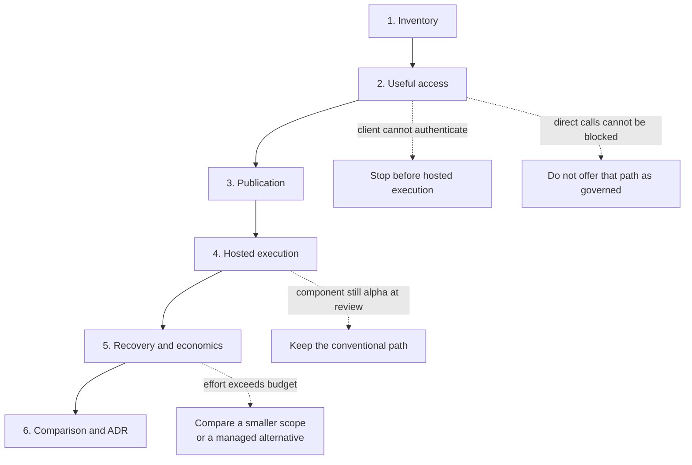

| Step | Work |
|---|---|
| 1. Inventory | Cluster versions, controllers, runner namespace and node pool, delivery authority, identity and secret mechanisms, network policy enforcement, available capacity, and the dependencies in [section 3.2](#32-what-the-inventory-must-still-identify) |
| 2. Useful access | One actual client through Okta to one read-only internal capability and one approved model; permitted and denied calls; debugging |
| 3. Publication | The service owner publishes guidance and discoverable metadata independently of compute |
| 4. Hosted execution | The same representative agent as a conventional EKS application and, where requirements permit, on the selected kagent profile |
| 5. Recovery and economics | Realistic failures, state recovery, cost and maintenance measurements |
| 6. Comparison | AgentCore evaluated against equivalent permissions, models, inputs and success criteria; adoption conditions or rejection recorded in an ADR |

Meeting a stop condition narrows or ends the option. It does not extend the pilot. A fifth condition applies at any step: if a requirement needed for the next step is still not agreed at the review date, that step pauses and reports observations only.

### 16.5 Experiments by scorecard criterion

The [validation plan](../../Notes/Infra/AgentGateway/validation-plan.md#experiments-and-expected-evidence) lists 26 experiments with the evidence each needs and what a failure would mean.

| Criterion | Experiments |
|---|---|
| Developer value | Actual client authenticates; model access through the gateway; the two publication experiments |
| Delivery effort | Custom code, charts and services written before the first useful workload |
| Team autonomy | Publish guidance without compute; consumer adopts or rejects content |
| Security | Two tenants and a machine caller; gateway bypass and policy override; concurrent session access; credential expiry and revocation; secret rotation and inspection |
| Release safety | Failed release and stale CI retry; roll back a release; breaking MCP migration |
| Reliability | Worker and node interruption; snapshot and database restore; gateway outage; telemetry and registry outage; task success under load |
| Debugging | Injected-failure debugging with normal team access |
| Operational burden | Shared controller and CRD upgrade; added services, on-call ownership and support hours |
| Cost and performance | Representative load and spend; shared token budget |
| Portability | Portability assessment; AgentCore Runtime behind the gateway |

Before selection, the pilot produces a tested connection matrix, a configuration authority map, a successful developer journey, a compatibility inventory, a recovery demonstration and a measured cost and effort comparison. Unresolved gaps are recorded beside successful results.

## 17. Relationship to the AgentCore option

The other option under evaluation is AWS AgentCore managed through Terraform and Terragrunt. The two share source control, CI, ECR, Okta and the observability direction. They are compared on one basis: the same requirement values, one pilot workload, twelve common experiments and one scorecard. This document describes one option and is not a comparison.

| Concern | This option | AgentCore option |
|---|---|---|
| Tool governance | Agentgateway on EKS | AgentCore domain tool gateway |
| Model access | Gateway model endpoint; provider credential at the gateway | Execution role and approved model list; an inference gateway is optional later |
| Hosted execution | Conventional Deployment, or kagent and Agent Substrate | Managed harness or custom runtime |
| Session state | CloudNativePG; S3 snapshots | AgentCore memory, owned per workload |
| Deployment selection | Helm values under `agent-deployments`, applied by Helmfile | `deployment.yaml` under `agentcore-deployments`, applied by Terraform, with candidate and active releases |
| Release gate | Checks proportional to the change; candidates only for identified risks | Isolated candidate, evidence bound to a manifest hash, then activation |
| Catalog | Agentregistry, optional | AWS Agent Registry |
| Cost shape | Provisioned capacity and operating effort; unpriced | Metered services; priced inventory with illustrative totals |

Possible outcomes are a smaller tool-access platform, conventional EKS execution, conditional kagent adoption, AgentCore, hybrid use, deferral or rejection. The decision is recorded in an ADR when it is made.

**Hybrid.** Agentgateway documents an `aws.agentCore` backend that routes to an AgentCore Runtime by its ARN and signs requests with SigV4. A selective hybrid is therefore technically plausible: a managed runtime behind the same gateway identity, policy and telemetry. It is an alternative to test, with one experiment, and not the organizing principle of this design. Each runtime needs its own backend and route (documented upstream).

**Application layer.** The application conventions are written so that the same packages and content run under either option, with only bindings and the deployment selection differing. That claim has its own experiment in the [application validation plan](../../Notes/Applications/validation-plan.md).

## 18. Glossary

| Term | Meaning |
|---|---|
| A2A | Agent-to-Agent protocol. kagent serves it over gRPC. |
| Actor | Agent Substrate's sandboxed unit of compute that runs a session's conversation. |
| ADR | Architecture decision record. Written only when a decision is made. |
| Agent (kagent) | A pairing of one AgentTemplate with one Harness. |
| AgentTemplate | kagent resource that defines what an agent does: model, system prompt and tools. |
| Binding | Environment-specific configuration that connects a component to an endpoint, identity, tool, model or data store. |
| Candidate (release) | A release-specific copy of a workload or route, deployed beside the active one to test a higher-impact change before activation. |
| CEL | Common Expression Language. Agentgateway uses it for authorization rules. |
| GatewayClass | Gateway API resource that names the controller responsible for a Gateway. |
| Harness | kagent resource that defines how an agent is allowed to run: runtime, image, environment and Substrate policy. |
| MCP | Model Context Protocol, the protocol through which clients and agents discover and call tools. |
| MR | Merge request. |
| Profile | A reviewed default configuration for a supported runtime or gateway pattern. An example to copy, not a new API. |
| Revision | The compiled, immutable output of one kagent Agent, identified by a content digest. |
| Selection | The artifact digest and configuration that environment configuration names for one workload in one environment. |
| Session | A running conversation with one Agent. |
| Static consumer | A client or agent whose endpoints and content are resolved when it is configured or released, so it does not call the catalog per request. |
| Tenant | The boundary that data and permissions must not cross. Its meaning is not yet agreed. |
| Worker, WorkerPool | A pre-started sandboxed pod that hosts one actor at a time; a pool declares how many workers to keep and their sandbox class. |

## 19. Sources

**Notes**

| Note | Used for |
|---|---|
| [Notes index and terms](../../Notes/Infra/AgentGateway/README.md) | Workflows, existing environment, terms |
| [Architecture option](../../Notes/Infra/AgentGateway/architecture-option.md) | Capability placement, component responsibilities, alternatives |
| [Foundation and services](../../Notes/Infra/AgentGateway/foundation-and-services.md) | Reuse, networking, bypass candidates, persistence, capacity |
| [Identity and authorization](../../Notes/Infra/AgentGateway/identity-and-authorization.md) | Connection matrix, model access, policy ownership, delegation |
| [Workload deployment](../../Notes/Infra/AgentGateway/workload-deployment.md) | Supported paths, execution choices, state and recovery |
| [Repository structure](../../Notes/Infra/AgentGateway/repository-structure.md) | Layouts, configuration authority, CI permissions |
| [Release and promotion](../../Notes/Infra/AgentGateway/release-and-promotion.md) | Default flow, proportional checks, rollback |
| [Skills and prompts](../../Notes/Infra/AgentGateway/skills-and-prompts.md) | Publication, adoption, retirement |
| [Evaluations and operations](../../Notes/Infra/AgentGateway/evaluations-and-operations.md) | Telemetry, debugging, incidents, upgrades |
| [Costs](../../Notes/Infra/AgentGateway/costs.md) | Cost model and inventory |
| [Worked examples](../../Notes/Infra/AgentGateway/worked-examples.md) | Developer and operator journeys |
| [Validation plan](../../Notes/Infra/AgentGateway/validation-plan.md) | Requirements, pilot sequence, experiments |
| [Comparison basis](../../Notes/Infra/README.md) | Shared requirements, session profile, scorecard |
| [Application structure and reuse](../../Notes/Applications/README.md) | Customization levels, shared work, obligations of a hosted application |
| [AgentCore option](../../Notes/Infra/AgentCore/README.md) | Section 17 |

**Upstream documentation, read 5 October 2026**

| Topic | Page |
|---|---|
| Agentgateway on Kubernetes, architecture | <https://agentgateway.dev/docs/kubernetes/latest/documentation/about/architecture/> |
| Agentgateway policy targeting and merging | <https://agentgateway.dev/docs/kubernetes/latest/documentation/about/policies/target-merge/> |
| Agentgateway Okta MCP authentication | <https://agentgateway.dev/docs/kubernetes/latest/documentation/mcp/auth/okta/> |
| Agentgateway MCP tool access | <https://agentgateway.dev/docs/kubernetes/latest/documentation/mcp/tool-access/> |
| Agentgateway stateful MCP | <https://agentgateway.dev/docs/kubernetes/latest/documentation/mcp/session/> |
| Agentgateway API keys | <https://agentgateway.dev/docs/kubernetes/latest/documentation/llm/api-keys/> |
| Agentgateway budget limits | <https://agentgateway.dev/docs/kubernetes/latest/documentation/llm/cost-controls/budget-limits/> |
| Agentgateway observability | <https://agentgateway.dev/docs/kubernetes/latest/documentation/observability/> |
| Agentgateway AgentCore connectivity | <https://agentgateway.dev/docs/standalone/latest/documentation/agent/agentcore/> |
| Istio Agentgateway integration | <https://istio.io/latest/docs/ambient/usage/agentgateway/> |
| kagent core concepts | <https://kagent.dev/docs/kagent/1.x/about/core-concepts/> |
| kagent architecture | <https://kagent.dev/docs/kagent/1.x/about/architecture/kagent/> |
| kagent bring your own agent | <https://kagent.dev/docs/kagent/1.x/agents/bring-your-own-agent/> |
| kagent Agent Substrate tuning | <https://kagent.dev/docs/kagent/1.x/operations/tune-agent-substrate/> |
| kagent networking and egress control | <https://kagent.dev/docs/kagent/1.x/substrate-runtime/networking-and-egress/> |
| kagent Substrate identity | <https://kagent.dev/docs/kagent/1.x/substrate-runtime/identity/> |
| Agentregistry | <https://github.com/agentregistry-dev/agentregistry> |
| Agentregistry kagent deployment | <https://aregistry.ai/docs/agents/deploy/kagent/> |

A source link establishes what a component documents for that version. It does not prove compatibility between components or with our environment.

## 20. Appendix: what the upstream documentation adds to the notes

Checking the linked documentation confirmed the constraints the notes record. It also surfaced the points below, which the notes do not state or state differently. Each is documented upstream and untested by us. Consider carrying them back into the notes.

| Point | Effect on the design |
|---|---|
| A Substrate worker hosts at most one actor at a time and is freed at every turn boundary. The identity note speaks of actors sharing a worker. | The isolation test is about residue between successive actors on a reused worker, not about concurrent co-tenancy ([section 9.7](#97-sessions-and-execution-isolation)). |
| Actors reach the network only through Substrate's own default-deny egress gateway, with an allowlist that kagent derives from the AgentTemplate. | An additional control on two bypass paths for kagent workloads, and a second hop between an actor and Agentgateway ([section 10](#10-trust-boundaries-and-bypass-prevention)). |
| Nodes fetch sandbox runtime assets from a public Google Cloud Storage URL unless the SandboxConfig points at a hosted copy. | An egress requirement, or a mirror to operate, for any cluster with restricted egress ([section 6.5](#65-hosted-execution-kagent-and-agent-substrate)). |
| A kagent Session is not a Kubernetes resource. It is created over gRPC under kagent's own authentication and authorization and tracked in PostgreSQL. | Kyverno and Kubernetes RBAC do not govern session access; the entry point decision (D-5) must cover kagent's API. |
| A development installation of Substrate stores snapshots in an in-cluster object store with well-known credentials, and is not durable. | A pilot that tests restore must not run on the development defaults. |
| The upstream budget example keys the limit on a request header. | Keying on a verified claim must be confirmed before budgets are treated as attributed to identity ([section 9.4](#94-model-access)). |
| The budget page does not state what happens when the rate-limit server is unavailable. | D-6 cannot be closed from documentation; it needs the experiment. |
| All MCP tool access is allowed until rules are defined on a backend. | A new MCP backend needs its rules before it is exposed ([section 9.3](#93-tool-authorization)). |
| Stateful MCP session routing needs selector-based backend targets, not static ones. | A constraint on how hosted and remote MCP servers are bound if sessions are stateful ([section 12.4](#124-candidates-and-sessions)). |
| Istio registers two GatewayClasses for its integration and applies none of its own configuration APIs to the Agentgateway proxy. | Supports WA-1. |
| Documented versions on 5 October 2026: Agentgateway 1.6.x, kagent 1.0 alpha with `v1alpha3` resources, Istio 1.31.1. | Starting point for the compatibility inventory ([section 6.7](#67-versions-and-maturity)). |
