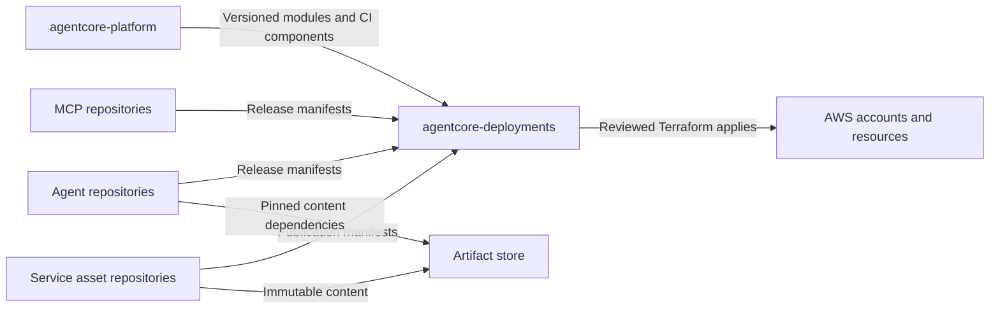

# AgentCore platform architecture option

Status: Draft option under evaluation. Updated 5 October 2026.

This option uses AWS AgentCore services with Terraform and Terragrunt to provide governed agent execution, tool access, and reusable content distribution. It proposes a common platform while allowing service and agent teams to release independently. Its main unresolved issue is whether release isolation and end-user authorization can be maintained across all participating services.

## Problems this option addresses

Teams need a repeatable way to deploy agents, expose tools, and publish service guidance without rebuilding identity, observability, and release controls for each component. Service owners also need a way to distribute skills and prompts to consumers without owning those consumers' agents.

Success would mean clear resource ownership, reproducible releases, tested authorization, and a deployment workflow that preserves the active release when a candidate fails. Catalog visibility, operational health, and permission to execute are separate concerns.

## Design principles

Keep one configuration owner for each resource and mutable field. Build immutable component artifacts, review environment selections, and bind approval to the exact behavior evaluated. Preserve service ownership of business authorization. Allow content-only publishers to participate independently of workload execution.

Use declarative configuration for resource and activation state; use pipeline events for build, evaluation and approvals. Introduce managed capabilities only when their security and operational assumptions are demonstrated. Treat shared baseline changes and stateful data changes as their own lifecycle rather than assuming every change belongs to a reversible component release.

## Capability placement

| Capability | Proposed location | Design reference |
|---|---|---|
| Network, encryption, state and deployment trust | Foundation per account/region | [Foundation](foundation-and-services.md) |
| Corporate auth and credential infrastructure | Environment platform | [Identity](identity-and-authorization.md) |
| Gateways and baseline engines | Platform/domain boundary | [Workload deployment](workload-deployment.md) |
| Targets and workload policies | Component/release units | [Workload deployment](workload-deployment.md) |
| Runtime/harness and memory | Workload execution account | [Workload deployment](workload-deployment.md) |
| Registry and versioned records | Shared approved catalog; local candidates | [Release lifecycle](release-and-promotion.md) |
| Skills/prompts and artifact manifests | Service publication plus consumer pins | [Asset publishing](skills-and-prompts.md) |
| Evaluators, trace prerequisites and monitoring | Environment platform with workload configuration | [Operations](evaluations-and-operations.md) |
| Evaluation evidence and approval records | Shared-services evidence store written by pipelines | [Repositories](repository-structure.md) |
| Manifest and binding resolver | Platform repository, run in deployment CI | [Workload deployment](workload-deployment.md) |
| Code interpreter/browser | Optional later capability with explicit session boundaries | [Workload deployment](workload-deployment.md) |

Exact Terraform resource types and schemas belong in a pinned-provider compatibility inventory. This conceptual map does not establish provider coverage.

## Proposed architecture

| Layer | Responsibilities | Proposed owner |
|---|---|---|
| Foundation | Network, encryption, Terraform backend support, deployment roles, artifact storage | Platform team |
| Shared platform | Identity integration, gateways, baseline policy, registry, evaluators, observability | Platform team with domain owners |
| Components | Agents, MCP targets, workload policies, memory, evaluations, content publications | Component teams |

Each Terraform-managed resource has one state owner. Workload state may create a target attached to a shared gateway, but cannot also manage the gateway resource or its platform-owned fields. State separation limits configuration scope; IAM permissions and reviewed plans must also enforce the intended boundary.

The diagram shows publishing and deployment responsibilities, not runtime network or authentication paths. Those require a separate, tested identity model.

## Proposed account and environment model

Start the evaluation in one region. The working topology is a shared-services account for approved catalog records and artifact storage, with separate dev, stage, and prod accounts. Candidate publications may use environment-local registries.

This topology is a proposal. Cross-account registry operations, artifact access, encryption grants, regional availability, and evaluation placement must be verified before adopting it. Keep evaluators local to environments unless cross-account use is demonstrated.

## Identity and authorization

Choose authentication per connection rather than imposing JWT on every resource. An AgentCore runtime version supports either JWT or IAM SigV4 inbound authentication, not both simultaneously. AWS also distinguishes cryptographically verified JWT identity from a user identifier supplied by an IAM caller. [AWS runtime authentication](https://docs.aws.amazon.com/bedrock-agentcore/latest/devguide/runtime-oauth.html)

The pilot should document each caller, credential, verified user identity, and authorization owner. Use the corporate identity provider for user tokens. Service calls can use IAM where appropriate. When a tool acts on behalf of a user, preserve a verifiable binding between that user and the delegated credentials.

Gateway authorization, application authorization, and downstream service permissions have different responsibilities. Skills and prompts provide guidance; they do not grant access. A skill that ships scripts is the exception to treat as code: it runs with the consumer's execution role and needs code review as well as content review. Derive actor and tenant identifiers from trusted identity context and test unauthorized memory access, direct runtime invocation, and gateway bypass.

For destructive operations, the downstream service should enforce tenant ownership, idempotency, and business limits. A model instruction or a per-call Cedar limit cannot establish those guarantees by itself.

## Release and promotion model

The proposed release unit is an immutable manifest containing the exact code and content dependencies used by a component. It identifies image digests or harness configuration, prompt and skill versions, tool schemas, workload policy revisions, model configuration, and evaluation inputs. Environment-specific bindings remain in deployment configuration.

Shared baseline policies have their own reviewed release process. A workload rollback must not silently undo an organization security fix. Shared memory and downstream state also require compatibility planning; switching an endpoint does not reverse their changes.

The proposed workflow is:

1. Component CI tests and publishes immutable artifacts and a release manifest.
2. A deployment merge request (MR) selects the candidate and pins the platform version.
3. Terraform creates isolated candidate resources without changing active dependencies.
4. Evaluations and authorization tests produce evidence bound to the manifest hash and environment configuration revision.
5. Release approval permits a reviewed Terraform change to select the active release.
6. The previous compatible release remains available through the rollback window.

Terraform owns resource configuration and active release references. Pipeline jobs own evaluation runs and approval events. Emergency rollback should use an expedited deployment change; any temporary out-of-band action must be reconciled before routine deployment resumes.

This workflow is intended behavior, not a proven atomic transaction across AWS resources. The pilot must identify changes that are shared, irreversible, or applied before promotion.

## Protocol specific promotion

HTTP and aggregated MCP traffic need separate promotion designs. AWS gateway target routing applies to HTTP targets; weighted entries have weights from 1 to 99. The design cannot assume aggregated MCP targets support the same weighted routing or a zero-weight candidate. [AWS gateway rules](https://docs.aws.amazon.com/bedrock-agentcore/latest/devguide/gateway-rules.html)

For the pilot, evaluate MCP candidates through an isolated candidate gateway with enforced policies. Promote through a controlled consumer configuration change once tests pass. Validate session handling, tool naming, discovery, and rollback before introducing traffic splitting.

## Catalog and content distribution

The registry describes available assets. Proposed publication records identify the artifact version, location, hash, owner, and compatibility contract. Catalog approval controls discoverability; the deployment workflow separately checks execution approval before activation.

Publishing a new skill or prompt does not update consumer agents automatically. Consumers pin versions and run their own evaluations before adopting an update. The service team tests correct interaction with its API; the consumer team tests how that guidance behaves within its agent.

## Tradeoffs

| Potential benefit | Cost or limitation to evaluate |
|---|---|
| Common modules and deployment controls | Platform engineering effort and upgrade responsibility |
| Independent service and agent ownership | Compatibility contracts and coordinated breaking changes |
| Reproducible code and content releases | Artifact retention and manifest management |
| Central tool governance | Shared gateway blast radius, quotas, and change contention |
| AgentCore managed capabilities | AWS coupling, regional constraints, and changing provider support |
| Offline and online evaluation | Evaluation cost, latency, statistical uncertainty, and sensitive trace handling |

## Initial scope

The proposed pilot includes one consumer agent, one service integration, one enforced domain gateway where required, identity propagation, tracing, content publishing, and a demonstrated rollback. Use a harness if it meets the pilot requirements; otherwise use a custom runtime. Treat switching implementations as a reviewed migration.

Defer shared browser sessions, dynamic skill adoption, generalized catalog workflows, and broad module abstractions until a consumer demonstrates the need. A calendar estimate should follow the technical experiments and staffing assessment.
