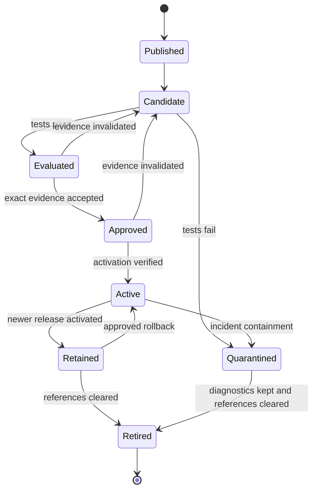

# AgentCore release promotion and rollback

Status: Proposed release protocol under evaluation. Updated 5 October 2026.

The release protocol binds an immutable component manifest to environment configuration and evaluation evidence. Terraform owns deployed resources and activation references; CI performs build, evaluation and approval events. This separation must be implemented consistently for normal releases and emergency recovery.

## Release identity

Proposed manifest fields include:

| Field group | Contents |
|---|---|
| Provenance | Component name/type, semantic version, source commit and publisher |
| Artifacts | Image digest or harness configuration hash; content locations and hashes |
| Dependencies | Skill/prompt versions, tool/schema versions and compatibility requirements |
| Controls | Workload policy bundle and model/execution configuration |
| Evaluation inputs | Dataset and evaluator versions with hashes |

Do not embed environment credentials or mutable active endpoint aliases as release content. Environment bindings are recorded in `deployment.yaml` and the evaluation attestation. Real model behavior may still vary over time even with a configuration pin; document provider stability limits.

An evidence record identifies manifest hash, environment binding hash, platform commit, shared baseline revision, dataset/evaluator versions, run identity, results, time and approver. Approval for a different hash or environment is not reusable automatically.

## Ownership of mutable fields

| Object or field | Owner | Other workflows |
|---|---|---|
| Runtime/harness and candidate configuration | Terraform component unit | CI proposes manifest selection |
| Active release/route/consumer binding | Terraform activation configuration | CI applies after exact approval |
| Gateway baseline policy | Terraform platform unit | Separate platform/security review |
| Workload policy | Terraform component/release unit | Must preserve active revision during tests |
| Catalog content | Terraform publication unit | Publisher proposes immutable version |
| Catalog approval/status transition | Publication workflow or curator | Verify exact revision before transition |
| Evaluation run/result | Evaluation pipeline | Referenced by release review |
| Artifact bytes | Publisher CI | Immutable once published |

Only use ignored Terraform fields where the selected schema supports a genuine division of ownership. Computed status may not require an ignore rule. Do not copy status-ignoring snippets without checking provider semantics.

## Pipeline stages

1. **Build:** Run component checks, create immutable artifacts, and publish the manifest.
2. **Propose candidate:** Open a deployment merge request (MR) with manifest and platform pins. Calculate affected units and dependencies, including shared resource effects.
3. **Plan and review:** Validate internal schemas, Terraform/Terragrunt configuration, policies, tool schemas and permissions. Review replacement and deletion separately.
4. **Apply candidate:** Deploy isolated resources and wait for readiness. A successful apply is not proof of a working release.
5. **Evaluate:** Exercise the candidate with test users/tenants, collect telemetry, run deterministic and quality evaluations, and save evidence.
6. **Approve:** Check that evidence matches the candidate, environment bindings and current shared controls. Authorize activation and publication through their separate gates.
7. **Activate:** Apply the reviewed active-reference change, verify actual routing and selected content, and run smoke checks.
8. **Observe:** Evaluate live outcomes and operational metrics for the agreed window. Keep the previous release and record the activation result.
9. **Retire candidate/previous resources:** Clean up only after references, sessions, retention and rollback requirements permit it.

Dev, stage and prod use the same component artifact but different bindings and evidence. Stage success informs prod approval; it does not prove production identity, connectivity or quotas are correct. Provider/module upgrades have their own dependency and replacement analysis.

## State transitions and concurrency

These are internal release states, not AgentCore API status names. Serialize activation per component/environment. Use Terraform state locks plus release-level concurrency controls; several related state files need coordination beyond an individual lock.

Retries must inspect actual resources and existing evidence. A repeated apply or approval event cannot authorize a different candidate. Check the expected currently active release before changing it, and stop if another promotion has intervened. Re-evaluate when changes invalidate the binding or control revisions.

## Catalog lifecycle

AWS documents DRAFT, PENDING_APPROVAL, APPROVED, REJECTED and terminal DEPRECATED states. Editing an approved record creates a draft revision while the approved revision remains discoverable. [AWS registry lifecycle](https://docs.aws.amazon.com/bedrock-agentcore/latest/devguide/registry-record-lifecycle.html)

The registry pages cited in these notes now carry a migration notice. Agent Registry moved to a dedicated `agent-registry` namespace on 6 August 2026, with its own endpoints, IAM action prefix, ARNs, SDK clients and a changed record schema. AWS states that accounts without existing registries on that date cannot use the old `bedrock-agentcore` namespace, which shuts down on 30 October 2026. Nothing has been deployed for this option, so there is nothing to migrate; build on the new namespace from the start and record its API names, permissions and provider resources in the provider inventory. [AWS registry migration guide](https://docs.aws.amazon.com/bedrock-agentcore/latest/devguide/registry-faq.html)

The proposed default is separately versioned records so older supported assets remain discoverable. Verify new-version behavior with the pinned provider. For executable assets, publish approved consumer-facing endpoints only after their readiness and release gates; candidate endpoints must not be mistaken for active endpoints. If approval and activation order depends on record content, define that order explicitly in the pilot.

Publication approval does not itself enforce workload execution permission. The activation workflow must check its own release authorization and downstream policy compatibility.

## Failure handling

| Failure point | Serving behavior expected | Recovery |
|---|---|---|
| Build or manifest validation | Active release unchanged | Correct component source |
| Candidate apply partially succeeds | Active dependencies unchanged | Inspect state and isolate/repair candidate |
| Evaluation fails or is incomplete | Candidate not activated | Quarantine and create corrected release |
| Publication rejected | Existing approved versions remain available | Correct publication or release evidence |
| Activation partly applies | Potential mixed configuration | Pause promotions, inspect actual bindings, restore compatible selection |
| Live quality or authorization incident | Contain unsafe operations | Approved rollback or disable affected capability |
| Shared baseline update breaks consumers | Multiple releases may be affected | Platform incident process; preserve required security restrictions |

Terraform apply is not transactional across resources. Activation plans should minimize mutable changes, and the pipeline must detect partial updates before declaring success.

## Rollback boundaries

Rollback restores code, harness configuration, prompts, skills, schema/target bindings and compatible workload policies. It retains current baseline security controls unless separately approved. It does not undo refunds, outbound messages, memory writes or external schema migrations.

Identify the last compatible release, confirm its dependencies still exist, review the configuration change, apply it, verify routing and run recovery checks. Resolve sessions and state compatibility explicitly. Record the actual recovery time against the required target.

An emergency out-of-band action needs a named operator, audit record and prompt reconciliation into deployment configuration. Block routine promotion until Terraform and actual resources agree. The normal design favors expedited reviewed deployment changes.
