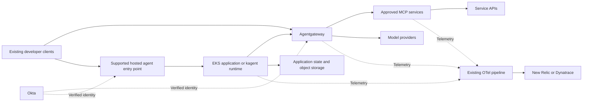

# EKS agent platform architecture option

Status: Proposed design under evaluation. Updated 5 October 2026. [Notes index and terms](README.md)

This option starts with governed tool and model access for existing developer clients. Hosted execution is an additional offering for shared assistants, background work and isolated sessions. The design aims to reuse our Kubernetes operations and native component APIs while keeping custom platform automation small.

## Problems and success criteria

Developers currently need a repeatable way to find approved capabilities, authenticate, diagnose failures and publish service integrations. Service teams should own their APIs, tool contracts and guidance without owning every consuming agent. Hosted agents need supported execution and persistence rather than individually assembled infrastructure.

Success requires useful developer workflows, demonstrable authorization, bounded operational impact and favorable total cost. Existing EKS knowledge may reduce learning effort but does not establish runtime reliability or isolation. Compare options on the [shared comparison basis](../README.md); this option's requirements, stop conditions and experiments are in the [validation plan](validation-plan.md).

## Capability placement

| Capability | Proposed location | Adoption condition |
|---|---|---|
| Tool and model connectivity | Agentgateway | Actual clients, protocols, auth and telemetry work |
| Model credentials and budgets | Agentgateway LLM backends; its rate-limit server for shared token budgets | Providers selected; caller authentication, credential custody and budget enforcement demonstrated |
| Corporate identity | Existing Okta | Required grants, claims and audiences supported |
| Network controls | Existing Istio and cluster network enforcement | Each intended path and [bypass restriction](foundation-and-services.md#bypass-enforcement-candidates) demonstrated |
| Infrastructure admission | Existing Kyverno | Permitted deployment and policy changes enforceable |
| Discovery | Agentregistry | Catalog reduces onboarding effort and has suitable access controls |
| Trusted hosted application | Conventional EKS Deployment or job | Framework and lifecycle meet the workload |
| Declarative/session execution | kagent and Agent Substrate | Native management, isolation and density justify operating them |
| Metadata/checkpoints | CloudNativePG where supported | Application schema, isolation and recovery proven |
| Artifacts/snapshots | ECR for images and Helm charts, S3 for snapshots, GitLab package registry for build-time packages | Integrity, reader permissions and retention established |
| Operational telemetry | Existing OTel and New Relic/Dynatrace | Trace continuity and required signals visible |
| Prompt/evaluation UI | Optional Langfuse | Teams need the workflow enough to justify its dependencies |

Agentregistry offers catalog and Kubernetes deployment integration; those features must not introduce a second writer for production configuration (see [configuration authority](repository-structure.md#configuration-authority)). Its documented kagent example applies the registry's own `ar.dev/v1alpha1` `Deployment` resource and shows the resulting `Agent` and `MCPServer` resources and pods. It names no kagent version and none of the 1.x Harness, AgentTemplate or Session resources, so it appears to target the 0.x model; that is an inference, not a documented statement. Validate the chosen pair before relying on integrated deployment. [Registry deployment integration](https://aregistry.ai/docs/agents/deploy/kagent/)

## Runtime traffic

The diagram describes logical boundaries. Both client paths require Okta-verified identity; a hosted entry point that is not a gateway route must authenticate users itself and does not inherit the gateway's checks. Hosted entry points may be gateway routes or runtime APIs, depending on supported protocols and session authorization. It does not assume an ordinary HTTP route can securely expose every kagent API. Catalog discovery and CI delivery are outside the runtime request path.

## Component responsibilities

Agentgateway mediates configured connections. For models it holds the provider credential and applies approved-model and budget policy, as described under [model access](identity-and-authorization.md#model-access). It does not replace downstream business authorization, application state semantics or a workflow engine. Shared endpoints should follow meaningful permission and failure boundaries rather than creating a gateway per agent or one universal proxy for every environment.

kagent's current 1.x alpha model separates a Harness, an AgentTemplate and their pairing in an Agent; the controller compiles revisions and manages sessions on Substrate. This could avoid building a custom agent specification and session controller. Evaluate that native model before writing adapters. Keep a conventional-container path available where its supported API or maturity is insufficient. Its generation, bring-your-own and sandbox constraints are recorded in [workload deployment](workload-deployment.md#execution-choices). [kagent concepts](https://kagent.dev/docs/kagent/1.x/about/core-concepts/)

Registry publication makes a capability discoverable. Deployed selections and service permissions remain independent. A registry outage should not stop agents whose dependencies are already resolved, unless runtime discovery is an explicit requirement.

## Delivery principles

Use existing GitLab CI/CD and Helmfile for environment selections initially. Publish immutable artifacts; review expanded permissions and incompatible changes. Normal compatible releases use normal rollouts. Introduce parallel versions or isolated candidates only for an identified contract, state, policy or session risk.

Do not introduce a universal deployment language, a custom promotion service or mandatory catalog approval state machine without a demonstrated need. Native readiness still needs task-level verification. One owner controls each object or field, including controller-generated resources.

## Alternatives to compare

| Option | Main question |
|---|---|
| Agentgateway with existing clients | How much developer value can tool/model access deliver without hosted agents? |
| Agentgateway with conventional EKS execution | Is familiar container hosting sufficient for our workloads? |
| Agentgateway with kagent/Substrate | Do native sessions, sandboxing and suspension provide measurable benefit? |
| AgentCore | Are managed isolation, integrations and operations worth their cost? |
| Selective hybrid | Does keeping a managed capability remove disproportionate engineering work? |

Agentgateway documents direct AgentCore Runtime connectivity, making a selective hybrid technically plausible. That capability is an alternative to test, not the organizing principle of this design; the validation plan has one experiment for it. [AgentCore connectivity](https://agentgateway.dev/docs/standalone/latest/documentation/agent/agentcore/)

## Initial scope

Start with one existing developer client, one useful read-only service capability, one approved model and a reproducible debugging path. Then add content publication and one representative hosted workload. Defer generalized automation, additional portals, self-hosted model inference and multiple AI engineering backends until measurements justify them.
