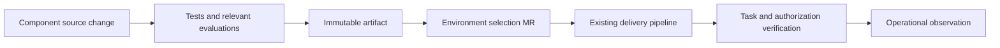

# EKS agent platform release and promotion

Status: Proposed delivery process. Updated 5 October 2026. [Notes index and terms](README.md)

Use the organization's existing GitLab CI/CD and Helmfile delivery conventions. A normal release builds/tests source, publishes an immutable artifact, updates an environment selection, deploys and verifies behavior. Additional gates and parallel resources follow the impact of the change rather than applying to every publication.

## Default flow

CI records artifact identity, source commit, platform/chart versions, environment configuration revision, rendered resources and test results. Preserve these through the required retention period. GitLab job artifacts expire by `expire_in` or the instance default, so set retention explicitly or copy the record to durable storage. A bespoke evidence service is deferred until existing CI/artifact systems cannot meet audit or recovery requirements.

The same component bytes move between environments; endpoints, identities and data bindings differ. Tests attest to their actual environment. A dev success does not establish production auth, connectivity or quotas.

Promotion follows the dev, stage and prod environments in the [repository structure](repository-structure.md#environment-configuration). Proposed roles: dev shows that the artifact deploys and integrates; stage rehearses the change against production-shaped identity, policy and data bindings, and is where disruption, load and rollback drills run; prod receives only a selection already verified in stage. Whether every change must pass through stage is part of the approval requirement still to agree.

## Checks proportional to change

| Change | Proposed checks and release path |
|---|---|
| Service guidance | Publisher validation; consumer tests when adopted |
| Read-only agent behavior | Component checks and representative evaluations; normal rollout |
| Compatible tool implementation | Contract and authorization tests; normal rollout |
| Expanded access or production writes | Permission diff/review and targeted end-to-end tests |
| Breaking tool/session contract | Parallel version and explicit consumer migration |
| Shared gateway/auth/controller | Affected-consumer compatibility checks and platform review |
| Database or snapshot format | Migration, restore and backward-compatibility procedure |

Mandatory approvals and thresholds remain requirements to agree, not permissions granted by this table. Tests for authorization and transaction correctness are deterministic. LLM judges can assess quality but cannot substitute for them.

## Configuration authority and concurrency

Environment configuration is the proposed production selection authority. The ownership of each object, including controller-generated resources, the registry and AWS infrastructure, is set out once in [configuration authority](repository-structure.md#configuration-authority). Registry CLI and ad-hoc `kubectl` are not writers for production objects.

Serialize deployments to the same workload/environment and detect stale selections. Record the expected current revision before activation. A CI job rerun uses the same immutable artifact or performs a new review; it must not resolve `latest` to different bytes under an old approval.

Controller readiness and Helm success are prerequisites, not the final acceptance signal. Verify actual route/backend behavior, selected content and negative authorization before declaring deployment complete.

## Candidates and sessions

Create a separate candidate only where ordinary rollout cannot contain the change. Candidate resources may be release-specific workloads/routes with test credentials and state. Their proxy, worker or database may still be shared; identify which dependencies could affect active behavior.

For breaking MCP changes, start with versioned endpoints and explicit consumer adoption. Test tool discovery, naming, streaming, session affinity and reconnect. Do not treat per-request weighted HTTP routing as a proven MCP session promotion strategy.

Define existing session behavior before changing an agent or runtime: pinned continuation, drain or explicit restart. Shared configuration changes can affect consumers independently of their image update and must enter review scope. Test the selected runtime's compiled revision behavior rather than assuming a name pin makes all dependencies immutable.

## Failure and rollback

| Failure | Required handling |
|---|---|
| Source checks fail | No new deployment selection |
| Artifact or catalog publication fails | Preserve current selection; retry the failed operation idempotently |
| Deployment partly succeeds | Inspect actual state and controller status before retry/rollback |
| Verification fails | Contain affected capability and restore a compatible selection |
| Shared policy incident | Platform owner reconciles controls; workload rollback must not undo a security fix |
| Stateful migration fails | Use the tested migration/restore procedure |

Kubernetes reconciliation and Helm upgrades do not make a multi-resource platform change transactional. Verify effective state after recovery. Endpoint rollback does not undo external writes or data migrations.

There are two recovery paths. A routine rollback is an ordinary selection change to a retained compatible artifact/configuration; it uses the normal pipeline and its verification, and may be prioritized ahead of other work. An emergency change is made outside the pipeline when the pipeline is unavailable or too slow for the incident; it needs an operator, an audit record and immediate reconciliation into configuration before routine delivery resumes. The runners run in the EKS cluster, so a cluster or node-pool fault can take the pipeline down with the workloads; the emergency path must work without them. The notes do not propose a third, expedited pipeline.

CRD/controller upgrades have a separate lifecycle; rolling back a chart does not necessarily restore previous CRD schemas or persisted data.

## Publication and retention

Catalog metadata advertises approved intended usage and endpoints; it is not the release state machine. Publish consumer-facing endpoint updates after deployment verification, or mark entries unavailable until verified. Define ownership and retry behavior so metadata cannot imply a failed deployment is live.

Retain previous compatible images, content, tool bindings and required runtime dependencies for the agreed rollback window. Cleanup accounts for consumer pins, sessions and data retention. A fixed count of recent images is insufficient when old consumers remain active.
