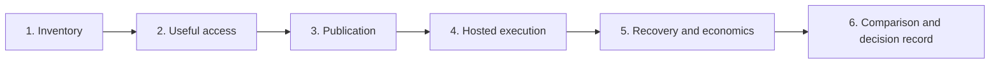

# Agent platform proposal

| | |
|---|---|
| Status | Proposed. Nothing is selected or deployed, and there are no pilot results. A demo runs on one machine. |
| Updated | 7 October 2026 |
| Based on | Architecture document 0.1 (5 October 2026); the working notes of 5 October 2026; the demo as of 7 October 2026 |
| Audience | Architects, leads, developers, DevOps and platform engineers |

We propose a time-boxed pilot of an internal agent platform built on the EKS infrastructure we already run, with Agentgateway as its connectivity layer. The pilot is compared on one agreed basis with the other option under evaluation, AWS AgentCore. This page says what the platform does, what we are asking for, what a demo has shown so far, and where to read more.

## What the platform does

1. It gives the developer clients people already use governed access to approved tools and models.
2. It lets a service team publish a tool or written guidance for its API without owning the agents that consume it.
3. It hosts agents where a component needs a hosted process.

The first two do not require hosted execution. A team can get value from the platform without deploying an agent.

Five points carry most of the design:

- **Access comes before hosting.** The first deliverable is one existing client, one read-only tool and one approved model, with a debugging path that works for an ordinary developer.
- **The gateway is the control point.** Agentgateway verifies the caller, decides which tools and models that caller may use, holds the model provider's credential and applies budgets. It is a control point only if calls around it are denied.
- **Services keep business authorization.** Gateway permission to call a tool never replaces the service's own checks.
- **Delivery reuses what we have.** Components publish immutable artifacts, a merge request selects one for an environment, and the existing GitLab and Helmfile pipeline applies it. Each object has one writer.
- **Maturity is uneven.** Agentgateway is the core. kagent 1.0 is alpha, Istio's Agentgateway integration is experimental, and no cost has been priced.

## What we are asking for

| Ask | Why now |
|---|---|
| Agree to run the pilot in the six steps of the [Pilot plan](30-pilot-plan.md), starting with an inventory of the cluster | Every later step depends on what the inventory finds |
| Name a decision owner, and agree the pilot's duration, review date and stop conditions | Without them a missing threshold becomes an open-ended pilot |
| Agree the requirement values once, for this option and for AgentCore | A threshold agreed for one option only is not a basis for comparison |
| Name the first developer client, the first read-only service capability and the first approved model | Step 2 is one real client reaching one real tool and one model |

We are not asking to select this option, to adopt kagent, or to deploy anything to production. Those are outcomes of the pilot, recorded in an architecture decision record when the evidence supports selection, deferral or rejection.

## Where things stand

| | State on 7 October 2026 |
|---|---|
| Selected | Nothing. Neither this option nor AgentCore has been chosen. |
| Working assumptions | Seven, among them a standalone Agentgateway controller, conventional Deployments as the default for hosted agents, and Agentregistry as a catalog only. |
| Still open | Fifteen decisions, among them the credential a model request carries, the entry point for hosted agents, the bypass controls, the telemetry backend and the secret mechanism. Every requirement value. |
| Priced | Nothing for this option. AgentCore has illustrative totals. An unpriced option is not a cheaper one. |
| Demonstrated | One incident on a kind cluster, with stand-ins for Okta, the operational backend, ECR, the pipeline and the model provider. Its results are observations, not pilot evidence. |

The full register is on [Decisions, risks and requirements](31-decisions-and-risks.md).

## What the demo has shown so far

A release breaks the search of a sample application. An alert starts a read-only diagnosis agent. Three signed-in people propose, approve and apply the rollback from an incident card, and the incident is resolved about seven seconds after the last click.

- **Observed in the demo:** every call between three people, four agents, two tool servers and one model endpoint went through the gateway with a verified identity.
- **Observed in the demo:** the rules were enforced twice, at the gateway and again in the tool server, and none of them lived in an agent's prompt.
- **Observed in the demo:** the gateway could be bypassed five ways until a network boundary and admission rules were added. The controls and their known gaps are written down.
- **Observed in the demo:** a real MCP client cannot yet sign in through the gateway by itself. Three pieces of configuration are missing. This is where the pilot starts.
- **Not exercised:** Okta, EKS, Istio, token budgets, session isolation, delivery through GitLab, and cost beyond about $0.15 of model calls for one incident.

The walkthrough with screenshots is on [The demo: one incident, end to end](20-demo-one-incident.md), and what it taught us is on [Demo findings and limits](21-demo-findings.md).

## The pilot at a glance

Meeting a stop condition narrows or ends the option. It does not extend the pilot. The proposed stop conditions are: the selected client cannot sign in through the gateway; direct calls around the gateway cannot be blocked; a required component is still alpha at the review date; a requirement needed for the next step is still not agreed; and operating effort exceeds the agreed budget.

## Where to read more

| If you are | Start with | Then read |
|---|---|---|
| An architect | [Architecture overview](10-architecture-overview.md), [Options and how they are compared](02-options-and-comparison.md) | [Identity and authorization](11-identity-and-authorization.md), [Trust boundaries and bypass prevention](12-trust-boundaries.md), [Decisions, risks and requirements](31-decisions-and-risks.md) |
| A lead | [Problem, goals and scope](01-problem-goals-scope.md), [Building on the platform](14-building-on-the-platform.md) | [Repositories, delivery and rollback](13-repositories-and-delivery.md), [Pilot plan](30-pilot-plan.md) |
| A developer | [Building on the platform](14-building-on-the-platform.md), [The demo: one incident, end to end](20-demo-one-incident.md) | [Identity and authorization](11-identity-and-authorization.md), [Observability and operations](15-observability-and-operations.md) |
| A DevOps or platform engineer | [Architecture overview](10-architecture-overview.md), [Trust boundaries and bypass prevention](12-trust-boundaries.md) | [Repositories, delivery and rollback](13-repositories-and-delivery.md), [Observability and operations](15-observability-and-operations.md), [Cost model](16-cost-model.md) |
| Deciding on the pilot | This page, [Demo findings and limits](21-demo-findings.md) | [Pilot plan](30-pilot-plan.md), [Decisions, risks and requirements](31-decisions-and-risks.md) |

### All pages

| Page | Answers |
|---|---|
| [Problem, goals and scope](01-problem-goals-scope.md) | Why, for whom, and what is deferred? |
| [Options and how they are compared](02-options-and-comparison.md) | What are the two options, and on what basis are they compared? |
| [Architecture overview](10-architecture-overview.md) | What are the parts, which exist already, and how mature are they? |
| [Identity and authorization](11-identity-and-authorization.md) | Who is verified where, and who decides what? |
| [Trust boundaries and bypass prevention](12-trust-boundaries.md) | What stops a call going around the gateway? |
| [Repositories, delivery and rollback](13-repositories-and-delivery.md) | Who writes what, and how does a change reach production and come back? |
| [Building on the platform](14-building-on-the-platform.md) | As a team, which path do I take? |
| [Observability and operations](15-observability-and-operations.md) | How is it debugged and run? |
| [Cost model](16-cost-model.md) | What will it cost, and what is still unpriced? |
| [The demo: one incident, end to end](20-demo-one-incident.md) | What does the demo show? |
| [Demo findings and limits](21-demo-findings.md) | What did building it teach us, and what does it not show? |
| [Pilot plan](30-pilot-plan.md) | What happens next, in what order, and when do we stop? |
| [Decisions, risks and requirements](31-decisions-and-risks.md) | What is open, who closes it, and with what evidence? |
| [Glossary and sources](90-glossary-and-sources.md) | Terms, upstream documentation and the versions the demo ran |

## How far to trust a statement

Four phrases mark how far a statement on these pages can be trusted. Anything not marked is proposed design.

| Phrase | Meaning |
|---|---|
| **Working assumption (WA-n)** | A choice these pages make where the notes leave a fork open, so that the rest of the design can be concrete. Each has an open decision. |
| **Documented upstream** | Stated by the component's own documentation on 5 October 2026. We have not tested it. |
| **Observed in the demo** | Seen on the demo's kind cluster: one node, one machine, with stand-ins. A reason to look somewhere first in the pilot, not a pass. |
| **To validate** | Needs a pilot result before anyone relies on it. |

Every component also carries one of four status labels, Reused, New, Optional or Candidate, defined on [Architecture overview](10-architecture-overview.md). The diagrams show the same labels by color, border style and badge.

These pages are the published form of the architecture document and the working notes. Where they disagree with those sources, treat it as a defect in the page.
