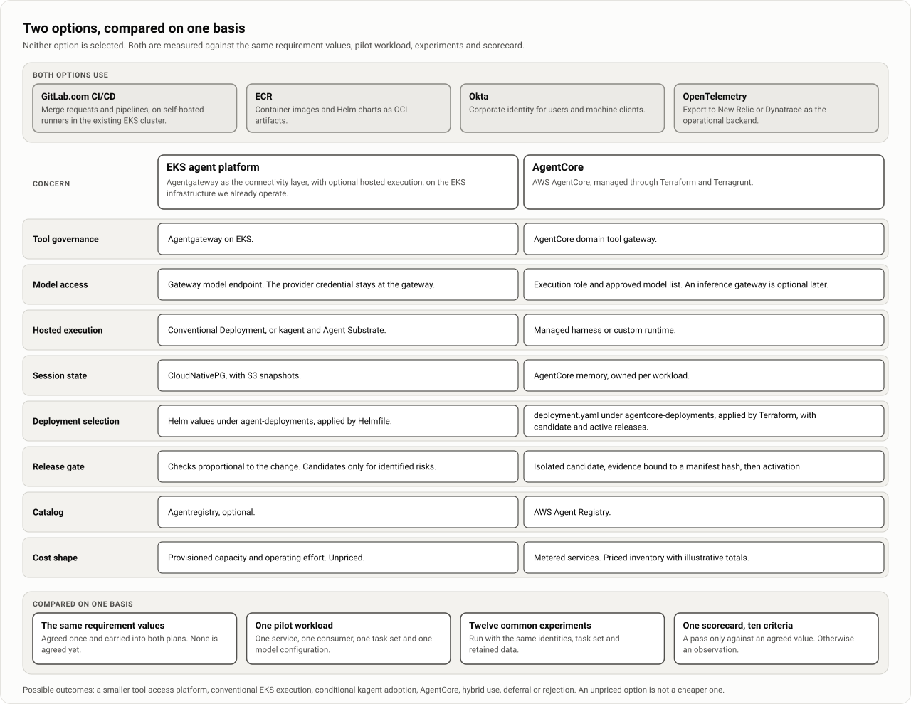

# Options and how they are compared

| | |
|---|---|
| Status | Proposed. Nothing is selected or deployed, and there are no pilot results. |
| Updated | 7 October 2026 |
| Based on | Working notes on the comparison basis and on the AgentCore option (5 October 2026); architecture document 0.1 (5 October 2026), section 17 |
| Parent | [Agent platform proposal](00-proposal.md) |

Two options are under evaluation for an internal agent platform: AWS AgentCore managed through Terraform and Terragrunt, and the EKS agent platform built around Agentgateway. Neither is selected. They are compared on one basis: the same requirement values, one pilot workload, twelve common experiments and one scorecard. This page describes that basis and summarizes both options. It is not the comparison, which needs pilot results from both.

## The two options

| Option | In one sentence | What its own description calls unresolved |
|---|---|---|
| AgentCore | AWS AgentCore services for agent execution, tool access and content distribution, declared in Terraform and Terragrunt | Whether release isolation and end-user authorization can be maintained across all participating services |
| EKS agent platform | Agentgateway for tool and model connectivity on the EKS infrastructure we already run, with optional hosted execution | The controls that stop calls going around the gateway are not selected, kagent is alpha, and no cost is priced |

### What both options share

- GitLab.com Ultimate for source control and CI/CD, with self-hosted runners in the existing EKS cluster.
- ECR for container images and Helm charts. The GitLab package registry may hold packages that only pipelines read.
- Okta as the corporate identity provider.
- OpenTelemetry with New Relic or Dynatrace as the stated observability direction. The vendor is not chosen.
- The same three aims: host agents, govern tools, and let a service team publish skills and prompts without deploying an agent or owning its consumers.

### Concern by concern

| Concern | EKS agent platform | AgentCore |
|---|---|---|
| Tool governance | Agentgateway on EKS | AgentCore domain tool gateway |
| Model access | Gateway model endpoint; provider credential at the gateway | Execution role and approved model list; an inference gateway is optional later |
| Hosted execution | Conventional Deployment, or kagent and Agent Substrate | Managed harness or custom runtime |
| Session state | CloudNativePG; S3 snapshots | AgentCore memory, owned per workload |
| Deployment selection | Helm values under `agent-deployments`, applied by Helmfile | `deployment.yaml` under `agentcore-deployments`, applied by Terraform, with candidate and active releases |
| Release gate | Checks proportional to the change; candidates only for identified risks | Isolated candidate, evidence bound to a manifest hash, then activation |
| Catalog | Agentregistry, optional | AWS Agent Registry |
| Cost shape | Provisioned capacity and operating effort; unpriced | Metered services; priced inventory with illustrative totals |

## The AgentCore option in brief

The option proposes three layers. A foundation per account and region holds network, encryption, Terraform state support, deployment roles and artifact storage. A shared platform holds identity integration, gateways, baseline policy, the registry, evaluators and observability. Component teams own agents, MCP targets, workload policies, memory, evaluations and content publications. Two repositories are proposed, `agentcore-platform` for reusable modules and `agentcore-deployments` for what is deployed where, and each Terraform-managed resource has one state owner.

- **Accounts.** The working topology is one region, a shared-services account for approved catalog records and artifacts, and separate dev, stage and prod accounts. Cross-account registry and artifact access are to verify.
- **Identity.** Authentication is chosen per connection. **Documented upstream** by AWS: a runtime version accepts either JWT or IAM SigV4 inbound authentication, not both at once, and a cryptographically verified JWT identity is distinct from a user identifier supplied by an IAM caller.
- **Release.** The release unit is an immutable manifest of code and content dependencies. A deployment merge request (MR) selects a candidate, Terraform creates isolated candidate resources, evaluations and authorization tests produce evidence bound to the manifest hash, and a reviewed Terraform change activates the release. This is intended behavior, not a proven atomic transaction across AWS resources.
- **MCP promotion.** Weighted gateway routing applies to HTTP targets (**documented upstream**). The option does not assume it for aggregated MCP targets, and evaluates MCP candidates through an isolated candidate gateway.
- **Content.** Publishing a skill or prompt does not update consumers. Consumers pin versions and run their own evaluations before adopting.

| Potential benefit | Cost or limitation to evaluate |
|---|---|
| Common modules and deployment controls | Platform engineering effort and upgrade responsibility |
| Independent service and agent ownership | Compatibility contracts and coordinated breaking changes |
| Reproducible code and content releases | Artifact retention and manifest management |
| Central tool governance | Shared gateway blast radius, quotas and change contention |
| AgentCore managed capabilities | AWS coupling, regional constraints and changing provider support |
| Offline and online evaluation | Evaluation cost, latency, statistical uncertainty and sensitive trace handling |

## The EKS agent platform in brief

The option starts with governed tool and model access for existing developer clients, through Agentgateway. Hosted execution is an additional offering: a conventional Deployment by default, with kagent and Agent Substrate as a candidate track that its own project labels alpha. Delivery reuses GitLab CI/CD and Helmfile, with immutable artifacts selected per environment by MR. Lower total cost, easier debugging and reduced maintenance are hypotheses to measure, not results. The design starts on the [Architecture overview](10-architecture-overview.md).

The option is itself a set of alternatives, compared on the same basis.

| Alternative | Main question |
|---|---|
| Agentgateway with existing clients | How much developer value can tool and model access deliver without hosted agents? |
| Agentgateway with conventional EKS execution | Is familiar container hosting sufficient for our workloads? |
| Agentgateway with kagent and Agent Substrate | Do native sessions, sandboxing and suspension provide measurable benefit? |
| AgentCore | Are managed isolation, integrations and operations worth their cost? |
| Selective hybrid | Does keeping a managed capability remove disproportionate engineering work? |

## Shared requirements

Each value is agreed once and both plans carry the same value. A threshold agreed for one option only is not a basis for comparison. No value is agreed today.

| Requirement | Agreed value | Where the two plans differ today |
|---|---|---|
| Pilot service, consumer and developer clients | Not selected | |
| Model providers, approved models and caching | Not selected | The AgentCore plan assumes them in its cost profile and has no requirement row |
| Operational telemetry backend | Not selected | |
| Workload volume, concurrency and latency | Not agreed | |
| Availability, recovery time and rollback window | Not agreed | |
| Tenant meaning, data classification, retention and regions | Not agreed | |
| Types of user delegation | Not agreed | |
| Mandatory approvals and audit retention | Not agreed | |
| Budget, including operating effort | Not agreed | The AgentCore budget row excludes operating effort |
| Pilot duration, review date and stop conditions | Not agreed | Not stated in the AgentCore plan; its phases are evidence gates without a schedule |
| Scorecard weights or must-pass criteria | Not agreed | Stated in neither plan |

These differences in scope are closed when the values are agreed.

## Shared pilot workload

Both options use one service, one consumer, one task set and one model configuration. Until the pilot measures a real profile, both cost pages price the same assumed session.

| Input | Assumed value |
|---|---|
| Model calls per session | 6, at 8,000 input and 400 output tokens each |
| Gateway calls per session | 12 |
| Execution size | 1 vCPU and 1 GB peak, 20 seconds of active CPU |
| Session lifetime | 2 minutes of work, then a 15-minute idle timeout |
| Monthly volume | 5,000, 50,000 and 500,000 sessions |
| Environments | 3 |
| Evaluation | 20% of sessions |

The profile is replaced for both options at the same time.

## Cost status today

AgentCore has a priced inventory with illustrative monthly totals for the shared profile. They assume Claude Sonnet 5.5 without prompt caching and ten release-gate runs, at US list prices read on 5 October 2026. They are estimates, not measurements.

| | 5,000 sessions | 50,000 sessions | 500,000 sessions |
|---|---|---|---|
| Illustrative AgentCore total per month | about $1,700 | about $8,300 | about $74,000 |
| Share that is model inference | 35% | 72% | 81% |

At pilot volume more than half of the AgentCore estimate is fixed networking and release-gate runs, not traffic. Its totals exclude the observability vendor, a collector, the Okta add-on, CI runner compute, load tests and people, and staffing is expected to exceed the AWS bill at pilot scale.

The EKS option lists the same cost lines and prices none of them. The totals cannot be compared until both are priced for this profile, and an unpriced option is not a cheaper one. Neither option estimates people; hours are reported for both. The cost lines and the hypothesis to test are on [Cost model](16-cost-model.md).

## Common experiments

Both options run these twelve. Experiments that apply to one option only stay in that option's plan; the EKS ones are on the [Pilot plan](30-pilot-plan.md).

| Common experiment | In the AgentCore plan | In the EKS plan |
|---|---|---|
| Publish guidance without compute | Publish only skills and prompts from a service repository | Publish guidance without compute |
| Consumer adopts pinned content | Adopt a service asset in one consumer | Consumer adopts or rejects content |
| Deny an unauthorized user and tenant, including direct invocation | Deny an unauthorized user and tenant | Two tenants and a machine caller; attempt gateway bypass and policy override |
| Isolate state across users and tenants | Read and write memory across actors and tenants | Concurrent session access |
| Failed release leaves active behavior unchanged; retries are safe | Fail the candidate evaluation; retry and restart the promotion pipeline | Failed release and stale CI retry |
| Roll back within the agreed recovery target | Roll back a complete release | Roll back a release |
| Change a tool contract incompatibly | Remove or change a tool schema; activate an MCP candidate | Breaking MCP migration |
| Change a shared platform component | Update shared gateway or baseline policy | Shared controller and CRD upgrade |
| Keep secret values out of state, plans and CI | Inspect state and plans for secret material | Secret rotation and inspection |
| Follow one trace in the chosen vendor backend | Export telemetry to the chosen vendor while running an AWS evaluation | Injected-failure debugging |
| Measure time from entitlement removal to denial | Open decision on entitlement revocation latency | Credential expiry and revocation |
| Measure the shared workload | Measure one representative workload | Representative load and spend |

## Scorecard

One scorecard serves both options. It is the union of the seven criteria in the AgentCore plan and the eight in the EKS plan.

| Criterion | Question for each option | Measurement |
|---|---|---|
| Developer value | How quickly does a developer get a useful result? | Setup time, time to first useful task, publication and adoption effort |
| Delivery effort | What must we build before the first useful workload? | Custom code, modules, charts and services written for the pilot |
| Team autonomy | Can a service publish content without owning consumers? | Publication with no compute and no consumer change |
| Security | Can we preserve user permissions and prove tenant isolation? | Observed identity and delegation at each hop; denied access cases |
| Release safety | Can a failed change leave active behavior unchanged? | Failed-release, retry and rollback results against the agreed window |
| Reliability | Does work complete through disruption? | Task success, disruption recovery and dependency-outage behavior |
| Debugging | Can the owning team find a fault without elevated access? | Time to identify injected failures with normal team access |
| Operational burden | Who supports incidents, upgrades and resource lifecycle? | Added services, upgrades performed, on-call ownership and support hours |
| Cost and performance | What does a successful task cost and how long does it take? | Incremental and allocated cost per successful task; latency for the shared profile |
| Portability | How difficult is migration to another option? | Estimated effort to move code, content, tool contracts, identity and state |

## Reading results

- Run each common experiment with the same model configuration, task set, identities and retained data.
- Report a pass only against an agreed value. Otherwise report an observation.
- Record results in each option's plan, and summarize both before an architecture decision record (ADR) is written.

The demo on [The demo: one incident, end to end](20-demo-one-incident.md) shows the EKS option only, on a kind cluster with stand-ins. Its results are observations on one machine and supply nothing to this comparison.

## Possible outcomes and the hybrid

The outcomes are a smaller tool-access platform, conventional EKS execution, conditional kagent adoption, AgentCore, hybrid use, deferral or rejection. The decision is recorded in an ADR when it is made.

**Hybrid.** **Documented upstream:** Agentgateway has an `aws.agentCore` backend that routes to an AgentCore Runtime by its ARN and signs requests with SigV4, and each runtime needs its own backend and route. A managed runtime behind the same gateway identity, policy and telemetry is therefore technically plausible. It is an alternative **to validate** with one experiment, not the organizing principle of either design.

**Application layer.** The application conventions sit above the platform and select neither option. They are written so that the same packages and content run under either, with only bindings and the deployment selection differing. That claim has its own experiment. The conventions are on [Building on the platform](14-building-on-the-platform.md).

## Where each option is described

- **EKS agent platform.** This page set: design on pages 10 to 16, the demo on pages 20 and 21, and the plan on pages 30 and 31.
- **AgentCore.** Its own working notes, with the same reading order as the EKS notes: architecture option, repository structure, foundation, identity, workload deployment, skills and prompts, release and promotion, evaluations and operations, costs, worked examples and a validation plan. It has no page set yet.
