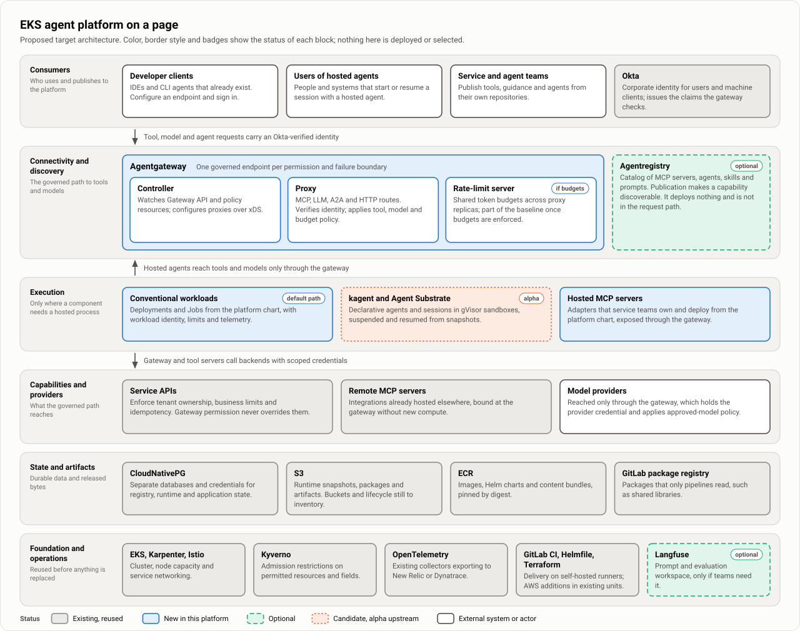
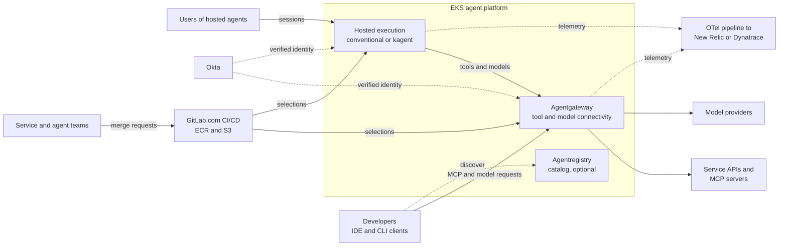
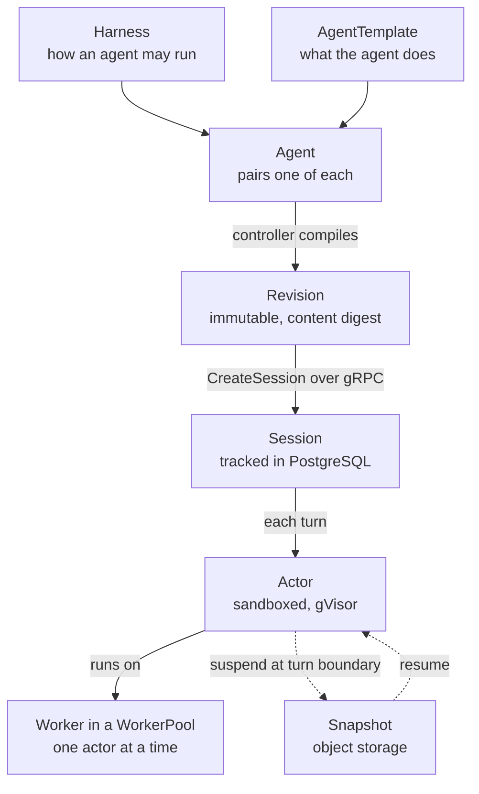
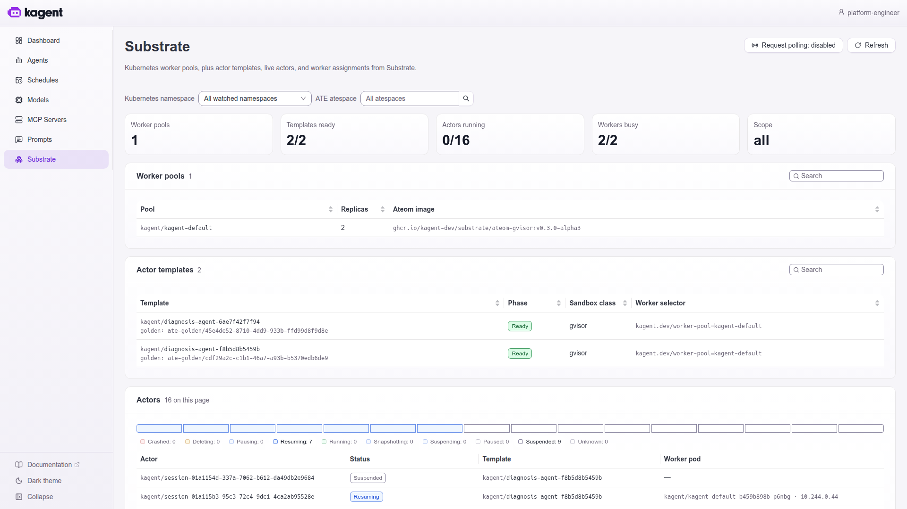

# Architecture overview

| | |
|---|---|
| Status | Proposed. Nothing is selected or deployed, and there are no pilot results. |
| Updated | 7 October 2026 |
| Based on | Architecture document 0.1 (5 October 2026), sections 1, 4, 5, 6 and 8; the demo as of 7 October 2026 |
| Parent | [Agent platform proposal](00-proposal.md) |

The platform adds one core component, Agentgateway, in front of tools, models and agents. Most of what it stands on exists today: EKS, Okta, Istio, Kyverno, CloudNativePG, OpenTelemetry, GitLab and ECR. A catalog (Agentregistry) and a prompt and evaluation workspace (Langfuse) are optional, and kagent with Agent Substrate is a candidate for hosted sessions. Maturity is uneven: Agentgateway's resources are `v1alpha1`, kagent 1.0 is alpha, and the reused services have not been inventoried.

## The design in five points

- **Access comes before hosting.** The first deliverable is one existing client, one read-only tool and one approved model, with a debugging path that works for an ordinary developer.
- **The gateway is the control point.** Agentgateway verifies the caller, decides which tools and models that caller may use, holds the model provider's credential and applies budgets. It is a control point only if calls around it are denied ([Trust boundaries and bypass prevention](12-trust-boundaries.md)).
- **Services keep business authorization.** Gateway permission to call a tool never replaces the service's own checks on tenant ownership, limits and idempotency.
- **Delivery reuses what we have.** Components publish immutable artifacts. A merge request (MR) selects an artifact for an environment, and the existing GitLab CI/CD and Helmfile pipeline applies it. Each object has one writer.
- **Maturity is uneven.** Agentgateway is the core. kagent 1.0 is alpha, Istio's Agentgateway integration is experimental, and no cost has been priced.

## Component status

Every component carries one of four labels. The SVG diagrams show the same labels by color, border style and badge.

| Label | Meaning |
|---|---|
| **Reused** | Exists in our environment today. The design depends on it, and its version and configuration still have to be inventoried. |
| **New** | Added by this platform. |
| **Optional** | Added only when a stated need appears. |
| **Candidate** | Under evaluation, and labeled alpha or experimental by its own project. |

## System context

Both client paths require an Okta-verified identity. A hosted entry point that is not a gateway route must authenticate users itself; it does not inherit the gateway's checks. Catalog discovery and CI delivery are outside the runtime request path.

| External system | Interface | Direction |
|---|---|---|
| Developer clients | MCP over HTTP with OAuth; a model endpoint configured as a base URL and bearer credential | Into the gateway |
| Okta | OAuth 2.0 and OpenID Connect; token validation through published keys | Tokens to clients; keys to the gateway |
| Model providers | Provider APIs, called with a credential the gateway holds | Out of the gateway |
| Service APIs and MCP servers | MCP from the gateway; each service's own API behind its adapter | Out of the gateway |
| GitLab.com | MRs and pipelines on self-hosted runners; federation to AWS and the cluster by ID token | Into the cluster and AWS |
| ECR, S3 | Images, charts and bundles by digest; snapshots and packages | Pulled by the cluster and by pipelines |
| New Relic or Dynatrace | OTLP export from existing collectors | Out of the cluster |

## Solution strategy

1. **Access before hosting.** Compute is deployed only when a component needs a hosted process.
2. **Reuse before replace.** Existing cluster services are used where they fit, and each addition has an adoption condition.
3. **Native APIs over a new abstraction.** Workloads are described with Helm values or the runtime's own resources. A profile is a reviewed example to copy, not a new API.
4. **One writer per object.** Each object or field has one owner, including resources that controllers generate ([Repositories, delivery and rollback](13-repositories-and-delivery.md)).
5. **Immutable artifacts, selected per environment.** The same bytes move from dev to prod. Endpoints, identities and data bindings differ by environment.
6. **Checks proportional to the change.** Parallel versions and isolated candidates are used only for an identified contract, state, policy or session risk.
7. **Controls live where a team cannot remove them.** Platform rules are enforced at the gateway, at admission and in the network. A shared library is a convenience.
8. **Business authorization stays downstream.** The gateway decides who may call a tool. The service decides whether this payment may be refunded.
9. **Static consumers.** Endpoints and content are resolved when a client is configured or an agent is released. A catalog outage does not stop them.
10. **Evidence before adoption.** An experiment without an agreed threshold produces an observation, not a pass.

## Component catalog

| Capability | Component | Status | Adoption condition |
|---|---|---|---|
| Tool and model connectivity | Agentgateway | New | Actual clients, protocols, authentication and telemetry work |
| Model credentials and budgets | Agentgateway LLM backends; its rate-limit server for shared token budgets | New | Providers selected; caller authentication, credential custody and budget enforcement demonstrated |
| Corporate identity | Okta | Reused | Required grants, claims and audiences supported |
| Network controls | Istio and the cluster's network policy enforcement | Reused | Each intended path and each bypass restriction demonstrated |
| Infrastructure admission | Kyverno | Reused | Permitted deployment and policy changes enforceable |
| Discovery | Agentregistry | Optional | The catalog reduces onboarding effort and has suitable access controls |
| Trusted hosted application | Conventional EKS Deployment or Job | New convention on reused EKS | Framework and lifecycle meet the workload |
| Declarative and session execution | kagent and Agent Substrate | Candidate | Native management, isolation and density justify operating them |
| Metadata and checkpoints | CloudNativePG | Reused | Application schema, isolation and recovery proven |
| Artifacts and snapshots | ECR, S3, GitLab package registry | Reused | Integrity, reader permissions and retention established |
| Operational telemetry | OTel with New Relic or Dynatrace | Reused | Trace continuity and required signals visible |
| Prompt and evaluation workspace | Langfuse | Optional | Teams need the workflow enough to justify its dependencies |

## Agentgateway

Agentgateway mediates configured connections between callers and tools, models and agents.

**Structure (Documented upstream).** A controller watches Gateway API resources and Agentgateway custom resources, translates them into the proxy's configuration and serves it over xDS. For each `Gateway` of the `agentgateway` GatewayClass, a deployer provisions a proxy Deployment. The proxy handles HTTP, gRPC, MCP, A2A and LLM traffic.

| Resource | API | Purpose |
|---|---|---|
| `Gateway`, `HTTPRoute`, `GRPCRoute` | Kubernetes Gateway API | Listeners and routing |
| `AgentgatewayBackend` | `agentgateway.dev/v1alpha1` | A destination: an MCP server, a model provider, an agent runtime |
| `AgentgatewayPolicy` | `agentgateway.dev/v1alpha1` | Traffic, security and transformation rules |
| `AgentgatewayParameters` | Agentgateway custom resource | Listed upstream with the other two; its fields were not checked |

- **For tools.** The gateway terminates MCP, authenticates the caller with Okta, filters the tool list to what the caller may use and forwards permitted calls. **Documented upstream:** static, dynamic and virtual MCP backends, stateful or stateless session routing, and tool rules written as CEL expressions over token claims and the tool name.
- **For models.** The gateway holds the provider credential, restricts callers to approved models and applies budgets. The credential is referenced from a secret or comes from workload identity. It is never inline, and passthrough is allowed only where a caller is meant to hold its own provider account.
- **Policy model (Documented upstream).** A policy has frontend, traffic and backend sections that attach at different targets. When several policies apply, sections merge field by field, the more specific target wins, and the oldest policy wins a tie. A platform policy is therefore not automatically a restriction that teams cannot override ([Identity and authorization](11-identity-and-authorization.md)).
- **Rate-limit server (Documented upstream).** Shared token budgets need a separately deployed rate-limit server. Local rate limiting counts requests, not tokens. Rate limiting is evaluated before prompt guards, so a request that a guardrail rejects still consumes quota, and a token limit is not a currency budget. If budgets are adopted, this server joins the baseline with an owner.
- **What it is not.** It does not replace downstream business authorization, application state or a workflow engine. Shared endpoints follow permission and failure boundaries: not a gateway per agent, and not one proxy for every environment.

## Agentregistry

Agentregistry is a catalog of MCP servers, agents, skills and prompts, with a server, the `arctl` CLI, a web UI and a PostgreSQL database (**Documented upstream**). Publication makes a capability discoverable. Deployed selections and service permissions stay independent of it.

It also documents a deployment integration that produces kagent resources and pods. The page names no kagent 1.x resource, so it appears to target the 0.x model; that is an inference. Under **Working assumption (WA-3)** the integration is not used for production, because it would be a second writer.

## Hosted execution

**Conventional workloads (WA-2, the default).** Deployments suit trusted applications that serve requests and keep session state outside the process. Jobs suit bounded asynchronous work. The platform chart supplies workload identity, resources, telemetry and gateway bindings. The application sets concurrency, timeouts, maximum iterations and tokens, and graceful shutdown. A gateway request timeout alone does not stop downstream execution.

**kagent and Agent Substrate (Candidate).** kagent 1.0 is labeled alpha and replaces the 0.x Deployment-based `Agent` with a new resource model. Use one pinned generation in the pilot.

All of the following is **Documented upstream** and **To validate**.

| Topic | What the kagent 1.0 documentation states |
|---|---|
| Sessions | A Session is not a Kubernetes resource. It is created through kagent's gRPC API under kagent's own authentication and authorization, and tracked in PostgreSQL. |
| Execution | A worker is a pre-started sandboxed pod that hosts at most one actor at a time, only while a turn runs. A pool is sized for concurrent turns, not for the number of agents or sessions. |
| Isolation | Every actor is compiled to the `gvisor` sandbox class. Workers in a microVM pool accept no kagent actor. |
| Egress | An actor reaches the network only through Substrate's egress gateway, which is default-deny, with an allowlist that kagent derives from the AgentTemplate. |
| Snapshots | A development installation uses an in-cluster object store with well-known credentials and is not durable. Production needs a real bucket and a backup policy. |
| Node dependencies | Nodes fetch sandbox runtime assets from a public Google Cloud Storage URL unless a hosted copy is configured. |

**Bring-your-own images.** The container must serve the A2A service over gRPC on port 80 and answer `GET /readyz` on port 8081. The `kagent-adk` Python package and the Go helper meet the contract. The `kagent-langgraph` and `kagent-crewai` adapters do not. Check the pilot agent against this contract before planning to run one image on both execution paths.

## Persistence and artifacts

| Store | Holds | Rule |
|---|---|---|
| CloudNativePG | Registry, runtime and application state | Separate databases, credentials and migration ownership |
| S3 | Runtime snapshots, packages, artifacts | Encryption, tenant access, retention and restore defined per use |
| ECR | Images, Helm charts and content bundles as OCI artifacts | Pinned by digest. Anything a running pod pulls stays in ECR or S3, where workload IAM applies |
| GitLab package registry | Packages that only pipelines read | Duplicates turned off, protection rules added, recorded hash still verified |

Runtime snapshots, SQL session metadata and external side effects are three different recovery boundaries. Restoring only one may not restore a usable conversation.

## Versions and maturity

No version is pinned. The pilot records the tested combination in a compatibility inventory. This table records what the documentation showed on 5 October 2026.

| Component | Documented version | Documented maturity | Status here |
|---|---|---|---|
| Agentgateway on Kubernetes | 1.6.x | Custom resources at `v1alpha1`; no maturity label on the pages checked | New |
| Istio integration of Agentgateway | Istio 1.31.1 | Experimental, for evaluation only | Not used (WA-1) |
| kagent | 1.0 | Alpha; resources at `v1alpha3` | Candidate |
| Agent Substrate | Documented within kagent 1.0 | Covered by the same alpha documentation | Candidate |
| Agentregistry | Not shown on the pages checked | Deployment API at `v1alpha1` | Optional |
| Langfuse, self-hosted | Not checked | Not checked | Optional, not in the pilot (WA-6) |
| EKS, Istio, Kyverno, Karpenter, CloudNativePG, OTel | Not inspected | | Reused |

Two separately documented capabilities are not proof that they integrate.

## Deployment view

The picture is illustrative. The notes define no namespace names, no gateway count and no statement on whether environments share a cluster (WA-7). The pilot starts with one gateway endpoint in dev for one domain (WA-4).

**Gateway controller (WA-1).** One controller owns each GatewayClass.

| | Standalone controller (WA-1) | Istio-managed |
|---|---|---|
| GatewayClass | `agentgateway` | `istio-agentgateway` for ingress, `istio-agentgateway-waypoint` for waypoints |
| Maturity | No experimental label on the pages checked | Experimental, for evaluation only; documented under ambient mode |
| Istio policy on the proxy | Not applicable | Istio's `AuthorizationPolicy`, `RequestAuthentication` and `PeerAuthentication` are not applied to the Agentgateway proxy |
| Open point | How the proxy presents an identity that mesh backends accept | Whether the experimental status is acceptable |

**Network paths.**

| Path | Treatment |
|---|---|
| User client to gateway | TLS and supported Okta authentication |
| Client or agent to model endpoint | Gateway-issued or Okta-derived credential; approved models only |
| Gateway to MCP server or backend | Explicit backend identity and TLS or mesh configuration |
| Gateway to model provider | Provider credential held by the gateway; private connectivity or restricted egress where available |
| Agent to approved tools and models | The governed endpoint, or an explicitly equivalent approved path |
| Workload to AWS | Scoped workload IAM through the supported EKS identity mechanism |
| Collector to vendor | Authenticated OTLP export |

A route in the gateway is not proof that a workload cannot connect directly to a backend or a provider.

**Capacity and availability.** Keep a reliable baseline for the gateway, its controller and the persistent services. Scale agents on concurrent work or queue depth, because CPU under-represents work that waits on model and tool I/O. Karpenter supplies nodes; it does not decide how many replicas exist. The GitLab runners draw on the same cluster capacity. Multiple replicas or zones do not by themselves establish availability: before production, demonstrate secret rotation, database and object restore, gateway failure handling and node replacement. Namespace separation alone does not isolate arbitrary code.

## Observed in the demo

On the demo's kind cluster, one node on one machine, the new, optional and candidate components ran as themselves, and most of the reused ones were absent or replaced by a stand-in.

- **Versions that ran together.** Kubernetes 1.37.0, Gateway API 1.6.0, Agentgateway 1.6.0 under its own controller (as WA-1), kagent 1.0.0-alpha7 with Agent Substrate 0.3.0-alpha3, Agentregistry chart 0.4.0, Langfuse 4.46.0, Kyverno 1.19.1 and Keycloak 26.7.5.
- **One gateway carried all three kinds of traffic.** A single Gateway served MCP routes to two tool servers, A2A routes to four agents, and the model route in both the Anthropic Messages and the OpenAI chat-completions format.
- **Both execution paths ran.** Three agents and two MCP servers ran as conventional Deployments. One declarative agent ran on kagent. No bring-your-own image was tried on kagent.
- **The registry was a catalog only (WA-3).** Its server has no cluster credentials. Scaled to zero, tools and agents still answered.
- **Langfuse was deployed**, where WA-6 leaves it out of the pilot. It held about 1.8 GiB idle and its ClickHouse failed once.
- **Footprint.** The cluster held 8.5 GiB when new, 10 GiB after a few incidents and 11 to 12 GiB after some hours. kagent with Substrate took about 0.5 GiB after install and 1.1 GiB after use, Agentregistry about 55 MiB, Kyverno 70 to 100 MiB.
- **Stand-ins.** Keycloak for Okta; Grafana, Prometheus, Loki, Tempo and Alertmanager for the operational backend; a local registry for ECR; `task` targets for CI; a model endpoint on the same machine for the provider.
- **Not exercised.** Istio, Karpenter, CloudNativePG, S3, the rate-limit server, more than one replica or environment, availability and recovery. Incident state was kept in memory.
- **A difference to reconcile.** Callers reached the kagent agent with A2A 1.0 over JSON-RPC through the gateway. The bring-your-own contract above speaks of A2A over gRPC. The demo ran no bring-your-own image, so the two statements have not been tested against each other.

Agent Substrate as the kagent console shows it, half an hour after an incident: one pool of two workers, the agent's two revisions as actor templates in the gVisor sandbox class, and one actor for each of sixteen conversations.

More: [Demo findings and limits](21-demo-findings.md).
