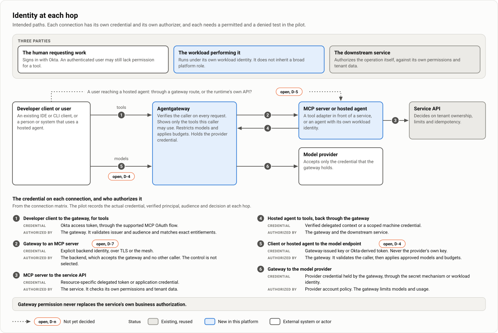
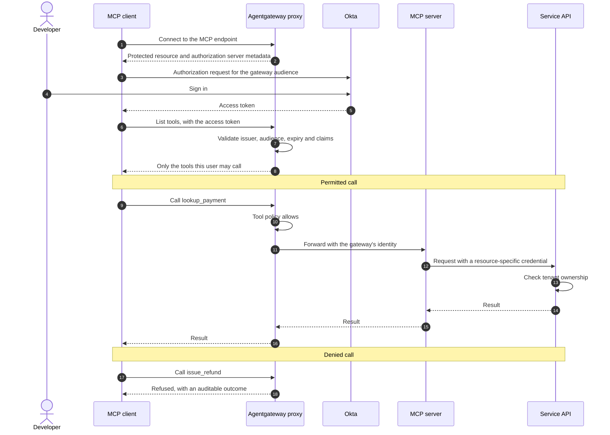
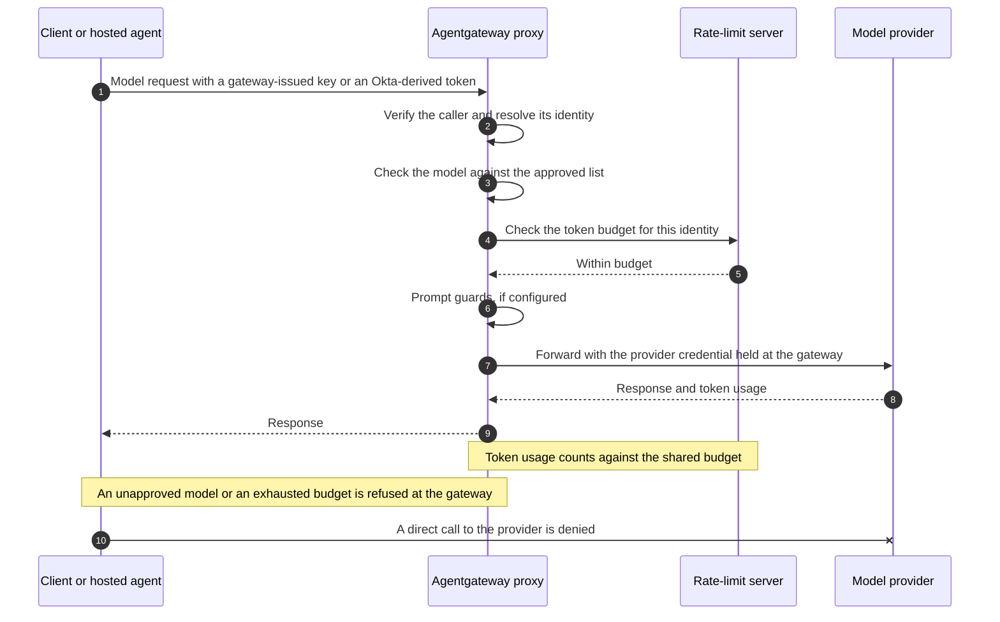
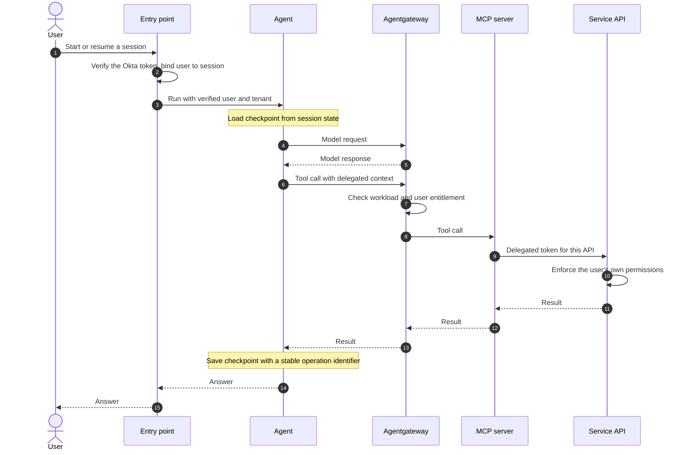
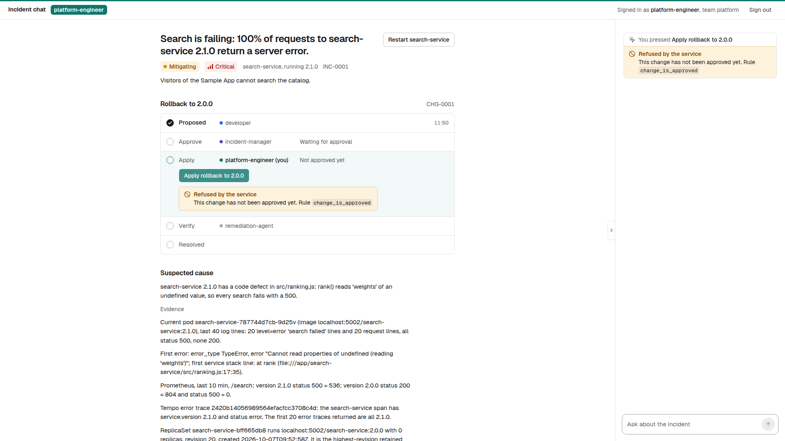
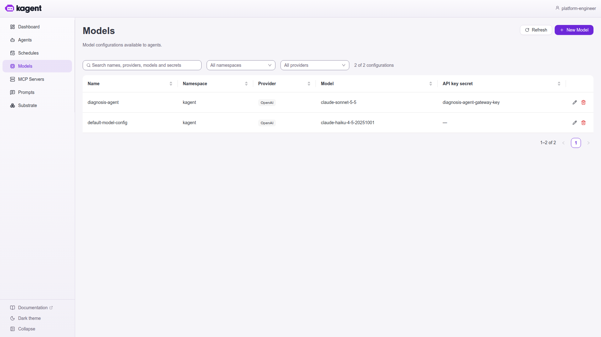

# Identity and authorization

| | |
|---|---|
| Status | Proposed. Nothing is selected or deployed, and there are no pilot results. |
| Updated | 7 October 2026 |
| Based on | Architecture document 0.1 (5 October 2026), sections 7.1 to 7.3 and 9; the demo as of 7 October 2026 |
| Parent | [Agent platform proposal](00-proposal.md) |

The model separates three parties: the human requesting work, the workload performing it, and the downstream service that authorizes the operation. Okta verifies the human. The gateway verifies each caller and decides which tools and models that caller may reach. The service decides whether the operation itself is allowed. Every supported connection needs a positive and a negative test, and two forks are still open: the credential a model request carries (D-4) and the entry point for hosted agents (D-5).

## Connection matrix

| Connection | Credential | Who authorizes |
|---|---|---|
| Developer client to MCP gateway | Okta access token through the supported MCP OAuth flow | The gateway validates issuer and audience and matches exact entitlements |
| Client or hosted agent to model endpoint | Gateway-issued key or Okta-derived token; never the provider's own key | The gateway validates the caller, then applies approved models and budgets |
| Gateway to model provider | Provider credential held by the gateway through the secret mechanism or workload identity | Provider account policy; the gateway limits models and usage |
| User to hosted agent | Supported user authentication at the entry point | The entry point or runtime binds the user to a permitted agent and session |
| Hosted agent to tools | Verified delegated context or a scoped machine credential | The gateway and the downstream service |
| Batch job to tools | Named machine identity | The gateway and the service grant autonomous permissions explicitly |
| Gateway or MCP service to API | Resource-specific delegated token or application credential | The backend checks its own permissions and tenant data |
| Workload to AWS | Scoped EKS workload IAM | IAM and resource policies |
| Application to stored state | Database credential plus trusted application identity | The application enforces user and tenant access |
| Client to catalog | Supported authenticated catalog access | The catalog restricts visibility and publication separately |
| GitLab CI to cluster and AWS | ID token federation into scoped IAM roles, or the GitLab agent for Kubernetes. Not the runner pod's service account or node role | RBAC and IAM restrict project, protected ref and environment scope |
| Collector to telemetry backend | Vendor ingest credential | The observability platform |

The table defines intended paths, not proven integration support. The pilot records the actual credential, verified principal, audience and decision at each hop. Token forwarding respects the destination's audience: an Okta token is not forwarded to an unrelated API merely because that API accepts bearer authentication.

## A developer client calls a tool

The sequences on this page show intended behavior. Client compatibility, token handling and each denial are experiments, not established results.

**Documented upstream:** Agentgateway serves the protected resource metadata itself and has a native Okta provider. It serves authorization server metadata from Okta's discovery document, adds the configured audience to the authorization request because Okta does not support resource indicators, and proxies dynamic client registration. Pre-registering the client ID is recommended, because Okta's registration endpoint usually needs an API token that MCP clients do not have. Tools the caller may not use are hidden from the list, and a call to one is refused.

No agent workload, session database or worker pool exists for this developer.

## A model request

Clients usually configure a model endpoint as a base URL and a bearer credential, not through the MCP OAuth flow. The Okta MCP provider therefore does not by itself cover model requests, and each supported client needs an established way to carry a verified identity (D-4). The developer never holds the provider's key. Usage is attributed from the verified identity, not from a header the caller supplies.

| Question | Position |
|---|---|
| Who holds the provider credential? | The gateway, by secret reference or workload identity. Never inline; passthrough only where a caller is meant to hold its own provider account. |
| What does the caller present? | A gateway-issued key or an Okta-derived token. Open, D-4. |
| How are models restricted? | Each caller is limited to approved models. Which providers and models are approved is a requirement to agree. |
| How is usage attributed? | From the verified identity, not from a caller-supplied header. |

If gateway keys are used, define who issues them, how each maps to an Okta user or a named workload, and how rotation and revocation work. A long-lived key keeps working after an Okta entitlement is removed unless something revokes it. The upstream budget example keys its limit on a request header, so confirm that a budget can be keyed on a validated claim before relying on it.

## A hosted agent acts for a user

- The agent runs under its own workload identity. It does not inherit a broad platform execution role.
- When an operation must follow the human's permissions, the tool path obtains a resource-specific delegated credential. If that flow is unavailable, the capability is limited or uses a separately approved machine operation. It never falls back silently to a privileged service credential.
- A batch job has no user. It calls tools as a named machine identity whose autonomous permissions are granted explicitly.

Whether the entry point is a gateway route or the runtime's own API is open (D-5).

## Okta and the claims contract

A claims contract defines issuer, audience, subject, expiry, user versus machine identity, tenant membership and tool entitlements. Identity owners decide how groups and permissions become issuer-controlled claims and how entitlement removal takes effect. Reviewed entitlement configuration lives under `access/` in the environment configuration repository; its format, and how it reaches Okta, are not yet defined.

- An authenticated user may still lack permission for a tool.
- A machine client is not treated as a human because its token validates.
- Tenant and session identifiers come from verified context. A header or prompt text cannot replace them.

"Tenant" means the boundary that data and permissions must not cross. Whether that is an internal team, a customer organization or both is a requirement still to agree.

## Tool authorization

Entitlements are matched exactly. **Documented upstream:** tool access rules are CEL expressions in an `AgentgatewayPolicy`, such as `jwt.sub == "alice" && mcp.tool.name == "get_me"`. All tool access is allowed until rules are defined. Once rules exist, a caller who matches none of them sees no tools and has calls refused. A new MCP backend therefore needs its rules in place before it is exposed.

Test missing claims, unexpected claim types, similarly named scopes, stale tokens and alternate route matches. Any rule on tool arguments must be validated against parsed protocol data; the page checked does not show argument inspection.

## Who may change gateway policy

| Party | May do |
|---|---|
| Platform owners | Control authentication and mandatory restrictions |
| Service and tool owners | Propose narrower access configuration in their assigned scope |
| Agent teams | Select from allowed tools; they cannot grant themselves backend rights |

Because more specific policies win and merge field by field, a platform rule holds only if RBAC limits who can create or modify routes, backends and policy fields, and admission rules restrict the permitted fields. Inspect effective policy and test attempted overrides ([Trust boundaries and bypass prevention](12-trust-boundaries.md)).

## Delegation, sessions and revocation

- **Business permissions.** Gateway permission to call a tool is one prerequisite. In the worked examples the payments service itself resolves ownership, refund eligibility, cumulative limits and idempotency. For delegated flows, document consent, refresh, expiry, revocation and credential storage. Credentials never appear in skills, prompt variables, catalog descriptions or trace payloads.
- **Sessions.** Session access is a separate control from Kubernetes admission. Reject cross-user and cross-tenant session identifiers, including through direct runtime APIs and debug interfaces. kagent's session API has its own authentication (**Documented upstream**); how it verifies an Okta user is not established and is part of D-5.
- **Sandboxes.** A Substrate worker hosts one actor at a time and is reused, so the test is that nothing carries over from one actor to the next. Pod-level policy does not identify which actor a worker is running.
- **Admission is not authorization.** Kyverno enforces infrastructure configuration. Service-account RBAC cannot substitute for end-user business authorization.
- **Revocation.** Measure the time from entitlement removal to denial at every boundary, including any gateway-issued model key. Withdrawing a catalog entry revokes no credential.

## Observed in the demo

On the demo's kind cluster, with Keycloak standing in for Okta, every agent, tool and model call went through the gateway with the caller's verified identity, and the tool rules were enforced twice.

- **The claims contract as built.** One realm, one audience (`agentgateway`), and three claims on every token: `preferred_username`, a top-level `roles` array and `team`. Four users, two public clients with PKCE for the Chat UI and for MCP clients, a command-line client for the demo's scripts, and one confidential machine client, `alert-automation`. No tool, agent or endpoint accepts a user name, role or team as an argument or header.
- **Per-tool rules by role, at two layers.** The gateway's route lists each tool with the roles that may see and call it; a tool that is not listed is hidden from everyone. `delivery-mcp` verifies the token again and applies the rules only it can know: the caller's team owns the service, the approver is not the proposer, the change is approved, and `apply_change` is idempotent on its change identifier.
- **The gateway removes `Authorization` after validating it.** A backend receives the caller's token only when its route sets passthrough. The demo sets it for the delivery tool server and the agents and leaves it off for the model route.
- **Both credentials of D-4 ran.** People and the alert automation called the model route with their Keycloak token. The kagent agent called it with a key the gateway issued to that workload, on a route of its own; the gateway stores only the key's hash, and deleting one ConfigMap revokes it. kagent 1.0.0-alpha7 can instead pass the caller's token to the model route, but its API has no way to forward a caller's token to an MCP server.
- **kagent does not verify tokens itself.** It reads the user from a token's payload and checks neither signature nor expiry. The gateway route in front of the agent, the sign-in proxy in front of kagent's console and network policies do the checking, which bears on D-5. The console lets in the platform engineer only, and a chat started there reaches the agent without passing the gateway.
- **kagent scopes a conversation to whoever started it.** In the console the platform engineer sees that the alert's sixteen conversations exist and cannot open them.
- **A simplification that differs from the design.** Every hop forwards the caller's same token, under one audience, to the next hop. The design calls for the gateway's own identity toward the MCP server and a resource-specific credential toward each API. No delegation or token exchange was built.
- **Attribution.** Each model call was recorded with the verified user, or with the workload for the diagnosis agent. Buttons on the incident card are handled by code that calls the tool as the signed-in user; the model never decides whether an action runs.
- **Not exercised.** Okta and its MCP provider, a second tenant, token budgets, session isolation, and time from entitlement removal to denial. Tokens last 30 minutes. A real MCP client could not sign in through the gateway by itself; a client that already holds a token works.

What each refusal looked like to the caller:

| Refused by | Case | What the caller sees |
|---|---|---|
| Gateway | No token, or a token that does not verify | HTTP 401 |
| Gateway | Wrong role on an agent or hook route | HTTP 403, `authorization failed` |
| Gateway | A tool the caller's role lacks | Absent from `tools/list`; a call returns HTTP 400 with JSON-RPC error -32602, `Unknown tool`, the same as a tool that does not exist |
| Gateway | An unapproved model | HTTP 403 |
| Service | A rule of `delivery-mcp` | HTTP 200 from the gateway; the tool result is `{"error": "forbidden", "layer": "service", "rule": "<rule_name>", "message": "..."}` |

A caller cannot tell a denied tool from a missing one. The worked examples expect a denied call to produce an actionable access result, so this needs a decision in the pilot.

The second layer, as a signed-in person sees it. The platform engineer may call `apply_change`, so the gateway lets the call through; the tool server refuses it because the change is not approved yet, and names its rule.

The workload's credential, as kagent holds it. The diagnosis agent's model configuration names the Secret with the key the gateway issued to that workload. The provider reads OpenAI because the agent speaks that format to the gateway's model route.

More: [Demo findings and limits](21-demo-findings.md).
