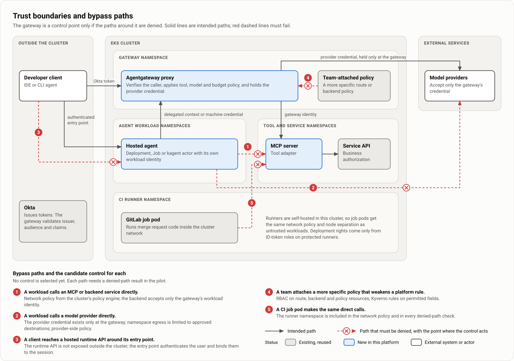

# Trust boundaries and bypass prevention

| | |
|---|---|
| Status | Proposed. Nothing is selected or deployed, and there are no pilot results. |
| Updated | 7 October 2026 |
| Based on | Architecture document 0.1 (5 October 2026), section 10; the demo as of 7 October 2026 |
| Parent | [Agent platform proposal](00-proposal.md) |

The gateway is a control point only if a call that goes around it fails. A route in the gateway does not stop a workload from connecting directly to a tool server or a model provider, and a team that may create gateway resources can loosen a platform rule without touching it. The design names five bypass paths and candidate controls for each. No control is selected (D-7): each path needs a denied-path result in the pilot, and a path that cannot be blocked or equivalently governed is not offered as governed.

## The five bypass paths

| Bypass path | Candidate controls | Denied-path check |
|---|---|---|
| A workload calls an MCP or backend service directly | Kubernetes NetworkPolicy from the cluster's policy engine; the backend accepts only the gateway's workload identity, through mesh authorization at the backend or a credential only the gateway holds | A direct call from an agent namespace is refused while the gateway's call succeeds |
| A workload calls a model provider directly | The provider credential exists only at the gateway; egress from workload namespaces is limited to approved destinations; provider-side policy limits which identity or network path may invoke models | A workload without a provider key and one with a smuggled key are both denied |
| A client reaches a hosted runtime API around its entry point | The runtime API is not exposed outside the cluster; the entry point authenticates the user and binds the user to the session | Unauthenticated and wrong-user requests fail at every exposed address |
| A team attaches a more specific gateway policy that weakens a platform rule | RBAC on route, backend and policy resources; Kyverno rules on permitted fields | The attempted override is rejected at admission or has no effect |
| A CI job pod makes the same direct calls | The runner namespace has the same network policy and node separation as untrusted workloads | Direct calls from a job pod are refused |

For kagent actors, Agent Substrate's default-deny egress gateway is an additional control on the first two paths (**Documented upstream**), and it is **To validate** like the others.

## Why each path is real

- **The network does not know about routes.** With no network policy, any pod can call a tool server or an agent on its Service, and any pod can call the model provider's address. Mesh egress settings are not a boundary where a workload can avoid its proxy; pair them with network policy.
- **Gateway policies merge.** **Documented upstream:** when several Agentgateway policies apply, their sections merge field by field, the more specific target wins, and the oldest policy wins a tie. A platform policy is therefore not automatically a restriction that teams cannot override. It holds only if RBAC limits who can create routes, backends and policies, and admission restricts what they may contain.
- **Runtimes have their own APIs.** A hosted entry point that is not a gateway route does not inherit the gateway's checks. kagent creates sessions through its own gRPC API, which Kubernetes RBAC and Kyverno do not govern ([Identity and authorization](11-identity-and-authorization.md)).
- **The runners are inside.** The GitLab runners are self-hosted in the cluster this option builds on, and job pods run MR code inside that network.

## Secrets

Use the organization's secret delivery mechanism where it is supported, and choose one if none exists (D-9). Manifests contain references, not tokens. Inspect Terraform state, rendered manifests, Helm release data, CI logs and debug output for accidental copies. A Kubernetes Secret or a sensitive Terraform variable does not establish absence from other stores.

## CI runners

Whatever a job pod's service account or node role can do, every job on that runner can do. Deployment rights therefore sit on ID-token roles and protected runners, not on the runner itself. A cluster or node-pool fault can also take the pipeline down with the workloads, which is why the emergency change path must work without the runners ([Repositories, delivery and rollback](13-repositories-and-delivery.md)).

## What closes this page

| Open item | Closed by |
|---|---|
| D-7: which control denies each bypass path | A denied-path result for each row of the table above |
| D-9: secret delivery mechanism and network policy engine | The inventory, then the secret rotation and inspection experiment |
| D-5: the entry point for hosted agents | Unauthenticated and wrong-user requests fail at every exposed address |

The identifiers are listed in [Decisions, risks and requirements](31-decisions-and-risks.md), and the experiments in the [Pilot plan](30-pilot-plan.md).

## Observed in the demo

On the demo's kind cluster, the bypasses were tried first and the controls were added afterward. Two layers were built, network policy and admission rules, and three drills show each control refusing the direct path while the governed path still answers.

**Five bypasses worked on Agentgateway 1.6.0 before any control existed.** Each was done on the cluster by someone with rights to create gateway resources in a namespace:

1. A second policy on the platform's route made the token optional. It was accepted and attached. It had no effect only while it was the younger of the two: once the platform's policy had been recreated, requests without a token reached the tool server.
2. A second route to the tool server's Service, with no policy, offered `developer` all ten tools, `apply_change` included.
3. The same from another namespace, with a backend that names the Service by its DNS name. No ReferenceGrant is asked for a host name.
4. A backend that names the model provider's host: the model answered through the gateway without a token.
5. A route with the exact path of a platform route, or with a host name and the path `/`, from another namespace took the platform route's traffic, callers' bearer tokens included.

**The network boundary.** One chart, installed once per namespace of agents or tool servers, creates four kinds of NetworkPolicy:

| Policy | Allows |
|---|---|
| `default-deny` | Nothing in and nothing out, unless a policy below allows it |
| `only-from-the-gateway` | In: the gateway's proxy pods, on the ports the workloads serve |
| `only-to-the-platform` | Out: cluster DNS, the gateway, the identity provider's keys and the telemetry collector |
| One per exception | What a single workload needs beyond that, written down with its reason |

The exceptions in the demo are short: the tool server that applies changes reaches the Kubernetes API, the chart registry and the search it verifies; the observability tool server reaches Grafana; the Chat UI is reached from the presenter's machine. A separate policy bounds Agent Substrate's egress gateway to pods of the cluster, because kagent 1.0.0-alpha7 adds the model vendor's public host to an agent's allowlist even when the model's base URL points at the gateway.

**The admission rules.** Four Kyverno `ValidatingPolicy` resources apply to every gateway resource that is not part of a platform release:

| Policy | Refuses |
|---|---|
| `gateway-policy-targets` | A policy that targets a Gateway, route, backend or Service of the platform, by name or by label selector |
| `gateway-route-claims` | A route that sends traffic to a platform backend, claims a path at or under a platform route's path, matches paths by regular expression, or claims a host name |
| `gateway-backend-destinations` | A backend that is a model backend or a forward proxy, or that names a platform Service, the model provider's host, or a bare address |
| `gateway-platform-objects` | Any change or deletion of a platform gateway resource by anyone but a deployer |

A team's own route to its own backend, with its own policy, passes all four.

**The drills.**

| Drill | Attempts | Result |
|---|---|---|
| `bypass-tool` | A pod in the agents' namespace, and a pod in another namespace, call the tool server directly. Then the same `tools/list` through the gateway. | No connection for either direct call. The governed call is answered. |
| `bypass-model` | A pod in the agents' namespace connects to the model endpoint directly. Then the gateway's model route without and with a token. | No connection. HTTP 401 without a token, a completion with one. |
| `policy-override` | Three resources applied as a team would: a policy that makes the platform route's token optional, a second route to the tool server, and a backend that names it. | Each is refused at admission. The platform's own release and a team's policy on its own route are admitted. |

**What the controls do not catch.**

- NetworkPolicy works on addresses and ports, not paths. An exception for one path of a workload opens its whole port. It does not stop the kubelet's probes or `kubectl port-forward`. On kind a refused connection is dropped, so the caller sees a timeout, not a refusal.
- The admission exemption is for an identity applying a Helm release. A deployer applying by hand with Helm's label written in passes, and so does a team that uses Helm for its own gateway resources. A label that only a deployer may set would be a firmer test.
- A backend naming an outside DNS name that resolves inside the cluster, a team's own `ExternalName` Service or hand-written endpoints that point at a platform Service, and a `GRPCRoute` that claims a platform path are not covered.
- Whether every team route must authenticate is a separate rule that was not written.

**Residual gaps on kind.**

- The Chat UI's port also serves the chat assistant's A2A endpoint and its alert hook, so the presenter's machine reaches them without the gateway. The assistant's own token check holds there. Serving the UI from its own pod would close it.
- The boundary is installed in the two namespaces of agents and tool servers. A pod elsewhere is not limited on its way out, and the local model endpoint needs no key. With a real provider, the first control is that only the gateway holds the credential.
- The tool server that applies changes may reach two ports on the whole node network, wider than the two destinations it needs.
- kind has one identity, so the deployer exemption is the cluster administrator. With a pipeline it would be the pipeline's identity.
- kagent does not verify tokens itself. Its gateway route, the sign-in proxy of its console and network policies guard its port. The console is a path to the diagnosis agent that does not pass the gateway. It is open to the platform engineer only, and whoever signs in can change or delete the agent.

**Not exercised.** A CI job pod as the caller, provider-side policy, mesh authorization at a backend (no Istio), a smuggled provider key, and inspection of state, release data and logs for secret values.

More: [Demo findings and limits](21-demo-findings.md).
