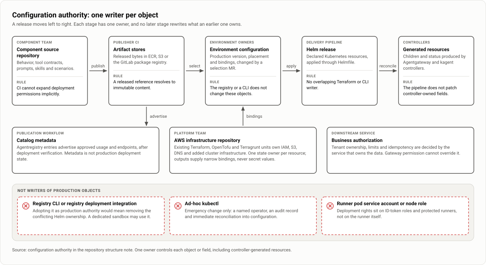
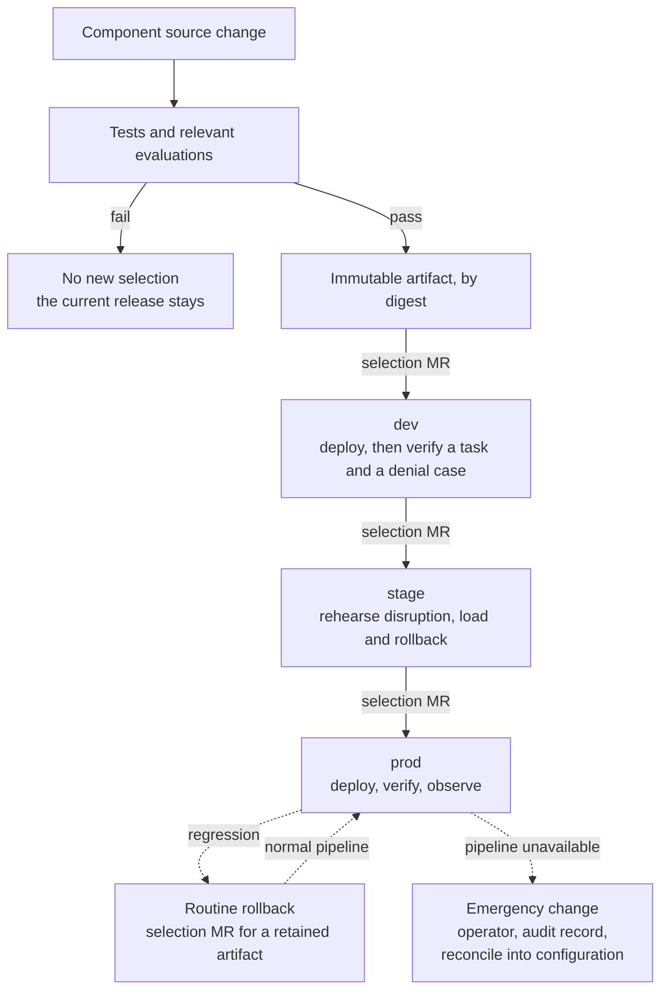

# Repositories, delivery and rollback

| | |
|---|---|
| Status | Proposed. Nothing is selected or deployed, and there are no pilot results. |
| Updated | 7 October 2026 |
| Based on | Architecture document 0.1 (5 October 2026), sections 11 and 12; the demo as of 7 October 2026 |
| Parent | [Agent platform proposal](00-proposal.md) |

Two shared homes hold reusable platform implementation and environment selection. Source code, tool contracts, prompts and skills stay with the teams that own their behavior. A component publishes an immutable artifact, a merge request (MR) selects it for an environment, and the existing GitLab CI/CD and Helmfile pipeline applies it. Each object has one writer, and there are two ways back: a routine rollback through the pipeline and an emergency change outside it. The repository names are proposals; no repository exists.

## Layout

```text
agent-platform/                # Reusable platform implementation
├── charts/
│   ├── agent/                 # Conventional application conventions
│   └── mcp-server/            # Hosted tool service conventions
├── profiles/
│   ├── kagent/                # Supported runtime configurations
│   └── gateway/               # Common gateway patterns
├── policies/
│   ├── kyverno/
│   └── agentgateway/
├── packages/                  # Shared libraries; proposed in the application notes
├── templates/                 # GitLab CI/CD components
├── starters/                  # agent, mcp-server, service-assets
├── tests/                     # Platform integration and compatibility
└── docs/

agent-deployments/             # Or these directories in existing cluster config
├── clusters/
│   ├── dev/
│   │   ├── helmfile.yaml
│   │   ├── platform/          # agentgateway, optional registry and runtime
│   │   ├── domains/
│   │   │   └── payments/      # Routes and permitted tool access
│   │   └── workloads/
│   │       ├── payments-mcp/
│   │       └── incident-assistant/
│   ├── stage/
│   └── prod/
├── access/                    # Reviewed entitlement configuration
├── checks/
└── CODEOWNERS
```

A component repository carries only what it needs:

```text
payments-service/              incident-assistant/
├── src/                       ├── src/          # Omit for a declarative agent
├── mcp/                       ├── config/       # Native runtime configuration
├── agent-assets/              ├── prompts/
│   ├── skills/                ├── skills/
│   └── prompts/               ├── evals/
├── tests/                     │   ├── scenarios/
│   ├── contracts/             │   └── expectations/
│   └── authorization/         ├── tests/
└── .gitlab-ci.yml             └── .gitlab-ci.yml
```

Use upstream charts directly where practical. Local charts implement our application conventions; they are not wrappers around every upstream chart. Terraform, OpenTofu and Terragrunt changes stay in the established AWS infrastructure repository.

## Who writes what



| Item | Authority | Restriction |
|---|---|---|
| Component behavior and contracts | Component source repository | CI cannot expand deployment permissions implicitly |
| Released bytes | ECR, S3 or the GitLab package registry | A released reference resolves to immutable content |
| Production version and placement | Environment configuration | The registry or a CLI does not independently change these objects |
| Catalog metadata | Publication workflow | Metadata is not production deployment state |
| Declared Kubernetes resources | The assigned Helm release or existing delivery mechanism | No overlapping Terraform or CLI writer |
| Generated children and status | The selected controller | The pipeline does not patch controller-owned fields |
| AWS infrastructure | Existing Terraform or OpenTofu units | One state owner per resource |
| Business authorization | Downstream service | Gateway permission cannot override it |

## Review and CI permissions

Component publishers write their own artifact namespace and propose environment updates. Environment-scoped deployment roles apply only approved configuration. Platform owners review shared components, identity and policy changes; service owners review their integrations.

Three GitLab behaviors bear on these boundaries:

- `CODEOWNERS` approval is enforced only on protected branches where that setting is enabled.
- With dev, stage and prod in one project and branch, the default CI/CD ID token subject is the same for every environment. A role is environment-scoped only once the `sub` claim components or separate projects distinguish them.
- A job pod's service account and node role are available to every job on that runner. Keep deployment rights on ID-token roles and protected runners.

Directory ownership is supplemented by actual RBAC and IAM restrictions. Pin platform commits, CI/CD component references, charts and images. Pinning a chart does not pin every image it deploys, so inspect the rendered output.

## Default flow



| Environment | Role |
|---|---|
| dev | Shows that the artifact deploys and integrates |
| stage | Rehearses the change against production-shaped identity, policy and data bindings; disruption, load and rollback drills run here |
| prod | Receives only a selection already verified in stage |

CI records the artifact identity, source commit, platform and chart versions, environment configuration revision, rendered resources and test results. GitLab job artifacts expire, so set retention explicitly or copy the record to durable storage. Whether every change must pass through stage is part of the approval requirement still to agree (D-14). A dev success does not establish production authentication, connectivity or quotas.

## Checks proportional to the change

| Change | Checks and release path |
|---|---|
| Service guidance | Publisher validation; consumer tests when adopted |
| Read-only agent behavior | Component checks and representative evaluations; normal rollout |
| Compatible tool implementation | Contract and authorization tests; normal rollout |
| Expanded access or production writes | Permission diff and review; targeted end-to-end tests |
| Breaking tool or session contract | Parallel version and explicit consumer migration |
| Shared gateway, authentication or controller | Affected-consumer compatibility checks and platform review |
| Database or snapshot format | Migration, restore and backward-compatibility procedure |

Tests for authorization and transaction correctness are deterministic. An LLM judge can assess quality but cannot substitute for them.

## Concurrency and acceptance

- Deployments to the same workload and environment are serialized, and a stale selection is detected by recording the expected current revision before activation.
- A rerun of a CI job uses the same immutable artifact or goes through a new review. It never resolves `latest` to different bytes under an old approval.
- Controller readiness and Helm success are prerequisites, not acceptance. A deployment is complete after actual route and backend behavior, the selected content and a negative authorization case are verified.

## Candidates and sessions

A separate candidate is created only where an ordinary rollout cannot contain the change. Its proxy, worker or database may still be shared, so identify which dependencies could affect active behavior.

For a breaking MCP change, start with versioned endpoints and explicit consumer adoption. Per-request weighted HTTP routing is not a proven way to promote MCP sessions. **Documented upstream:** stateful MCP session routing and affinity need selector-based backend targets.

Before changing an agent or runtime, define what happens to existing sessions: pinned continuation, drain or explicit restart (D-11). For kagent, a session runs the revision it was created from (**Documented upstream**).

## Failure and rollback

| Failure | Handling |
|---|---|
| Source checks fail | No new deployment selection |
| Artifact or catalog publication fails | Keep the current selection; retry the failed operation idempotently |
| Deployment partly succeeds | Inspect actual state and controller status before retrying or rolling back |
| Verification fails | Contain the affected capability and restore a compatible selection |
| Shared policy incident | The platform owner reconciles controls; a workload rollback must not undo a security fix |
| Stateful migration fails | Use the tested migration and restore procedure |

There are two recovery paths and no third, expedited pipeline:

- **Routine rollback.** An ordinary selection change to a retained compatible artifact and configuration. It uses the normal pipeline and its verification, and may be prioritized ahead of other work.
- **Emergency change.** Made outside the pipeline when the pipeline is unavailable or too slow for the incident. It needs an operator, an audit record and immediate reconciliation into configuration before routine delivery resumes. The runners run in the cluster, so this path must work without them.

Helm upgrades do not make a multi-resource change transactional. An endpoint rollback does not undo external writes or data migrations, and rolling back a chart does not necessarily restore previous CRD schemas or persisted data.

**Publication and retention.** Catalog metadata is not the release state machine. Consumer-facing endpoint updates are published after deployment verification. Previous compatible images, content, tool bindings and runtime dependencies are retained for the agreed rollback window. A fixed count of recent images is not enough while old consumers remain active.

## Observed in the demo

On the demo's kind cluster, one repository stands in for all of them, `task` targets stand in for the pipeline, and there is one environment. The layout and the one-writer rule were followed; promotion was not exercised.

- **The layout held.** `agent-platform/`, `agent-deployments/` and one directory per component under `components/` stand in for the separate repositories. A root Helmfile picks up one sub-Helmfile per platform service, workload and domain, and a single release can be applied by name.
- **Where the demo's layout differs.**

| Proposed | In the demo |
|---|---|
| `agent-deployments/access/` | Absent. The trusted issuer, and who may call each route, are files inside `clusters/dev/`. The demo found nothing that every cluster would share. |
| `clusters/stage/`, `clusters/prod/`, `checks/`, `CODEOWNERS` | Absent. One cluster, `dev`. |
| `charts/mcp-server/` | Absent. The hosted MCP server is deployed with `charts/agent`. |
| `policies/kyverno/`, `policies/agentgateway/` | Present, plus `policies/network/` for the namespace boundary. |
| `packages/`, `templates/`, `starters/` | Absent. |

- **Who may call what is one file per route.** A domain directory holds a values file per route with its allowed roles, and for a tool server its tool-to-role table. Changing access is changing that file and applying its release.
- **Artifacts are tags, not digests.** Images are named `<registry>/<component>:<version>` in a local registry that stands in for ECR. The Sample App chart is pushed there as an OCI chart.
- **The bad release is drift.** The command that starts the incident upgrades the Helm release with one changed value and edits no tracked file. The cluster then differs from its tracked selection until the rollback or a reset ends it.
- **The rollback keeps the release as the only writer.** The delivery tool server runs `helm upgrade` on the same release with the retained earlier version, under a small Role, then verifies with a real search request before it marks the change applied. A second apply with the same change identifier starts nothing. Apply to resolved took about 7 seconds.
- **It is not the design's routine rollback.** There is no selection MR and no pipeline. A developer proposes, an incident manager approves and a platform engineer applies through a tool, and the service records who did each. That is closer to an operator's change with an audit record than to either recovery path as written.
- **One-writer cases met along the way.** The registry has no cluster credentials. The admission rules treat only resources applied by the deployer as part of a Helm release as the platform's. The Sample App chart's own ServiceMonitor has to stay off: the rollback's Role cannot patch it, and Apply fails.
- **Not exercised.** GitLab, MR review and Code Owners, ID-token federation, promotion through stage and prod, serialized deployments and stale-selection detection, candidates, a breaking MCP migration, session behavior across a rollout, a controller or CRD upgrade, and retention.

More: [Demo findings and limits](21-demo-findings.md).
