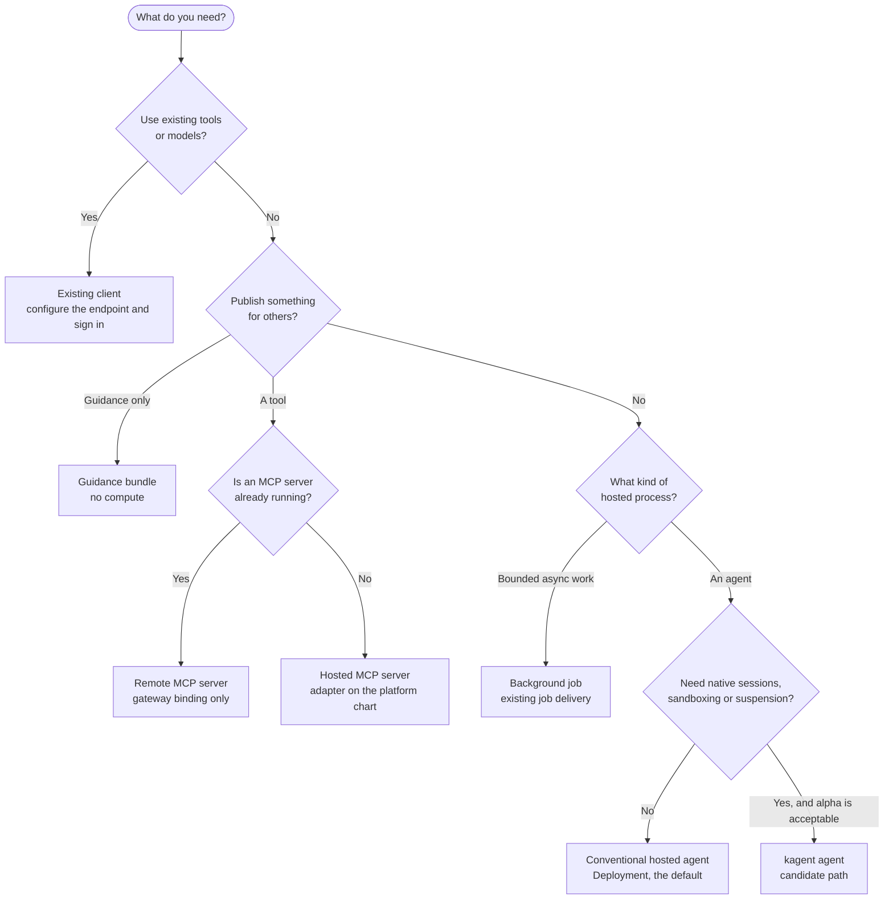
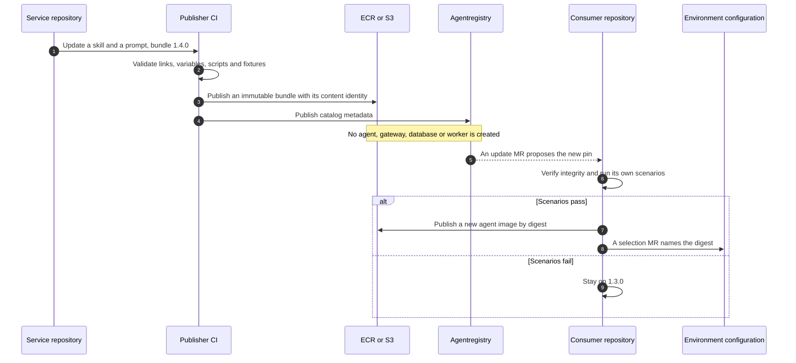
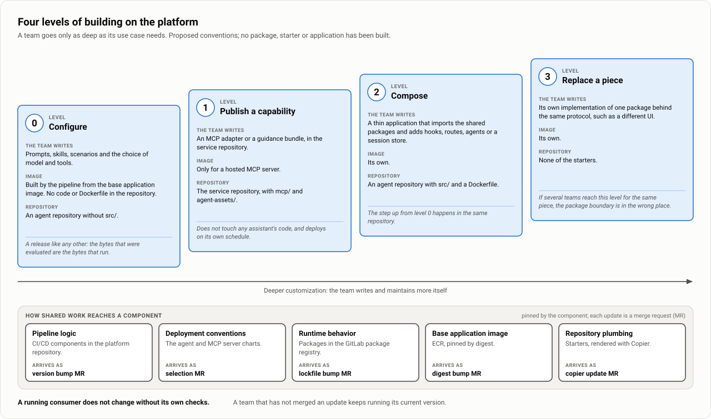
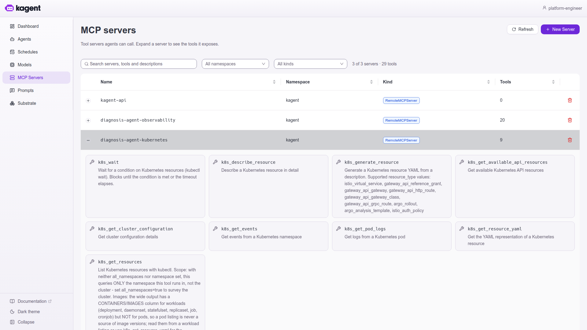

# Building on the platform

| | |
|---|---|
| Status | Proposed. Nothing is selected or deployed, and there are no pilot results. |
| Updated | 7 October 2026 |
| Based on | Architecture document 0.1 (5 October 2026), sections 7.4 and 13; the application notes (5 October 2026); the demo as of 7 October 2026 |
| Parent | [Agent platform proposal](00-proposal.md) |

A team takes the shortest path that meets its need. Most teams never host anything: they point an existing client at the gateway, or publish a tool or written guidance from their own service repository. A team that needs a hosted agent starts from a supported profile and writes only as much code as its use case requires. Shared work reaches every team as a pinned reference, and each upstream change arrives as a merge request (MR) that the team chooses to merge. No starter, package or base image has been built.

## Which path do I use?

| Path | You own | The platform supplies |
|---|---|---|
| Existing client | Client configuration and selected tools | Endpoints, identity integration, permissions and diagnostics |
| Existing remote MCP server | The service and its protocol contract | Gateway binding and approved access |
| New hosted MCP server | Adapter or server image, and tests | Deployment conventions and gateway exposure |
| Conventional hosted agent | Framework and code, checkpoints and scenarios | EKS workload profile, identity and telemetry |
| kagent agent | Native agent behavior and configuration | A supported Harness, runtime dependencies and operational profile |
| Background work | Job logic and idempotent tool operations | Existing worker and job delivery, bounded capacity |

An existing REST API needs an explicit adapter or a supported transformation before MCP clients can call it as a tool. Registering a URL or publishing a skill does not establish protocol compatibility.

## What each path looks like

- **Consume tools.** Find a supported endpoint in the catalog or the initial documentation, authenticate with Okta, request permissions where needed and make one example call. For models, point the same client at the gateway's model endpoint with the credential the platform issues.
- **Publish a capability.** Develop in the service repository against fixtures. CI tests and publishes an immutable image or package. A deployment update is needed only for hosted compute or changed gateway configuration. Verify through the dev endpoint, then promote.
- **Run a hosted agent.** Start from a supported starter, select tools and a model, and run local scenarios against dev endpoints. Publish the image or the native configuration package, propose the dev selection, verify deployed behavior and promote. You do not design node pools or shared databases.

## Publishing guidance and adopting it

A service can publish written guidance for its API with no compute at all. Publication and adoption are separate releases with separate owners.

A consumer stays on its pinned version until its owner updates the pin and evaluates the composed behavior. If catalog publication fails after upload, the metadata step is retried without rebuilding the bytes. Guidance cannot grant a tool permission or create an authenticated connection, and a bundle that ships scripts is a code dependency that runs with the consumer's credentials.

## Customization levels

The application conventions sit above the platform and apply to both options under evaluation. A team goes only as deep as its use case needs.

| Level | The team writes | Image |
|---|---|---|
| 0. Configure | Prompts, skills, scenarios and the choice of model and tools | Built by the pipeline from the base application image; no code or Dockerfile in the repository |
| 1. Publish a capability | An MCP adapter or a guidance bundle in the service repository | Only for a hosted MCP server |
| 2. Compose | A thin application that imports the shared packages and adds hooks, routes, agents or a session store | Its own |
| 3. Replace a piece | Its own implementation of one package behind the same protocol, such as a different UI | Its own |

- Level 0 produces an artifact like any other release. The pipeline bakes pinned content onto the base image, runs the scenarios and publishes one digest, so the bytes that were evaluated are the bytes that run (**Working assumption (WA-5)**).
- Level 1 does not touch any assistant's code. A tool published as an MCP server deploys on its own schedule, is authorized at the gateway and serves any consumer.
- Moving from level 0 to level 2 adds `src/` and a Dockerfile to the same repository.
- If several teams reach level 3 for the same piece, the package boundary is in the wrong place.
- Where the selected runtime's native declarative agent meets the need, such as a kagent AgentTemplate, use it for level 0 and write no configuration schema of our own.

## Where shared work lives

Each kind of shared work has one home and reaches a component as a pinned reference. Only the last row copies files.

| Shared work | Home | Component pins | Update arrives as |
|---|---|---|---|
| Pipeline logic | CI/CD components in the platform repository's `templates/` | Component reference | A version bump MR |
| Deployment conventions | `charts/agent` and `charts/mcp-server` | Chart version in environment configuration | A selection MR |
| Runtime behavior | Packages in the GitLab package registry | Lockfile | A lockfile bump MR |
| Base application image | ECR | Digest | A digest bump MR |
| Repository plumbing | `starters/`, rendered with Copier | Template tag in `.copier-answers.yml` | A `copier update` MR |

A running consumer does not change without its own checks. A team that has not merged keeps running its current version. Level 0 has the longest path for a fix: library, base image, assistant image, selection. For a security fix, the time for that whole chain is a value to agree and measure.

## Decisions behind the conventions

| Decision | Proposed | Rejected | Reason |
|---|---|---|---|
| How behavior is shared | Versioned packages and a base application image | A template repository that teams fork or copy | A copy holds logic, and every later fix must be merged into it |
| What the starter holds | Repository plumbing only, with an update path | A full application skeleton, or a copy-once generator | A skeleton is copied logic again; a copy-once generator cannot receive changes |
| Team code in the base image | None. Code in the request path means the team builds its own image | A plugin loader that fetches team packages at start | The image that was evaluated would not be the code that runs |
| Custom tools | An MCP server behind the gateway | In-process tool plugins | An in-process tool is tied to one assistant's release, language and credentials |
| System prompt and skills | Pinned content in the assistant's repository, baked into its image | A Helm value or deployment field | Behavior is evaluated before release; environment configuration holds only bindings |
| Assistants per deployment | One release per assistant | One deployment serving many assistant configurations | One workload identity would hold every assistant's tool permissions |
| Where platform rules are enforced | The gateway, admission and network | The shared library | A team can omit the library, so it is a convenience and not a control |
| How the library is designed | Extracted from the first hosted application | Designed before any application exists | Its scope is unknown until one application has met the obligations below |

**Package contract.** Packages, charts, CI/CD components, starter tags and the base image follow the same rules: semantic versions pinned exactly, published versions never change, and compatibility is shown by tests and not inferred from a version number. A changed default that alters behavior, such as a limit or a timeout, is a breaking change. The previous major version receives security fixes for a support window that is not yet agreed, and a version is withdrawn only after listing the components that pin it.

## What every hosted application must do

These obligations are the scope of the shared library. The library makes them easy; the gateway, admission and the network make them mandatory.

| Concern | Obligation | Under this option |
|---|---|---|
| User identity | Verify the caller at the entry point; derive tenant and session from verified context | Okta at a gateway route, or verified by the entry point itself |
| Model access | Never hold a provider key; endpoint and credential come from bindings | The gateway model endpoint |
| Tool access | MCP through the governed gateway; delegated context or a scoped machine credential; a stable operation identifier on every write | Agentgateway |
| Execution bounds | Limits on concurrency, time, iterations and tokens; bounded retries; graceful shutdown | Set in the application |
| Session state | Held outside the process, with declared behavior across a rollout | CloudNativePG where supported |
| Telemetry | OTel instrumentation with release and environment attributes; trace context propagated to tools | The existing collector topology |
| Runtime contract | Health endpoints and one entry protocol | A conventional Deployment, or kagent's contract ([Architecture overview](10-architecture-overview.md)) |
| Content | Pinned and integrity-checked | Baked onto the image (WA-5) |
| Deployment selection | One selection per assistant per environment | Helm values under `agent-deployments` |

## Worked examples

The notes contain eight platform journeys with hypothetical names and versions. None has been run.

| Journey | What it shows |
|---|---|
| A developer consumes a payments lookup tool | Permitted lookup, denied refund, model access, no hosted compute |
| Payments publishes an MCP capability | Adapter in the service repository, image by digest, gateway binding, catalog entry after verification |
| Payments publishes only guidance | Bundle `1.4.0` with no compute; a consumer stays on `1.3.0` until it adopts |
| An incident assistant is hosted | Read-only tools, bounded execution, no cluster-admin |
| A release fails checks | `2.1.0` is blocked; `2.0.0` stays selected |
| A breaking tool version is introduced | Versioned binding, consumer migration, retirement after the rollback window |
| An operator diagnoses and recovers a release | Trace correlation, routine rollback, external writes investigated separately |
| A shared controller is upgraded | Pinned chart, controller and CRD change tested against affected gateways, agents and sessions |

The application notes add journeys for each level: an assistant launched without code, a service team adding a tool for it, a move from level 0 to level 2 for a hook in the request path, a replaced UI, and how an upstream fix, a conflicting starter update and a breaking version reach each team.

## Observed in the demo

On the demo's kind cluster, five of the paths above ran in one incident, each built by hand and without any of the shared work this page proposes.

- **Conventional hosted agents in two frameworks.** The chat assistant is written in TypeScript with Mastra; the remediation and comms agents in Python with Strands. All three run as Deployments from one shared chart, read their bindings from environment variables and reach tools, agents and the model only through gateway routes.
- **A declarative kagent agent.** The diagnosis agent has nothing to build: it is a system prompt, a runbook, a model choice and a list of seven tools, with its own evaluation scenarios. That is close to level 0 on the runtime's native resources. kagent 1.0.0-alpha7 could not load a skill from git, so the runbook is put into the prompt.
- **A hosted MCP server.** The delivery tool server was scaffolded with `kmcp` and written with FastMCP. It is deployed with the shared agent chart, not with the generated `MCPServer` resource, and its tests carry a permitted and a refused case for every rule.
- **A third-party MCP server.** Grafana's MCP server runs behind a gateway route with its write tools switched off, which leaves twenty read-only tools.
- **A client with a token, and nothing hosted.** A script acting as `developer` lists the tools of both servers through the gateway and makes a read call from outside the cluster.
- **Catalog entries live with the component.** Each component carries its own registry entry, and one task publishes four agents and two tool servers.
- **Framework fit cost effort.** The chat assistant could not use Mastra's built-in A2A endpoint for its interactive card and serves A2A with the protocol's own SDK in the same process. Tool descriptions are sent to the model with every call, so the diagnosis agent is offered three of the observability server's twenty tools.
- **Obligations met and not met.** The three conventional agents and the delivery tool server verify the caller's token themselves, hold no provider key and export OpenTelemetry, and an agent gives a model call one total deadline with no retry. Against the table above, incident, change and chat state are held in memory, and images are selected by tag, not by digest.
- **Not exercised.** A real MCP client signing in by itself, which does not work against the demo's gateway yet. Starters, shared packages, the base application image and Copier updates. A guidance bundle published and adopted across repositories. A bring-your-own image on kagent. A background job.

The tool servers as kagent's console lists them. The Kubernetes tool server offers nine tools and the observability server twenty; the agent's template selects four of the first and three of the second.

More: [Demo findings and limits](21-demo-findings.md).
