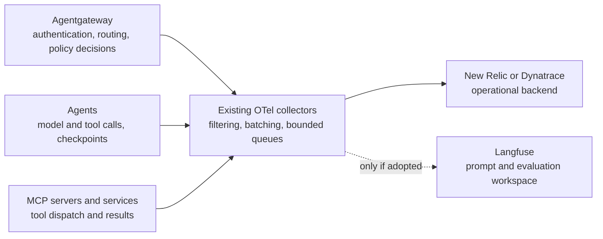
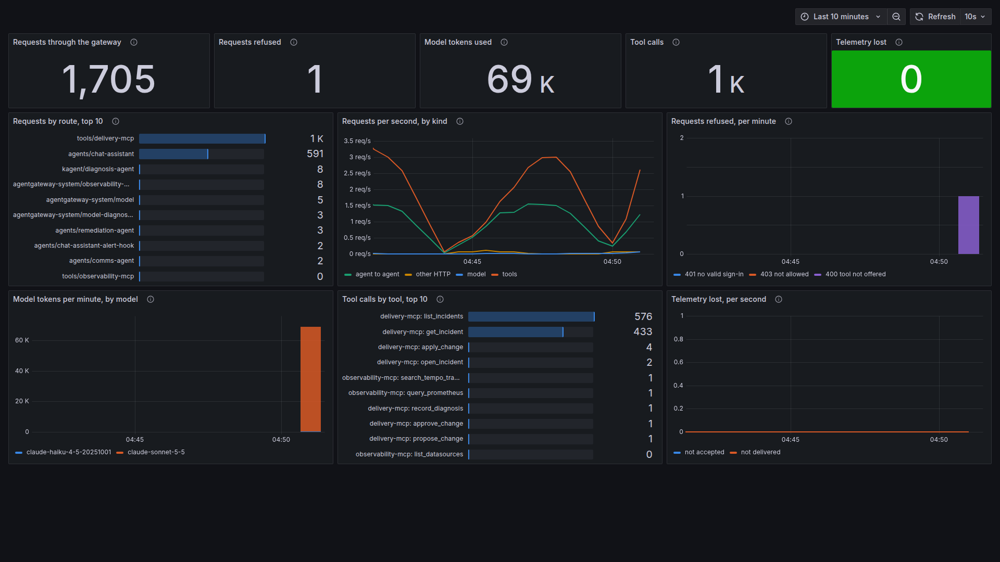
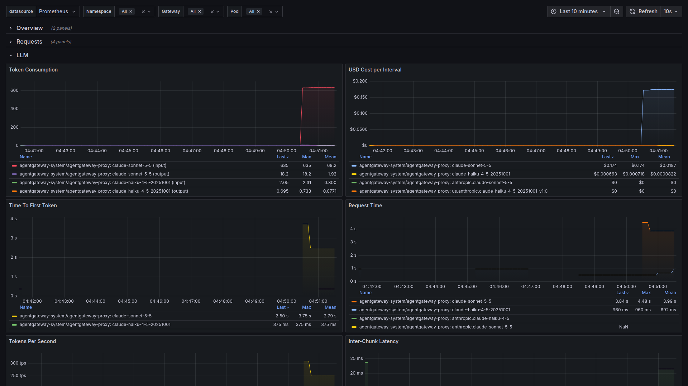
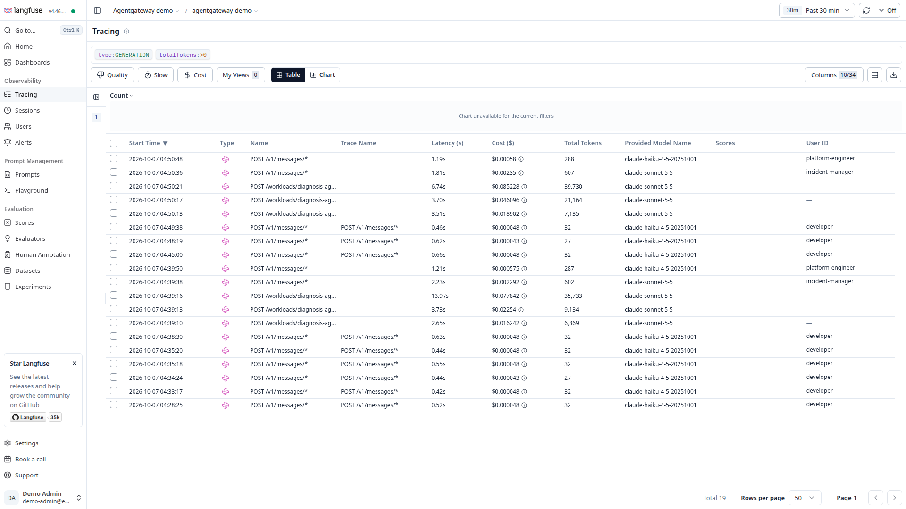
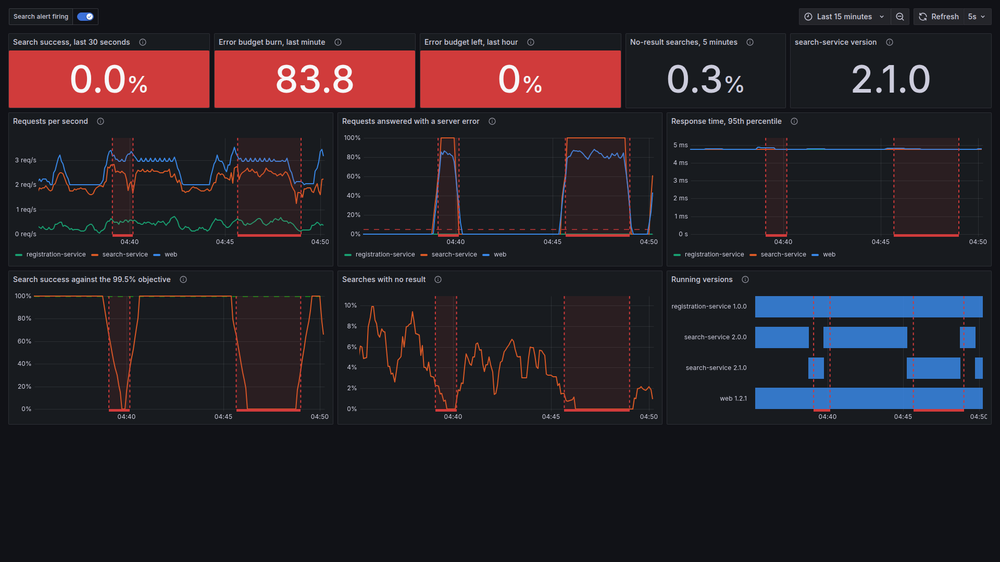

# Observability and operations

| | |
|---|---|
| Status | Proposed. Nothing is selected or deployed, and there are no pilot results. |
| Updated | 7 October 2026 |
| Based on | Architecture document 0.1 (5 October 2026), sections 7.5 and 14; the demo as of 7 October 2026 |
| Parent | [Agent platform proposal](00-proposal.md) |

A developer should be able to follow one request from the client through the gateway, the agent, the tool and the service, with ordinary team access and not cluster-admin. Telemetry goes through the OpenTelemetry collectors we already run to one operational backend, New Relic or Dynatrace (D-8). Langfuse is optional and is not part of the initial pilot (**Working assumption (WA-6)**). Each component has a named owner for incidents and upgrades, and the tested version combination is pinned.

## Telemetry topology

- The pilot runs against one operational backend. Which one is a requirement to agree (D-8).
- Application instrumentation records model and tool calls, checkpoints and workflow outcomes. Proxy telemetry alone cannot explain an agent's internal reasoning and action sequence.
- Trace context is propagated across supported protocols, with release, environment and runtime identity recorded.
- Secret values and sensitive prompt or tool content stay out of telemetry by default. Filter at the source where a separate exporter could bypass collector filtering.
- Bound queues, export retries and metric cardinality.
- **Documented upstream:** Agentgateway emits Prometheus metrics, access logs and OpenTelemetry traces, with span attributes for generative AI and MCP. The attribute list was not checked.

If Langfuse is adopted (D-13), New Relic or Dynatrace stays the operational backend, and one authority is defined for deployed prompts. A mutable prompt label in Langfuse must not silently override a source-controlled production selection.

## Evaluation responsibilities

| Layer | Checks | Owner |
|---|---|---|
| Service assets | Accurate API guidance, variables, scripts and compatibility | Service team |
| MCP tools | Protocol and schema, backend permissions, idempotency and errors | Tool or service team |
| Agent behavior | Task outcome, selected tools, composed instructions and limits | Agent team |
| Shared platform | Authentication, policy override, session isolation and deployment behavior | Platform and identity teams |

Start with component-owned scenarios and deterministic assertions in CI. Record dataset and evaluator versions, sample counts, model settings, failures, latency and usage. Missing telemetry or an evaluator error is not a pass. Use fixtures and test tenants for operations with side effects.

## Debugging

Every supported starter makes service and version identity and request correlation visible. The pilot must show the path below with ordinary developer permissions.

| Symptom | First evidence to inspect | Owner |
|---|---|---|
| Authentication failure | Issuer, audience and expiry outcome; the client's flow | Identity, platform |
| Tool denied | Verified principal and effective tool policy | Identity, tool owner |
| Gateway cannot reach backend | Route and configuration status, DNS and TLS, backend readiness | Platform, service |
| Agent chooses the wrong tool | Composed configuration, task trace and scenario | Agent team |
| Session cannot resume | Runtime session metadata; snapshot and state availability | Runtime, data owner |
| Model throttling or excess usage | Provider result, concurrency and retry limits | Agent, platform |
| Model request refused or over budget | Verified caller, approved-model policy and rate-limit decision | Platform, agent |
| Missing traces | Instrumentation, collector queues and vendor export | Observability, component |

Logs distinguish a policy denial from a dependency failure without revealing credentials.

## Signals, incidents and on-call

Monitor active work, queue wait, request latency and errors, denied access, provider throttling, CPU and memory, worker occupancy, snapshot operations and collector drops, where the signals are supported. Derive alerts from workload requirements and real failure modes, not from a universal dashboard template.

| Situation | Response |
|---|---|
| Unsafe tool | Disable access independently of agent rollback where possible; preserve audit evidence; identify affected consumers |
| Runtime outage | Decide session and state recovery explicitly |
| Tool outage | Bounded retries and a clear unavailable-capability response |
| Unsafe guidance | Stop new adoption, identify deployed consumers, use access and execution controls, publish a corrected immutable version |
| Shared authentication or policy change at fault | The platform incident owner handles that boundary; agents are not rolled back blindly |

Assign on-call and escalation ownership for the proxy and controller, the rate-limit service where budgets are enforced, the runtime, the database, the registry and each downstream service.

## Behavior when a dependency fails

| Failure | Intended behavior | State |
|---|---|---|
| Agentregistry unavailable | Statically configured consumers keep working; new discovery pauses | To validate |
| Rate-limit server unavailable | Model traffic is either refused or allowed. Not decided, and not stated on the upstream budget page | Open, D-6 |
| Gateway proxy or controller outage | Known effect on clients, agents and in-flight sessions; recovery without manual repair | To validate |
| Telemetry export fails | Bounded queues. A telemetry failure does not silently invalidate a mandatory release check | To validate |
| Worker or node interruption | Session loss and recovery are observed; side effects are handled by idempotent operations | To validate |
| Tool or service API outage | Bounded retries and a clear "capability unavailable" response | Proposed |
| Agent crashes after an external write | The retry carries the same operation identifier, and the backend deduplicates or reconciles | Proposed |

## Upgrades and drift

Pin chart, controller, CRD and runtime versions and record their tested combination. Upgrade shared components independently of unrelated agent changes, and test CRD migration, persisted sessions, policy semantics and representative consumers. Inspect rendered configuration and actual controller acceptance, not just chart diffs.

Existing infrastructure plans and Helmfile diffs detect configuration changes. Synthetic authentication and task checks detect expired credentials, remote API changes and broken integrations.

## Observed in the demo

On the demo's kind cluster, Grafana with Prometheus, Loki, Tempo and Alertmanager stands in for the operational backend, behind one OpenTelemetry Collector, and Langfuse is deployed beside it. One incident could be followed in both.

- **One trace per request, across every hop.** In Tempo the alert, the hook, the incident, the diagnosis and its model calls are one trace. Each button click is one trace through the gateway, the chat assistant, the agent, the tool server, the search check and the model call. Clicks, card polls and the alert are separate traces, and the browser emits no span.
- **Prompt text is split by destination.** Tempo gets every trace with prompt and completion text removed. Langfuse gets only traces that contain a model call, with the text kept, about 20 seconds late.
- **Model calls are attributed to a verified identity.** Langfuse shows one generation per model call with tokens, cost and the verified user, or the workload for the diagnosis agent. An incident is several traces there, not one. Proposing and approving call no model, so those roles do not appear.
- **The gateway's own figures need no agent instrumentation.** The dashboard that ships with Agentgateway shows token consumption and cost per model, MCP calls by method and tool calls by tool. A second dashboard built for the demo shows requests by route and refusals per minute. A refusal by the service is not among them: the gateway answered that call with HTTP 200, and the refusal is in the tool's result.
- **The tool server writes an audit line per call:** tool, target, user, roles, team, outcome and rule.
- **The alert started the incident.** The search error-ratio rule reached the alert hook 22 to 25 seconds after the bad release, 31 at worst, authenticated as a machine client. The card was visible within a second of that, and the diagnosis was on it at 39 to 41 seconds.
- **An agent debugged with the same telemetry.** The diagnosis agent reads Prometheus, Tempo and Loki through a read-only MCP server behind the gateway and answers in 14 to 15 seconds.
- **Two outage drills.** With the collector scaled to zero, the Sample App and the gateway went on answering; that minute's traces and gateway log records were lost, and metrics were not, because Prometheus scrapes them. With the registry scaled to zero, tools and agents went on answering.
- **Langfuse cost operating attention.** Its ClickHouse once grew past a smaller memory limit while idle, and every query failed. The cause was not found; the limit is now 4 GiB, and a restart recovers it. Langfuse held about 1.8 GiB idle.
- **Evaluation in place.** The diagnosis agent has three scenarios that run against the deployed agent, each one real model turn. The tool server's rules are tested deterministically.
- **Not exercised.** New Relic or Dynatrace, and a trace followed with ordinary team access: Grafana and the cluster were used with administrator logins. Collector queues under load, metric cardinality, a gateway outage, worker interruption, an upgrade of a controller or CRD, and on-call. The tool server and the agents expose no metrics endpoint.

### What it looked like

The gateway's view of the ten minutes around one incident: requests by route, the one request refused, model tokens by model and tool calls by tool. Telemetry lost is zero.

The dashboard that ships with Agentgateway, on its LLM row: token consumption and cost per model, time to first token and request time.

Langfuse's table of model calls. The top five rows are one incident: three calls by the diagnosis agent's workload, which carry no user, then one for the incident manager and one for the platform engineer.

The operational dashboard that stands in for New Relic or Dynatrace, while search is failing. The alert that starts the incident fires on the same error ratio.

More: [Demo findings and limits](21-demo-findings.md).
