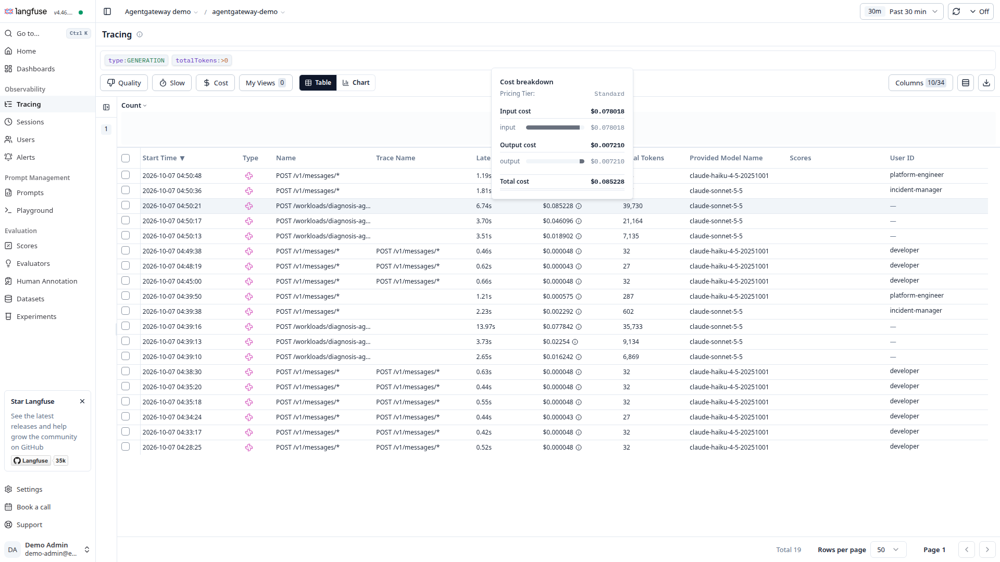

# Cost model

| | |
|---|---|
| Status | Proposed. Nothing is selected or deployed, and there are no pilot results. |
| Updated | 7 October 2026 |
| Based on | Architecture document 0.1 (5 October 2026), section 15; the cost notes for both options (5 October 2026); the demo as of 7 October 2026 |
| Parent | [Agent platform proposal](00-proposal.md) |

No usage has been measured and no price inventory exists for this option. This page lists the cost lines, the session profile both options are to be priced for, and the controls on spending; it prices none of the lines. An unpriced option is not a cheaper one. The AgentCore option has illustrative totals, and the two cannot be compared until both are priced for the same profile and then measured.

## Two views of cost

Report two views side by side. Incremental cash cost identifies new spend. Allocated platform cost includes the shared capacity and operating work this platform consumes. State the allocation policy so that comparisons are reproducible.

```text
monthly total = model inference + evaluations
              + compute and warm capacity + storage
              + networking + telemetry + licenses and support
              + attributable operating effort

cost per successful task = attributable cost / successful completed tasks
```

- Unsuccessful runs and retries count in the numerator.
- Existing capacity is not free, and open-source software has an operating cost.
- Separate one-time delivery effort from recurring operations, and amortize only with a stated period.
- Do not charge the full existing EKS control plane to this option unless it requires another cluster.

## Cost inventory

| Item | Measure | Allocation consideration |
|---|---|---|
| Models | Input, output and cached tokens; provider charges | Agent or team, plus evaluation activity |
| Gateway and controller | Requests, replicas, CPU and memory | Shared baseline and traffic contribution |
| Rate-limit service | Replicas and backing store, where shared budgets are enforced | Shared baseline |
| Conventional agents and tools | Node-hours attributable to placement and replicas | Requests alone do not equal billed node capacity |
| Agent Substrate | Warm workers, actor occupancy, snapshots and restore traffic | Compare actual node footprint and latency |
| PostgreSQL | Allocated capacity, storage, backups and operations | Existing headroom versus required expansion |
| Registry | Service and database footprint, maintenance | Discovery volume and onboarding value |
| Langfuse, if adopted | Web and workers, ClickHouse, cache, storage and operations | Fixed baseline plus ingestion and evaluation usage |
| Network | Load balancer, NAT, endpoint and transfer charges | Existing shared charges versus new requirements |
| Telemetry | Billed ingestion, retention, queries and host monitoring | Vendor contract and duplicate destinations |
| Delivery | Runner pod compute, artifact retention and evaluation runs | Per release, plus platform compatibility tests; runner pods draw on the same EKS capacity |
| People | Build, review, on-call, upgrades and support hours | Reported separately from cloud charges |

Add the exact region, instance types, purchase model, current price source, vendor contract and date during the pilot. No dollar totals are given for this option without those inputs.

## The shared pricing profile

Both options are to be priced for the same assumed session. The pilot replaces the profile with measurements for both options at the same time.

| Input | Assumed value |
|---|---|
| Model calls per session | 6, at 8,000 input and 400 output tokens each |
| Gateway calls per session | 12 |
| Execution size | 1 vCPU and 1 GB peak, 20 seconds of active CPU |
| Session lifetime | 2 minutes of work, then a 15-minute idle timeout |
| Monthly volume | 5,000, 50,000 and 500,000 sessions |
| Environments | 3 |
| Evaluation | 20% of sessions |

## What the AgentCore estimate shows, and what this option still needs

The AgentCore cost notes carry illustrative monthly totals for this profile, at list prices read on 5 October 2026. They are estimates on an assumed profile, not measurements.

| Sessions a month, three environments | Illustrative AgentCore total | Shape |
|---|---|---|
| 5,000 | About $1,700 | More than half is fixed networking and release-gate runs, not traffic |
| 50,000 | About $8,300 | Model inference above 70% |
| 500,000 | About $74,000 | Model inference above 70% |

Staffing is not priced in those totals and is expected to exceed the AWS bill at pilot scale. This option has no counterpart figures. Each line needs the following before a comparison means anything:

| Line | The AgentCore estimate is built from | This option needs |
|---|---|---|
| Model inference | Tokens per session at the model's rate | The same figure where provider, model, rates and caching are the same; record any difference |
| Execution | Active CPU and peak memory per second | Node-hours for the pods or workers serving the same concurrency, with failure headroom and warm capacity |
| Gateway and policy | A charge per invocation and authorization request | Gateway and controller replicas and the rate-limit service as a fixed baseline |
| Session state and memory | A charge per event, record and retrieval | CloudNativePG capacity, storage and backups; S3 snapshots |
| Evaluation | Built-in evaluator charges | Evaluator model tokens, plus Langfuse or CI footprint where used |
| Fixed networking | NAT gateways and interface endpoints per environment | Additions beyond existing cluster networking, with the allocated share reported separately |
| Telemetry | CloudWatch spans and logs; vendor not priced | Vendor ingest for the same sessions |
| Catalog | Registry records and API calls | Agentregistry service and database footprint |
| People | Not estimated | Not estimated; report hours for both options |

**Hypothesis to test.** This option's cost is mostly fixed baseline at pilot volume and mostly inference at high volume, so its difference from AgentCore lies in execution, platform services and people, not in tokens.

## Capacity economics

- EKS savings depend on bin packing, usable headroom, node lifetime and tolerated cold-start latency. Removing idle pods may not remove a node.
- Snapshot and restore can improve density but add warm workers, storage, traffic and runtime operations. Measure fleet cost with and without the capability under the same arrival and concurrency distribution.
- Use real pod requests and observed consumption; neither alone establishes billing. Include spare capacity for failures, previous versions kept for rollback, and load-test and evaluation workloads.
- AgentCore meters differently from provisioned nodes, including its treatment of I/O wait. Use its billed usage, not a conversion from pod CPU requests.

## Spending controls

- Bound agent iterations, tokens, wall time, concurrent work and retries.
- Restrict approved models, and prevent callers from bypassing the governed path or raising limits without permission ([Trust boundaries and bypass prevention](12-trust-boundaries.md)).
- Attribute cost from verified team and workload identity, not from caller-provided labels.
- Apply retention to traces, snapshots, artifacts and evaluation results. Avoid duplicating full payloads across the operational backend and an AI engineering backend.

Gateway token budgets need care. **Documented upstream:** global token limiting differs from local per-instance request limiting, so a local quota multiplied by replicas is not a fleet-wide token budget. Global limiting depends on a separately deployed rate-limit server, which is both a cost line and an availability dependency (D-6). A token limit is not a currency budget across models with different prices, and rate limiting is evaluated before content-safety checks, so a request that a guardrail rejects still consumes quota.

## Measurements for selection

Record arrival rate, concurrency, warm and cold latency, task success, tool and model calls, tokens, evaluation frequency, resource occupancy, node-hours, storage and transfer, and support hours. Compare existing-client access separately from hosted execution, because they deliver different scope. A favorable cloud bill with materially greater incident and review effort is not a demonstrated improvement in total cost.

The experiments that produce these figures, "Representative load and spend" and "Shared token budget", are in the [Pilot plan](30-pilot-plan.md).

## Observed in the demo

On the demo's kind cluster, on one machine with a local model endpoint, a few figures were observed. They describe one scripted incident and one node. They are not a cost basis and say nothing about the shared session profile.

- **About $0.15 an incident.** Langfuse priced each model call from its tokens at the vendor's list prices ($2 and $10 per million input and output tokens for Claude Sonnet 5.5, $1 and $5 for Claude Haiku 4.5). An incident made five model calls, and almost all of the cost was the three calls of the diagnosis. Proposing and approving call no model.
- **The gateway reports tokens and cost itself.** Its own dashboard shows consumption and cost per model for every caller, whatever framework the agent was written in. Model calls were attributed to the verified user or to the workload, not to a caller-supplied label.
- **Only approved models were served.** A request for any other model was refused with HTTP 403. No token budget and no rate-limit server were deployed.
- **Memory of the whole stack.** The cluster held 8.5 GiB when new, 10 GiB after a few incidents and 11 to 12 GiB after some hours of use.

| Platform service | Observed memory |
|---|---|
| Langfuse, with ClickHouse | About 1.8 GiB idle; ClickHouse limit 4 GiB |
| kagent and Agent Substrate | About 0.5 GiB after install, 1.1 GiB after use |
| Kyverno admission controller | 70 MiB idle, 100 MiB after use; the node grew by about 0.5 GiB around its install |
| Agentregistry | About 55 MiB |

- **Operating effort showed up early.** Langfuse's ClickHouse failed once while idle and needed a restart and a higher limit. kagent's alpha limits needed workarounds. Neither was counted in hours.
- **Bring-up.** From no cluster to a ready demo took 14 to 15 minutes on one machine.
- **Not exercised.** EKS node pricing, load, concurrency, warm capacity, Bedrock or any metered provider, vendor telemetry ingest, the session profile above, evaluations at volume, and people's time.

One incident on 7 October 2026 came to $0.153: five model calls and about 69,000 tokens. The diagnosis agent's three calls were $0.150 of it. This is the cost breakdown Langfuse shows for the largest of them.



More: [Demo findings and limits](21-demo-findings.md).
