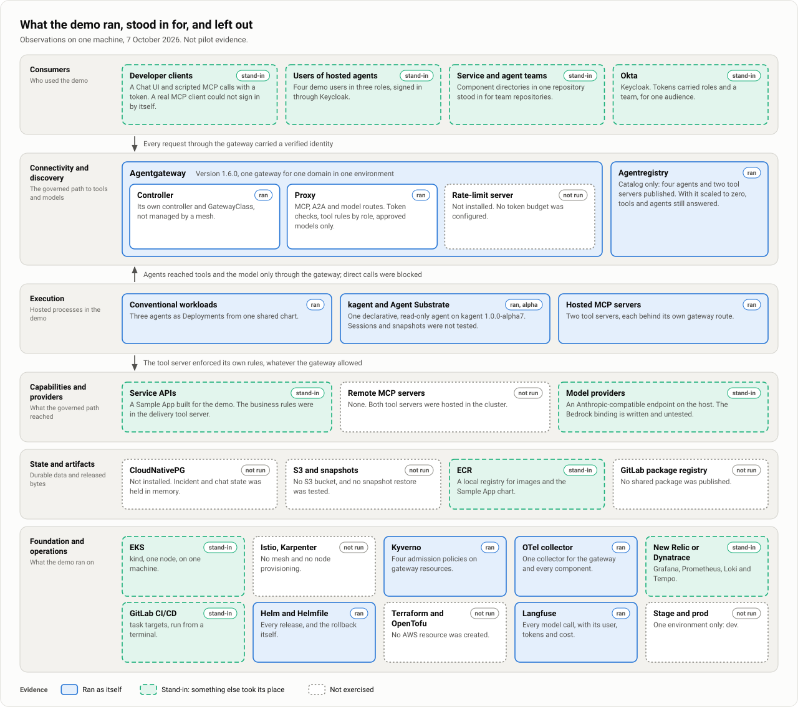
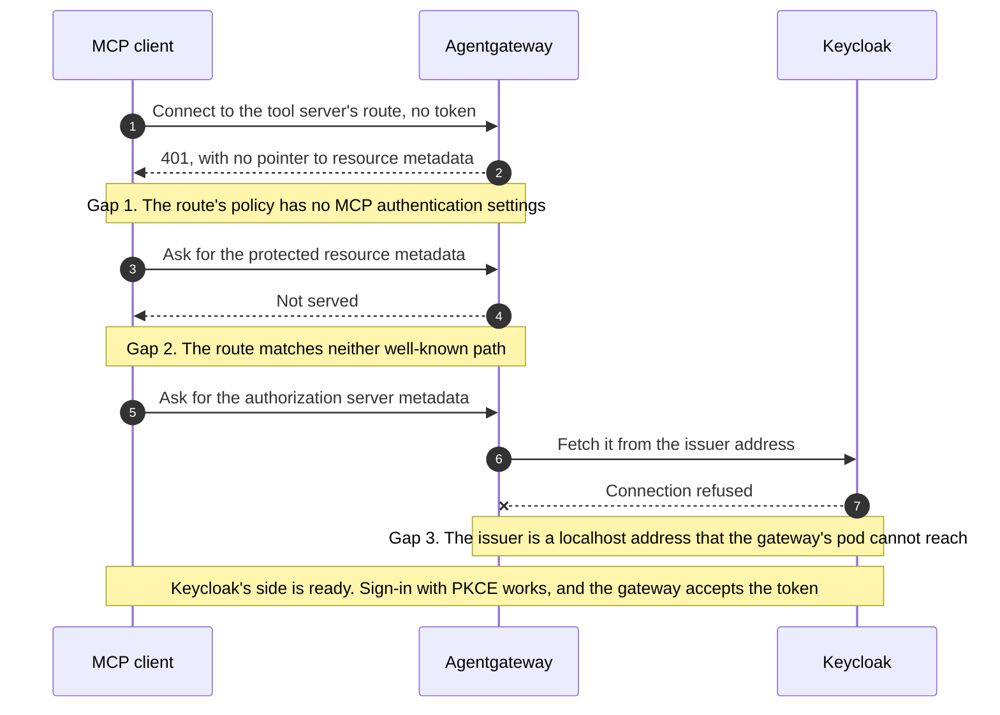

# Demo findings and limits

| | |
|---|---|
| Status | Observations from one machine. Not pilot evidence, and no decision is closed by them. |
| Updated | 7 October 2026 |
| Based on | The demo repository as of 7 October 2026: its contracts, measurements, run of show, platform and component notes, policy charts and drills. Three runs of the incident on 7 October 2026. |
| Parent | [Agent platform proposal](00-proposal.md) |

Building the demo turned a good part of the design from text into something that runs, and it surfaced things the documentation did not say. This page collects what was learned, what bears on an open decision, where the demo differs from the design, and what it does not show. The incident itself is on [The demo: one incident, end to end](20-demo-one-incident.md).

Read every statement here as **Observed in the demo**: a kind cluster with one node, on one machine, with stand-ins for Okta, the operational backend, ECR, the pipeline and the model provider. A result on kind is a reason to look somewhere first in the pilot. It is not a pass.

## What the demo covered

| | Components |
|---|---|
| Ran as themselves | Agentgateway 1.6.0 with MCP, A2A and model routes; Agentregistry as a catalog; kagent 1.0.0-alpha7 with Agent Substrate for one declarative agent; three conventional agents and two hosted MCP servers; Kyverno; the OpenTelemetry Collector; Langfuse; Helm and Helmfile |
| Stand-ins | Keycloak for Okta; Grafana, Prometheus, Loki and Tempo for New Relic or Dynatrace; a local registry for ECR; `task` targets for GitLab CI/CD; a model endpoint on the same machine for the provider; kind for EKS; a Chat UI and scripted calls for developer clients |
| Not exercised | Istio, Karpenter, CloudNativePG, S3 and snapshots, the rate-limit server and token budgets, the GitLab package registry, Terraform and OpenTofu, remote MCP servers, stage and prod |

## Findings that bear on a decision

Decision and assumption numbers are those of [Decisions, risks and requirements](31-decisions-and-risks.md).

| Finding | What was observed | Bears on | More |
|---|---|---|---|
| The gateway could be bypassed five ways until controls were added | With Agentgateway 1.6.0 and no controls, anyone who could create gateway resources in a namespace could undo a platform rule: a second policy that made the token optional, a second route to the tool server that offered a developer all ten tools, a backend naming the model host that answered without a token, and a route that took a platform route's traffic, tokens included. A default-deny network boundary and four Kyverno admission policies closed them. Their known gaps are written down. | D-7 | [Trust boundaries and bypass prevention](12-trust-boundaries.md) |
| A real MCP client cannot sign in through the gateway yet | A client that already holds a token lists and calls tools. A client that has to sign in by itself fails at the first step. Three pieces of configuration are missing; see below. | The pilot's first stop condition | [Pilot plan](30-pilot-plan.md) |
| Both model credentials work | People and the alert's machine client called the model route with their identity provider token. The kagent agent called a route of its own with a key the gateway issued to that workload. Revocation time was measured for neither. | D-4 | [Identity and authorization](11-identity-and-authorization.md) |
| kagent needs a guard in front of it | kagent 1.0.0-alpha7 does not verify tokens itself. Callers reach the agent through its gateway route, and network policies let nothing else reach its port. kagent's console is a second door, behind a sign-in proxy that lets in the platform engineer only. | D-5 | [Identity and authorization](11-identity-and-authorization.md) |
| kagent scopes a conversation to whoever started it | In the console the platform engineer sees that the alert's sixteen conversations exist and cannot open them. The creator is read from a token that kagent does not verify. | D-5 | [Identity and authorization](11-identity-and-authorization.md) |
| The registry is not in the request path | It ran as a catalog with no cluster credentials. Scaled to zero, tools and agents went on answering. Its own Deploy feature was not used. | D-3, WA-3 | [Architecture overview](10-architecture-overview.md) |
| Rules held at two layers | A developer was not offered `apply_change` by the gateway. A platform engineer was offered it and was refused by the tool server while the change was not approved. | The principle that business authorization stays downstream | [Identity and authorization](11-identity-and-authorization.md) |
| A denied tool looks like a missing tool | The gateway answers a call to a tool the role lacks with "Unknown tool", the same as for a tool that does not exist. The design expects a denied call to give an actionable result. | Tool authorization; debugging | [Identity and authorization](11-identity-and-authorization.md) |
| The gateway's metrics do not see a refusal by the service | The gateway answered that call with HTTP 200; the refusal is in the tool's result and in the tool server's audit line. | Debugging; audit | [Observability and operations](15-observability-and-operations.md) |
| Langfuse was useful and cost attention | It attributed every model call to a verified user or to a workload, with tokens and cost. An incident is several traces there, not one, and its ClickHouse failed once while idle. | D-13, WA-6 | [Observability and operations](15-observability-and-operations.md) |
| The rollback ran through a tool, not through a pipeline | The tool server upgrades the same Helm release, so the release stays the only writer, and three roles are recorded on the change. There is no merge request and no pipeline, so it matches neither recovery path of the design. | Release and rollback | [Repositories, delivery and rollback](13-repositories-and-delivery.md) |
| An incident cost about $0.15 in model calls | Five calls and about 69,000 tokens; almost all of it was the diagnosis. Proposing and approving call no model. | Cost model | [Cost model](16-cost-model.md) |

## The MCP client sign-in gap

The pilot's first step is one real developer client signing in through the gateway, and its first stop condition is that client failing to do so. On the demo, as found on 6 October 2026 with Agentgateway 1.6.0 and Keycloak 26.7.5, it fails. The demo has a check that walks the steps such a client takes and says which ones the cluster does not answer.

| Gap | What is missing | Where it would be fixed |
|---|---|---|
| 1 | MCP authentication settings in the route's policy, so that the 401 names the resource metadata and the gateway serves it | The shared route authentication chart, which has no option for it |
| 2 | Two more path matches on the route, for the protected resource and the authorization server metadata | The shared MCP route chart, which has one match |
| 3 | An issuer address that both a browser and the gateway's pod resolve to the identity provider | The identity provider's host name; a property of the local setup |

Each gap was checked on a scratch copy of the route. With the first two closed, the third remains. This is a gap in the demo's configuration and says nothing yet about Okta, where Agentgateway documents a native provider. It is still the most useful thing the demo found, because it is exactly where the pilot starts.

## Limits of the alpha runtime

One agent ran on kagent 1.0.0-alpha7 with Agent Substrate 0.3.0-alpha3. These limits were found on that version.

- **A skill cannot be loaded from git.** The diagnosis agent's runbook is put into its prompt.
- **A caller's token cannot be forwarded to a tool server.** The agent calls its tools, and by choice its model, with a key the gateway issued to the workload. A model call can instead carry the caller's token, but then nothing names the workload.
- **One credential per host name.** The agent has to address the gateway by a second host name for tools.
- **No token verification.** See the finding above.
- **Its console is a second door.** The dev cluster switches kagent's console on for the platform engineer only, behind a sign-in proxy, which is the only check there is. Whoever signs in can create, change and delete agents, and a chat started there reaches the diagnosis agent through kagent's controller, so the gateway's route policy and records do not cover it. It is an operator's console and not part of the show.
- **Its allowlist is wider than its bindings.** kagent adds the model vendor's public host to the agent's egress allowlist even when the model's address is the gateway, and nothing in kagent switches that off. A separate network policy limits the egress gateway to pods of the cluster.
- **One diagnosis was refused.** In one of three runs on 7 October 2026 the card showed "Diagnosis failed: diagnosis-agent: input was not accepted; retry after the session becomes available". kagent can turn a message away for a moment with this error, and the chat assistant retries it twice before it reports a failure. The other two runs were diagnosed in about fifteen seconds. The cause was not established, and the cluster was in use by other work at the time.

- **What Substrate held half an hour after the last run.** The console showed sixteen actors, one for each conversation: nine suspended and seven shown as resuming, with both workers marked busy and none running. This was not investigated.

The agent in kagent's console, with the conversations the platform engineer can see and cannot open:

Session isolation between users beyond what the console shows, snapshots and restore, worker interruption and a bring-your-own image were not tested. These bear on D-2 and D-10.

## Where the demo differs from the design

The architecture document should be read with these in mind until one side is changed.

| Topic | The design says | The demo does |
|---|---|---|
| Langfuse | Not deployed in the initial pilot (WA-6) | Deployed, and used to show model calls by identity |
| Credentials between hops | The gateway forwards with its own identity, and each API gets a resource-specific credential | Every hop forwards the caller's same token, under one audience. No delegation or token exchange was built |
| kagent's protocol | The bring-your-own contract speaks of A2A over gRPC | Callers reach the declarative agent with A2A over JSON-RPC through the gateway. No bring-your-own image ran, so the two have not been tested against each other |
| A denied tool | Refused with an auditable, actionable outcome | Hidden, and a call answers "Unknown tool" |
| Rollback | A selection merge request through the normal pipeline, or an emergency change by an operator | A tool call by a platform engineer, after a proposal and an approval recorded by the tool server |
| Released artifacts | Selected by digest | Selected by tag, in a local registry |
| Repository layout | A shared `access/` directory, an MCP server chart, packages, CI templates and starters | Access files inside the one cluster's directory, one chart for agents and MCP servers, a network policy chart added, and none of the others |
| Bypass controls | Candidates listed, none selected (D-7) | Two layers built and drilled, on kind's network plugin |

## What the demo does not show

| Area | Not exercised |
|---|---|
| Identity | Okta and its MCP provider; a second tenant; delegated, resource-specific credentials; time from entitlement removal to denial; behavior when the identity provider is unreachable |
| Gateway | Token budgets and the rate-limit server; guardrails; more than one replica; a gateway outage; Bedrock or any metered provider |
| Runtime | Session isolation between users, snapshots and restore, worker interruption, a bring-your-own image, execution isolation between actors |
| Platform | EKS, Istio, Karpenter, CloudNativePG, S3; the cluster's own network policy engine and secret mechanism |
| Delivery | GitLab, merge request review, federation to AWS and the cluster, promotion through stage and prod, candidates, a breaking tool migration, a controller upgrade |
| Operations | New Relic or Dynatrace; a trace followed with ordinary team access, since administrator logins were used; on-call; upgrades; load |
| Cost | Anything beyond the model calls of one incident and the memory of one node |

Incident, change and chat state are held in memory, and restarting the tool server forgets them. The demo's reset uses that.

## Limits stated to an audience

The run of show ends by saying these aloud, and the pages repeat them where they apply.

- A real MCP client cannot yet sign in through the gateway by itself.
- Langfuse shows an incident as several traces, and not every role appears, because proposing and approving call no model. The diagnosis is attributed to the workload, not to a person.
- The diagnosis agent's runbook is in its prompt.
- kagent and Agent Substrate are alpha.
- Incidents live in memory.
- Three chat tabs in one browser share one identity provider session, and a sign-in lasts 30 minutes.
- Nothing has been presented by a person yet. The timings come from scripted rehearsals.

## What to carry into the pilot

1. Start step 2 with the sign-in gap: the three missing pieces, against Okta.
2. Take the two control layers and their written gaps as the starting candidates for D-7, and repeat the drills on the cluster's own network policy engine and from a CI job pod.
3. Decide what a denied tool call should return, since a caller cannot tell it from a missing tool today.
4. Decide whether a tool-driven rollback is a third recovery path or belongs behind the pipeline.
5. Treat the versions that ran together as the first rows of the compatibility inventory, for kind only. They are listed on [Glossary and sources](90-glossary-and-sources.md).
