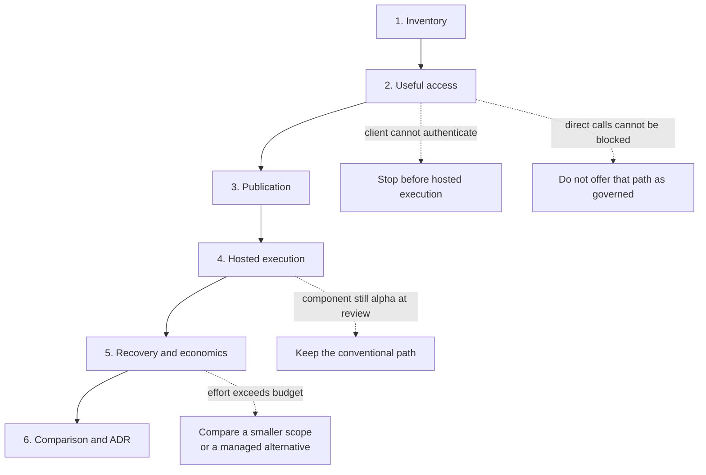

# Pilot plan

| | |
|---|---|
| Status | Proposed. Nothing is selected or deployed, and there are no pilot results. |
| Updated | 7 October 2026 |
| Based on | Architecture document 0.1 (5 October 2026), sections 16.3 to 16.5; the validation plans in the working notes (5 October 2026); the demo as of 7 October 2026 |
| Parent | [Agent platform proposal](00-proposal.md) |

The pilot decides whether governed connectivity and EKS execution meet developer and operational needs better than the alternatives. It runs in six steps, starts with one thin useful workflow, and adds a component only when it solves an observed requirement. Five stop conditions narrow or end the option; none of them extends the pilot. It ends with a comparison against AgentCore on the shared basis and an architecture decision record (ADR).

## The six steps

| Step | Work |
|---|---|
| 1. Inventory | Record cluster versions, controllers, the GitLab runner namespace and node pool, delivery authority, identity and secret mechanisms, network policy enforcement and available capacity, including what the supplied environment list omits. See [Problem, goals and scope](01-problem-goals-scope.md) |
| 2. Useful access | One actual client through Okta to one read-only internal capability and one approved model. Show permitted and denied calls, and debugging |
| 3. Publication | The service owner publishes guidance and discoverable metadata independently of compute |
| 4. Hosted execution | The same representative agent as a conventional EKS application and, where requirements permit, on the selected kagent profile. Check the agent against kagent's bring-your-own contract first, and record any adaptation as delivery effort |
| 5. Recovery and economics | Introduce realistic failures; record state recovery, cost and maintenance measurements |
| 6. Comparison | Evaluate AgentCore against equivalent permissions, models, inputs and success criteria on the shared basis; record adoption conditions or rejection in an ADR |

Access for existing clients is a smaller scope than a workload that needs hosted execution, not a substitute for it. The two are reported separately.

## Requirements to agree

An experiment can produce observations before its threshold is agreed, but it cannot be declared a pass. Owners are proposed roles, not assigned people. Values that also apply to AgentCore are agreed once, on the basis described on [Options and how they are compared](02-options-and-comparison.md), and carried here unchanged.

| Requirement | Current value | Used to assess | Proposed owner to agree | Needed before |
|---|---|---|---|---|
| Pilot duration, review date and stop conditions | Not agreed | Whether the pilot continues, narrows or ends | Decision owner | Step 1 |
| Initial developer clients and useful service | Not selected | Tool access and onboarding | Platform and service teams | Step 2 |
| Model providers and approved models | Not selected | Model access, credential custody and budgets | Platform and security teams | Step 2 |
| Operational telemetry backend | Not selected (New Relic or Dynatrace) | Trace continuity and telemetry cost | Observability team | Step 2 |
| Tenant meaning, data classification and retention | Not agreed | Identity, storage and telemetry | Security and data owners | Step 2 |
| User delegation versus autonomous work | Not agreed | Credential flow and permissions | Identity and service teams | Step 2 |
| Hosted workload and execution trust | Not selected | Conventional runtime versus sandbox | Agent and security teams | Step 4 |
| Traffic, concurrency and latency | Not agreed | Warm capacity and scaling | Agent and platform teams | Step 4 |
| Availability, recovery and rollback window | Not agreed | Failure drills and retention | Platform and service teams | Step 5 |
| Mandatory review and audit retention | Not agreed | Delivery gates and evidence | Release owners and security | Step 5 |
| Cloud and operating-effort budget | Not agreed | Total cost and maintenance | Platform and budget owners | Step 5 |

Record the setup and debugging experience of real users, not only an administrator's success.

## Pilot bounds and stop conditions

The pilot has no agreed duration. Agree a duration and a review date during the inventory step, so that a missing threshold shows up as a blocked step and not as an open-ended pilot. The stop conditions are proposals to confirm with the same owner.

| Observation | Proposed consequence |
|---|---|
| The selected client cannot complete Okta authentication through the gateway in a supported configuration | Stop before hosted execution; record the client and the gap |
| Direct calls to a backend or model provider cannot be blocked or equivalently governed with the cluster's controls | Do not offer that path as governed; narrow the scope or reject |
| A required component is still alpha or experimental at the review date with no acceptable support path | Exclude it from any production recommendation; keep the conventional path |
| A requirement needed for the next step is still not agreed at the review date | Pause that step and report observations only |
| Measured operating effort exceeds the agreed budget with no identified reduction | Compare a smaller scope or a managed alternative before continuing |

Meeting a stop condition narrows or ends the option. It does not extend the pilot.

## Experiments by scorecard criterion

The validation plan lists 26 experiments, each with the evidence it needs, a proposed owner and what a failure would mean. Each is named once below, under the criterion it mainly serves; several supply evidence to more than one. The working notes place three hosted-execution experiments under no criterion. They are listed under delivery effort, where their failure meanings point.

| Criterion | Experiments | Also measured |
|---|---|---|
| Developer value | Actual IDE or client authenticates; model access through the gateway; publish an existing service integration | Setup time and time to first useful task |
| Delivery effort | Conventional hosted agent; kagent and Substrate integration; registry and runtime compatibility | Custom code, charts and services written before the first useful workload |
| Team autonomy | Publish guidance without compute; consumer adopts or rejects content | |
| Security | Two tenants and a machine caller; attempt gateway bypass and policy override; concurrent session access; credential expiry and revocation; secret rotation and inspection | |
| Release safety | Failed release and stale CI retry; roll back a release; breaking MCP migration | |
| Reliability | Worker and node interruption; snapshot and database restore; gateway outage; telemetry and registry outage | Task success under load |
| Debugging | Injected-failure debugging with normal team access | |
| Operational burden | Shared controller and CRD upgrade | Added services, on-call ownership and support hours |
| Cost and performance | Representative load and spend; shared token budget | |
| Portability | Portability assessment; AgentCore Runtime behind the gateway | |

Twelve of these are common to both options and are run the same way under each.

### The experiments that decide a stop condition

| Experiment | Evidence needed | A failure would mean |
|---|---|---|
| Actual IDE or client authenticates | Discovery, refresh, redirect and deny behavior with the selected client, through Okta | The client fleet needs a different authentication path or a client change |
| Attempt gateway bypass and policy override | Direct calls blocked or equivalently governed, including from a CI job pod; mandatory policy retained | The gateway is a convenience, not a control point |
| Model access through the gateway | A client and an agent reach an approved model with a gateway-issued or Okta-derived credential; an unapproved model and a direct provider call are denied; usage is attributed to the verified caller | Model access is not governed, or provider keys would have to be distributed |
| kagent and Substrate integration | Supported resources, actual invocation, permissions and sessions | Hosted execution stays on the conventional path |
| Representative load and spend | Success, latency, node footprint, usage and support effort for the shared session profile | Operational or cost fit needs changes or another option |

Three rules apply across the set. For sandbox tests, inspect boundaries between actors, not only pod policies. For transactions, test idempotency and recovery separately from model quality. Evaluate rollback with retained dependencies and with session and state compatibility.

## Compatibility inventory

The pilot records the combination it tested. No version is pinned by this proposal.

- Kubernetes and EKS version; Istio mode.
- Gateway controller and GatewayClass; Gateway API channel and version.
- Agentgateway chart, proxy and custom resource definitions; the rate-limit server, where shared budgets are used.
- kagent generation, API and CLI; Agent Substrate worker and sandbox version.
- Registry integration; database requirements.
- OpenTelemetry instrumentations and exporters.

Record each component's documented maturity beside its version. For each integration, record source links, required schemas and permissions, the actual result, limitations, the configuration and source revision, the reviewer and the date. Two separately documented capabilities are not proof that they integrate.

## What the pilot produces

Before selection, the pilot produces:

- A tested connection matrix.
- A configuration authority map.
- A successful developer journey.
- A compatibility inventory.
- A recovery demonstration.
- A measured cost and effort comparison.

Unresolved gaps are recorded beside successful results. The possible outcomes are a smaller tool-access platform, conventional EKS execution, conditional kagent adoption, AgentCore, hybrid use, deferral or rejection. An ADR is written only when a decision is made.

## Order of work for the application layer

The application conventions on [Building on the platform](14-building-on-the-platform.md) have their own plan, which adds to this one and does not repeat its experiments.

1. **Platform first.** Nothing in the application layer precedes the first existing-client workflow.
2. **First application.** Build the first hosted application as a thin application on shared packages, as packages from the start. It is proposed as the representative hosted workload of the shared pilot, so that one application serves both options.
3. **Library.** Extract the shared library from that application. Do not design the library first.
4. **Configured assistants.** Offer the base application image when a second assistant wants the same application with different content.
5. **Starters.** Render them with Copier once two components share plumbing.

## What the demo changes about the plan

The demo is one incident on a kind cluster with stand-ins. Its results are observations on one machine, not pilot evidence, and they close no decision. They do sharpen where the pilot should look first. Detail is on [Demo findings and limits](21-demo-findings.md) and [Decisions, risks and requirements](31-decisions-and-risks.md).

- **Client sign-in, the first stop condition.** **Observed in the demo:** with Agentgateway 1.6.0 and Keycloak 26.7.5, a real MCP client could not sign in through the gateway by itself; a client that already held a token worked. Three pieces were missing: MCP authentication settings in the route's policy, two `/.well-known` route matches, and an issuer address that both a browser and the gateway's pod can reach. This is a gap in the demo's configuration and says nothing yet about Okta. It is the first thing step 2 should try.
- **Bypass controls, the second stop condition and decision D-7.** **Observed in the demo:** a default-deny network boundary for each workload namespace blocked direct calls to a tool server and to the model endpoint, and four Kyverno admission policies refused three attempts to loosen a platform rule. The demo's files also list what these controls do not catch. They are a starting point on kind's network plugin, not the cluster's controls, and the CI job pod path was not exercised because the demo has no pipeline.
- **Model credential, decision D-4.** **Observed in the demo:** both forms ran. Calls made for a signed-in person reached the shared model route with that person's identity provider token; the kagent workload called its own route with a key the gateway issued to it. Time from revocation to denial was not measured for either.
- **Outage experiments.** **Observed in the demo:** with the registry scaled to zero, tools and agents still answered; with the collector at zero, the Sample App and the gateway still answered. These are first observations for the telemetry and registry outage experiment.
- **Compatibility inventory.** The versions that ran together are its first rows, for kind only: Kubernetes 1.37.0, Gateway API 1.6.0, Agentgateway 1.6.0, kagent 1.0.0-alpha7 with Agent Substrate 0.3.0-alpha3, Agentregistry chart 0.4.0, Kyverno 1.19.1 and Langfuse 4.46.0. The full list is on [Glossary and sources](90-glossary-and-sources.md).
- **Not exercised.** Okta, EKS, Istio, token budgets and the rate-limit server, session isolation and restore, delivery through GitLab with promotion between environments, and cost. Every requirement above is still to agree and every experiment is still to run.
