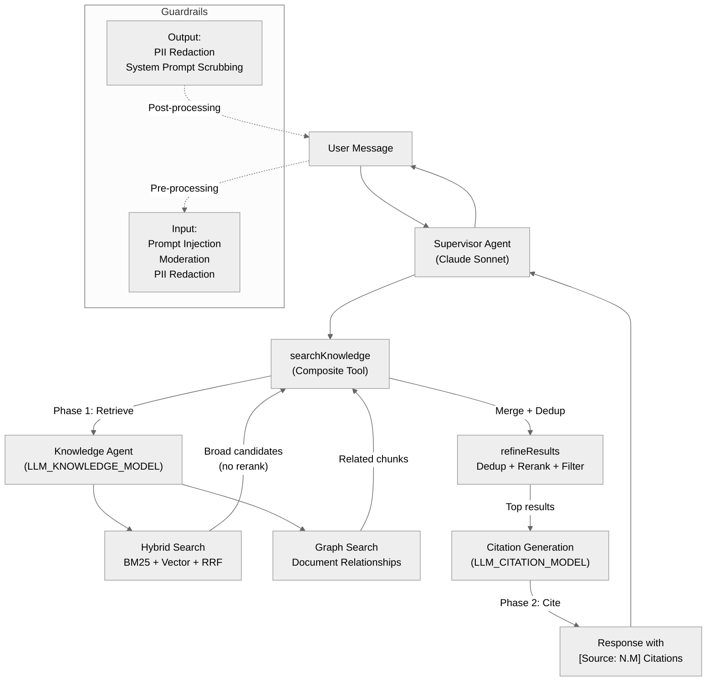

# Agents & RAG

Typhoon uses a multi-agent architecture built on Mastra to answer customer questions from ingested source documents. The system combines a supervisor agent, a knowledge agent with multiple search strategies, a two-stage retrieval pipeline, and a citation generation layer.

## System Overview

## Components

| Component                                     | Description                                                         | Key File                                        |
| --------------------------------------------- | ------------------------------------------------------------------- | ----------------------------------------------- |
| [Supervisor](./supervisor.md)                 | Routes user queries to specialized agents, presents cited responses | `packages/agents/src/supervisor.ts`             |
| [Knowledge Agent](./knowledge-agent.md)       | Searches the knowledge base using hybrid and graph tools            | `packages/agents/src/knowledge.ts`              |
| [Search Tools](./search-tools.md)             | Hybrid search, graph search, composite search, thread title         | `packages/agents/src/tools/`                    |
| [Retrieval Pipeline](./retrieval-pipeline.md) | Two-stage retrieve-then-rerank with Cohere cross-encoder            | `packages/db/src/drivers/pg/retrieval.ts`       |
| [Citations](./citations.md)                   | Citation generation, storage stripping, and hydration               | `packages/agents/src/tools/knowledge-search.ts` |
| [Metadata Filtering](./metadata-filtering.md) | Dynamic metadata-aware filtered search                              | `packages/db/src/repos/metadata.repo.ts`        |
| [Guardrails](./guardrails.md)                 | Input/output safety processors                                      | `packages/agents/src/guardrails/`               |
| [Memory](./memory.md)                         | Mastra memory configuration for conversation persistence            | `apps/api/src/mastra/index.ts`                  |

## Agent Variants

| Agent            | Memory            | Guardrails         | Tools                                                   | Use Case               |
| ---------------- | ----------------- | ------------------ | ------------------------------------------------------- | ---------------------- |
| Supervisor       | Yes (20 messages) | Yes (configurable) | `searchKnowledge`, `setThreadTitle`                     | Production chat        |
| Knowledge Agent  | Optional          | No                 | `searchKnowledgeBaseHybrid`, `searchKnowledgeBaseGraph` | Internal sub-agent     |
| Experiment Agent | No                | No                 | `searchKnowledge`                                       | Evaluation experiments |

## Model Configuration

Each stage uses a dedicated model that can be configured independently via environment variables:

| Model               | Env Var                         | Default                       | Purpose                                           |
| ------------------- | ------------------------------- | ----------------------------- | ------------------------------------------------- |
| Chat (Supervisor)   | `LLM_CHAT_MODEL`                | `anthropic.claude-sonnet-4-6` | Main conversation model                           |
| Knowledge           | `LLM_KNOWLEDGE_MODEL`           | Falls back to chat model      | Search tool routing                               |
| Citation            | `LLM_CITATION_MODEL`            | Falls back to chat model      | Synthesizing search results with citations        |
| Guardrail           | `LLM_GUARDRAIL_MODEL`           | Falls back to chat model      | Safety checks (typically a fast model like Haiku) |
| Title               | `LLM_TITLE_MODEL`               | Falls back to chat model      | Thread title generation                           |
| Metadata Extraction | `LLM_METADATA_EXTRACTION_MODEL` | Falls back to chat model      | Document metadata extraction during ingestion     |
| Scoring             | `LLM_SCORING_MODEL`             | Falls back to chat model      | Evaluation scoring                                |

All models are created via `@typhoon/ai` factory functions that connect to an OpenAI-compatible gateway (e.g. Bifrost for Bedrock).
