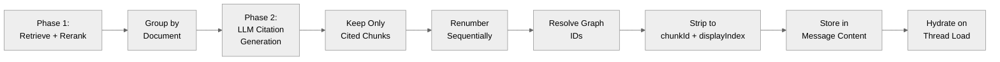

# Citations

Typhoon generates inline citations (`[Source: N.M]`) that link every factual claim to a specific document chunk. The citation system spans generation, post-processing, storage optimization, and hydration on load.

## Citation Format

Citations use a hierarchical numbering scheme:

- **`[Source: N]`** -- references an entire document (or a single-chunk document)
- **`[Source: N.M]`** -- references chunk M within document N

Where N is the document index and M is the chunk index within that document. Multiple sources can be combined: `[Source: 1.1, 2]`.

## Lifecycle

### Phase 2: Citation Generation

After Phase 1 retrieval and reranking, the composite `searchKnowledge` tool generates citations:

1. **Group sources by document** -- chunks from the same document are grouped together
2. **Assign hierarchical indices** -- single-chunk documents get `[N]`, multi-chunk documents get `[N.1]`, `[N.2]`, etc.
3. **Build source summary** -- each document/chunk is formatted with its title, section, and a 500-character content preview
4. **LLM call** -- `LLM_CITATION_MODEL` generates a structured output with:
   - `answer`: the synthesized response with inline `[Source: N.M]` markers
   - `citedRefs`: array of all source references actually used (e.g. `["1", "2.1", "2.3"]`)
5. **Prune** -- only chunks that were actually cited are kept in `_chunkSources`
6. **Renumber** -- display indices are renumbered sequentially so the user sees `[Source: 1], [Source: 2]` even if the original indices were non-contiguous
7. **Rewrite** -- `[Source: X]` markers in the text are rewritten with the new sequential indices

### Graph Tool ID Resolution

The graph search tool returns numeric node indices (e.g. `"5"`, `"13"`) as chunk IDs instead of real vector store UUIDs. After citation generation, the composite tool resolves these:

1. First pass: match by `documentId + startIndex` against hybrid search results that have real IDs
2. Second pass: query the vector store directly for any still-unresolved numeric IDs via `getChunkIdByDocumentAndIndex()`

This resolution happens after citation generation to avoid changing dedup/ordering behavior.

## Storage Optimization

### Stripping Before Persistence

**File:** `packages/db/src/drivers/pg/strip-chunks.ts`

Before messages are written to the database, `stripChunkSources()` reduces full chunk metadata to just `{ chunkId, displayIndex }`. This eliminates redundant storage of title, text, section, source, etc. that already exists in the vector store.

The function operates on the Mastra v4 message format (format 2, parts array) and specifically targets `tool-invocation` parts whose result contains `_chunkSources`.

### Hydration on Load

**File:** `packages/services/src/threads/hydrate-chunks.ts`

When a thread is loaded, `hydrateChunkSources()` enriches the slim references with full metadata:

1. **Collect** all `chunkId` values from all messages in the thread
2. **Batch fetch** metadata from the vector store via `vectorStore.getChunksByIds()`
3. **Resolve** sync target names from IDs
4. **Enrich** each `_chunkSources` entry with `title`, `section`, `text` (200 chars), `source`, `documentId`, `startIndex`, `syncTargetName`

This operates on messages with `tool-*` parts in `output-available` state, mutating them in place.

## Observability

Each chunk source is tagged with `searchTool` (either `"search_knowledge_base_hybrid"` or the graph tool name) so the system can track which search strategy contributed to the final answer.

Debug logging in the composite tool captures:

- Tools used per query
- Raw source count before dedup
- Count after dedup, below-threshold, and final
- Score distributions
- Citation reindex mapping (old index -> new index)

## Key Files

| File                                              | Purpose                                              |
| ------------------------------------------------- | ---------------------------------------------------- |
| `packages/agents/src/tools/knowledge-search.ts`   | Citation generation (Phase 2) and ID resolution      |
| `packages/db/src/drivers/pg/strip-chunks.ts`      | Strip metadata before DB write                       |
| `packages/services/src/threads/hydrate-chunks.ts` | Batch-fetch metadata on thread load                  |
| `packages/db/src/drivers/pg/vector.ts`            | `getChunksByIds()`, `getChunkIdByDocumentAndIndex()` |

## Related

- [Search Tools](./search-tools.md) -- the composite tool that generates citations
- [Retrieval Pipeline](./retrieval-pipeline.md) -- what happens before citation generation
