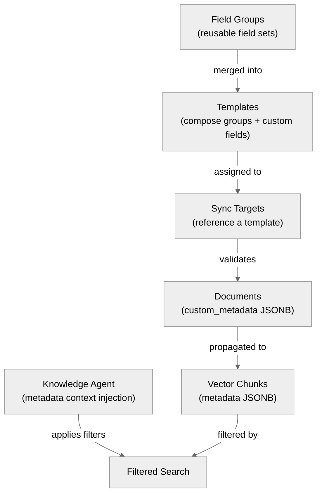

# Metadata Filtering

Typhoon supports user-defined metadata on documents that enables scoped search results. The metadata system spans schema definition, document validation, vector propagation, dynamic agent context, and optional LLM-based extraction during ingestion.

## Architecture



## Schema Definition

### Field Groups

Reusable sets of metadata fields stored in the `metadata_field_groups` table. Each field has:

| Property        | Type                                      | Description                       |
| --------------- | ----------------------------------------- | --------------------------------- |
| `type`          | `string`, `number`, `boolean`, `string[]` | Field value type                  |
| `required`      | boolean                                   | Whether the field must be present |
| `default`       | any                                       | Default value when not provided   |
| `allowedValues` | array                                     | Enum-like constraint on values    |
| `description`   | string                                    | Human-readable field description  |

Example:

```json
{
  "name": "Region",
  "fields": {
    "country": { "type": "string", "required": true, "allowedValues": ["US", "EU", "APAC"] },
    "state": { "type": "string", "required": false }
  }
}
```

### Templates

Templates compose field groups and custom fields into a complete metadata schema. Stored in the `metadata_templates` table.

- **`field_group_ids`** -- ordered list of field group UUIDs whose fields are merged
- **`custom_fields`** -- additional fields defined directly on the template (same shape as field group fields)

The effective schema is resolved by `resolveTemplateSchema()`, which merges all referenced field groups with the template's custom fields.

### Template Assignment

Sync targets reference a template via `metadata_template_id`. When documents are ingested from that sync target, their `custom_metadata` is validated against the template's effective schema.

## Document Metadata

### Validation

`validateCustomMetadata()` in `packages/types/src/metadata.ts` validates a document's custom metadata against the template schema:

- Non-schema keys are silently stripped (no error, just removed)
- Required fields without defaults cause validation errors
- Values are type-checked against the field definition

### Propagation to Vectors

During ingestion (`packages/ingestion/src/pipeline.ts`), document metadata is merged into each vector chunk's JSONB metadata:

```typescript
metadata: {
  text: chunk.text,
  documentId,
  syncTargetId,
  source: sourceKey,
  title: docTitle,
  // Document custom metadata fields are spread here:
  category: "electronics",
  region: "US",
  ...
}
```

This makes metadata fields available for filtering at query time without a join.

## Dynamic Agent Context

### getMetadataContext Callback

The API's Mastra composition root (`apps/api/src/mastra/index.ts`) configures a `getMetadataContext` callback with a 60-second TTL cache:

```typescript
const METADATA_CONTEXT_TTL_MS = 60_000;

async function getMetadataContext(): Promise<string | undefined> {
  if (Date.now() < _metadataCache.expiresAt) return _metadataCache.value;
  const value = await _metadataRepoForAgent.getFieldValuesForAgent();
  _metadataCache = { value, expiresAt: Date.now() + METADATA_CONTEXT_TTL_MS };
  return value;
}
```

### MetadataRepo.getFieldValuesForAgent()

Queries distinct metadata field keys and their values across all non-deleted documents:

```sql
SELECT kv.key, jsonb_agg(DISTINCT kv.value)
FROM documents d, jsonb_each(d.custom_metadata) AS kv(key, value)
WHERE d.status != 'deleted' AND d.custom_metadata != '{}'::jsonb
GROUP BY kv.key ORDER BY COUNT(DISTINCT d.id) DESC
```

Returns a compact string like:

```
category: general, electronics, clothing | region: US, EU, APAC
```

### Injection into Knowledge Agent

The composite `searchKnowledge` tool prepends the metadata context to the user's query:

```
User question: What is the refund policy for electronics?

Available metadata fields and values:
category: general, electronics, clothing | region: US, EU, APAC
```

The knowledge agent's instructions teach it to recognize metadata dimensions and apply filters accordingly.

## Auto-Extraction

When `auto_extract_metadata` is enabled on a sync target, LLM-based metadata extraction runs during ingestion:

1. The template's effective schema is converted to a Zod schema via `buildDocumentMetadataSchema()`
2. The first `METADATA_EXTRACTION_MAX_CHARS` (default 8000) characters of parsed content are sent to `LLM_METADATA_EXTRACTION_MODEL`
3. A single `generateText` + `Output.object` call extracts title, description, and custom metadata fields
4. Extracted metadata is stored in the `documents` table and propagated to vector chunks
5. Extraction failure is fatal -- the document goes to `error` status

## Filtered Search

When the knowledge agent applies metadata filters, the vector store uses MongoDB-style operators on the chunk JSONB metadata:

```json
{
  "$and": [{ "category": { "$in": ["electronics", "general"] } }, { "region": "US" }]
}
```

Including both the specific value and a default/catch-all value (like "general") in `$in` filters prevents excluding general-purpose documents that are relevant across categories.

## CRUD API

| Endpoint                            | Method             | Description                      |
| ----------------------------------- | ------------------ | -------------------------------- |
| `/api/v1/metadata/field-groups`     | GET, POST          | List/create field groups         |
| `/api/v1/metadata/field-groups/:id` | GET, PATCH, DELETE | Read/update/delete a field group |
| `/api/v1/metadata/templates`        | GET, POST          | List/create templates            |
| `/api/v1/metadata/templates/:id`    | GET, PATCH, DELETE | Read/update/delete a template    |

## Key Files

| File                                            | Purpose                                               |
| ----------------------------------------------- | ----------------------------------------------------- |
| `packages/types/src/metadata.ts`                | `validateCustomMetadata()`, `resolveTemplateSchema()` |
| `packages/ingestion/src/pipeline.ts`            | Metadata propagation to vectors, auto-extraction      |
| `packages/agents/src/knowledge.ts`              | Agent instructions for metadata filtering             |
| `packages/agents/src/tools/knowledge-search.ts` | Metadata context injection                            |
| `apps/api/src/mastra/index.ts`                  | `getMetadataContext` callback wiring                  |
| `packages/db/src/repos/metadata.repo.ts`        | CRUD and `getFieldValuesForAgent()`                   |
| `apps/api/src/routes/metadata-field-groups.ts`  | Field group API routes                                |
| `apps/api/src/routes/metadata-templates.ts`     | Template API routes                                   |

## Related

- [Knowledge Agent](./knowledge-agent.md) -- how the agent uses metadata filters
- [Search Tools](./search-tools.md) -- filter parameter on search tools
