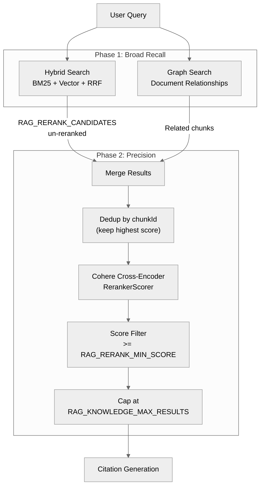

# Retrieval Pipeline

Typhoon uses a two-stage retrieve-then-rerank pipeline to balance broad recall with precision. The pipeline is shared across agent search tools and the search API.

## Pipeline Overview



## Two-Stage Design

### Phase 1: Broad Recall (Sub-Tools)

Each search tool retrieves `RAG_RERANK_CANDIDATES` (default 100) candidates with `rerank: false`. The tools return broad, un-reranked results so the composite tool can rerank the merged set.

- **Hybrid search** runs weighted full-text search (tsvector with A/B/C/D tier weights) and vector similarity in parallel, fusing results via weighted Reciprocal Rank Fusion (RRF). Title and section matches rank higher than body text matches — see [Vector Storage](../ingestion/vector-storage.md#weighted-tsvector-full-text-search)
- **Graph search** traverses document relationships to find connected chunks above `RAG_GRAPH_THRESHOLD`

### Phase 2: Precision (Composite Tool)

The `searchKnowledge` composite tool merges results from all sub-tools and runs them through the shared `refineResults` pipeline:

1. **Merge** -- combine all source chunks from sub-tool results
2. **Dedup** -- by `chunkId`, keeping the highest-scoring entry
3. **Rerank** -- Cohere cross-encoder via `RerankerScorer` with semantic-only weights
4. **Filter** -- discard results with score below `RAG_RERANK_MIN_SCORE` (default 0.1)
5. **Cap** -- limit to `RAG_KNOWLEDGE_MAX_RESULTS` (default 10)

## refineResults

**File:** `packages/db/src/drivers/pg/retrieval.ts`

The shared post-processing pipeline used by all search consumers:

```typescript
async function refineResults(results: QueryResult[], query: string, options?: RefineOptions): Promise<QueryResult[]>;

interface RefineOptions {
  minScore?: number; // Discard below threshold
  dedupKey?: string; // Metadata field to dedup on
  reranker?: RerankFn; // Caller-provided reranker callback
}
```

Pipeline stages run in order, each independently optional:

1. **Dedup** by metadata key (keeps highest-scoring entry per key)
2. **Rerank** via the caller's reranker callback (model-agnostic)
3. **minScore filter** (applied last because RRF scores are small fractions while reranked scores are normalized 0-1)

## RerankerScorer

**File:** `packages/ai/src/reranker-scorer.ts`

Calls a Cohere-compatible `/rerank` endpoint (e.g. Bifrost gateway for `bedrock/cohere.rerank-v3-5:0`).

### Key Features

- **Automatic batching** -- concurrent calls with the same query are batched into a single API request via microtask scheduling
- **Retry with backoff** -- retries on 429, 500, 502, 503, 504 with exponential backoff and jitter
- **Metrics** -- captures `RerankMetrics` per query: model, document count, top score, duration, search units
- **Trace propagation** -- injects `traceparent` header from the active OTel span

### Configuration

| Env Var                       | Default                          | Description      |
| ----------------------------- | -------------------------------- | ---------------- |
| `RERANKER_BASE_URL`           | (required)                       | Rerank endpoint  |
| `RERANKER_API_KEY`            | `LLM_API_KEY`                    | Auth key         |
| `RERANKER_MODEL`              | (required)                       | Model ID         |
| `RERANKER_MAX_RETRIES`        | `LLM_MAX_RETRIES` (3)            | Max retries      |
| `RERANKER_RETRY_DELAY_MS`     | `LLM_RETRY_DELAY_MS` (500)       | Base retry delay |
| `RERANKER_RETRY_MAX_DELAY_MS` | `LLM_RETRY_MAX_DELAY_MS` (10000) | Max retry delay  |
| `RERANKER_TIMEOUT_MS`         | `15000`                          | Request timeout  |

## Rerank Weights

The composite `searchKnowledge` tool uses semantic-only weights because source results come from different tools (hybrid, graph) with incompatible original score scales:

| Weight     | Value | Rationale                                     |
| ---------- | ----- | --------------------------------------------- |
| `semantic` | 1.0   | Pure cross-encoder relevance                  |
| `vector`   | 0     | Original scores are incompatible across tools |
| `position` | 0     | Not meaningful across merged results          |

Standalone tools (e.g. hybrid search on its own) use the same defaults but can be overridden via environment variables:

| Env Var                      | Default |
| ---------------------------- | ------- |
| `RAG_RERANK_WEIGHT_SEMANTIC` | 1.0     |
| `RAG_RERANK_WEIGHT_VECTOR`   | 0       |
| `RAG_RERANK_WEIGHT_POSITION` | 0       |

## RRF Configuration

Hybrid search fuses BM25 and vector results using Reciprocal Rank Fusion. The RRF parameters are configured in the pgvector `hybridQuery` implementation:

- **`RAG_HYBRID_RRF_K`** -- RRF smoothing constant (affects rank weighting)
- **`VECTOR_WEIGHT`** / **`FTS_WEIGHT`** -- relative weighting of vector vs keyword results

## Consumer Configuration

Different consumers of the retrieval pipeline use different settings:

| Consumer                         | dedupKey     | Reranker            | minScore               | Retrieval Inflation              |
| -------------------------------- | ------------ | ------------------- | ---------------------- | -------------------------------- |
| Agent hybrid tool (standalone)   | `chunkId`    | Yes                 | `RAG_RERANK_MIN_SCORE` | `RAG_RERANK_CANDIDATES`          |
| Agent hybrid tool (in composite) | --           | No                  | --                     | `RAG_RERANK_CANDIDATES`          |
| Composite `searchKnowledge`      | by `chunkId` | Yes (semantic-only) | `RAG_RERANK_MIN_SCORE` | Uses sub-tool results            |
| Search API (default)             | `documentId` | Yes                 | `RAG_RERANK_MIN_SCORE` | `RAG_RERANK_CANDIDATES`          |
| Search API (expanded)            | `chunkId`    | Yes                 | `RAG_RERANK_MIN_SCORE` | `RAG_RERANK_CANDIDATES_EXPANDED` |
| Vector API (rerank=true)         | --           | Yes                 | `RAG_RERANK_MIN_SCORE` | `RAG_RERANK_CANDIDATES`          |

## Tuning Parameters

All parameters are configurable via environment variables:

| Env Var                          | Default | Description                                    |
| -------------------------------- | ------- | ---------------------------------------------- |
| `RAG_RERANK_CANDIDATES`          | 100     | Candidates retrieved when reranker is active   |
| `RAG_RERANK_CANDIDATES_EXPANDED` | 200     | Expanded pool for deep search mode             |
| `RAG_RERANK_MIN_SCORE`           | 0.1     | Minimum score to keep after reranking          |
| `RAG_KNOWLEDGE_MAX_RESULTS`      | 10      | Maximum results returned by composite tool     |
| `RAG_VECTOR_MIN_SCORE`           | 0.6     | Min vector similarity for API endpoint         |
| `RAG_VECTOR_MIN_SCORE_AGENT`     | 0.5     | Min vector similarity for agent vector tool    |
| `RAG_GRAPH_THRESHOLD`            | 0.7     | Graph RAG similarity threshold                 |
| `RAG_FTS_WEIGHT_A`               | 1.0     | tsvector weight for tier A (title, critical)   |
| `RAG_FTS_WEIGHT_B`               | 0.6     | tsvector weight for tier B (section, keywords) |
| `RAG_FTS_WEIGHT_C`               | 0.4     | tsvector weight for tier C (moderate custom)   |
| `RAG_FTS_WEIGHT_D`               | 0.2     | tsvector weight for tier D (body text)         |

## Related

- [Search Tools](./search-tools.md) -- the tools that use this pipeline
- [Citations](./citations.md) -- what happens after retrieval
