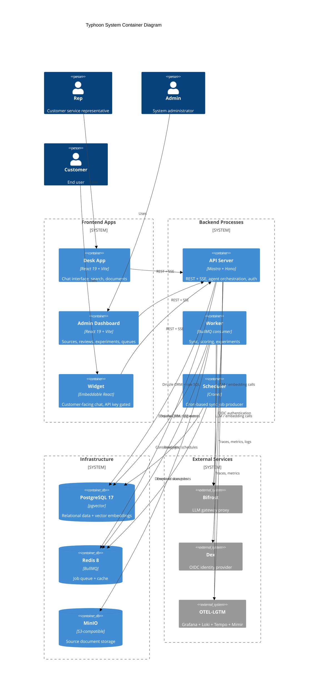

# Architecture Overview

Typhoon is an AI-powered customer service chatbot that ingests source documents from S3/MinIO, indexes them into a PostgreSQL + pgvector database via a multi-stage pipeline (parse, chunk, extract metadata, embed), and serves RAG-powered answers through a conversational interface backed by Mastra agents. The system is built as a Bun/TypeScript monorepo with three backend processes (API server, worker, scheduler), three frontend apps (rep desk, admin dashboard, customer widget), and supporting infrastructure (PostgreSQL, Redis, MinIO, Dex, Bifrost, OTEL-LGTM).

## System Container Diagram



## Monorepo Structure

Built with **Bun workspaces** for dependency management and **Turborepo** for task orchestration.

```
typhoon/
  apps/
    api/          -- Mastra + Hono API server (port 5172)
    worker/       -- BullMQ consumer with four worker pools
    scheduler/    -- Croner-based cron job producer (port 5171)
    desk/         -- Rep workspace: chat, search, documents (port 5173)
    admin/        -- Admin dashboard: sources, reviews, experiments (port 5174)
    widget/       -- Embeddable customer chat widget (port 5175)
  packages/
    config/       -- Shared TypeScript configs + Zod env validation (L0)
    types/        -- Zod schemas for domain entities (L0)
    db/           -- Drizzle ORM schemas, migrations, repos (L1)
    ai/           -- LLM + embedding model factories (L1)
    blob-store/   -- Interface-based blob storage with S3 adapter (L1)
    logger/       -- Structured logging via Mastra logger (L1)
    telemetry/    -- OpenTelemetry SDK, custom metrics, Hono middleware (L1)
    queue/        -- BullMQ job queue wrapper (L1)
    agents/       -- Mastra supervisor + knowledge agent with RAG tools (L2)
    evals/        -- Scorer categories, scoring/experiment job handlers (L2)
    ingestion/    -- Document parsers, MDocument pipeline, sync jobs (L2)
    services/     -- Business logic services with constructor DI (cross-layer)
    chat/         -- React chat UI components, streaming, markdown (L2)
    ui/           -- Shared Radix UI component library, shadcn-style (L2)
    api-client/   -- Typed API calls, TanStack Query option factories (L2)
  infra/
    docker/       -- Docker Compose files, Dockerfiles, service configs
  scripts/
    docker.sh     -- Wrapper for multi-file docker compose
    dev-setup.sh  -- First-time dev environment setup
    doctor.sh     -- Health check for all services
    seed-data.sh  -- DB seed + sample document upload
    reset-dev.sh  -- Tear down and re-setup from scratch
```

## 3-Layer Dependency Model

Packages are organized into three layers. Higher layers import from lower layers; circular dependencies are prohibited. Turborepo enforces build order automatically.

| Layer               | Packages                                                   | Purpose                                     |
| ------------------- | ---------------------------------------------------------- | ------------------------------------------- |
| L0 (Foundations)    | `config`, `types`                                          | Shared configuration and domain schemas     |
| L1 (Infrastructure) | `db`, `ai`, `blob-store`, `logger`, `telemetry`, `queue`   | Infrastructure clients and adapters         |
| L2 (Domain)         | `agents`, `evals`, `ingestion`, `chat`, `ui`, `api-client` | Domain logic and UI                         |
| Cross-layer         | `services`                                                 | Business logic that imports from all layers |

See [Package Dependency Model](./package-dependency-model.md) for a full dependency graph and rules.

## Application Architecture

The backend is split into three independently scalable processes that share PostgreSQL and Redis:

```
+-----------+    enqueue     +----------+    consume     +-----------+
|   API     | ------------> |  Redis   | <------------ |  Worker   |
|  (Hono)   |  queue admin  | (BullMQ) |               | (BullMQ)  |
+-----------+   SSE events  +----------+               +-----------+
                                 ^
                                 | enqueue scan jobs
                            +----+------+
                            | Scheduler |
                            | (Croner)  |
                            +-----------+
         All three ---> PostgreSQL + pgvector
```

### API Server (`apps/api`)

- **Framework:** Mastra + Hono (`@mastra/hono`)
- **Auto-generated endpoints:** Agent generate/stream, memory threads/messages, working memory
- **Custom routes:** Sync targets CRUD, document browsing, feedback, widget chat, auth, queue admin, search, reviews, experiments, scorers, datasets, traces, dashboard, metadata templates/field groups
- **Storage:** PostgresStore (threads, messages, memory) + PgVector (embeddings)
- Enqueues BullMQ jobs but does not consume them

### Worker (`apps/worker`)

- **Headless BullMQ consumer** with four worker pools:
  - **Sync** -- processes scan, process-file, and delete-file jobs (downloads from S3/MinIO, parses, chunks, embeds, upserts vectors)
  - **Reviews** -- scoring preparation (`score-message`) and aggregation (`score-aggregate`); creates BullMQ Flows that fan out scorer execution to the scoring queue
  - **Scoring** -- generic scorer execution (`score-run`); runs a single LLM-based scorer per job, shared by reviews and experiments with priority scheduling
  - **Experiments** -- experiment lifecycle (`experiment-setup`, `exp-item-process`, `experiment-complete`); uses BullMQ Flow with multi-step jobs (`moveToWaitingChildren`) for agent call, scoring, and result collection
- Scales horizontally (multiple replicas via K8s HPA/KEDA)
- Minimal `/healthz` HTTP endpoint for K8s probes (port 5170)

### Scheduler (`apps/scheduler`)

- **Single-replica cron producer** -- reads sync target schedules from DB, enqueues scan jobs
- Uses Croner for cron parsing, polls DB every 60s for schedule changes
- Minimal `/healthz` HTTP endpoint for K8s probes (port 5171)

### Frontend Apps

All three frontend apps share the same stack: React 19, Vite, TanStack Router/Query, Radix UI (shadcn-style).

| App    | Port | Purpose         | Key Features                                                      |
| ------ | ---- | --------------- | ----------------------------------------------------------------- |
| Desk   | 5173 | Rep workspace   | Chat (AI SDK `useChat`), search, documents, dashboard             |
| Admin  | 5174 | Admin dashboard | Sources, documents, reviews, experiments, scorers, queues, traces |
| Widget | 5175 | Customer chat   | Embeddable React widget, API key gated                            |

Frontend follows **Page -> Feature Hook -> API Client**: pages compose layout using feature hooks for mutations and `@typhoon/api-client` for typed API calls with TanStack Query option factories.

See [Layered Architecture](./layered-architecture.md) for backend and frontend layer details.

## Data Architecture

| Store            | Technology                            | Purpose                                                                              |
| ---------------- | ------------------------------------- | ------------------------------------------------------------------------------------ |
| Relational       | PostgreSQL 17                         | Sync targets, documents, sync jobs, feedback, scores, reviews, experiments, metadata |
| Vectors          | pgvector (PostgreSQL extension)       | Document chunk embeddings for RAG                                                    |
| Threads/Messages | Mastra PgStore (PostgreSQL)           | Conversation storage, message history                                                |
| Memory           | Mastra Memory (PostgreSQL + pgvector) | Last 20 messages per thread (semantic recall and working memory disabled)            |
| Cache/Jobs       | Redis 8                               | BullMQ job queues (sync, reviews, scoring, experiments)                              |
| Files            | MinIO (S3-compatible)                 | Source document storage                                                              |

## Communication Patterns

| Pattern            | Technology                                   | Use Case                                                                         |
| ------------------ | -------------------------------------------- | -------------------------------------------------------------------------------- |
| REST               | Hono HTTP (via Mastra)                       | CRUD operations (sync targets, documents, feedback, scorers, datasets, metadata) |
| SSE (Chat)         | Mastra `handleChatStream` + AI SDK `useChat` | Real-time chat streaming from agents                                             |
| SSE (Queue Events) | Hono `streamSSE()` + `EventSource`           | Live BullMQ job state changes to admin UI                                        |
| Jobs               | BullMQ (Redis)                               | Background document sync, scoring, experiment pipelines                          |
| Cron               | Croner                                       | Scheduled sync refresh jobs (Scheduler reads DB every 60s)                       |

## Agent System

A two-tier agent system routes queries through a supervisor to a specialized knowledge agent. The supervisor delegates all factual questions to the knowledge agent via a composite `searchKnowledge` tool that performs two-phase retrieve-then-rerank. The knowledge agent uses hybrid (BM25 + vector) and graph-based search tools, with results merged, deduplicated, reranked via Cohere cross-encoder, and synthesized into a cited response by a dedicated citation LLM.

Key components:

- **Supervisor Agent** -- routes queries, manages thread titles, applies input/output guardrails (prompt injection, moderation, PII detection)
- **Knowledge Agent** -- RAG-powered retrieval with `toolChoice: 'required'`, metadata-aware filtering
- **Experiment Agent** -- lightweight variant without memory/guardrails for evaluation
- **PrefillErrorHandler** -- reactive error recovery for Bedrock/Bifrost prefill rejection

See [Agent Architecture](./agent-architecture.md) for the full agent system documentation.

## Evaluation System

Automated scoring evaluates agent responses across two categories:

**Response Quality** (always runs): Answer Relevancy, Faithfulness, Hallucination (inverted for averaging)

**Retrieval Quality** (runs only when context exists): Context Relevance, Context Precision

Pipelines:

- **Reviews** -- triggered after each chat message via BullMQ Flow; individual scorers execute as `score-run` jobs
- **Experiments** -- triggered manually with datasets; items processed via multi-step `exp-item-process` jobs

Custom LLM-as-judge scorers are supported and displayed separately from built-in category averages.

## Authentication

| User Type        | Method             | Details                                                             |
| ---------------- | ------------------ | ------------------------------------------------------------------- |
| Reps/Admins      | Better Auth (OIDC) | Dex in dev, Okta/other in production; session cookies               |
| Widget customers | API keys           | `X-API-Key` header; one key per widget deployment, created by admin |

## Sub-Pages

- [Data Flow](./data-flow.md) -- end-to-end sequence diagrams for document ingestion and chat queries
- [Layered Architecture](./layered-architecture.md) -- Route, Service, Repository pattern with code examples
- [Package Dependency Model](./package-dependency-model.md) -- three-layer model with full dependency graph
- [Agent Architecture](./agent-architecture.md) -- supervisor, knowledge, and experiment agents with tool details
