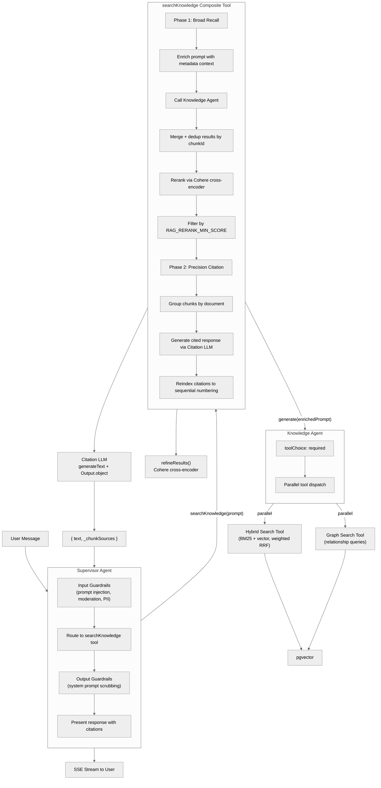

# Agent Architecture

The Typhoon agent system uses a two-tier design: a **supervisor agent** routes user queries to a specialized **knowledge agent** via a composite `searchKnowledge` tool. The knowledge agent performs RAG retrieval using hybrid and graph search tools, and the composite tool reranks results and generates a cited response. An **experiment agent** provides a lightweight variant for offline evaluation.

## Agent Flow



## Supervisor Agent

**File:** `packages/agents/src/supervisor.ts`

**Purpose:** Routes all user interactions. Most queries are delegated to the knowledge agent via the `searchKnowledge` tool. The supervisor handles simple greetings directly and manages thread titles.

**Configuration:**

| Setting           | Value                                                                  |
| ----------------- | ---------------------------------------------------------------------- |
| ID                | `typhoon-supervisor`                                                      |
| Model             | `createChatModel()` (via Bifrost gateway)                              |
| Temperature       | 0                                                                      |
| Tools             | `searchKnowledge`, `setThreadTitle`                                    |
| Memory            | Last 20 messages, semantic recall disabled, working memory disabled    |
| Input processors  | Token limiter + guardrail workflow (prompt injection, moderation, PII) |
| Output processors | System prompt scrubbing guardrail                                      |
| Error processors  | `PrefillErrorHandler`                                                  |

**Key behaviors:**

- Passes the user's full message verbatim as a single `searchKnowledge` call -- never splits multi-topic questions
- Preserves names, codes, product IDs exactly as written
- Presents the tool's response faithfully without rephrasing or renumbering `[Source: N]` citations
- Calls `setThreadTitle` alongside `searchKnowledge` on the first message of a new conversation only
- Writes one short narration sentence before each tool call (e.g., "Let me look that up for you.")

**Factory function:**

```typescript
function createSupervisor(
  supervisorMemory: MastraMemory,
  guardrailsOrOptions?: GuardrailsConfig | SupervisorOptions,
): Agent;
```

Options include `guardrails` configuration (toggle individual guardrails) and `getMetadataContext` callback (for dynamic metadata field injection).

---

## Knowledge Agent

**File:** `packages/agents/src/knowledge.ts`

**Purpose:** RAG-powered retrieval agent. Searches the knowledge base using hybrid and graph tools, returning raw results for the composite tool to rerank and synthesize.

**Configuration:**

| Setting     | Value                                                     |
| ----------- | --------------------------------------------------------- |
| ID          | `knowledge`                                               |
| Model       | `createKnowledgeModel()`                                  |
| Temperature | 0                                                         |
| Tools       | `searchKnowledgeBaseHybrid`, `searchKnowledgeBaseGraph`   |
| toolChoice  | `required` (always searches before responding)            |
| Memory      | None (when used as sub-agent) or configurable via options |

**Key behaviors:**

- Always searches the knowledge base before answering (enforced by `toolChoice: 'required'`)
- Default behavior is to call both hybrid and graph tools in parallel for best coverage
- Understands metadata filter syntax (`$eq`, `$ne`, `$gt`, `$in`, `$or`, `$and`, `$contains`, `$regex`, etc.)
- When metadata dimensions are mentioned in conversation, applies filters using available metadata fields
- Includes default/catch-all values in `$in` filters to avoid excluding general-purpose documents

**Rerank configuration:** When the knowledge agent is created by the composite `searchKnowledge` tool, it is initialized with `rerank: false` so sub-tools return broad, un-reranked candidates. The composite tool handles reranking at the merged-result level. When used standalone, reranking defaults to `true`.

---

## Experiment Agent

**Purpose:** Lightweight supervisor variant for offline experiment evaluation. There is no dedicated experiment agent file -- the experiment agent is created by calling `createSupervisor()` with different options that strip features which would interfere with reproducible evaluation.

**Creation (in `apps/worker/src/workers/experiments.worker.ts`):**

```typescript
createSupervisor(undefined, { guardrails: false, threadTitle: false });
```

**Differences from production supervisor:**

| Feature          | Supervisor (chat)                 | Supervisor (experiments)        |
| ---------------- | --------------------------------- | ------------------------------- |
| Memory           | Last 20 messages                  | None (each item is independent) |
| Guardrails       | Prompt injection, moderation, PII | None (tests raw agent quality)  |
| Tools            | searchKnowledge + setThreadTitle  | searchKnowledge only            |
| Error processors | PrefillErrorHandler               | None                            |

This ensures both production chat and experiments share the same base instructions (`BASE_INSTRUCTIONS`), knowledge tools, and scoring-compatible output format.

---

## searchKnowledge Composite Tool

**File:** `packages/agents/src/tools/knowledge-search.ts`

**Purpose:** Two-phase knowledge search: broad recall via the knowledge agent, then precision citation via a dedicated LLM. This design separates retrieval (optimized for recall) from synthesis (optimized for accuracy and citation quality).

### Phase 1: Broad Recall

1. **Enrich prompt:** Prepends dynamic metadata context (field names, values) from the `getMetadataContext()` callback (60s TTL cache)
2. **Call knowledge agent:** `knowledgeAgent.generate(enrichedPrompt, { toolChoice: 'auto', maxSteps: 7 })`
3. **Extract tool results:** Iterates over all steps and tool results, collecting source documents with metadata (title, section, text, source, chunkId, score, searchTool)
4. **Dedup by chunkId:** When the same chunk appears from multiple tools, keeps the highest-scoring entry
5. **Rerank:** Passes deduplicated candidates through `refineResults()` with Cohere cross-encoder (`rerankWithScorer`). Uses pure cross-encoder weights since sources come from different tools with incompatible original score scales
6. **Filter:** Removes results below `RAG_RERANK_MIN_SCORE`, caps at `RAG_KNOWLEDGE_MAX_RESULTS`

### Phase 2: Precision Citation

1. **Group by document:** Chunks are grouped by documentId for hierarchical citation indices
2. **Assign display indices:** Single-chunk documents get `[N]`, multi-chunk documents get `[N.1]`, `[N.2]`, etc.
3. **Generate cited response:** Calls `generateText()` with structured output (`Output.object`) using a citation schema:
   ```typescript
   z.object({
     answer: z.string(), // Answer with inline [Source: N] markers
     citedRefs: z.array(z.string()), // All references actually used
   });
   ```
4. **Reindex citations:** Rewrites `[Source: X]` markers to sequential numbering based on actually-cited references only. Uncited chunks are excluded from `_chunkSources`.
5. **Resolve graph IDs:** Graph tool returns fake numeric IDs; these are resolved to real vector store chunk IDs for downstream hydration.

### Return Value

```typescript
{
  text: string;           // Cited answer with [Source: N] markers
  _chunkSources?: Array<{
    index: number;
    displayIndex: string; // "1", "2.1", "2.2", etc.
    chunkId: string;
    title: string;
    section: string;
    text: string;         // First 200 chars of chunk
    source: string;       // File path
    syncTargetName: string;
    documentId: string;
    startIndex: number;
    score: number;
    searchTool: string;   // "searchKnowledgeBaseHybrid" or "searchKnowledgeBaseGraph"
  }>;
}
```

---

## Search Tools

### Hybrid Search Tool

**File:** `packages/agents/src/tools/search-kb-hybrid.ts`

Keyword (BM25) + vector similarity search via weighted Reciprocal Rank Fusion (RRF). Built on Mastra's `createVectorQueryTool` with the `hybrid` search type.

- Supports toggling reranking via `createHybridSearchTool({ rerank })`. When `rerank: false`, returns raw candidates for external reranking.
- Wrapped with `withProgress()` to emit tool progress events to the UI stream.

### Graph Search Tool

**File:** `packages/agents/src/tools/graph-kb.ts`

Graph-based retrieval for relationship and comparison queries. Built on Mastra's `createGraphRAGTool`.

- Returns chunks with numeric index IDs that must be resolved to real vector store chunk IDs by the composite tool.
- Wrapped with `withProgress()` for UI updates.

### Set Thread Title Tool

**File:** `packages/agents/src/tools/set-thread-title.ts`

Called by the supervisor on the first message of a new conversation. Generates a concise thread title from the user's message using a small LLM call.

---

## Guardrails

**Files:** `packages/agents/src/guardrails/input.ts`, `packages/agents/src/guardrails/output.ts`

The supervisor agent uses Mastra's built-in processor framework for input and output guardrails, configured per-environment via flags.

### Input Guardrails

Applied as a Mastra workflow with conditional steps:

| Guardrail        | Processor                 | Strategy             | Threshold      | Default                            |
| ---------------- | ------------------------- | -------------------- | -------------- | ---------------------------------- |
| Token limiter    | `TokenLimiterProcessor`   | limit                | 127,000 tokens | Always on                          |
| Prompt injection | `PromptInjectionDetector` | block                | 0.7            | Off (`GUARDRAIL_PROMPT_INJECTION`) |
| Moderation       | `ModerationProcessor`     | block                | 0.5            | Off (`GUARDRAIL_MODERATION`)       |
| PII detection    | `PIIDetector`             | redact (placeholder) | --             | Off (`GUARDRAIL_PII_DETECTION`)    |

All LLM-based guardrails use structured output (`jsonPromptInjection: true`) and share a guardrail model (`createGuardrailModel()`).

### Output Guardrails

| Guardrail               | Processor               | Strategy | Default                                  |
| ----------------------- | ----------------------- | -------- | ---------------------------------------- |
| System prompt scrubbing | `SystemPromptScrubbing` | block    | On (`GUARDRAIL_SYSTEM_PROMPT_SCRUBBING`) |

---

## PrefillErrorHandler

**File:** `packages/agents/src/supervisor.ts` (imported from `@mastra/core/processors`)

**Problem:** Mastra attempts assistant message prefill after tool calls. Bedrock/Bifrost rejects this with "does not support assistant message prefill". There is no Mastra configuration to prevent the prefill attempt.

**Solution:** The `PrefillErrorHandler` error processor catches this specific error and retries by appending a `<system-reminder>continue</system-reminder>` user message (stored with `metadata.systemReminder`).

**Filtering requirement:** These synthetic messages must be filtered out everywhere they could appear:

| Location                | How                          | File                                              |
| ----------------------- | ---------------------------- | ------------------------------------------------- |
| UI thread display       | `isSystemReminder()` utility | `apps/api/src/routes/threads.ts`                  |
| Scoring data extraction | JSONB metadata filter        | `apps/worker/src/workers/scoring.worker.ts`       |
| Chat thread component   | `isSystemReminder` check     | `packages/services/src/threads/thread.service.ts` |

---

## Memory Configuration

**File:** `apps/api/src/mastra/index.ts`

The supervisor agent uses Mastra Memory with the following settings:

```typescript
const supervisorMemory = new Memory({
  storage, // PostgresStore
  vector: pgVector,
  embedder: createEmbeddingModel(),
  options: {
    lastMessages: 20,
    semanticRecall: false,
    workingMemory: { enabled: false },
  },
});
```

| Feature         | Setting          | Rationale                                                                        |
| --------------- | ---------------- | -------------------------------------------------------------------------------- |
| Message history | Last 20 messages | Sufficient context for multi-turn conversations                                  |
| Semantic recall | Disabled         | Knowledge retrieval is handled by the knowledge agent's search tools, not memory |
| Working memory  | Disabled         | No persistent user preferences or facts tracked across sessions                  |

The knowledge agent has no memory when used as a sub-agent (each search is independent). The experiment agent has no memory by design (each dataset item is evaluated independently).

---

## Tool Progress

**File:** `packages/agents/src/tools/with-progress.ts`

The `emitToolProgress()` function writes transient `data-tool-progress` chunks into the SSE stream during tool execution. These provide real-time status updates in the chat UI.

```typescript
await emitToolProgress(context, 'Searching the knowledge base...');
// ... do work ...
await emitToolProgress(context, 'Reranking 24 combined chunks...');
// ... do work ...
await emitToolProgress(context, 'Composing answer with citations...');
```

**Mechanism:** Uses Mastra's `context.writer.custom()` to write chunks into the live UI message stream. AI SDK v6 surfaces these on the client as `data-tool-progress` parts. They are persisted (not transient) so progress lines survive page refreshes.

**`withProgress()` wrapper:** For tools created via Mastra's RAG helpers (`createVectorQueryTool`, `createGraphRAGTool`) where the `execute` function is not owned, `withProgress()` wraps the tool to emit start/done/failed progress events automatically.

**No-op safety:** `emitToolProgress()` gracefully no-ops when called outside an agent tool context (e.g., in unit tests or workflow execution where `context.agent` is unset).

---

## Metadata Context Injection

**File:** `apps/api/src/mastra/index.ts`

Available metadata fields and their values are dynamically queried from the database and injected into the knowledge agent's prompt at search time.

```typescript
const METADATA_CONTEXT_TTL_MS = 60_000;
let _metadataCache = { value: undefined, expiresAt: 0 };

async function getMetadataContext() {
  if (Date.now() < _metadataCache.expiresAt) return _metadataCache.value;
  const value = await metadataRepo.getFieldValuesForAgent();
  _metadataCache = { value, expiresAt: Date.now() + METADATA_CONTEXT_TTL_MS };
  return value;
}
```

The context is prepended to the user's prompt in the `searchKnowledge` tool:

```
User question here

Available metadata fields and values:
region: ["US", "EU", "APAC", "Global"]
product: ["Pro", "Enterprise", "All"]
...
```

This allows the knowledge agent to apply metadata filters without hardcoded field names. The 60-second TTL cache ensures new fields are picked up without a server restart while avoiding per-request database queries.

### Related Documentation

- [Data Flow](./data-flow.md) -- end-to-end sequence diagrams showing the agent in context
- [Architecture Overview](./README.md) -- system-level view
- [Layered Architecture](./layered-architecture.md) -- how routes wire into the agent system
- [Package Dependency Model](./package-dependency-model.md) -- `@typhoon/agents` package dependencies
