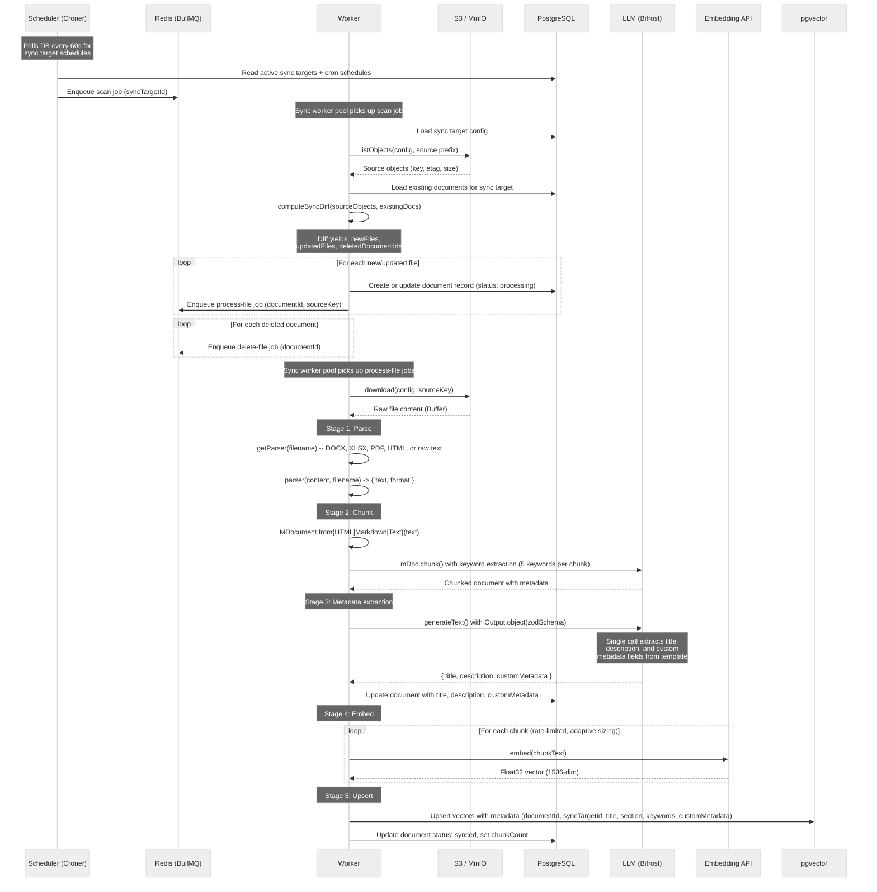
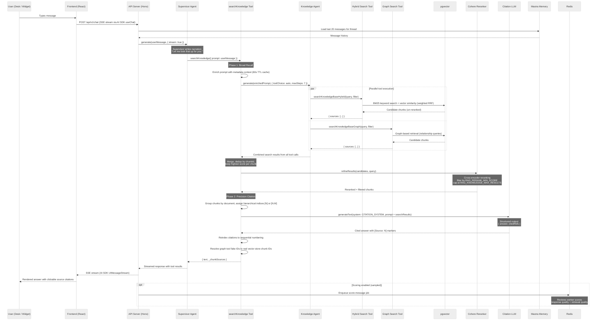

# Data Flow

This document traces two end-to-end data flows through the Typhoon system: document ingestion (how source files become searchable vector embeddings) and chat queries (how a user question becomes a cited answer).

## Document Ingestion Pipeline

Source documents flow from S3/MinIO through a multi-stage pipeline orchestrated by BullMQ jobs. The pipeline is split into two job types -- a **scan** job that diffs the source against the database and enqueues per-file jobs, and **process-file** jobs that handle the actual ingestion.

### Stage Details

**Scan** (`packages/ingestion/src/jobs/sync-scan.ts`): Triggered by the scheduler or manually from the admin UI. Lists all objects in the S3 prefix, diffs against existing document records to find new, updated (etag changed), and deleted files. Enqueues child jobs with deterministic IDs for deduplication (force-sync uses per-run salt).

**Parse** (`packages/ingestion/src/parsers/`): Format-specific parsers handle DOCX (mammoth), XLSX (SheetJS), PDF (pdf-parse), and HTML (turndown to markdown). Plain text and markdown files skip parsing. The parser registry matches by file extension.

**Chunk** (`packages/ingestion/src/pipeline.ts`): Uses Mastra's `MDocument.chunk()` with format-aware strategies (recursive text splitting for plain text, HTML-aware splitting for HTML). An extraction LLM generates 5 keywords per chunk. Chunks exceeding `EMBEDDING_MAX_CHARS` are split further via `enforceChunkSizeLimit()`.

**Metadata Extraction** (`packages/ingestion/src/pipeline.ts` -> `generateDocumentMetadata()`): A single `generateText` + `Output.object` call using a Zod schema built from `buildDocumentMetadataSchema()`. Extracts document title, description, and any custom metadata fields defined by the sync target's template. Uses up to `METADATA_EXTRACTION_MAX_CHARS` (default 8000) characters of document text. Extraction failure is fatal -- the document enters `error` status.

**Embed** (`packages/ingestion/src/pipeline.ts`): Rate-limited embedding via a module-scope `createRateLimiter` (default: 3 concurrent, 200ms interval). Adaptive chunk sizing uses a `TokenRatioTracker` to proactively split chunks that would exceed the embedding model's token limit. Supports batch embedding via `embedMany` with fallback to per-chunk `embed`.

**Upsert** (`packages/db/src/drivers/pg/`): Vectors are upserted into pgvector with rich JSONB metadata including documentId, syncTargetId, title, section, keywords, source path, and any custom metadata fields from the template. This metadata enables filtered search at query time.

**Per-stage timeouts**: parse (60s), chunk (5m), metadata (60s), embed (5m), upsert (30s). Tighter than BullMQ's lock duration so a hung stage surfaces with a clear label.

---

## Chat Query Flow

A user message flows through the supervisor agent to the knowledge agent's search tools, through reranking and citation generation, and back as a streamed SSE response.

### Query Flow Details

**Frontend** (`apps/desk/src/components/pages/chat.tsx`, `apps/widget/src/main.tsx`): Uses AI SDK v6 `DefaultChatTransport` + `useChat` hook. The `useStreamStallDetection` hook monitors for server hangs and auto-aborts after 15s of inactivity.

**API Layer** (`apps/api/src/routes/chat.ts`): Receives the chat request, loads thread context via Mastra Memory (last 20 messages), and calls the supervisor agent with streaming enabled. The response is returned as an SSE stream via `createUIMessageStreamResponse()`.

**Supervisor Agent** (`packages/agents/src/supervisor.ts`): Routes the query by calling `searchKnowledge` with the user's full message verbatim. Also calls `setThreadTitle` on the first message of a new conversation. Never splits multi-topic questions. Temperature is set to 0 for deterministic routing.

**searchKnowledge Composite Tool** (`packages/agents/src/tools/knowledge-search.ts`): Two-phase design:

1. **Broad Recall** -- Calls the knowledge agent, which dispatches to hybrid and/or graph search tools. Sub-tools return un-reranked candidates (`rerank: false`) to avoid double-reranking. The composite tool merges all results, deduplicates by chunk ID (keeping the highest score), and reranks the combined set using a Cohere cross-encoder via `refineResults()`.
2. **Precision Citation** -- Groups reranked chunks by document, assigns hierarchical display indices (`[N]` for single-chunk docs, `[N.M]` for multi-chunk), and calls a dedicated citation LLM with structured output to generate an answer with `[Source: N]` markers. Citation indices are rewritten to sequential numbering based on actually-cited references.

**Knowledge Agent** (`packages/agents/src/knowledge.ts`): Has `toolChoice: 'required'` to ensure it always searches before responding. Default behavior is to call both hybrid and graph tools in parallel for best coverage. Understands metadata filter syntax and applies filters based on conversation context and available metadata fields.

**Metadata Context Injection** (`apps/api/src/mastra/index.ts`): A `getMetadataContext()` callback queries the database for available metadata field names and values, cached with a 60-second TTL. This context is prepended to the user's prompt so the knowledge agent knows which filter fields exist and what values are valid.

**Tool Progress** (`packages/agents/src/tools/with-progress.ts`): `emitToolProgress()` writes transient `data-tool-progress` chunks into the SSE stream. The chat UI renders these as status updates under the tool call pill (e.g., "Searching the knowledge base...", "Reranking 24 combined chunks...", "Composing answer with citations...").

**Scoring** (optional): When scoring is enabled, the API enqueues a `score-message` job after each chat response. The reviews worker runs built-in scorers (Answer Relevancy, Faithfulness, Hallucination, Context Relevance, Context Precision) via BullMQ Flow fan-out.

### Key Configuration

| Parameter                          | Default                  | Description                               |
| ---------------------------------- | ------------------------ | ----------------------------------------- |
| `RAG_RERANK_MIN_SCORE`             | Configured in `@typhoon/ai` | Minimum reranker score threshold          |
| `RAG_KNOWLEDGE_MAX_RESULTS`        | Configured in `@typhoon/ai` | Max chunks after reranking                |
| `RAG_RERANK_WEIGHTS`               | Configured in `@typhoon/ai` | Cross-encoder weight configuration        |
| `METADATA_EXTRACTION_MAX_CHARS`    | 8000                     | Max document text for metadata extraction |
| `EMBEDDING_RATE_LIMIT_CONCURRENT`  | 3                        | Max concurrent embedding API calls        |
| `EMBEDDING_RATE_LIMIT_INTERVAL_MS` | 200                      | Min interval between embedding calls      |
| `EMBEDDING_BATCH_SIZE`             | 1                        | Texts per `embedMany` call                |
| Memory `lastMessages`              | 20                       | Messages loaded per thread for context    |

### Related Documentation

- [Agent Architecture](./agent-architecture.md) -- detailed agent, tool, and guardrail documentation
- [Layered Architecture](./layered-architecture.md) -- how routes, services, and repos are structured
- [Package Dependency Model](./package-dependency-model.md) -- package relationships and build order
