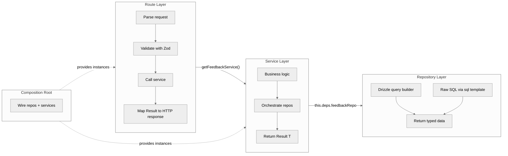
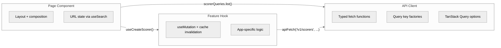

# Layered Architecture

The Typhoon backend follows a strict **Route -> Service -> Repository** pattern that separates HTTP concerns from business logic and data access. This architecture enables testability (each layer is independently mockable), reuse (services are shared between the API server and worker), and clarity (each layer has a single responsibility).

The frontend follows a parallel **Page -> Feature Hook -> API Client** pattern.

## Why This Pattern

1. **Separation of concerns** -- Routes handle HTTP parsing and response formatting. Services contain business logic. Repos encapsulate all database queries. No layer leaks into another.
2. **Testability** -- Services accept their dependencies via constructor injection, making them trivially mockable in unit tests without touching the database or network.
3. **Reuse between API and Worker** -- Services like `ScoringService` are instantiated in both `apps/api/src/services.ts` and `apps/worker/src/services.ts`, each wired with their own database connection pool.
4. **Consistency** -- Every backend app (api, worker, scheduler) follows the same folder layout, making it easy to navigate the codebase.

## Request Flow



---

## Route Layer

**Location:** `apps/api/src/routes/`

Routes are pure HTTP handlers. They parse the request, validate the body with Zod, call a service method, and return a JSON response. Routes never import from `@typhoon/db` directly -- all data access goes through services.

**Rules:**

- No Drizzle or database imports
- Use `registerApiRoute` from Mastra to define routes
- Use `errorResponse()` from `../lib/error-response` for all error responses
- Auth middleware applied per-route via `middleware: [requireAuth]`
- Use `c.get()`/`c.set()` for passing context (user, session) through middleware

**Example** (`apps/api/src/routes/feedback.ts`):

```typescript
import { registerApiRoute } from '@mastra/core/server';
import { isError } from '@typhoon/services';
import { z } from 'zod';

import { errorResponse } from '../lib/error-response';
import { requireAuth } from '../middleware/require-auth';
import { getFeedbackService } from '../services';

const upsertFeedbackSchema = z.object({
  messageId: z.string().min(1),
  rating: z.enum(['positive', 'negative']).nullable(),
  comment: z.string().nullable().optional(),
});

export const feedbackRoutes = [
  registerApiRoute('/v1/feedback', {
    method: 'POST',
    middleware: [requireAuth],
    handler: async (c) => {
      const userId = getUserId(c);
      const body = upsertFeedbackSchema.parse(await c.req.json());

      const result = await getFeedbackService().upsertFeedback({
        messageExternalId: body.messageId,
        userId,
        rating: body.rating,
        comment: body.comment,
      });

      if (isError(result)) return errorResponse(c, result);

      if ('deleted' in result.data) return c.json({ deleted: true });
      if ('_status' in result.data) {
        const { _status, ...rest } = result.data;
        return c.json(rest, 201);
      }
      return c.json(result.data);
    },
  }),
];
```

**Error mapping** (`apps/api/src/lib/error-response.ts`): The `errorResponse()` function maps service error strings to HTTP status codes using a lookup table. For example, `'not-found'` maps to 404, `'validation-failed'` to 400, `'conflict'` to 409. Unrecognized errors default to 500. Human-readable overrides provide friendly messages for terse codes.

---

## Service Layer

**Location:** `packages/services/src/`

Services contain all business logic. They accept their dependencies (repos, queues, external clients) via constructor injection through a typed `Deps` interface. Every public method returns `Result<T>` instead of throwing errors.

**Rules:**

- Constructor dependency injection via a `*Deps` interface
- Return `Result<T>` -- never throw for business errors
- Shared by API and worker (instantiated separately in each composition root)
- No HTTP concepts (no request/response objects, no status codes)

**Example** (`packages/services/src/feedback/feedback.service.ts`):

```typescript
import type { FeedbackRepo, MessageRepo, ThreadRepo } from '@typhoon/db/repos';
import type { Result } from '../types';

export interface FeedbackServiceDeps {
  feedbackRepo: FeedbackRepo;
  messageRepo: MessageRepo;
  threadRepo: ThreadRepo;
}

export class FeedbackService {
  constructor(private deps: FeedbackServiceDeps) {}

  async upsertFeedback(input: {
    messageExternalId: string;
    userId: string;
    rating: 'positive' | 'negative' | null;
    comment?: string | null;
  }): Promise<Result<{ deleted?: true } | Record<string, unknown>>> {
    const msg = await this.deps.messageRepo.findByExternalId(input.messageExternalId);
    if (!msg) return { error: 'not-found' };

    if (input.rating === null) {
      await this.deps.feedbackRepo.deleteByMessageAndUser(msg.id, input.userId);
      return { data: { deleted: true } };
    }

    const existing = await this.deps.feedbackRepo.findByMessageAndUser(msg.id, input.userId);
    if (existing) {
      const updated = await this.deps.feedbackRepo.update(existing.id, {
        rating: input.rating,
        comment: input.comment ?? null,
      });
      return { data: { ...updated, messageId: input.messageExternalId } };
    }

    const entry = await this.deps.feedbackRepo.create({
      threadId: msg.threadId,
      messageId: msg.id,
      userId: input.userId,
      rating: input.rating,
      comment: input.comment ?? null,
    });
    return { data: { ...entry, messageId: input.messageExternalId, _status: 201 } };
  }
}
```

### The `Result<T>` Pattern

Defined in `packages/services/src/types.ts`:

```typescript
export type Result<T> = { data: T } | { error: string; details?: unknown };

export function isError<T>(result: Result<T>): result is { error: string; details?: unknown } {
  return 'error' in result;
}
```

Services return either `{ data: T }` on success or `{ error: string }` on failure. The error string is a machine-readable code (e.g., `'not-found'`, `'conflict'`, `'validation-failed'`) that the route layer maps to an HTTP status code via `errorResponse()`. This avoids exception-based control flow and makes error handling explicit and testable.

The `_status` convention: When a service creates a new resource, it can include `_status: 201` in the data object. The route layer detects this and responds with HTTP 201 instead of 200, then strips the `_status` field from the response body.

### Available Services

| Service             | Purpose                                                |
| ------------------- | ------------------------------------------------------ |
| `ChatService`       | Chat session management, scoring sample rate           |
| `DashboardService`  | Aggregated dashboard statistics                        |
| `DatasetService`    | Dataset CRUD for experiments                           |
| `DocumentService`   | Document CRUD, re-sync, metadata updates               |
| `ExperimentService` | Experiment lifecycle management                        |
| `FeedbackService`   | Message feedback (thumbs up/down + comments)           |
| `MetadataService`   | Metadata field groups and templates CRUD               |
| `QueueService`      | BullMQ queue inspection and management                 |
| `ReviewService`     | Review listing and scoring status                      |
| `ScorerService`     | Scorer definition CRUD                                 |
| `ScoringService`    | Score data access for reviews and experiments          |
| `SearchService`     | Direct search (hybrid + reranking) for the search page |
| `SyncTargetService` | Sync target CRUD, manual sync triggers                 |
| `ThreadService`     | Thread listing, message hydration with chunk sources   |
| `TraceService`      | OpenTelemetry trace retrieval                          |

---

## Repository Layer

**Location:** `packages/db/src/repos/`

Repos encapsulate all database queries. They use Drizzle ORM's query builder for standard CRUD and the `sql` template tag for raw queries when complex joins or PostgreSQL-specific features are needed.

**Rules:**

- Data access only -- no business logic
- All DB queries in the entire codebase go through repos
- Use Drizzle query builder for CRUD, raw `sql` template for complex queries
- Constructor accepts the Drizzle `Db` instance

**Example** (`packages/db/src/repos/feedback.repo.ts`):

```typescript
import { and, eq } from 'drizzle-orm';
import type { Db } from '../client';
import { feedback } from '../schema/feedback';
import { messages } from '../schema/messages';

export class FeedbackRepo {
  constructor(private db: Db) {}

  async findByMessageAndUser(messageId: string, userId: string) {
    const [existing] = await this.db
      .select({ id: feedback.id })
      .from(feedback)
      .where(and(eq(feedback.messageId, messageId), eq(feedback.userId, userId)));
    return existing ?? null;
  }

  async create(data: {
    threadId: string;
    messageId: string;
    userId: string;
    rating: 'positive' | 'negative';
    comment: string | null;
  }) {
    const [entry] = await this.db.insert(feedback).values(data).returning();
    return entry;
  }

  async listByThreadAndUser(threadId: string, userId: string) {
    return this.db
      .select({
        id: feedback.id,
        messageExternalId: messages.externalId,
        rating: feedback.rating,
        comment: feedback.comment,
        createdAt: feedback.createdAt,
      })
      .from(feedback)
      .innerJoin(messages, eq(feedback.messageId, messages.id))
      .where(and(eq(feedback.threadId, threadId), eq(feedback.userId, userId)));
  }
}
```

### Available Repos

| Repo             | Table(s)                                      | Purpose                        |
| ---------------- | --------------------------------------------- | ------------------------------ |
| `DashboardRepo`  | Multiple (aggregation queries)                | Dashboard statistics           |
| `DocumentRepo`   | `documents`                                   | Document records and metadata  |
| `ExperimentRepo` | Mastra `experiments` storage                  | Experiment results             |
| `FailedJobRepo`  | `failed_jobs`                                 | Persistent failed job tracking |
| `FeedbackRepo`   | `feedback`, `messages`                        | User feedback on messages      |
| `MessageRepo`    | `messages` (Mastra)                           | Message lookup by external ID  |
| `MetadataRepo`   | `metadata_field_groups`, `metadata_templates` | Metadata schema CRUD           |
| `PartitionRepo`  | `pg_partman` tables                           | Table partition management     |
| `ReviewRepo`     | `reviews`                                     | Review records with scores     |
| `ScoreRepo`      | `scores`                                      | Individual scorer results      |
| `ScorerRepo`     | `scorer_definitions`                          | Scorer definition management   |
| `SyncJobRepo`    | `sync_jobs`                                   | Sync job records               |
| `SyncTargetRepo` | `sync_targets`                                | Sync target configuration      |
| `ThreadRepo`     | `threads` (Mastra)                            | Thread lookup and listing      |
| `TraceRepo`      | OTel trace tables                             | Trace retrieval                |

---

## Composition Roots

**Location:** `apps/*/src/services.ts`

Each backend app has a composition root that wires repos and services together. Repos are instantiated with the app's database connection, then injected into service constructors. Services are lazily created and cached.

**Example** (`apps/api/src/services.ts`, simplified):

```typescript
import { FeedbackRepo, MessageRepo, ThreadRepo } from '@typhoon/db/repos';
import { FeedbackService } from '@typhoon/services';
import { db } from './infra/db';

// Repos are instantiated with the app's DB connection
const feedbackRepo = new FeedbackRepo(db);
const messageRepo = new MessageRepo(db);
const threadRepo = new ThreadRepo(db);

// Services are lazily created and cached
let _feedbackService: FeedbackService | undefined;
export function getFeedbackService() {
  if (!_feedbackService) {
    _feedbackService = new FeedbackService({
      feedbackRepo,
      messageRepo,
      threadRepo,
    });
  }
  return _feedbackService;
}
```

**Why lazy instantiation?** Some services depend on queue connections or external clients that may not be available at import time. Lazy creation with caching ensures services are only instantiated when first used, and the same instance is reused for subsequent calls.

### App-Specific Composition Roots

| App       | File                             | Services Wired                                               |
| --------- | -------------------------------- | ------------------------------------------------------------ |
| API       | `apps/api/src/services.ts`       | All 15 services -- full CRUD, search, chat, queues           |
| Worker    | `apps/worker/src/services.ts`    | `ScoringService` only -- minimal for score processing        |
| Scheduler | `apps/scheduler/src/services.ts` | `SyncTargetRepo` only -- reads schedules, no services needed |

The worker's composition root demonstrates the pattern's flexibility -- it wires only what it needs:

```typescript
export function createWorkerServices(db: Db, sql: Sql) {
  const messageRepo = new MessageRepo(db);
  const threadRepo = new ThreadRepo(db);
  const scoreRepo = new ScoreRepo(db);
  const vectorStore = new PgVector({ id: 'typhoon-vectors', sql });

  const scoringService = new ScoringService({
    messageRepo,
    threadRepo,
    scoreRepo,
    vectorStore,
  });

  return { scoringService, vectorStore };
}
```

---

## Backend App Folder Layout

All backend apps follow a consistent structure:

```
src/
  index.ts          -- entry point (Hono server or BullMQ workers)
  services.ts       -- composition root
  infra/            -- db connection, queue setup, health checks, init
  config/           -- app-specific configuration
  [domain]/         -- core logic (routes/ for API, workers/ for worker, cron/ for scheduler)
```

---

## Frontend Architecture

The frontend follows a parallel **Page -> Feature Hook -> API Client** pattern:



**API Client** (`packages/api-client/src/`): Centralized typed API calls with TanStack Query option factories. Provides `apiFetch()` for raw requests and `queryOptions()` factories for each entity type. All query keys are defined in one place for consistent cache invalidation.

**Feature Hooks** (`apps/*/src/features/`): App-specific mutations that wrap `useMutation` with cache invalidation logic. For example, `useCreateSyncTarget()` calls `apiFetch`, then invalidates the sync targets query cache on success.

**Pages** (`apps/*/src/components/pages/`): Composition and layout only. Pages use TanStack Router's `useSearch`/`useNavigate` for URL state persistence (filters, pagination, selections). Entity creation uses dedicated pages, not dialogs.

### Related Documentation

- [Package Dependency Model](./package-dependency-model.md) -- how packages depend on each other
- [Data Flow](./data-flow.md) -- end-to-end sequence diagrams
- [Architecture Overview](./README.md) -- system-level view
