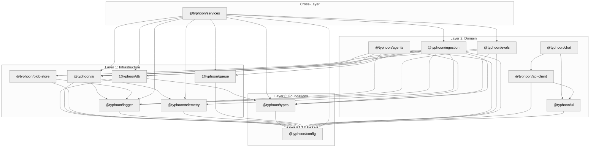

# Package Dependency Model

The Typhoon monorepo organizes its 15 internal packages into a three-layer dependency model. Higher layers import from lower layers. Circular dependencies are prohibited. Turborepo enforces build order automatically based on the dependency graph.

## Three-Layer Model

| Layer | Name           | Packages                                                   | Purpose                                                                              |
| ----- | -------------- | ---------------------------------------------------------- | ------------------------------------------------------------------------------------ |
| L0    | Foundations    | `config`, `types`                                          | Shared configuration (Zod env schemas, TypeScript configs) and domain entity schemas |
| L1    | Infrastructure | `db`, `ai`, `blob-store`, `logger`, `telemetry`, `queue`   | Infrastructure clients, adapters, and wrappers                                       |
| L2    | Domain         | `agents`, `evals`, `ingestion`, `chat`, `ui`, `api-client` | Domain logic, agent orchestration, and UI components                                 |
| --    | Cross-layer    | `services`                                                 | Business logic that imports from L0, L1, and L2                                      |

## Dependency Graph



## Rules

1. **Higher imports lower** -- L2 packages can import from L1 and L0. L1 packages can import from L0. L0 packages only import from each other (types -> config).

2. **Never reverse** -- An L0 package must never import from L1 or L2. An L1 package must never import from L2. Violations break the build and create circular dependency risk.

3. **No circular dependencies** -- If package A imports from package B, then B must not import from A (directly or transitively). Turborepo will detect and fail on cycles.

4. **`@typhoon/services` is the exception** -- The services package deliberately crosses layer boundaries, importing from L0 (config, types), L1 (db, ai, logger, telemetry, queue), and L2 (evals, ingestion). This is by design: services orchestrate domain logic that spans multiple layers. It is consumed only by app composition roots, never by other packages.

## Turborepo Build Order

Turborepo reads the `workspace:*` dependencies in each `package.json` and builds packages in topological order. A change to `@typhoon/config` triggers rebuilds of every downstream package. A change to `@typhoon/agents` only affects `@typhoon/services` and the apps that consume it.

Build order (simplified):

```
config -> types -> logger, telemetry, queue
       -> db, ai, blob-store
       -> agents, evals, ingestion, ui, api-client, chat
       -> services
       -> apps (api, worker, scheduler, desk, admin, widget)
```

## Package Details

### Layer 0: Foundations

**`@typhoon/config`** -- Shared TypeScript configurations and Zod-validated environment variable schemas. Provides `tsconfig.lib.json` (extended by packages) and `tsconfig.app.json` (extended by apps). Environment variables are never read via `process.env` directly -- always through Zod schemas defined here.

**`@typhoon/types`** -- Zod schemas for domain entities (sync targets, documents, metadata, etc.). Provides both runtime validation and TypeScript type inference via `z.infer<typeof schema>`. Includes metadata validation utilities like `validateCustomMetadata()` and `buildDocumentMetadataSchema()`.

### Layer 1: Infrastructure

**`@typhoon/db`** -- Drizzle ORM schemas, migrations, repository classes, and PostgreSQL drivers (PgVector, PostgresStore). All database queries in the codebase go through repos defined here. Drizzle schemas live in `src/schema/`, repos in `src/repos/`, drivers in `src/drivers/pg/`.

**`@typhoon/ai`** -- LLM and embedding model factories using AI SDK with OpenAI-compatible providers. Exports `createChatModel()`, `createKnowledgeModel()`, `createEmbeddingModel()`, `createCitationModel()`, `createGuardrailModel()`, `createRerankerScorer()`. Centralizes all model configuration and RAG parameters (`RAG_RERANK_MIN_SCORE`, `RAG_KNOWLEDGE_MAX_RESULTS`, etc.).

**`@typhoon/blob-store`** -- Interface-based blob storage with an `S3BlobStore` adapter. The `BlobStore` interface abstracts object storage; `createBlobStore({ provider: 's3', ... })` factory creates the adapter. Adding a new backend (GCS, Azure Blob) means implementing one adapter class.

**`@typhoon/logger`** -- Structured logging via Mastra's logger. Exports `createAppLogger('module-name')` factory -- one logger per module. Log levels: debug for flow, info for state changes, warn for 4xx, error for 5xx.

**`@typhoon/telemetry`** -- OpenTelemetry SDK with custom metrics, Hono middleware for request tracing, and a `getTracer()` factory. Exports histograms for chunk size, embedding token usage, and stage durations. Integrates with the OTEL-LGTM Grafana stack.

**`@typhoon/queue`** -- BullMQ job queue wrapper. Defines queue names, job data schemas, and connection factories for Redis. Queues: sync, reviews, scoring, experiments, reports.

### Layer 2: Domain

**`@typhoon/agents`** -- Mastra supervisor and knowledge agents with RAG tools. Exports `createSupervisor()`, `createKnowledgeAgent()`, `createExperimentAgent()`. Includes the composite `searchKnowledge` tool, hybrid/graph search tools, guardrail workflows (prompt injection, moderation, PII detection), and `emitToolProgress()` for UI updates.

**`@typhoon/evals`** -- Scorer categories (response quality, retrieval quality), scorer construction (`constructScorer`, `mapScorerRows`), and job handlers for scoring and experiments. Exports `runRagEvals()`, `prepareScoring()`, `runSingleScorer()`, `setupExperiment()`, `processExperimentItemStep1/Step2()`, `completeExperiment()`.

**`@typhoon/ingestion`** -- Document parsers (DOCX, XLSX, PDF, HTML), the `processFile` pipeline (chunk, extract metadata, embed, upsert), sync job handlers (scan, process-file, delete-file, cancel), and S3 provider. Includes rate limiting, adaptive chunk sizing, and per-stage timeouts.

**`@typhoon/chat`** -- React chat UI components for the desk and widget apps. Includes streaming markdown rendering, tool progress display, source citation rendering, and the `useStreamStallDetection` hook for detecting hung SSE connections.

**`@typhoon/ui`** -- Shared React component library built on Radix UI primitives with shadcn/ui patterns. Provides DataTable, form components, dialog/sheet, badges, and utility functions (`cn()` for class merging, `apiFetch()` for API requests). Uses CVA for component variants.

**`@typhoon/api-client`** -- Typed API client for frontend apps. Centralized query keys, TanStack Query option factories (e.g., `syncTargetQueries.list()`, `documentQueries.detail(id)`), and typed fetch functions. All frontend data fetching goes through this package.

### Cross-Layer

**`@typhoon/services`** -- Business logic services with constructor dependency injection. Each service has a typed `*Deps` interface and returns `Result<T>`. Contains 15 services covering all domain operations. Imported only by app composition roots (`apps/*/src/services.ts`), never by other packages.

## Package Naming and Configuration

- **Scope:** All packages use the `@typhoon/*` scope
- **Internal deps:** `workspace:*` protocol for all internal dependencies
- **Exports:** All packages export via `./src/index.ts` (no build step for internal consumption)
- **TypeScript:** Packages extend `@typhoon/config/tsconfig.lib.json`, apps extend `@typhoon/config/tsconfig.app.json`
- **Runtime:** Bun 1.3.14, TypeScript 6.0+ with strict mode, ESNext/bundler module resolution, verbatimModuleSyntax

### Related Documentation

- [Layered Architecture](./layered-architecture.md) -- Route, Service, Repo pattern within apps
- [Architecture Overview](./README.md) -- system-level view with all components
- [Agent Architecture](./agent-architecture.md) -- `@typhoon/agents` package in detail
