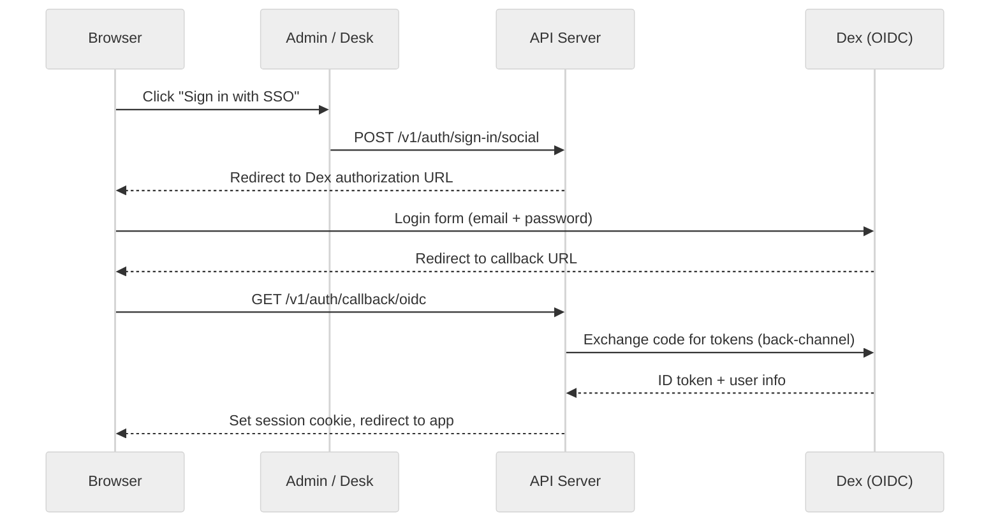

# Authentication

## Overview

Typhoon uses [Better Auth](https://www.better-auth.com/) as its authentication foundation, supporting three authentication methods for different user types.

## Authentication Methods

| Method              | Users                        | Mechanism                                                                             |
| ------------------- | ---------------------------- | ------------------------------------------------------------------------------------- |
| **OIDC**            | Reps and admins              | Browser-based SSO via Dex (dev) or Okta (prod). Session cookie issued after callback. |
| **API Keys**        | Widget deployments           | `X-API-Key` header on each request. One key per widget deployment.                    |
| **Session Cookies** | Reps and admins (after OIDC) | Database-backed sessions with Redis cookie cache.                                     |

Email/password sign-in is disabled. All human users authenticate via OIDC.

## Sub-pages

- [OIDC Flow](./oidc-flow.md) -- Provider configuration, group-to-role mapping, programmatic auth
- [RBAC](./rbac.md) -- Role definitions, auth middleware, route protection
- [API Keys](./api-keys.md) -- Widget authentication, key management
- [Session Management](./session-management.md) -- Database sessions, Redis cache, cookie configuration

## Key Files

- `apps/api/src/infra/auth.ts` -- Better Auth configuration
- `apps/api/src/middleware/require-auth.ts` -- Session validation middleware
- `apps/api/src/middleware/require-admin.ts` -- Admin role enforcement middleware
