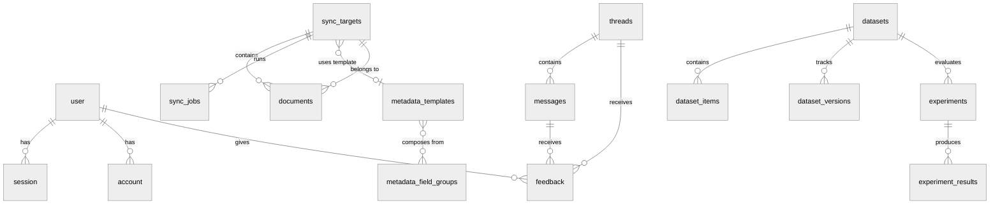

# Database

Typhoon uses **PostgreSQL 17** with the **pgvector** extension for vector similarity search. Data access follows a dual-store model:

- **Drizzle ORM** manages all custom application tables (content, auth, evaluation, metadata, observability).
- **Mastra PgStore / PgVector** manages agent-specific storage (threads, messages, resources, vector embeddings) and versioned entity tables.

Both stores share the same PostgreSQL instance and can be queried together.

## Entity-Relationship Overview

## Table Categories

| Category             | Tables                                                                                                                                                                                                                                                                                                    | Store                           |
| -------------------- | --------------------------------------------------------------------------------------------------------------------------------------------------------------------------------------------------------------------------------------------------------------------------------------------------------- | ------------------------------- |
| **Auth**             | `user`, `session`, `account`, `apikey`                                                                                                                                                                                                                                                                    | Drizzle                         |
| **Content**          | `sync_targets`, `documents`, `sync_jobs`                                                                                                                                                                                                                                                                  | Drizzle                         |
| **Conversations**    | `threads`, `messages`, `resources`                                                                                                                                                                                                                                                                        | Drizzle (Mastra-managed schema) |
| **Metadata**         | `metadata_field_groups`, `metadata_templates`                                                                                                                                                                                                                                                             | Drizzle                         |
| **Evaluation**       | `scores`, `datasets`, `dataset_items`, `dataset_versions`, `experiments`, `experiment_results`                                                                                                                                                                                                            | Drizzle                         |
| **Observability**    | `ai_spans`, `failed_jobs`                                                                                                                                                                                                                                                                                 | Drizzle                         |
| **Mastra Versioned** | `agents`, `agent_versions`, `skills`, `skill_versions`, `workspaces`, `workspace_versions`, `prompt_blocks`, `prompt_block_versions`, `scorer_definitions`, `scorer_definition_versions`, `mcp_servers`, `mcp_server_versions`, `mcp_clients`, `mcp_client_versions`, `workflow_snapshots`, `skill_blobs` | Drizzle (Mastra-managed schema) |

## Key Directories

| Path                                | Description                            |
| ----------------------------------- | -------------------------------------- |
| `packages/db/src/schema/`           | Drizzle table definitions              |
| `packages/db/src/schema/versioned/` | Mastra versioned entity schemas        |
| `packages/db/src/repos/`            | Repository classes (data access layer) |
| `packages/db/drizzle/`              | Generated migration files              |
| `packages/db/drizzle.config.ts`     | Drizzle Kit configuration              |

## Further Reading

- [Schema Reference](./schema-reference.md) -- complete column-level documentation for every table
- [Migrations](./migrations.md) -- how to generate, apply, and manage schema changes
- [Patterns](./patterns.md) -- Drizzle query patterns and repository conventions used in the project
