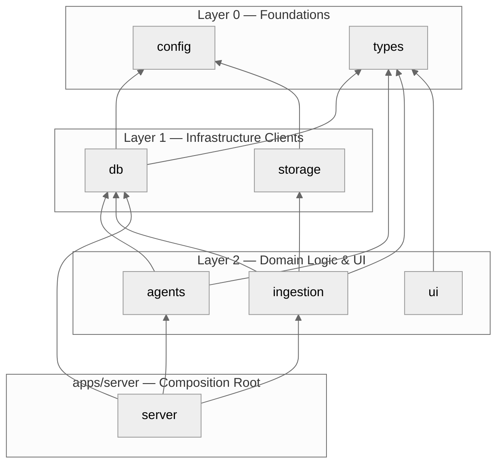
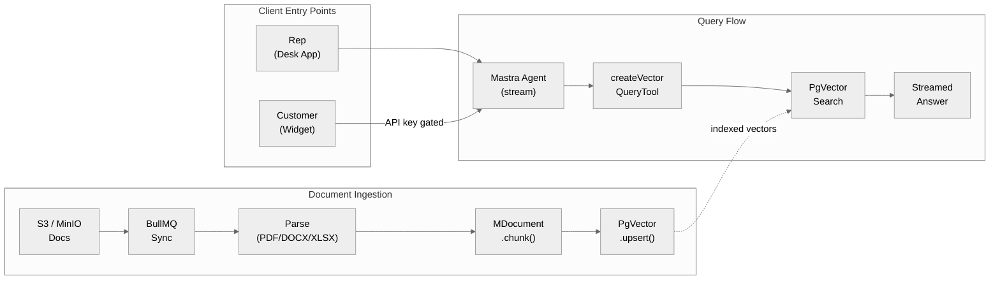
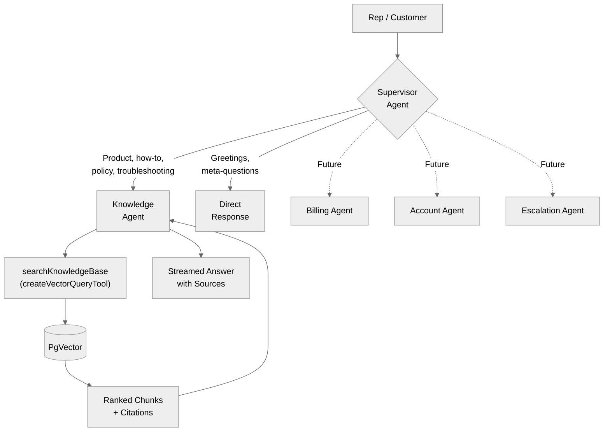
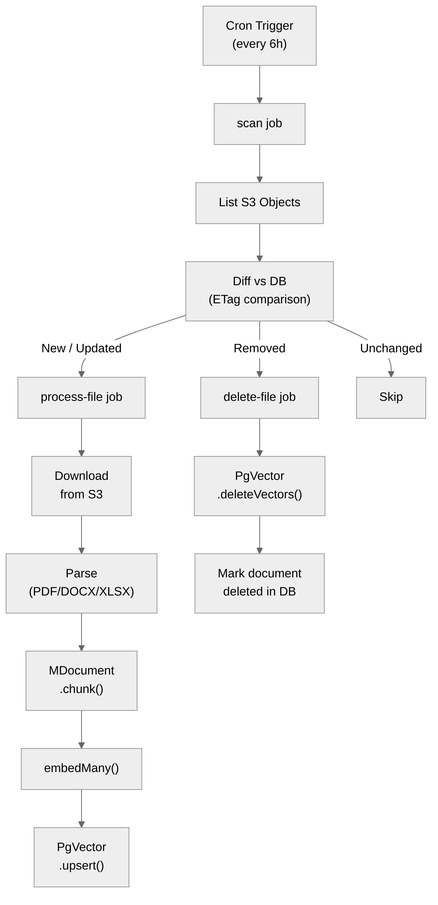
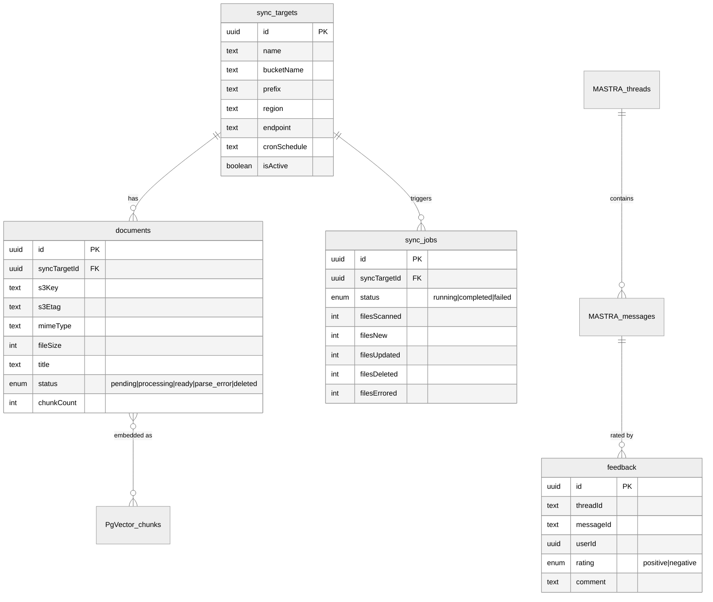
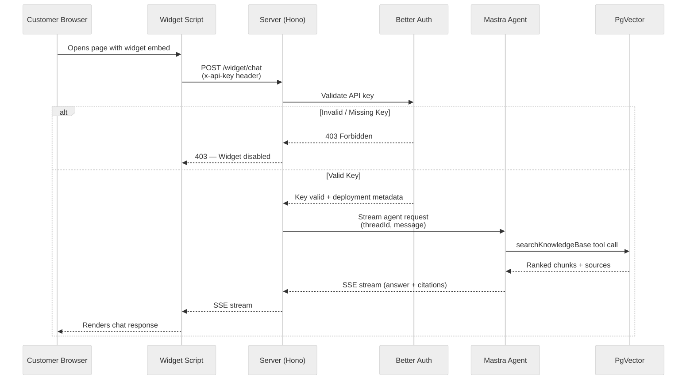

# Typhoon: AI-Powered Customer Service Chatbot — Design & Proposal

## Context

Typhoon is a **RAG-powered customer service chatbot** that answers questions from source documents stored in S3/MinIO. There is no ticket system — customers interact with a chatbot, and the chatbot retrieves answers from ingested documents.

**Deployment model:** Everything is built and deployed together. The customer-facing widget is gated behind **deployment-level API keys** — each widget deployment (e.g., "Marketing Website", "Help Center") gets its own API key. No key = widget doesn't work. Admin creates keys per deployment for tracking, rate-limiting, and revocation control.

**Architecture philosophy:** Use Mastra's built-in capabilities wherever possible. Only write custom code for gaps Mastra doesn't cover.

---

## 1. What Mastra Handles vs Custom Code

| Capability | Mastra Built-in | Custom Code Needed |
|-----------|----------------|-------------------|
| HTTP server | Built-in Hono server, auto-exposes agents | Custom routes via `registerApiRoute()` |
| Agent endpoints | Auto-generated generate/stream endpoints | - |
| Chat streaming | `handleChatStream` from `@mastra/ai-sdk` | - |
| Thread/conversation storage | `PgStore` from `@mastra/pg` | - |
| Message history | Auto-persisted by Memory | - |
| Working memory | `Memory` class with `workingMemory` option | - |
| Semantic recall | `Memory` class with `semanticRecall` + `PgVector` | - |
| Vector storage | `PgVector` from `@mastra/pg` | - |
| Vector search tool | `createVectorQueryTool()` from `@mastra/rag` | - |
| Chunking | `MDocument.chunk()` (9 strategies) | - |
| Re-ranking | `rerank()` from `@mastra/rag` | - |
| Stream data redaction | Built-in (filters system prompts, API keys) | - |
| Metadata filtering | MongoDB-style query syntax | - |
| PDF/DOCX/XLSX parsing | - | Custom parsers → `MDocument.fromText()` |
| S3 sync pipeline | - | BullMQ jobs |
| Feedback on responses | - | Custom table + routes |
| Widget API key gating | - | Better Auth API key plugin |
| Document management UI | - | Custom admin routes |
| Frontend apps | - | React apps (desk, admin, widget) |

---

## 2. Technology Stack

| Layer | Technology |
|-------|-----------|
| Runtime | Bun 1.3.11 |
| Language | TypeScript 5.9+ (strict, NodeNext) |
| Monorepo | Bun workspaces + Turborepo |
| Lint/Format | Biome v2 |
| Tests | Vitest |
| **Server** | **Mastra built-in (Hono-based)** + custom routes |
| Frontend | React 19 + Vite + TanStack Router/Query + Tailwind + shadcn/ui |
| Agent ↔ UI Protocol | AG-UI (event-based SSE) via CopilotKit headless mode |
| Frontend Observability | Custom OTel instrumentation (spans, metrics, events) |
| **Agents + RAG + Memory** | **Mastra (`@mastra/core`, `@mastra/rag`, `@mastra/memory`, `@mastra/pg`)** |
| LLM | AI SDK v6 via Mastra model router |
| ORM | Drizzle (PostgreSQL) — only for non-Mastra tables |
| Vectors | pgvector via `@mastra/pg` PgVector |
| Storage | `PgStore` from `@mastra/pg` (threads, messages, memory) |
| Files | MinIO (S3-compatible) |
| Background Jobs | BullMQ (Redis-based) |
| Cache | Redis 8 |
| Auth | Better Auth (users, sessions, RBAC, API keys). OIDC plugin → Dex (local) / Okta (prod) |
| Observability | OpenTelemetry |

---

## 3. Project Structure

```
typhoon/
├── apps/
│   ├── server/                  # Mastra instance + custom routes + BullMQ workers
│   │   └── src/
│   │       ├── index.ts         # Mastra instance (agents, storage, vector, routes)
│   │       ├── routes/          # Custom API routes via registerApiRoute
│   │       │   ├── sync-targets.ts
│   │       │   ├── documents.ts
│   │       │   ├── feedback.ts
│   │       │   └── widget.ts
│   │       └── workers.ts       # BullMQ worker startup
│   │
│   ├── desk/                    # Rep workspace (search + chat hybrid)
│   ├── admin/                   # Admin dashboard
│   └── widget/                  # Embeddable customer chat widget
│
├── packages/
│   ├── config/    (L0)          # Shared TS, Biome, env validation (Zod)
│   ├── types/     (L0)          # Zod schemas for domain entities
│   ├── db/        (L1)          # Drizzle schemas + migrations (non-Mastra tables only)
│   ├── storage/   (L1)          # S3/MinIO client
│   ├── ingestion/ (L2)          # Parsers (PDF/DOCX/XLSX) + MDocument pipeline + BullMQ sync jobs
│   │   └── src/
│   │       ├── parsers/
│   │       │   ├── registry.ts  # Parser selection by format
│   │       │   ├── pdf.ts       # PDF → text (pdf-parse-new)
│   │       │   ├── docx.ts      # DOCX → HTML (mammoth)
│   │       │   └── xlsx.ts      # XLSX → CSV text (SheetJS)
│   │       ├── pipeline.ts      # Parse → MDocument → chunk → embed → PgVector.upsert()
│   │       ├── sync.ts          # S3 listing, diffing logic
│   │       └── jobs/            # BullMQ job definitions
│   │           ├── queues.ts
│   │           ├── sync-scan.ts
│   │           ├── process-file.ts
│   │           └── delete-file.ts
│   ├── agents/    (L2)          # Mastra agent definitions + tools
│   │   └── src/
│   │       ├── supervisor.ts    # Supervisor agent definition
│   │       ├── knowledge.ts     # Knowledge agent definition
│   │       └── tools/
│   │           ├── search-kb.ts # createVectorQueryTool for KB search
│   │           └── get-context.ts
│   └── ui/        (L2)          # Shared React component library (shadcn/ui + Tailwind)
│
├── infra/
│   └── docker/                  # Docker Compose (PostgreSQL + pgvector, Redis, MinIO)
│
├── package.json                 # Root workspace config
├── turbo.json                   # Build orchestration
├── tsconfig.json                # Root TS config
└── biome.json                   # Lint/format config
```

**Layer dependency model:**



`apps/server` composes packages — it imports agents, ingestion jobs, and DB schemas, then wires them into the Mastra instance.

---

## 4. Core Flow



---

## 5. Mastra Instance Configuration

```typescript
// apps/server/src/index.ts
import { Mastra } from '@mastra/core';
import { PgStore, PgVector } from '@mastra/pg';
import { Memory } from '@mastra/memory';
import { supervisor, knowledgeAgent } from '@typhoon/agents';
import { customRoutes } from './routes';

const storage = new PgStore({
  connectionString: process.env.DATABASE_URL,
});

const vector = new PgVector({
  connectionString: process.env.DATABASE_URL,
});

const memory = new Memory({
  storage,
  vector,
  options: {
    lastMessages: 20,
    semanticRecall: {
      topK: 5,
      messageRange: 2,
    },
    workingMemory: {
      enabled: true,
      scope: 'resource',
    },
  },
});

export const mastra = new Mastra({
  agents: { supervisor, knowledgeAgent },
  storage,
  vectors: { pgVector: vector },
  server: {
    port: 4000,
    apiRoutes: customRoutes,
  },
});
```

---

## 6. Agent System (Supervisor + Knowledge Agent)

### 6.1 Supervisor Agent

```typescript
// packages/agents/src/supervisor.ts
import { Agent } from '@mastra/core/agent';

export const supervisor = new Agent({
  id: 'typhoon-supervisor',
  name: 'Typhoon Supervisor',
  model: 'anthropic/claude-sonnet-4-6',
  instructions: `You are Typhoon, an AI-powered customer service supervisor.
Route customer queries to the Knowledge Agent for answers from the knowledge base.

Available agents:
- **Knowledge Agent** — Answers questions from knowledge base documents.

Routing:
- Product questions, how-to, policy lookups, troubleshooting → Knowledge Agent
- Simple greetings or meta-questions → respond directly
- If unsure → route to Knowledge Agent`,
  agents: { knowledgeAgent },
  memory, // Mastra Memory with all tiers
});
```

### 6.2 Knowledge Agent

```typescript
// packages/agents/src/knowledge.ts
import { Agent } from '@mastra/core/agent';
import { createVectorQueryTool } from '@mastra/rag';

const searchKnowledgeBase = createVectorQueryTool({
  vectorStoreName: 'pgVector',
  indexName: 'knowledge_base',
  model: embeddingModel,
  description: 'Search the knowledge base for relevant document chunks',
});

export const knowledgeAgent = new Agent({
  id: 'knowledge',
  name: 'Knowledge Agent',
  model: 'anthropic/claude-sonnet-4-6',
  instructions: `You answer questions using ONLY information from the knowledge base.
Rules:
1. Search the knowledge base before answering
2. ALWAYS cite sources (document title + section)
3. If no relevant info found, say so clearly. Never fabricate.
4. Synthesize across multiple documents when relevant
5. Be concise — lead with the answer`,
  tools: { searchKnowledgeBase },
  memory,
});
```

### 6.3 Agent Routing



### 6.4 Future Agent Slots

Add new agents by defining them and registering with the supervisor:
- **Billing Agent** — handle billing inquiries
- **Account Agent** — password resets, account changes
- **Escalation Agent** — hand off to human

---

## 7. Document Ingestion Pipeline

### 7.1 S3 Sync (BullMQ)



### 7.2 Parsing (custom — only for formats Mastra doesn't handle)

| Format | Approach |
|--------|----------|
| PDF | `pdf-parse-new` → `MDocument.fromText()` |
| DOCX | `mammoth` → `MDocument.fromHTML()` |
| XLSX | `xlsx` (SheetJS) → `MDocument.fromText()` |
| Markdown | `MDocument.fromMarkdown()` (Mastra built-in) |
| HTML | `MDocument.fromHTML()` (Mastra built-in) |
| Plain text | `MDocument.fromText()` (Mastra built-in) |
| JSON | `MDocument.fromJSON()` (Mastra built-in) |

### 7.3 Chunking + Embedding + Storage (all Mastra)

```typescript
// packages/ingestion/src/pipeline.ts
import { MDocument } from '@mastra/rag';

async function processFile(content: string, format: string, doc: Document) {
  // 1. Create MDocument based on format
  const mDoc = format === 'html'
    ? MDocument.fromHTML(content)
    : format === 'markdown'
    ? MDocument.fromMarkdown(content)
    : MDocument.fromText(content);

  // 2. Chunk using Mastra's built-in strategies
  const chunks = await mDoc.chunk({
    strategy: format === 'markdown' ? 'markdown' : format === 'html' ? 'html' : 'recursive',
    maxSize: 512,
    overlap: 50,
  });

  // 3. Embed using Mastra's model router
  const { embeddings } = await embedMany({
    model: embeddingModel,
    values: chunks.map(c => c.text),
  });

  // 4. Upsert to PgVector (Mastra handles batching)
  await vectorStore.upsert({
    indexName: 'knowledge_base',
    vectors: embeddings,
    metadata: chunks.map((chunk, i) => ({
      text: chunk.text,
      documentId: doc.id,
      syncTargetId: doc.syncTargetId,
      source: doc.s3Key,
      title: doc.title,
      sectionHeading: chunk.metadata?.sectionHeading,
    })),
  });
}
```

---

## 8. Database Schema (Drizzle — only non-Mastra tables)

Mastra's `PgStore` handles threads, messages, and memory tables automatically. We only need Drizzle for domain-specific tables.



### `sync_targets` — S3 bucket configurations
```
id, name, bucketName, prefix, region, endpoint, cronSchedule, isActive, createdAt, updatedAt
```

### `documents` — Document metadata from S3 sync
```
id, syncTargetId, s3Key, s3Etag, mimeType, fileSize, title, author, pageCount,
status (pending|processing|ready|parse_error|deleted), errorMessage,
chunkCount, contentHash, lastSyncedAt, createdAt, updatedAt
UNIQUE(syncTargetId, s3Key)
```

### `sync_jobs` — Sync job tracking
```
id, syncTargetId, status (running|completed|failed),
filesScanned, filesNew, filesUpdated, filesDeleted, filesErrored,
errorMessage, startedAt, completedAt
```

### `feedback` — Rep feedback on AI responses
```
id, threadId, messageId, userId, rating (positive|negative), comment, createdAt
```

**Tables we DON'T need (handled by frameworks):**
- ~~conversations~~ → Mastra threads (`PgStore`)
- ~~messages~~ → Mastra messages (`PgStore`)
- ~~users~~ → Better Auth (manages user table automatically)
- ~~api_keys~~ → Better Auth API key plugin
- ~~sessions~~ → Better Auth (manages session table automatically)

---

## 9. Custom API Routes

Registered via `registerApiRoute()` in the Mastra instance. All other endpoints (agent generate/stream, memory threads/messages) are auto-generated by Mastra.

### Sync Targets (admin)
```
GET    /sync-targets               List configured S3 sources
POST   /sync-targets               Add S3 source
PATCH  /sync-targets/:id           Update config
DELETE /sync-targets/:id           Remove source
POST   /sync-targets/:id/sync      Trigger manual sync
GET    /sync-targets/:id/jobs      List sync job history
```

### Documents (read-only)
```
GET    /documents                  List documents (filterable by source, status, format)
GET    /documents/:id              Get document detail
```

### Feedback
```
POST   /feedback                   Submit feedback on an AI response
GET    /feedback                   List feedback (admin)
```

### Widget (API key gated)
```
POST   /widget/chat                Customer chat (API key auth, SSE)
GET    /widget/config              Widget branding/welcome message
```

### Auth (Better Auth — auto-mounted)
```
Better Auth handles: /api/auth/* (login, register, session, OIDC callback, API key management)
```

### Auto-generated by Mastra (no custom code needed)
```
POST   /api/agents/:agentId/generate    Agent generate
POST   /api/agents/:agentId/stream      Agent stream
GET    /api/memory/threads               List threads
POST   /api/memory/threads               Create thread
GET    /api/memory/threads/:id           Get thread
GET    /api/memory/status                Memory status
POST   /api/memory/save-messages         Save messages
GET    /api/memory/working-memory        Get working memory
PUT    /api/memory/working-memory        Update working memory
```

---

## 10. UI Design

### 10.1 Rep Workspace (`apps/desk`)

**Search + Chat hybrid** — two primary modes.

| Page | Route | Description |
|------|-------|-------------|
| Dashboard | `/` | Recent conversations, search bar |
| Chat | `/chat` | New conversation with AI. Uses `handleChatStream` + Mastra memory |
| Chat Detail | `/chat/:threadId` | Existing conversation with full history |
| Search | `/search` | Direct KB search via `createVectorQueryTool` |
| Documents | `/documents` | Browse synced documents |

**Key Components:**
- `ChatInterface` — Uses AI SDK UI hooks (`useChat`) with Mastra streaming
- `SourceCitations` — Inline citations from agent tool results
- `SearchResults` — Document chunks with relevance scores
- `FeedbackButtons` — Thumbs up/down on AI responses
- `ConversationList` — Sidebar listing Mastra threads

**Frontend integration (CopilotKit headless + AG-UI):**
```tsx
// CopilotKit provider wraps the app (AG-UI protocol handling)
<CopilotKit agentEndpoint="/api/agents/typhoon-supervisor">
  <OtelAgentProvider>  {/* Custom OTel instrumentation wrapper */}
    <App />
  </OtelAgentProvider>
</CopilotKit>

// In chat components — CopilotKit hooks for AG-UI, shadcn for UI
const { messages, sendMessage, isLoading } = useAgent({
  agentId: 'typhoon-supervisor',
  threadId,
  resourceId: userId,
});

// Custom tool renderers — show KB search results as styled cards
useRenderTool('search-knowledge-base', ({ args, result }) => (
  <SearchResultCards results={result.chunks} query={args.query} />
));
```

**OTel instrumentation (`packages/ui/src/providers/otel-agent-provider.tsx`):**
- Conversation traces: span per chat turn (threadId, agentId, duration, status)
- Tool call spans: per-tool timing and results (search-kb, get-context)
- Streaming metrics: time-to-first-token, total duration, token count
- User events: message sent, feedback submitted, citation clicked
- Error tracking: stream disconnections, agent errors
- Trace propagation: `traceparent` header connects frontend → backend spans
- All flows to Grafana/Tempo via OTel Collector

### 10.2 Admin Dashboard (`apps/admin`)

| Page | Route | Description |
|------|-------|-------------|
| Dashboard | `/` | System health, document counts, conversation volume |
| Sync Sources | `/sources` | Manage S3 bucket configs, trigger syncs |
| Sync Jobs | `/sources/:id/jobs` | View sync history |
| Documents | `/documents` | Browse all documents by status/source |
| Conversations | `/conversations` | Review rep conversations (via Mastra thread API) |
| Feedback | `/feedback` | Review positive/negative feedback |
| API Keys | `/api-keys` | Create/revoke deployment API keys for widget. Keys configured in widget `<script>` tag. Backed by Better Auth API key plugin |
| Settings | `/settings` | Branding, widget config |

### 10.3 Customer Widget (`apps/widget`)

- Embeddable `<script>` tag rendering a chat bubble
- Uses same Mastra agent via `/widget/chat` (API key auth)
- Gated by deployment-level API key — admin creates one key per deployment (e.g., "Marketing Site", "Help Center")
- Rate-limited and usage-tracked per API key/deployment



---

## 11. Background Jobs (BullMQ)

| Queue | Job | Trigger | Purpose |
|-------|-----|---------|---------|
| `sync` | `scan` | Repeatable cron (default 6h) | List S3, diff, enqueue per-file jobs |
| `sync` | `process-file` | Enqueued by scan | Download → parse → MDocument.chunk() → PgVector.upsert() |
| `sync` | `delete-file` | Enqueued by scan | PgVector.deleteVectors(), mark deleted |
| `reports` | `feedback-digest` | Cron daily 9 AM | Summarize feedback for admins |

---

## 12. Dependencies

```
Mastra (RAG, agents, memory, vectors, server):
  @mastra/core                     -- Agents, tools, MDocument, server, model router
  @mastra/memory                   -- Memory (message history, semantic recall, working memory)
  @mastra/pg                       -- PgStore (threads/messages) + PgVector (embeddings)
  @mastra/rag                      -- createVectorQueryTool, rerank, MDocument chunking
  @mastra/ai-sdk                   -- handleChatStream, toAISdkV5Messages
  @mastra/client-js                -- Client SDK for frontend integration
  ai, @ai-sdk/anthropic            -- AI SDK + LLM provider
  @ai-sdk/openai                   -- Embedding model provider

Auth:
  better-auth                      -- Users, sessions, RBAC, API keys
  # Plugins: oidc (Okta/Dex), api-key, rbac, organization

Database:
  drizzle-orm, postgres            -- Only for non-Mastra/non-auth tables
  drizzle-kit                      -- Migration tooling

Background Jobs:
  bullmq                           -- Job queue
  ioredis                          -- Redis client

S3:
  @aws-sdk/client-s3               -- S3/MinIO access

Document Parsing (only for formats Mastra doesn't handle):
  pdf-parse-new                    -- PDF text extraction
  mammoth                          -- DOCX to HTML/text
  xlsx                             -- Spreadsheet parsing

Frontend:
  react, react-dom                 -- UI framework
  vite                             -- Build tool
  @tanstack/react-router           -- Type-safe routing
  @tanstack/react-query            -- Server state
  tailwindcss                      -- Styling
  shadcn/ui                        -- Component library
  @copilotkit/react-core           -- AG-UI protocol handling (headless mode)

Observability:
  @opentelemetry/sdk-trace-web     -- Frontend OTel tracing
  @opentelemetry/api               -- OTel API

Utilities:
  zod                              -- Schema validation
  p-limit                          -- Concurrency control (embedding batching)
```

---

## 13. Implementation Phases

```mermaid
%%{init: {'theme': 'neutral'}}%%
gantt
    title Implementation Phases
    dateFormat X
    axisFormat %s

    section Phase 1 — Foundation
    Scaffold monorepo                          :p1a, 0, 1
    @typhoon/config                            :p1b, 0, 1
    @typhoon/types                             :p1c, 0, 1
    @typhoon/db (Drizzle schemas)              :p1d, after p1c, 1
    @typhoon/storage (S3 client)               :p1e, after p1b, 1
    Docker Compose (PG, Redis, MinIO)          :p1f, 0, 1

    section Phase 2 — Mastra + Ingestion
    Mastra instance (PgStore, PgVector, Memory):p2a, after p1d, 1
    @typhoon/ingestion (parsers + pipeline)    :p2b, after p2a, 2
    Custom routes (sync targets, documents)    :p2c, after p2a, 1

    section Phase 3 — Agents + Chat
    @typhoon/agents (Knowledge + Supervisor)   :p3a, after p2b, 1
    Wire agents + Memory into Mastra           :p3b, after p3a, 1
    Custom routes (feedback, widget, API keys) :p3c, after p3b, 1

    section Phase 4 — UI
    @typhoon/ui (shared components + OTel)     :p4a, after p3a, 1
    apps/desk (Rep workspace)                  :p4b, after p4a, 2
    apps/admin (Admin dashboard)               :p4c, after p4a, 2
    apps/widget (Customer chat)                :p4d, after p3c, 1
```



### Phase 1 — Foundation (Layer 0-1)
1. Scaffold monorepo: root `package.json`, `turbo.json`, `tsconfig.json`, `biome.json`
2. `@typhoon/config` — shared TS config, Biome config, env validation schemas
3. `@typhoon/types` — Zod schemas for domain entities
4. `@typhoon/db` — Drizzle schemas + migrations (sync_targets, documents, sync_jobs, feedback). Better Auth manages its own tables.
5. `@typhoon/storage` — S3/MinIO client
6. Docker Compose (PostgreSQL + pgvector, Redis, MinIO; Dex as optional profile for OIDC testing)

### Phase 2 — Mastra + Ingestion (Layer 2)
1. `apps/server` — Mastra instance: PgStore, PgVector, Memory config, PgVector index creation
2. `@typhoon/ingestion` — PDF/DOCX/XLSX parsers, MDocument pipeline, BullMQ sync jobs
3. Custom routes in `apps/server`: sync target management, document browsing

### Phase 3 — Agents + Chat
1. `@typhoon/agents` — Knowledge Agent with `createVectorQueryTool`, Supervisor Agent
2. Wire agents into Mastra instance with Memory (message history + semantic recall + working memory)
3. Verify auto-generated agent endpoints (stream/generate)
4. Custom routes: feedback, widget chat (API key gated), API key management

### Phase 4 — UI
1. `@typhoon/ui` — Shared component library (shadcn/ui) + CopilotKit headless setup + OTel agent provider
2. `apps/desk` — Rep workspace: CopilotKit sidebar (AG-UI) + search + conversation list + custom tool renderers (KB search cards, citations) + feedback
3. `apps/admin` — Sync sources, documents, conversations, feedback, API keys
4. `apps/widget` — Embeddable customer chat: CopilotKit popup (AG-UI, API key gated)

---

## 14. Verification

1. **Ingestion:** Configure S3 sync target → trigger sync → documents parsed, chunked, embedded → verify in PostgreSQL (pgvector)
2. **Search:** Rep searches "refund policy" → PgVector search returns relevant chunks with source attribution
3. **Chat:** Rep asks "How do I process a refund?" → agent searches KB → streams answer with citations → rep gives thumbs up
4. **Memory:** Start new conversation → agent remembers context within thread → semantic recall finds similar past conversations
5. **Re-sync:** Update document in S3 → trigger sync → ETag change detected → chunks re-embedded
6. **Deletion:** Delete document from S3 → sync → vectors removed, document marked deleted
7. **Widget gating:** Verify widget returns 403 with no API key → admin creates key → widget works → customer gets answer with sources
8. **Quality gates:** `tsc --noEmit`, `biome check .`, `vitest run`
