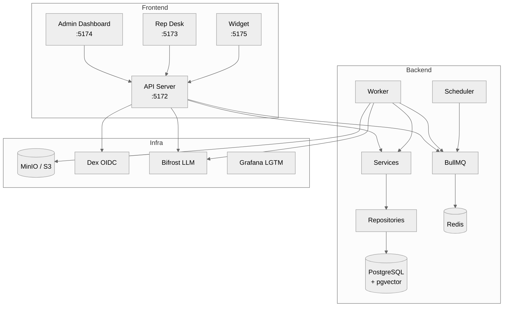

# Development Workflow

This guide covers the day-to-day development workflow for Typhoon.

## Quick Start

```bash
bun run setup    # First-time setup (install, env, docker, migrate, seed)
bun run dev      # Start all services in dev mode
```

See [Getting Started](../getting-started/README.md) for the full first-time walkthrough.

## Making Changes

The typical edit-lint-test cycle:

```bash
# 1. Make your changes in .ts/.tsx files

# 2. Format and lint
bun run format          # Auto-fix formatting with oxfmt
bun run lint            # Check lint rules with oxlint

# 3. Type check
bun run typecheck       # TypeScript strict mode across all packages

# 4. Run tests
bun run test            # Unit tests (all packages)
bun run test:watch      # Unit tests in watch mode (during active development)

# 5. If you changed packages/db schemas
bun run db:generate     # Generate Drizzle migration
bun run test:integration # Run integration tests

# 6. Verify everything passes
bun run check           # Format check + lint + typecheck in one command
bun run test            # All unit tests
```

## Architecture at a Glance



**Backend layers:** Route -> Service -> Repository

- **Routes** (`apps/api/src/routes/`) -- HTTP parsing, validation, response formatting
- **Services** (`packages/services/src/`) -- Business logic, orchestration, constructor DI
- **Repositories** (`packages/db/src/repos/`) -- All database queries, Drizzle ORM

**Frontend layers:** Page -> Feature Hook -> API Client

- **Pages** (`apps/*/src/components/pages/`) -- Composition and layout
- **Feature Hooks** (`apps/*/src/features/`) -- Mutations with cache invalidation
- **API Client** (`packages/api-client/src/`) -- Typed API calls, TanStack Query factories

## Monorepo Structure

```
typhoon/
  apps/
    api/           # Hono/Mastra API server
    admin/         # React admin dashboard
    desk/          # React rep desk
    widget/        # React customer widget
    worker/        # BullMQ worker
    scheduler/     # Cron job scheduler
  packages/
    agents/        # Mastra agent definitions
    ai/            # AI/LLM utilities
    api-client/    # Typed API client + TanStack Query
    blob-store/    # S3/MinIO abstraction
    chat/          # Chat hooks and utilities
    config/        # Shared config (env validation, tsconfig)
    db/            # Drizzle schemas, repos, migrations
    evals/         # Evaluation framework
    ingestion/     # Document parsing and embedding pipeline
    logger/        # Structured logging
    queue/         # BullMQ queue definitions
    services/      # Business logic services
    telemetry/     # OpenTelemetry instrumentation
    types/         # Shared TypeScript types
    ui/            # Radix UI components (shadcn-style)
  infra/
    docker/        # Docker Compose files
  scripts/         # Shell scripts (setup, docker, seed, etc.)
  fixtures/        # Test fixtures and seed data
  tests/           # Root-level tests (E2E, integration configs)
  docs/            # Documentation
```

## Development Servers

| Command               | What it starts             | URL(s)                |
| --------------------- | -------------------------- | --------------------- |
| `bun run dev`         | All services via Turborepo | All ports (5172-5175) |
| `bun run dev:api`     | API server only            | http://localhost:5172 |
| `bun run dev:desk`    | Rep desk only              | http://localhost:5173 |
| `bun run dev:admin`   | Admin dashboard only       | http://localhost:5174 |
| `bun run dev:widget`  | Customer widget only       | http://localhost:5175 |
| `bun run dev:worker`  | BullMQ worker only         | (no HTTP)             |
| `bun run dev:backend` | API + worker + scheduler   | http://localhost:5172 |

All `dev:*` commands start the target plus its package dependencies via Turborepo's `--filter` flag.

## Git Hooks

Lefthook runs checks at two stages:

**Pre-commit** (fast, file-scoped):

1. **format-check** -- `oxfmt --check` on staged `.ts`, `.tsx`, `.js`, `.jsx`, `.json`, `.css` files
2. **lint** -- `oxlint` on staged `.ts`, `.tsx`, `.js`, `.jsx` files

**Pre-push** (full project):

3. **typecheck** -- `bun run typecheck` (turbo per-package typecheck) across the entire project

If any check fails, the commit or push is rejected. Fix the issue and try again. See [Linting and Formatting](linting-formatting.md) for details.

## Branching Strategy

- Work on feature branches (e.g., `feature/TYPHOON-123`)
- Open pull requests against `main`
- Ensure all [quality gates](quality-gates.md) pass before requesting review

## Detailed Guides

- [Quality Gates](quality-gates.md) -- Includes test commands, coverage thresholds, and mocking patterns
- [Linting and Formatting](linting-formatting.md) -- oxlint and oxfmt configuration and usage
- [Quality Gates](quality-gates.md) -- The 7-step checklist before marking work complete
- [Conventions](conventions.md) -- Code style, naming, imports, environment variables
- [Scripts Reference](scripts.md) -- All available npm/bun scripts with descriptions
