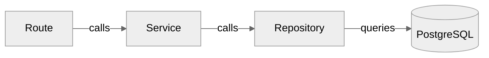

# Conventions

Code style, naming, architecture patterns, and other conventions used throughout the Typhoon codebase.

## File Naming

| Context          | Convention | Example                        |
| ---------------- | ---------- | ------------------------------ |
| Source files     | kebab-case | `sync-target-service.ts`       |
| Test files       | kebab-case | `sync-target-service.test.ts`  |
| React components | PascalCase | `SyncTargetDetail.tsx`         |
| Component tests  | PascalCase | `SyncTargetDetail.test.tsx`    |
| Config files     | kebab-case | `vitest.config.ts`             |
| Directories      | kebab-case | `sync-sources/`, `api-client/` |

## Imports

### Extensionless Imports

Use extensionless imports everywhere. The bundler (Vite / Bun) resolves extensions automatically:

```typescript
// Correct
import { SyncTargetService } from './sync-target-service';

// Incorrect
import { SyncTargetService } from './sync-target-service.js';
import { SyncTargetService } from './sync-target-service.ts';
```

### Workspace Dependencies

Internal packages use `workspace:*` protocol in `package.json`:

```json
{
  "dependencies": {
    "@typhoon/db": "workspace:*",
    "@typhoon/config": "workspace:*"
  }
}
```

### Package Exports

All packages export via `./src/index.ts` (no build step for internal consumption):

```json
{
  "exports": {
    ".": "./src/index.ts"
  }
}
```

Import from the package name, not from internal paths:

```typescript
// Correct
import { syncTargets } from '@typhoon/db';

// Incorrect (reaching into package internals)
import { syncTargets } from '@typhoon/db/src/schema/sync-targets';
```

## TypeScript

### Strict Mode

The project uses TypeScript 6.0+ with strict mode and `verbatimModuleSyntax` enabled. Shared configs live in `@typhoon/config`:

- Packages extend `tsconfig.lib.json`
- Apps extend `tsconfig.app.json`

### Avoid `any`

The `@typescript-eslint/no-explicit-any` rule is set to `error`. Use proper types instead:

```typescript
// Correct
function parse(input: string): Record<string, unknown> { ... }

// Incorrect -- lint error
function parse(input: string): any { ... }
```

In test files, `any` is allowed (the rule is turned off for `*.test.ts` and `*.test.tsx`).

## Environment Variables

### Always Use Zod Schemas

Environment variables are validated via Zod schemas in `@typhoon/config`. Never read `process.env` directly:

```typescript
// Correct -- validated config
import { config } from '@typhoon/config';
const dbUrl = config.DATABASE_URL;

// Incorrect -- unvalidated, untyped
const dbUrl = process.env.DATABASE_URL;
```

### Schema-First Pattern

Define a Zod schema first, then infer the TypeScript type:

```typescript
import { z } from 'zod';

const envSchema = z.object({
  DATABASE_URL: z.string().url(),
  REDIS_URL: z.string().url(),
  PORT: z.coerce.number().default(5172),
});

type Env = z.infer<typeof envSchema>;
```

### Request Body Validation

Validate request bodies at API boundaries:

```typescript
const createTargetSchema = z.object({
  name: z.string().min(1).max(255),
  bucket: z.string().min(1),
  prefix: z.string().optional(),
});

// In route handler
const body = createTargetSchema.parse(await c.req.json());
```

## Architecture

### Backend: Route -> Service -> Repository



**Routes** (`apps/api/src/routes/`):

- HTTP only: parse request, validate with Zod, call service, format response
- No Drizzle or database imports
- Use `errorResponse()` from `../lib/error-response` for error responses
- Auth middleware applied per-route: `middleware: [requireAuth]`

**Services** (`packages/services/src/`):

- Business logic and orchestration
- Constructor dependency injection (repos and other services injected)
- Return `Result<T>` types for error handling
- Shared by API and worker

**Repositories** (`packages/db/src/repos/`):

- Data access only -- all database queries go through repos
- Drizzle `sql` template for raw queries, Drizzle query builder for CRUD
- No business logic

**Composition roots** (`apps/*/src/services.ts`):

- Wire repos and services together per app
- One file per app that creates all instances

### Backend App Layout

All backend apps (API, worker, scheduler) follow this folder structure:

```
src/
  index.ts          # Entry point
  services.ts       # Composition root
  infra/            # Database, queue, health, initialization
  config/           # App-specific config
  [domain]/         # Core logic (routes/, workers/, cron/)
```

### Frontend: Page -> Feature Hook -> API Client

**Pages** (`apps/*/src/components/pages/`):

- Composition and layout only
- No direct API calls

**Feature Hooks** (`apps/*/src/features/`):

- App-specific mutations with cache invalidation
- Use TanStack Query mutations

**API Client** (`packages/api-client/src/`):

- Typed API calls to the backend
- Centralized query keys
- TanStack Query option factories

## React and UI

### Component Library

- **Radix UI** primitives with **shadcn/ui** patterns (see `packages/ui/src/components/ui/`)
- **CVA** (class-variance-authority) for component variants
- **`cn()`** for Tailwind class merging

### Navigation

Use TanStack Router `<Link>` for all internal navigation. Never use plain `<a href>` (causes full page reloads):

```tsx
// Correct
import { Link } from '@tanstack/react-router';
<Link to="/sync-sources/$id" params={{ id }}>View</Link>

// Incorrect -- full page reload
<a href={`/sync-sources/${id}`}>View</a>
```

### Entity Creation Pattern

Entity creation uses **dedicated pages**, not dialogs:

- List pages link to create pages (e.g., `/scorers/create`)
- Create pages redirect to detail pages on success
- Dual-mode components handle both create and edit by checking for route params

Reserve Dialog modals for:

- Destructive confirmations (AlertDialog)
- Simple inline actions only

### Page Layout

| Page type  | Max width   |
| ---------- | ----------- |
| List pages | `max-w-5xl` |
| Form pages | `max-w-5xl` |
| Dashboards | `max-w-6xl` |

Form pages use:

- Section headers: `<h2 className="text-sm font-semibold">`
- Section spacing: `pt-4`
- `Separator` before action buttons

### Form Controls

- Use Radix `Checkbox` from `@typhoon/ui` -- never raw `<input type="checkbox">`
- Use Radix `Select` from `@typhoon/ui` -- never raw `<select>`

### useEffect Dependencies

Always provide explicit `useEffect` dependencies. No suppression comments:

```typescript
// Correct
useEffect(() => {
  fetchData(id);
}, [id]);

// Incorrect -- suppressed warning
// eslint-disable-next-line react-hooks/exhaustive-deps
useEffect(() => {
  fetchData(id);
}, []);
```

## Logging

Use `createAppLogger()` from `@typhoon/logger` -- one logger per module:

```typescript
import { createAppLogger } from '@typhoon/logger';

const logger = createAppLogger('sync-target-service');

logger.debug('Starting sync', { targetId });
logger.info('Sync completed', { targetId, documentCount: 42 });
logger.warn('Rate limited', { retryAfter: 30 });
logger.error('Sync failed', { targetId, error });
```

Log level guidelines:

- `debug` -- flow and execution details
- `info` -- state changes and significant events
- `warn` -- 4xx errors, recoverable issues
- `error` -- 5xx errors, unrecoverable failures

## Server and API (Hono)

- Routes use `registerApiRoute` from Mastra, returning route arrays
- Auth middleware applied per-route via `middleware: [requireAuth]`
- Use `c.get()` / `c.set()` for passing context (user, session) through middleware

## Object Storage

Use `@typhoon/blob-store` -- interface-based with adapters:

```typescript
import { createBlobStore } from '@typhoon/blob-store';

const store = createBlobStore({ provider: 's3', ... });
await store.put('key', buffer);
const data = await store.get('key');
```

Adding a new storage backend means implementing the `BlobStore` interface in a single adapter class.

## Documentation

- **JSDoc** on all public functions (not just package entry points)
- **Avoid** `// oxlint-disable-next-line` suppressions -- fix the underlying issue
- When a suppression is truly necessary, include a clear justification comment
