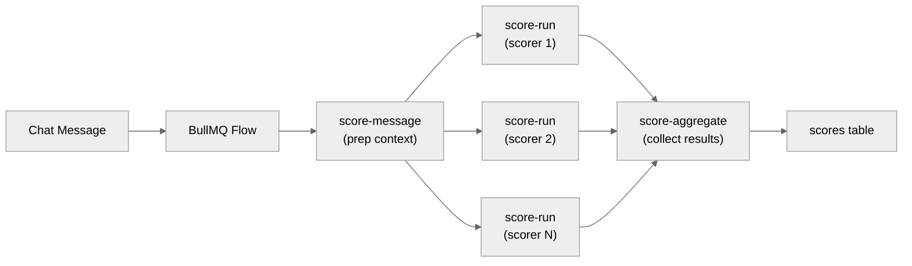

# Evaluation System

## Overview

Typhoon's evaluation system measures agent response quality through three complementary mechanisms: automated scoring (reviews), human annotation, and experiments.

## Components

### Automated Scoring (Reviews)

Triggered after each chat message. A BullMQ Flow fans out scoring to independent `score-run` jobs, one per active scorer. Results are aggregated and stored in the `scores` table.

See [Reviews](./reviews.md) for the full pipeline.

### Human Review (Annotations)

Human reviewers (admins) annotate individual assistant messages with tags and severity ratings. Annotations complement automated scores -- they capture qualitative issues that automated scorers may miss.

See [Annotations](./annotations.md) for the annotation workflow.

### Experiments

Batch evaluation of the agent against a dataset. Experiments run each dataset item through the agent, score the responses, and aggregate results for comparison.

See [Experiments](./experiments.md) for the experiment lifecycle.

## Scorer Categories

Scorers fall into two categories with different triggering behavior:

### Response Quality (always runs)

| Scorer           | Measures                                     | Scale                                        |
| ---------------- | -------------------------------------------- | -------------------------------------------- |
| Answer Relevancy | Is the answer relevant to the question?      | 0-1 (higher = better)                        |
| Faithfulness     | Is the answer grounded in retrieved context? | 0-1 (higher = better)                        |
| Hallucination    | Does the answer contain unsupported claims?  | 0-1 (higher = worse, inverted for averaging) |

These scorers run on every message, even when the agent answers without retrieving documents. Low faithfulness / high hallucination with empty context is a meaningful quality signal: the agent did not ground its response.

### Retrieval Quality (runs only when context exists)

| Scorer            | Measures                              | Scale                 |
| ----------------- | ------------------------------------- | --------------------- |
| Context Relevance | Are the retrieved documents relevant? | 0-1 (higher = better) |
| Context Precision | Are relevant documents ranked higher? | 0-1 (higher = better) |

These scorers evaluate the retrieval pipeline and require non-empty context. When no documents are retrieved, they appear as "N/A" in the UI.

## Sub-pages

- [Scorers](./scorers.md) -- Built-in and custom scorer definitions
- [Reviews](./reviews.md) -- Automated scoring pipeline
- [Experiments](./experiments.md) -- Batch evaluation lifecycle
- [Datasets](./datasets.md) -- Evaluation dataset management
- [Annotations](./annotations.md) -- Human review workflow

## Key Packages

| Package       | Purpose                                                                 |
| ------------- | ----------------------------------------------------------------------- |
| `@typhoon/evals` | Scorer categories, scorer construction, scoring/experiment job handlers |
| `@typhoon/queue` | BullMQ queue definitions for reviews, scoring, and experiments          |
