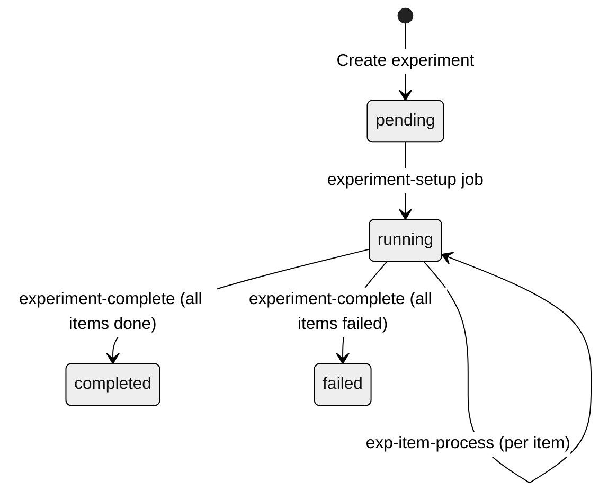

# Experiments

## Overview

Experiments provide batch evaluation of the agent against a dataset of test questions. Each dataset item is run through a lightweight experiment agent, scored by all active scorers, and aggregated into a single experiment result for comparison.

## Lifecycle



## Job Flow

Experiments use a two-level BullMQ Flow with multi-step jobs:

```
experiment-setup (experiments queue)
    |
    +-- Validate experiment (status must be 'pending')
    +-- Load dataset items
    +-- Set status to 'running'
    |
    +-- Create BullMQ Flow:
        |
        +-- exp-item-process (experiments queue, item 1)
        +-- exp-item-process (experiments queue, item 2)
        +-- exp-item-process (experiments queue, item N)
        |
        +-- experiment-complete (experiments queue)  -- waits for all children
```

### experiment-setup

1. Validates that the experiment exists and is in `pending` status.
2. Updates experiment status to `running`.
3. Loads all dataset items for the experiment's dataset version.
4. Creates a BullMQ Flow with one `exp-item-process` child per dataset item and an `experiment-complete` parent.

### exp-item-process (Multi-Step)

Each item goes through two steps using BullMQ's `moveToWaitingChildren` pattern:

**Step 1: Agent Call + Scoring Fan-out**

1. Checks if the experiment has been cancelled.
2. Extracts the question from the dataset item's input.
3. Calls the experiment agent with the question.
4. Extracts RAG context from the agent's tool call results.
5. Determines applicable scorers (retrieval scorers skipped when context is empty).
6. Adds `score-run` child jobs to the **scoring** queue (priority 5, lower than review scoring).
7. Persists intermediate state (`responseText`, `contextSkippedScorerNames`) to the job data.
8. Calls `moveToWaitingChildren()` to pause until all score-run children complete.

**Step 2: Result Collection**

1. Collects completed scores from `job.getChildrenValues()`.
2. Collects failed scorer info from `job.getFailedChildrenValues()`.
3. Includes context-skipped scorers with `score: null` and "Skipped: no retrieval context" reason.
4. Saves the experiment result (input, output, scores, ground truth).
5. Increments the atomic succeeded/failed counter on the experiment record.

### experiment-complete

1. Waits for all `exp-item-process` children (BullMQ Flow guarantee).
2. Collects aggregate results: succeeded count, failed count.
3. Sets experiment status to `completed` (or `failed` if all items failed).

## Experiment Agent

The experiment agent is a lightweight variant of the production knowledge agent:

- Uses the same `searchKnowledge` tool for RAG
- **No memory** -- each item is evaluated independently (no conversation history)
- **No guardrails** -- the agent answers freely to test raw response quality

This isolation ensures experiment scores are comparable across runs and not influenced by accumulated conversation context.

## Comparison

Experiments support side-by-side comparison of two experiment runs. The admin UI displays per-item scores from both experiments aligned by dataset item, making it easy to identify regressions or improvements when changing agent configuration, prompts, or retrieval settings.

## Concurrency and Configuration

| Variable                  | Default | Description                                   |
| ------------------------- | ------- | --------------------------------------------- |
| `EXPERIMENTS_CONCURRENCY` | `3`     | Concurrent experiment jobs per worker replica |

Experiment workers use longer timeouts than review workers:

- Lock duration: 10 minutes (vs. 5 minutes for reviews)
- Stalled interval: 5 minutes
- Max stalled count: 1

## Key Files

- `apps/worker/src/workers/experiments.worker.ts` -- experiments queue worker
- `packages/evals/src/handle-experiment-job.ts` -- `setupExperiment()`, `processExperimentItemStep1()`, `processExperimentItemStep2()`, `completeExperiment()`
- `packages/evals/src/run.ts` -- `runRagEvals()` for programmatic evaluation
- `packages/agents/src/` -- `createExperimentAgent()` factory
