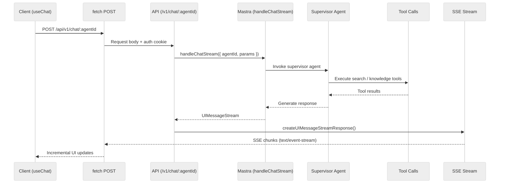

# Chat and Streaming

Typhoon uses two server-sent events (SSE) patterns: **chat streaming** for AI responses and **queue events** for real-time job status updates. Both require special server and proxy configuration for long-lived connections.

## Chat Streaming Architecture



### Server Side

The chat endpoint (`apps/api/src/routes/chat.ts`) uses two AI SDK functions:

1. **`handleChatStream()`** from `@mastra/ai-sdk` -- invokes the Mastra agent with the full conversation context, producing a `UIMessageStream`
2. **`createUIMessageStreamResponse()`** from `ai` -- wraps the stream as an SSE `Response`

```typescript
const uiMessageStream = await handleChatStream({
  mastra,
  agentId,
  version: 'v6',
  sendSources: true,
  sendReasoning: false,
  params: { ...params, requestContext, abortSignal: c.req.raw.signal },
  defaultOptions: hooks,
});

return createUIMessageStreamResponse({ stream: uiMessageStream });
```

### Client Side

- **Desk app** (`apps/desk/src/components/pages/chat.tsx`) -- uses `useChat` from AI SDK React with `DefaultChatTransport`, thread management via Mastra memory, and thread listing
- **Widget** (`apps/widget/src/main.tsx`) -- uses `useChat` with localStorage persistence for anonymous conversations

Both use the same transport mechanism: `DefaultChatTransport` sends a POST request and reads the SSE response stream.

## Queue Events (SSE)

The Admin app receives real-time BullMQ job state changes via a second SSE pattern.

### Server Side

The queue events endpoint (`apps/api/src/routes/queues.ts`) uses Hono's `streamSSE()` to push events as jobs transition between states (waiting, active, completed, failed):

```typescript
// Simplified -- actual implementation includes BullMQ event listeners
return streamSSE(c, async (stream) => {
  // Listen to BullMQ events and forward to client
  stream.writeSSE({ event: 'queue-event', data: JSON.stringify({ queue, jobId, state }) });
});
```

### Client Side

The `useQueueEvents` hook (`apps/admin/src/features/queues/use-queue-events.ts`) opens an `EventSource` connection and invalidates TanStack Query caches when events arrive:

- Queue detail queries are invalidated for the affected queue
- Sync queue events additionally invalidate document and sync target queries (documents change state during sync)
- Events are debounced per queue (200ms) to avoid refetch storms during bursts
- On reconnect after a drop, all queue-related queries are invalidated to catch missed events

This hook runs once at the authenticated layout level, so a single SSE connection covers the entire Admin app.

## SSE Infrastructure Configuration

Both SSE patterns require configuration at multiple layers to prevent premature connection termination.

### Bun Server

The Bun runtime defaults to a 10s idle timeout for connections. Typhoon raises the global ceiling to 30s and disables it entirely for SSE:

```typescript
// apps/api/src/index.ts

// /api/v1/* rewrite middleware
app.all('/api/v1/*', async (c) => {
  // Detect SSE requests by Accept header
  if (bunServer && c.req.header('accept')?.includes('text/event-stream')) {
    bunServer.timeout(c.req.raw, 0); // Disable idle timeout
  }
  // ...
});

// Server config
export default {
  port,
  idleTimeout: 30, // Global ceiling (seconds)
  // ...
};
```

The detection uses the `Accept: text/event-stream` header, so any current or future SSE endpoint is covered automatically.

### Nginx

The frontend Nginx configs (`infra/docker/nginx/*.conf`) include:

```nginx
location /api/ {
    proxy_buffering off;    # Don't buffer SSE events
    proxy_cache off;
    proxy_read_timeout 300s;  # Allow 5-minute idle connections
}
```

- `proxy_buffering off` is critical -- without it, Nginx buffers SSE events and delivers them in batches instead of immediately
- `proxy_read_timeout 300s` prevents Nginx from closing idle SSE connections (the default 60s is too short)

## Stream Stall Detection

The AI SDK's `useChat` hook has a known limitation: if the server dies mid-stream, the fetch reader (`reader.read()`) blocks indefinitely. The `status` stays `"streaming"` and the `error` callback is never invoked. There is no timeout built into the AI SDK.

The `useStreamStallDetection` hook (`packages/chat/src/hooks/use-stream-stall-detection.ts`) works around this:

1. **Tracks activity** -- monitors `messages` length and the latest message's part count
2. **Polls during streaming** -- checks every 5 seconds (`CHECK_INTERVAL_MS`) whether any activity has occurred
3. **Tool-aware dynamic timeout** -- uses 15 seconds (`STALL_TIMEOUT_MS`) when streaming text, but extends to 60 seconds (`TOOL_STALL_TIMEOUT_MS`) when a tool call is pending (message parts with `type.startsWith('tool-')` and non-terminal `state`)
4. **Auto-aborts** -- when the timeout expires with no activity, calls `stop()` and returns a stall error
5. **Explicit clear** -- `clearStallError` is called explicitly by recovery logic, not auto-cleared on message changes (because `stop()` finalizes messages which would prematurely clear the error)

### Background Recovery (Desk App)

The desk app (`apps/desk/src/components/pages/chat.tsx`) runs background recovery polling after a stall:

- Fetches the thread from the server every 5 seconds for up to 60 seconds
- If the agent completed server-side, replaces messages via `setMessages` + `clearStallError`
- The widget has inline tool-aware stall detection but no recovery (lightweight, no thread persistence)

### Thread Title via Stream Part

Thread titles are delivered to the sidebar via a dedicated `data-thread-title` stream part emitted by the `setThreadTitle` tool (`packages/agents/src/tools/set-thread-title.ts`). This provides immediate title updates without waiting for the full response to complete.

The desk app's `extractThreadTitle()` (`apps/desk/src/components/pages/chat-utils.ts`) uses two paths:

1. **Fast path** -- looks for `type === 'data-thread-title'` stream part (real-time during streaming)
2. **Fallback** -- reads the title from `tool-setThreadTitle` output state (for server-loaded historical messages)

Usage in chat components:

```typescript
const { messages, status, stop } = useChat({
  /* ... */
});

const { stallError, clearStallError } = useStreamStallDetection({ messages, status, stop });

// Display stallError in the UI if non-null
```

## Chat Configuration Context

Location: `packages/chat/src/components/chat/chat-config.tsx`

The `ChatConfigProvider` provides a React context that configures chat UI behavior across the desk app and widget. Components within the tree access it via `useChatConfig()`.

| Property          | Type                                          | Description                                               |
| ----------------- | --------------------------------------------- | --------------------------------------------------------- |
| `userName`        | `string?`                                     | Display name shown on user messages                       |
| `onFeedback`      | `(messageId, rating, comment?) => void`       | Callback for thumbs up/down feedback. `null` toggles off  |
| `feedbackState`   | `Map<string, { rating, comment? }>`           | Current feedback state per message                        |
| `onDocumentOpen`  | `(documentId, options?) => void`              | Opens the document viewer from an inline citation click   |
| `feedbackReadOnly`| `boolean?`                                    | When true, feedback is display-only (no clicks)           |
| `showDebugInfo`   | `boolean?`                                    | When true, tool call steps show expandable debug details  |

The desk app wires this to real feedback APIs and the document viewer panel. The widget provides a minimal config with no feedback or document viewer.

## Document Viewer Panel

Location: `packages/chat/src/components/document-viewer/document-viewer-panel.tsx`

A split-panel document viewer that opens when users click citations in chat. Features:

- **Progressive content loading** -- shows chunk text from the database immediately, then upgrades to full parsed content fetched from S3 via the `/v1/documents/:id/parsed-content` endpoint
- **Dual navigation modes:**
  - **Chunk mode** -- when opened from a citation, highlights the cited chunk(s) in the document and provides prev/next navigation between them. Matches chunks to DOM blocks by walking the tree and comparing text content
  - **Keyword mode** -- when search terms are present, highlights `<mark class="search-match">` elements and provides prev/next navigation
- **MutationObserver-based detection** -- both navigators use MutationObserver to detect when highlighted marks appear in the DOM (handles async rendering)
- **Smart scrolling** -- `scrollInViewport()` scrolls within the nearest Radix `ScrollArea` viewport rather than using native `scrollIntoView` (which can scroll hidden ancestors)
- **Keyboard navigation** -- F3 for next match, Shift+F3 for previous
- **Download** -- original source file download via `/v1/documents/:id/download`

Props:

| Prop             | Type                                              | Description                                       |
| ---------------- | ------------------------------------------------- | ------------------------------------------------- |
| `documentId`     | `string`                                          | Document to display                               |
| `searchTerms`    | `string[]`                                        | Keywords to highlight (keyword mode)              |
| `startIndex`     | `number?`                                         | Chunk start index for citation navigation         |
| `chunkText`      | `string?`                                         | Chunk text for citation matching                  |
| `citationChunks` | `Array<{ startIndex?, chunkText? }>?`             | Multiple citation chunks for multi-source viewing |
| `onClose`        | `() => void`                                      | Close handler                                     |

## PrefillErrorHandler

Mastra attempts to prefill the assistant message after tool calls. Bedrock and Bifrost reject this with "does not support assistant message prefill". The `PrefillErrorHandler` error processor (`packages/agents/src/supervisor.ts`) catches this error and retries by appending a `<system-reminder>continue</system-reminder>` user message (stored with `metadata.systemReminder`).

These synthetic messages must be filtered out everywhere they could appear:

| Location            | Filtering mechanism                                          |
| ------------------- | ------------------------------------------------------------ |
| Thread messages API | `isSystemReminder` check in `apps/api/src/routes/threads.ts` |
| Scoring worker      | JSONB filter in `apps/worker/src/workers/scoring.worker.ts`  |
| Chat thread UI      | Filtered in the message rendering component                  |

There is no Mastra configuration to prevent the prefill attempt -- it is a reactive error-recovery pattern.
