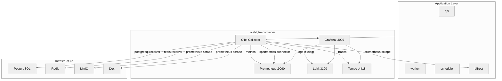

# Observability

Typhoon uses OpenTelemetry for instrumentation and a single `otel-lgtm` container that bundles Grafana, Loki, Tempo, Prometheus, and an OTel Collector for local development. In production, the same OTel instrumentation exports to an external provider -- only the `OTEL_EXPORTER_OTLP_ENDPOINT` changes.

## Architecture

## otel-lgtm Container

| Component   | Port | Purpose                           |
| ----------- | ---- | --------------------------------- |
| Grafana     | 3000 | Dashboards and exploration        |
| OTLP (gRPC) | 4317 | Trace and metric ingestion (gRPC) |
| OTLP (HTTP) | 4318 | Trace and metric ingestion (HTTP) |
| Prometheus  | 9090 | Metric storage and queries        |
| Loki        | 3100 | Log storage and queries           |
| Tempo       | 4418 | Distributed trace storage         |

The internal OTel Collector config is overridden to include all receivers, processors, and exporters needed for the full stack. No sidecar containers are required.

## Collector Configuration

The collector config at `infra/docker/otel/otel-collector-config.yaml` includes:

### Receivers

| Receiver            | Source                                               | Data type       |
| ------------------- | ---------------------------------------------------- | --------------- |
| OTLP                | api, worker, scheduler, bifrost                      | Traces, metrics |
| PostgreSQL receiver | Direct connection to `postgres:5432`                 | Metrics         |
| Redis receiver      | Direct connection to `redis:6379`                    | Metrics         |
| Prometheus scrape   | MinIO, Bifrost, Dex native `/metrics` endpoints      | Metrics         |
| filelog receiver    | Docker container logs (`/var/lib/docker/containers`) | Logs            |

### Connectors

| Connector   | Purpose                                                                 |
| ----------- | ----------------------------------------------------------------------- |
| spanmetrics | Derives Prometheus metrics from span attributes (LLM calls, queue jobs) |

The spanmetrics connector enables dashboards for LLM token usage, request duration by model, and queue job timing without any manual metric recording in application code.

### Exporters

All data stays local -- Prometheus, Loki, and Tempo exporters target `localhost` endpoints within the same container.

## Grafana Dashboards

Access Grafana at `http://localhost:3000` (admin/admin). Dashboards are organized into three folders:

### Overview

| Dashboard      | What it shows                                                                                  |
| -------------- | ---------------------------------------------------------------------------------------------- |
| Golden Signals | Service health (PostgreSQL, Redis, MinIO, Bifrost, Dex), key metrics per component, error logs |

### App

| Dashboard       | What it shows                                                                                                                                                                                                  |
| --------------- | -------------------------------------------------------------------------------------------------------------------------------------------------------------------------------------------------------------- |
| API Server      | HTTP request rate/duration/errors by route, active requests, conversations, agent traces                                                                                                                       |
| Worker (BullMQ) | Queue depth, job completed/failed/stalled rates, job duration p50/p95/p99, pipeline stage duration p95, embedding chunk size distribution, embed retries, token usage, processFile span duration, traces, logs |
| LLM Operations  | LLM call rate/duration by model (from spanmetrics), agent invocations, conversations                                                                                                                           |

### Infrastructure

| Dashboard             | Source                                                         | What it shows                                                                                        |
| --------------------- | -------------------------------------------------------------- | ---------------------------------------------------------------------------------------------------- |
| PostgreSQL            | Custom (OTel receiver metrics)                                 | Connections, cache hit ratio, transactions, row ops, dead tuples, seq scans, locks, bgwriter         |
| Redis                 | Custom (OTel receiver metrics)                                 | Memory, fragmentation, commands/s, hit rate, evictions, keys by DB, network I/O, clients             |
| MinIO (S3)            | [Grafana #13502](https://grafana.com/grafana/dashboards/13502) | Storage capacity, objects, S3 request rate/errors, TTFB, network, cluster health, drive status       |
| Bifrost (LLM Gateway) | Custom                                                         | Request rate/latency by provider/model, token usage, cost (USD), TTFT, ITL, cache hits, traces, logs |
| OTel Collector        | [Grafana #15983](https://grafana.com/grafana/dashboards/15983) | Pipeline stats, exporter queue, scrape targets, receiver/processor/exporter metrics                  |

## Trace-Log Correlation

Bidirectional correlation works automatically:

- **Log to Trace**: Structured JSON logs include `trace_id` and `span_id` fields. Loki `derivedFields` link to Tempo, so clicking a trace ID in a log line opens the trace view.
- **Trace to Log**: Tempo `tracesToLogsV2` filters Loki by trace ID when viewing a trace, showing all log lines emitted during that trace.

## Application Instrumentation

All three backend services (`api`, `worker`, `scheduler`) import `@typhoon/telemetry/instrumentation` as their first import, which auto-instruments:

| Library                                           | What it captures              |
| ------------------------------------------------- | ----------------------------- |
| `@opentelemetry/instrumentation-pg`               | PostgreSQL queries            |
| `@opentelemetry/instrumentation-ioredis`          | Redis commands                |
| `@appsignal/opentelemetry-instrumentation-bullmq` | BullMQ job publish/process    |
| `@hono/otel`                                      | HTTP requests                 |
| `@mastra/otel-bridge`                             | Mastra agent/model/tool spans |

LLM token usage, request duration, and queue job metrics are **derived from spans** by the spanmetrics connector -- not manually recorded. The only manual metric is `conversationStarted` (a business metric with no corresponding span).

See the [`@typhoon/telemetry` README](../../packages/telemetry/README.md) for implementation details.

## Configuration Files

| File                                             | Purpose                                                                                  |
| ------------------------------------------------ | ---------------------------------------------------------------------------------------- |
| `infra/docker/otel/otel-collector-config.yaml`   | Consolidated collector config: all receivers, spanmetrics connector, localhost exporters |
| `infra/docker/grafana/provisioning/datasources/` | Prometheus, Loki, Tempo datasource configs with bidirectional trace-log links            |
| `infra/docker/grafana/dashboards/`               | Dashboard JSON files organized into folders                                              |

## Production / K8s Differences

In non-dev environments:

- **OTLP endpoint**: Change `OTEL_EXPORTER_OTLP_ENDPOINT` to point to your OTel-compatible provider (Grafana Cloud, Datadog, etc.). The application instrumentation is identical.
- **filelog receiver**: Replace with your existing log forwarder (Fluent Bit, Grafana Alloy, etc.). The filelog receiver reads Docker container logs from the host filesystem, which is not available in K8s pods.
- **PostgreSQL/Redis receivers**: These can remain if the collector has network access to the databases, or be replaced with dedicated exporters in your monitoring stack.
- **spanmetrics**: The connector configuration travels with the collector config. If using a managed OTel service, replicate the spanmetrics rules or use the provider's equivalent feature.
