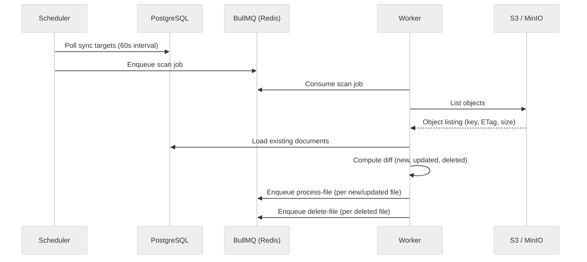

# S3 Sync Pipeline

## Overview

The sync pipeline detects changes in S3 buckets by comparing the current object listing against the `documents` table in PostgreSQL. A scheduler process polls the database every 60 seconds for sync target schedules and enqueues scan jobs into BullMQ.



## Source Registry

Sources are named credential sets registered at application startup from environment variables. Sync targets reference a source by name -- **credentials never touch the database**.

**File:** `packages/ingestion/src/source-registry.ts`

Each source has:

| Field         | Type                                | Description                                          |
| ------------- | ----------------------------------- | ---------------------------------------------------- |
| `name`        | string                              | Unique identifier (e.g., `s3-default`)               |
| `sourceType`  | string                              | Provider type (e.g., `s3`)                           |
| `credentials` | `Record<string, CredentialValue>`   | Provider-specific credentials from env vars          |
| `config`      | `Record<string, CredentialValue>`   | Provider config (e.g., `{ bucket: 'typhoon-documents' }`) |

Sources are registered in each app's startup config (`apps/*/src/config/sources.ts`):

```typescript
registerSource({
  name: 's3-default',
  sourceType: 's3',
  credentials: {
    endpoint: process.env.S3_ENDPOINT,
    region: process.env.S3_REGION ?? 'us-east-1',
    accessKey: process.env.S3_ACCESS_KEY || undefined,
    secretKey: process.env.S3_SECRET_KEY || undefined,
    forcePathStyle: process.env.S3_FORCE_PATH_STYLE !== 'false',
  },
  config: { bucket: process.env.S3_BUCKET ?? 'typhoon-documents' },
});
```

To add a new S3-compatible source (e.g., a separate bucket for a different team), add another `registerSource()` call with a unique name and its own credentials.

The `GET /v1/sources` API endpoint returns `{ name, sourceType, config }` (no credentials) so the admin UI can display source info.

## Sync Target Registry

Code-defined sync targets are validated and reconciled to the database at startup.

**File:** `packages/ingestion/src/sync-target-registry.ts`

When a sync target is registered:

1. **Schema validation** -- the full target config is parsed against `configSyncTargetSchema` (Zod)
2. **Source check** -- verifies the referenced source exists in the source registry
3. **Config validation** -- the `config` object is validated against a per-source-type Zod schema (e.g., S3 targets validate `{ prefix: string }`)
4. **Database reconciliation** -- registered targets are upserted to the `sync_targets` table with `managed_by` set to indicate they are config-managed (cannot be edited/deleted via the UI)

The server refuses to start if any registered sync target has invalid config or references an unknown source.

## Change Detection

Change detection is ETag-based. The sync scan compares every S3 object's ETag against the stored ETag in the `documents` table:

| Change Type | Condition                                                                       |
| ----------- | ------------------------------------------------------------------------------- |
| **New**     | Key exists in S3 but not in the database                                        |
| **Updated** | Key exists in both but ETags differ, or document is in `error`/`deleted` status |
| **Deleted** | Key exists in the database but not in S3 (and is not already `deleted`)         |

## BullMQ Jobs

| Job            | Queue | Trigger          | Description                                                 |
| -------------- | ----- | ---------------- | ----------------------------------------------------------- |
| `scan`         | sync  | Scheduler cron   | Lists S3 objects, diffs against DB, enqueues per-file jobs  |
| `process-file` | sync  | Enqueued by scan | Downloads file, parses, chunks, embeds, upserts to pgvector |
| `delete-file`  | sync  | Enqueued by scan | Removes vectors from pgvector, marks document as deleted    |

Each child job (`process-file`, `delete-file`) uses a deterministic job ID derived from the sync target, file key, and ETag. This provides natural deduplication -- if the same file appears in multiple concurrent scans, only one job is created.

## Cancellation Support

Sync jobs can be cancelled from the admin UI. The cancellation mechanism works as follows:

1. The admin API sets the sync job status to `cancelled` in the database.
2. Each `process-file` job checks `isSyncJobCancelled()` before expensive stages (chunk, metadata, embed, upsert).
3. If cancelled, the pipeline returns early with zero chunks, and the BullMQ job completes gracefully.

## Sync Job Tracking

Each scan creates a `sync_jobs` record that tracks aggregate statistics:

- `filesScanned` -- total files in the diff
- `filesNew` -- new files detected
- `filesUpdated` -- updated files detected
- `filesDeleted` -- deleted files detected
- `childJobsTotal` -- total child jobs enqueued

As child jobs complete, they call `incrementSyncJobCompletion()`. The last child to finish marks the sync job as `completed`.

## Search Meta Refresh

When metadata field settings (`searchable` or `searchPriority`) change, affected documents are marked `search_meta_dirty = true`. The next sync picks these up via `computeSyncDiff()` as `metaRefreshFiles` -- a separate category from new/updated/deleted.

Meta refresh files follow a lightweight path (`metaRefreshOnly` flag on `process-file`):

- No S3 download, no parsing, no chunking, no embedding
- Recomputes `_searchMeta_{A,B,C,D}` chunk metadata fields via SQL using `refreshDocumentSearchMeta()`
- Clears the `search_meta_dirty` flag

This can also be triggered directly via `POST /v1/sync-targets/:id/refresh-search-index`.

## Force Sync

A force sync re-processes all files regardless of ETag. This is useful when the parsing or chunking logic changes and all documents need to be re-ingested. When force is enabled:

- All existing files are treated as "updated" (old vectors are deleted first, then re-processed).
- Child job IDs include the sync job ID as a salt, so they do not deduplicate against normal sync jobs.

## Key Files

- `packages/ingestion/src/sync.ts` -- `computeSyncDiff()` function
- `packages/ingestion/src/jobs/sync-scan.ts` -- scan job handler
- `packages/ingestion/src/jobs/process-file.ts` -- process-file job handler
- `packages/ingestion/src/jobs/delete-file.ts` -- delete-file job handler
- `packages/ingestion/src/jobs/check-cancelled.ts` -- cancellation check
- `packages/ingestion/src/jobs/complete-sync-job.ts` -- child job completion tracking
