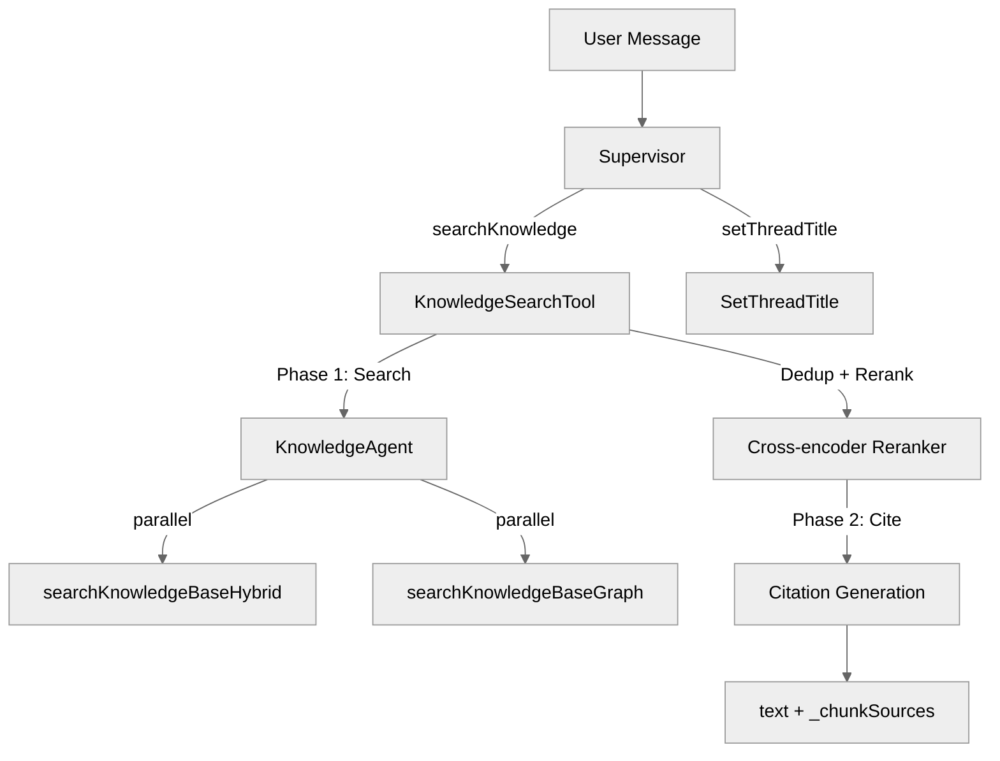

# @typhoon/agents

Multi-agent orchestration layer built on Mastra. Provides a supervisor agent that routes queries to specialized agents, with input/output guardrails for security, two-phase knowledge search with inline citations, and metadata-filtered RAG.

## Architecture Context

```
apps/api  ──>  @typhoon/agents  ──>  @typhoon/ai (model factories)
apps/worker       |                @typhoon/db (pgVector queries)
                  |                @mastra/core (Agent, tools, processors)
                  |                @mastra/rag (vector/graph/hybrid search)
                  v
           @typhoon/evals (scoring)
```

`@typhoon/agents` is the top of the AI stack. The API server (`apps/api`) wires the supervisor via the Mastra instance in `apps/api/src/mastra/index.ts`. The worker (`apps/worker`) uses `createExperimentAgent()` for evaluation runs. No other packages depend on `@typhoon/agents` directly -- it is a leaf consumed only by apps.

## Internal Structure

```
src/
  index.ts               -- Package entry point (re-exports)
  supervisor.ts           -- Supervisor agent factory + PrefillErrorHandler
  knowledge.ts            -- Knowledge agent factory (sub-agent)
  experiment-agent.ts     -- Lightweight experiment agent (no memory/guardrails)
  tools/
    knowledge-search.ts   -- Two-phase search + citation tool (composite)
    search-kb.ts          -- Vector-only search tool (Mastra createVectorQueryTool)
    search-kb-hybrid.ts   -- Hybrid keyword + vector search tool (custom)
    graph-kb.ts           -- Graph RAG search tool (Mastra createGraphRAGTool)
    set-thread-title.ts   -- Auto-generates thread title on first message
    with-progress.ts      -- Tool progress emission helpers
  guardrails/
    index.ts              -- Re-exports input + output guardrails
    input.ts              -- Input guardrail workflow (injection, moderation, PII)
    output.ts             -- Output guardrail workflow (PII, system prompt scrubbing)
```

## Exports

### Agent Factories

| Export                    | Signature                                                                       | Description                                                                              |
| ------------------------- | ------------------------------------------------------------------------------- | ---------------------------------------------------------------------------------------- |
| `createSupervisor()`      | `(memory: MastraMemory, opts?: GuardrailsConfig \| SupervisorOptions) => Agent` | Production supervisor with memory, guardrails, error processors, and metadata context    |
| `createKnowledgeAgent()`  | `(opts?: KnowledgeAgentOptions) => Agent`                                       | Knowledge base sub-agent with `toolChoice: 'required'` and `temperature: 0`              |
| `createExperimentAgent()` | `() => Agent`                                                                   | Stateless supervisor for experiment evaluation (no memory, no guardrails, no title tool) |

### Search Tools

| Export                        | Input Schema                            | Description                                                                 |
| ----------------------------- | --------------------------------------- | --------------------------------------------------------------------------- |
| `createKnowledgeSearchTool()` | `{ prompt: string }`                    | Two-phase composite: search then cite. Returns `{ text, _chunkSources }`    |
| `searchKnowledgeBase`         | Mastra vector query schema              | Pre-built vector-only search with reranking (singleton)                     |
| `searchKnowledgeBaseHybrid`   | `{ queryText, topK, filter? }`          | Pre-built hybrid keyword + vector search with reranking (singleton)         |
| `searchKnowledgeBaseGraph`    | Mastra graph query schema               | Pre-built graph RAG search with document relationship traversal (singleton) |
| `createVectorSearchTool()`    | `(opts?: { rerank?: boolean }) => Tool` | Factory for configurable vector search (rerank on/off)                      |
| `createHybridSearchTool()`    | `(opts?: { rerank?: boolean }) => Tool` | Factory for configurable hybrid search (rerank on/off)                      |

### Guardrails

| Export                     | Returns                       | Description                                                                   |
| -------------------------- | ----------------------------- | ----------------------------------------------------------------------------- |
| `createInputGuardrails()`  | `InputProcessorOrWorkflow[]`  | Token limiter (127k) + parallel prompt injection / moderation / PII redaction |
| `createOutputGuardrails()` | `OutputProcessorOrWorkflow[]` | Batch parts processor + PII redaction / system prompt scrubbing               |

### Progress Helpers

| Export               | Signature                                      | Description                                                  |
| -------------------- | ---------------------------------------------- | ------------------------------------------------------------ |
| `emitToolProgress()` | `(context, message, status?) => Promise<void>` | Emit a `data-tool-progress` chunk on the active tool stream  |
| `withProgress()`     | `(tool, { start, done? }) => Tool`             | Wrap a Mastra tool with automatic start/done progress events |

### Types

| Export                       | Description                                                                |
| ---------------------------- | -------------------------------------------------------------------------- |
| `GuardrailsConfig`           | `{ promptInjection?, moderation?, piiDetection?, systemPromptScrubbing? }` |
| `SupervisorOptions`          | `{ guardrails?, getMetadataContext? }`                                     |
| `KnowledgeAgentOptions`      | `{ memory?, rerank? }`                                                     |
| `KnowledgeSearchToolOptions` | `{ getMetadataContext? }`                                                  |
| `VectorSearchToolOptions`    | `{ rerank? }`                                                              |
| `HybridSearchToolOptions`    | `{ rerank? }`                                                              |

## Agent Architecture



## Two-Phase Knowledge Search

The `searchKnowledge` tool uses a two-phase architecture to guarantee both reliable search and inline citations:

**Phase 1 -- Search:** Calls the knowledge agent with `toolChoice: 'auto'` and `maxSteps: 7`. The knowledge agent runs both hybrid and graph search tools in parallel (or just hybrid for simple queries). Results from all tools are collected, deduplicated by `chunkId` (keeping highest score), and reranked through a cross-encoder scorer with configurable weights (`RAG_RERANK_WEIGHTS`) and minimum score threshold (`RAG_RERANK_MIN_SCORE`).

**Phase 2 -- Cite:** Takes the reranked results and makes a separate `generateText()` call with `Output.object` (structured output) to synthesize them into a response with inline `[Source: N.M]` citations. The structured output also returns `citedRefs` -- the list of actually-used references -- enabling a post-processing step that reassigns sequential display indices and strips uncited sources from `_chunkSources`.

### Citation Numbering

Sources use hierarchical numbering based on document grouping:

- Multi-chunk documents: `[Source: 1.1]`, `[Source: 1.2]` (document 1, chunks 1 and 2)
- Single-chunk documents: `[Source: 2]` (document 2)
- Multi-source claims: `[Source: 1.1, 2]`

### Graph ID Resolution

Graph search tools return numeric placeholder IDs (e.g., `"5"`, `"13"`) instead of real vector store chunk IDs. After citation generation, the tool resolves these to real IDs by matching `(documentId, startIndex)` pairs against the vector store, enabling downstream chunk hydration.

## Metadata-Filtered Search

The search tools support MongoDB-style metadata filtering to scope results to specific document subsets:

- **Hybrid search** accepts an optional `filter` parameter with operators: `$eq`, `$ne`, `$gt`, `$gte`, `$lt`, `$lte`, `$in`, `$nin`, `$regex`, `$contains`, `$and`, `$or`
- **Vector and graph search** support filtering via Mastra's `enableFilter: true`
- **Knowledge agent** auto-detects filters from conversation context and includes default/catch-all values in `$in` filters to avoid excluding general-purpose documents
- **Dynamic metadata context** is queried from the database (60s TTL cache) and injected into the knowledge agent's prompt at runtime

```typescript
// Supervisor with metadata context (API startup)
createSupervisor(memory, {
  guardrails: { promptInjection: true },
  getMetadataContext: async () => {
    // Returns 'country: US, DE, UK | state: CA, NY, TX | product_line: Pro, Basic'
    return await metadataContextCache.get();
  },
});
```

## Guardrail Pipeline

### Input Guardrails

Runs as a Mastra processor workflow before the agent sees the message:

1. **TokenLimiterProcessor** -- Truncates input to 127,000 tokens
2. **PromptInjectionDetector** -- Blocks messages with injection score > 0.7 (strategy: `block`)
3. **ModerationProcessor** -- Blocks harmful content with score > 0.5 (strategy: `block`)
4. **PIIDetector** -- Redacts PII with placeholder tokens (strategy: `redact`)

When multiple processors are enabled, steps 2-4 run in parallel. The PII-redacted result is preferred as the final output.

### Output Guardrails

Runs as a streaming processor workflow on the agent's response:

1. **FixedBatchPartsProcessor** -- Batches text-delta chunks (batch size 10) with fixes for AI SDK v6 text-delta ID tracking and non-text part ordering
2. **PIIDetector** -- Redacts PII from the response stream
3. **SystemPromptScrubber** -- Removes any leaked system prompt content

### PrefillErrorHandler

Mastra attempts assistant message prefill after tool calls. Bedrock/Bifrost rejects this. The `PrefillErrorHandler` (from `@mastra/core/processors`) catches the error and retries by appending a `<system-reminder>continue</system-reminder>` user message.

## Configuration

All model configuration is delegated to `@typhoon/ai` via factory functions:

| Factory                  | Used By                         | Purpose                            |
| ------------------------ | ------------------------------- | ---------------------------------- |
| `createChatModel()`      | Supervisor, Experiment agent    | Main conversation model            |
| `createKnowledgeModel()` | Knowledge agent                 | Search/retrieval model             |
| `createCitationModel()`  | Knowledge search tool           | Citation generation                |
| `createGuardrailModel()` | Guardrails                      | Injection/moderation/PII detection |
| `createTitleModel()`     | setThreadTitle tool             | Thread title generation            |
| `createRerankerScorer()` | Hybrid search, composite search | Cross-encoder reranker             |
| `createEmbeddingModel()` | Vector/hybrid search            | Query embedding                    |

## Dependencies

| Package        | Purpose                                           |
| -------------- | ------------------------------------------------- |
| `@typhoon/ai`     | Model factories and RAG configuration constants   |
| `@typhoon/config` | Environment variable validation                   |
| `@typhoon/db`     | `PgVector` type and `refineResults` for reranking |
| `@typhoon/logger` | Structured logging                                |
| `@typhoon/types`  | Domain type definitions                           |
| `@mastra/core` | Agent, Tool, processors, observability            |
| `@mastra/rag`  | Vector/graph tool factories, `rerankWithScorer`   |
| `ai`           | AI SDK v6 (`generateText`, `embed`, `Output`)     |
| `zod`          | Schema validation for tool I/O                    |

## Cross-References

- Architecture overview: [../../docs/architecture.md](../../docs/architecture.md)
- Agent and RAG design: [../../docs/agents-and-rag/](../../docs/agents-and-rag/)
- Ingestion pipeline (populates the knowledge base): [../../docs/ingestion-and-rag.md](../../docs/ingestion-and-rag.md)
- Evaluation and scoring: [../evals/README.md](../evals/README.md)
- AI model configuration: [../ai/](../ai/)
