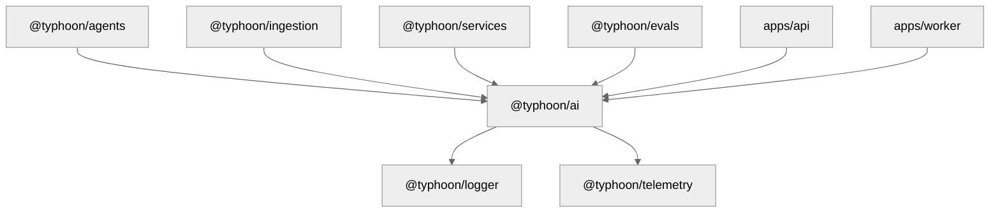

# @typhoon/ai

Centralized AI model factory. Creates task-specific LLM, embedding, and reranker model instances via an OpenAI-compatible provider (supports Bedrock, Bifrost, or any compatible gateway).

All providers include built-in retry with exponential backoff, W3C trace propagation, and request duration metrics.

## Architecture Context

`@typhoon/ai` is consumed by every package that needs to call an LLM, generate embeddings, or rerank search results. It centralizes model configuration so that environment variables, retry policies, and observability are handled in one place.



## Internal Structure

```
src/
  index.ts                          -- All model factories, RAG tuning constants, re-exports
  instrumented-fetch.ts             -- Fetch wrapper: retry, trace headers, metrics
  instrumented-fetch.test.ts        -- Tests for retry logic, trace injection, backoff
  reranker-scorer.ts                -- RerankerScorer class (Cohere-compatible gateway reranking)
  reranker-scorer.test.ts           -- Tests for batching, retry, metrics
  bedrock-reranker-scorer.ts        -- BedrockRerankerScorer class (native Bedrock Rerank API)
  bedrock-reranker-scorer.test.ts   -- Tests for batching, retry, metrics
  index.test.ts                     -- Tests for model factory functions (both modes)
```

## Exports

### Model Factories

Each factory reads from environment variables and returns a configured AI SDK model instance.

| Factory                           | Returns                                     | Model Env Var                   | Default Model                  | Purpose                                            |
| --------------------------------- | ------------------------------------------- | ------------------------------- | ------------------------------ | -------------------------------------------------- |
| `createChatModel(modelId?)`       | `LanguageModelV1`                           | `LLM_CHAT_MODEL`                | `anthropic.claude-sonnet-4-6`  | Primary agent conversations                        |
| `createTitleModel()`              | `LanguageModelV1`                           | `LLM_TITLE_MODEL`               | Falls back to chat model       | Title/summary generation                           |
| `createMetadataExtractionModel()` | `LanguageModelV1`                           | `LLM_METADATA_EXTRACTION_MODEL` | Falls back to chat model       | Document metadata extraction during ingestion      |
| `createGuardrailModel()`          | `LanguageModelV1`                           | `LLM_GUARDRAIL_MODEL`           | Falls back to chat model       | Moderation, PII detection, prompt injection checks |
| `createKnowledgeModel()`          | `LanguageModelV1`                           | `LLM_KNOWLEDGE_MODEL`           | Falls back to chat model       | Knowledge agent search tool routing                |
| `createCitationModel()`           | `LanguageModelV1`                           | `LLM_CITATION_MODEL`            | Falls back to chat model       | Citation generation from search results            |
| `createScoringModel(modelId?)`    | `LanguageModelV1`                           | `LLM_SCORING_MODEL`             | Falls back to chat model       | RAG scoring and evaluation                         |
| `createEmbeddingModel(modelId?)`  | `EmbeddingModelV1`                          | `EMBEDDING_MODEL`               | `amazon.titan-embed-text-v2:0` | Vector embedding generation                        |
| `createRerankerScorer()`          | `RerankerScorer` or `BedrockRerankerScorer` | `RERANKER_MODEL`                | --                             | Reranking (gateway or direct Bedrock)              |

### Constants

| Export                          | Default | Env Var                         | Description                                                  |
| ------------------------------- | ------- | ------------------------------- | ------------------------------------------------------------ |
| `EMBEDDING_DIMENSION`           | `1024`  | `EMBEDDING_DIMENSION`           | Vector dimension for pgvector indexes                        |
| `EMBEDDING_MAX_TOKENS`          | `8192`  | `EMBEDDING_MAX_TOKENS`          | Max input tokens for embedding model                         |
| `EMBEDDING_MAX_CHARS`           | `2000`  | `EMBEDDING_MAX_CHARS`           | Max input characters for embedding model                     |
| `METADATA_EXTRACTION_MAX_CHARS` | `8000`  | `METADATA_EXTRACTION_MAX_CHARS` | Max chars of parsed text sent to LLM for metadata extraction |

### RAG Tuning Constants

All configurable via environment variables (see `@typhoon/config` `ragSchema`):

| Export                           | Default                                     | Env Var                          | Description                                        |
| -------------------------------- | ------------------------------------------- | -------------------------------- | -------------------------------------------------- |
| `RAG_RERANK_WEIGHT_SEMANTIC`     | `1.0`                                       | `RAG_RERANK_WEIGHT_SEMANTIC`     | Reranker weight for semantic (Cohere) score        |
| `RAG_RERANK_WEIGHT_VECTOR`       | `0`                                         | `RAG_RERANK_WEIGHT_VECTOR`       | Reranker weight for original vector/RRF score      |
| `RAG_RERANK_WEIGHT_POSITION`     | `0`                                         | `RAG_RERANK_WEIGHT_POSITION`     | Reranker weight for positional rank score          |
| `RAG_RERANK_WEIGHTS`             | `{ semantic: 1.0, vector: 0, position: 0 }` | --                               | Convenience object for Mastra's `rerankWithScorer` |
| `RAG_RERANK_MIN_SCORE`           | `0.1`                                       | `RAG_RERANK_MIN_SCORE`           | Minimum reranker score to keep a result            |
| `RAG_VECTOR_MIN_SCORE`           | `0.6`                                       | `RAG_VECTOR_MIN_SCORE`           | Minimum vector similarity for API search           |
| `RAG_VECTOR_MIN_SCORE_AGENT`     | `0.5`                                       | `RAG_VECTOR_MIN_SCORE_AGENT`     | Minimum vector similarity for agent tool           |
| `RAG_GRAPH_THRESHOLD`            | `0.7`                                       | `RAG_GRAPH_THRESHOLD`            | Graph RAG similarity threshold                     |
| `RAG_KNOWLEDGE_MAX_RESULTS`      | `10`                                        | `RAG_KNOWLEDGE_MAX_RESULTS`      | Max results from knowledge search tool             |
| `RAG_RERANK_CANDIDATES`          | `100`                                       | `RAG_RERANK_CANDIDATES`          | Initial candidate pool size for reranking          |
| `RAG_RERANK_CANDIDATES_EXPANDED` | `200`                                       | `RAG_RERANK_CANDIDATES_EXPANDED` | Expanded pool for deep/thorough search mode        |

### Instrumented Fetch

| Export                          | Description                                                                                                                                                               |
| ------------------------------- | ------------------------------------------------------------------------------------------------------------------------------------------------------------------------- |
| `createInstrumentedFetch(opts)` | Returns a `fetch` function with retry, W3C trace header injection, and request duration metrics. Designed to be passed as the `fetch` option to `createOpenAICompatible`. |

### Reranker Scorers

Both implementations expose the same `RelevanceScoreProvider` interface and identical auto-batching behavior. The `createRerankerScorer()` factory selects the implementation based on the environment.

| Export                  | Mode           | Description                                                                                                                  |
| ----------------------- | -------------- | ---------------------------------------------------------------------------------------------------------------------------- |
| `RerankerScorer`        | Gateway        | Calls a Cohere-compatible `/rerank` endpoint (e.g. Bifrost). Used when `RERANKER_BASE_URL` is set.                           |
| `BedrockRerankerScorer` | Direct Bedrock | Calls the native AWS Bedrock Rerank API via `@aws-sdk/client-bedrock-agent-runtime`. Used when `RERANKER_BASE_URL` is unset. |

Both scorers provide:

- **Auto-batching**: Multiple `getRelevanceScore()` calls within the same microtask are batched into one API request
- **Retry with backoff**: Exponential backoff on transient errors (configurable per-provider)
- **Per-query metrics**: `getMetrics(query)` returns duration, document count, top score, and billed units
- **Trace context**: `RerankerScorer` injects W3C `traceparent`; `BedrockRerankerScorer` captures `x-amzn-requestid` into the active OTel span

## Provider Modes

All model factories support two modes, selected automatically based on environment variables:

| Mode               | When active                   | Provider                                   | Credentials                           |
| ------------------ | ----------------------------- | ------------------------------------------ | ------------------------------------- |
| **Gateway**        | `LLM_BASE_URL` is set         | `@ai-sdk/openai-compatible` (e.g. Bifrost) | `LLM_API_KEY`                         |
| **Direct Bedrock** | `LLM_BASE_URL` is **not** set | `@ai-sdk/amazon-bedrock` (native SDK)      | AWS credential chain (IRSA, env vars) |

Same pattern for embeddings (`EMBEDDING_BASE_URL`) and reranking (`RERANKER_BASE_URL`).

In direct Bedrock mode, the shared provider singleton uses `fromNodeProviderChain()` from `@aws-sdk/credential-providers`, which supports IRSA (EKS), instance profiles (EC2), environment variables, and `~/.aws/credentials` -- with automatic token refresh.

See [AWS Bedrock documentation](../../docs/infrastructure/aws-bedrock.md) for production setup.

## Environment Variables

### Model Configuration

| Variable                        | Default                        | Description                                                         |
| ------------------------------- | ------------------------------ | ------------------------------------------------------------------- |
| `LLM_BASE_URL`                  | --                             | Gateway endpoint. When unset, uses direct Bedrock                   |
| `LLM_API_KEY`                   | --                             | Gateway API key. Only needed when `LLM_BASE_URL` is set             |
| `AWS_REGION`                    | `us-east-1`                    | AWS region for direct Bedrock mode                                  |
| `LLM_CHAT_MODEL`                | `anthropic.claude-sonnet-4-6`  | Primary chat model ID                                               |
| `LLM_TITLE_MODEL`               | Falls back to chat model       | Title generation model                                              |
| `LLM_METADATA_EXTRACTION_MODEL` | Falls back to chat model       | Metadata extraction model                                           |
| `LLM_GUARDRAIL_MODEL`           | Falls back to chat model       | Guardrail model                                                     |
| `LLM_KNOWLEDGE_MODEL`           | Falls back to chat model       | Knowledge agent model                                               |
| `LLM_CITATION_MODEL`            | Falls back to chat model       | Citation generation model                                           |
| `LLM_SCORING_MODEL`             | Falls back to chat model       | RAG scoring / evaluation model                                      |
| `RERANKER_BASE_URL`             | --                             | Gateway rerank endpoint. When unset, uses direct Bedrock Rerank API |
| `RERANKER_MODEL`                | --                             | Model ID (gateway) or full ARN (direct Bedrock)                     |
| `RERANKER_API_KEY`              | Falls back to `LLM_API_KEY`    | Rerank API key (gateway mode only)                                  |
| `RERANKER_TIMEOUT_MS`           | `15000`                        | Per-request timeout for rerank endpoint (gateway mode only)         |
| `EMBEDDING_BASE_URL`            | --                             | Gateway embedding endpoint. When unset, uses direct Bedrock         |
| `EMBEDDING_API_KEY`             | Falls back to `LLM_API_KEY`    | Embedding API key (gateway mode only)                               |
| `EMBEDDING_MODEL`               | `amazon.titan-embed-text-v2:0` | Embedding model ID                                                  |
| `EMBEDDING_DIMENSION`           | `1024`                         | Vector dimension                                                    |

### Retry Configuration

All providers share common retry defaults. Per-provider overrides fall back to the `LLM_*` values when not set.

| Variable                       | Default                  | Description                                          |
| ------------------------------ | ------------------------ | ---------------------------------------------------- |
| `LLM_MAX_RETRIES`              | `3`                      | Common max retry attempts (429, 5xx, network errors) |
| `LLM_RETRY_DELAY_MS`           | `500`                    | Common initial retry delay                           |
| `LLM_RETRY_MAX_DELAY_MS`       | `10000`                  | Common max retry delay (backoff cap)                 |
| `EMBEDDING_MAX_RETRIES`        | `LLM_MAX_RETRIES`        | Embedding-specific override                          |
| `EMBEDDING_RETRY_DELAY_MS`     | `LLM_RETRY_DELAY_MS`     | Embedding-specific override                          |
| `EMBEDDING_RETRY_MAX_DELAY_MS` | `LLM_RETRY_MAX_DELAY_MS` | Embedding-specific override                          |
| `RERANKER_MAX_RETRIES`         | `LLM_MAX_RETRIES`        | Reranker-specific override                           |
| `RERANKER_RETRY_DELAY_MS`      | `LLM_RETRY_DELAY_MS`     | Reranker-specific override                           |
| `RERANKER_RETRY_MAX_DELAY_MS`  | `LLM_RETRY_MAX_DELAY_MS` | Reranker-specific override                           |

### Retry Behavior

- **Retries on:** 429 (rate limit), 500, 502, 503, 504, network errors (DNS, connection refused)
- **Does NOT retry on:** 400, 401, 403, 404 (client errors are terminal)
- **Backoff:** Exponential with +/-25% jitter, capped at max delay
- **Retry-After:** Respects the header when present (seconds or HTTP-date format)
- **Trace propagation:** Injects W3C `traceparent` header on every request
- **Request ID capture:** Reads `x-amzn-requestid`, `x-request-id`, or `x-amzn-trace-id` from response and attaches to the active OTel span
- **Metrics:** Records `llm.request.duration` (histogram) and `llm.request.retries` (counter with attempt + status attributes)

## Usage Examples

### Agent conversation model

```typescript
import { createChatModel } from '@typhoon/ai';

const model = createChatModel();
// Pass to Mastra agent or AI SDK generateText/streamText
```

### Embedding generation

```typescript
import { createEmbeddingModel, EMBEDDING_DIMENSION } from '@typhoon/ai';

const embeddingModel = createEmbeddingModel();
// EMBEDDING_DIMENSION is used when creating pgvector indexes
```

### Reranking search results

```typescript
import { createRerankerScorer, RAG_RERANK_WEIGHTS, RAG_RERANK_MIN_SCORE } from '@typhoon/ai';
import { rerankWithScorer } from '@mastra/rag';

const scorer = createRerankerScorer();
const reranked = await rerankWithScorer(results, query, scorer, {
  weights: RAG_RERANK_WEIGHTS,
  topK: 10,
});

// Access metrics after reranking
const metrics = scorer.getMetrics(query);
```

### Custom model for a specific task

```typescript
import { createScoringModel } from '@typhoon/ai';

// Use a specific model ID, overriding LLM_SCORING_MODEL
const model = createScoringModel('anthropic.claude-haiku-4');
```

## Dependencies

| Package                                 | Purpose                                                   |
| --------------------------------------- | --------------------------------------------------------- |
| `@ai-sdk/amazon-bedrock`                | Native Bedrock provider for direct mode                   |
| `@ai-sdk/openai-compatible`             | OpenAI-compatible provider for gateway mode               |
| `@aws-sdk/client-bedrock-agent-runtime` | Native Bedrock Rerank API for `BedrockRerankerScorer`     |
| `@aws-sdk/credential-providers`         | `fromNodeProviderChain()` for IRSA/instance profile creds |
| `@mastra/core`                          | `RelevanceScoreProvider` interface for reranker           |
| `@opentelemetry/api`                    | Trace context for W3C header injection                    |
| `@typhoon/logger`                          | Structured logging for retry/error events                 |
| `@typhoon/telemetry`                       | Request duration and retry count metrics                  |
| `ai`                                    | AI SDK v6 type definitions                                |

## Cross-References

- [Ingestion and RAG documentation](../../docs/ingestion-and-rag.md)
- [Environment variables reference](../../docs/environment-variables.md)
- [Architecture overview](../../docs/architecture.md)
