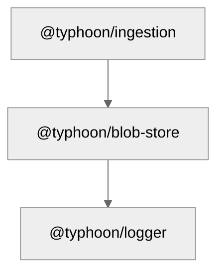

# @typhoon/blob-store

Interface-based object/blob storage for Typhoon. Supports multiple backends via the adapter pattern. Currently ships with an S3-compatible adapter that works with AWS S3, MinIO, and other S3-compatible services.

## Architecture Context

`@typhoon/blob-store` is consumed by `@typhoon/ingestion` for downloading source documents from S3/MinIO during the document sync pipeline. It abstracts the storage backend so that the ingestion logic is provider-agnostic.



## Internal Structure

```
src/
  index.ts                -- Package entry: re-exports types, factory, and S3 adapter
  types.ts                -- BlobStore interface, BlobObject, ListResult types
  factory.ts              -- createBlobStore() factory with provider switch
  factory.test.ts         -- Factory tests
  adapters/
    s3.ts                 -- S3BlobStore implementation (AWS SDK v3)
    s3.test.ts            -- S3 adapter unit tests
```

## Interface

The `BlobStore` interface defines all operations. Adapters must implement every method.

```typescript
interface BlobStore {
  /**
   * List all objects under a prefix (recursive, paginated internally).
   * @param prefix - Key prefix to filter by (e.g., "documents/")
   * @returns Array of BlobObject metadata (key, etag, lastModified, size)
   */
  list(prefix: string): Promise<BlobObject[]>;

  /**
   * List one level of hierarchy at a prefix -- folders + objects.
   * Uses "/" as delimiter. Folders appear in result.folders, direct
   * child objects appear in result.objects.
   * @param prefix - Key prefix (e.g., "documents/")
   * @returns { folders: string[], objects: BlobObject[] }
   */
  listByPrefix(prefix: string): Promise<ListResult>;

  /**
   * Download an object's content by key.
   * @param key - Full object key (e.g., "documents/report.pdf")
   * @returns Buffer containing the object's bytes
   */
  download(key: string): Promise<Buffer>;

  /**
   * Upload content to a key. Overwrites if the key already exists.
   * @param key - Destination key
   * @param body - Content as Buffer, Uint8Array, or string
   * @param contentType - Optional MIME type (e.g., "application/pdf")
   */
  upload(key: string, body: Buffer | Uint8Array | string, contentType?: string): Promise<void>;

  /**
   * Delete an object by key. No-op if the key does not exist.
   * @param key - Object key to delete
   */
  delete(key: string): Promise<void>;

  /**
   * Copy an object to a new key within the same store/bucket.
   * @param sourceKey - Source object key
   * @param destinationKey - Destination object key
   */
  copy(sourceKey: string, destinationKey: string): Promise<void>;
}
```

### Supporting Types

```typescript
/** Metadata for a stored blob object. */
interface BlobObject {
  key: string; // Full object key
  etag: string; // Entity tag (hash), quotes stripped
  lastModified: Date; // Last modification timestamp
  size: number; // Object size in bytes
}

/** Result of listing objects at a hierarchical prefix. */
interface ListResult {
  folders: string[]; // Common prefixes (subdirectories)
  objects: BlobObject[]; // Direct child objects
}
```

## Exports

| Export                    | Type      | Description                                                                       |
| ------------------------- | --------- | --------------------------------------------------------------------------------- |
| `createBlobStore(config)` | Function  | Factory that returns a `BlobStore` instance based on `config.provider`            |
| `BlobStore`               | Interface | Generic blob storage interface (type-only export)                                 |
| `BlobObject`              | Interface | Metadata for a single stored object (type-only export)                            |
| `ListResult`              | Interface | Result of `listByPrefix` (type-only export)                                       |
| `BlobStoreConfig`         | Type      | Union of all provider configs, currently `{ provider: 's3' } & S3BlobStoreConfig` |
| `S3BlobStore`             | Class     | S3-compatible adapter implementation                                              |
| `S3BlobStoreConfig`       | Interface | Configuration for the S3 adapter                                                  |

## Factory Usage

```typescript
import { createBlobStore } from '@typhoon/blob-store';

const store = createBlobStore({
  provider: 's3',
  endpoint: 'http://localhost:9000', // MinIO in dev
  region: 'us-east-1',
  accessKey: 'minioadmin',
  secretKey: 'minioadmin',
  bucket: 'typhoon-documents',
});

// All operations are provider-agnostic
const objects = await store.list('documents/');
const content = await store.download('documents/file.pdf');
await store.upload('documents/new.txt', Buffer.from('hello'), 'text/plain');
await store.delete('documents/old.txt');
await store.copy('documents/a.txt', 'archive/a.txt');

// Hierarchical listing (one level deep)
const { folders, objects: files } = await store.listByPrefix('documents/');
// folders: ["documents/reports/", "documents/policies/"]
// files: [{ key: "documents/readme.txt", ... }]
```

## S3 Adapter Details

The `S3BlobStore` uses the AWS SDK v3 (`@aws-sdk/client-s3`) with the following configuration:

- **Path-style access** is forced (`forcePathStyle: true`) for MinIO compatibility
- **Pagination** is handled internally for `list` and `listByPrefix` using `ContinuationToken`
- **ETag quotes** are stripped automatically from returned `BlobObject.etag` values
- **Zero-byte folder markers** are skipped in `listByPrefix` results
- **Logging** via `@typhoon/logger` at debug level for all operations

### S3BlobStoreConfig

```typescript
interface S3BlobStoreConfig {
  endpoint: string; // S3-compatible endpoint URL
  region: string; // AWS region (e.g., "us-east-1")
  accessKey: string; // AWS access key ID
  secretKey: string; // AWS secret access key
  bucket: string; // Target bucket name
}
```

### Direct S3 adapter usage (without factory)

```typescript
import { S3BlobStore } from '@typhoon/blob-store';

const store = new S3BlobStore({
  endpoint: process.env.S3_ENDPOINT,
  region: process.env.S3_REGION,
  accessKey: process.env.S3_ACCESS_KEY,
  secretKey: process.env.S3_SECRET_KEY,
  bucket: process.env.S3_BUCKET,
});
```

## Adapters

| Adapter          | Status      | Class         | Backend                                  |
| ---------------- | ----------- | ------------- | ---------------------------------------- |
| S3 / MinIO       | Implemented | `S3BlobStore` | AWS S3, MinIO, any S3-compatible service |
| GCS              | Planned     | --            | Google Cloud Storage                     |
| Azure Blob       | Planned     | --            | Azure Blob Storage                       |
| Local filesystem | Planned     | --            | Local disk (for testing)                 |

## Adding a New Adapter

1. Create `src/adapters/<name>.ts` implementing the `BlobStore` interface
2. Export a config interface (e.g., `GcsBlobStoreConfig`)
3. Add the config type to the `BlobStoreConfig` union in `src/factory.ts`
4. Add a case to the `createBlobStore()` switch statement
5. Re-export the adapter and config from `src/index.ts`
6. Add tests in `src/adapters/<name>.test.ts`

## Dependencies

| Package              | Purpose                                   |
| -------------------- | ----------------------------------------- |
| `@aws-sdk/client-s3` | AWS SDK v3 S3 client                      |
| `@typhoon/logger`       | Structured logging for storage operations |

## Cross-References

- [Ingestion and RAG documentation](../../docs/ingestion-and-rag.md)
- [Infrastructure guide](../../docs/infrastructure.md)
