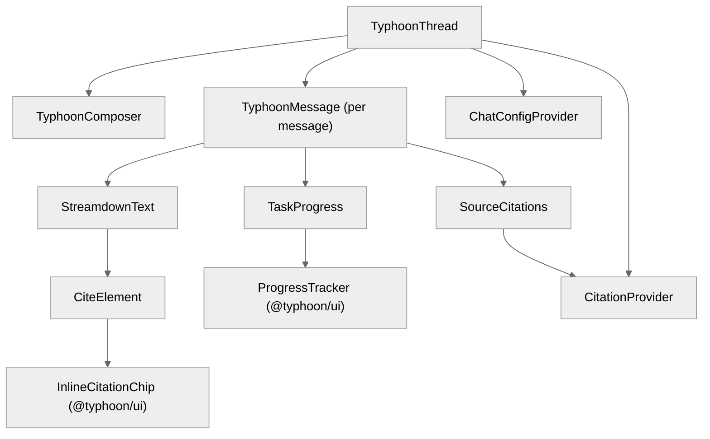

# @typhoon/chat

React UI components for AI-powered chat threads. Handles message streaming, tool progress visualization, source citations with hierarchical numbering, markdown rendering via Streamdown, document viewing, and stream stall detection.

## Architecture Context

```
apps/desk   ──>  @typhoon/chat  ──>  @typhoon/ui (InlineCitationChip, ProgressTracker, etc.)
apps/widget          |              @ai-sdk/react (useChat, UIMessage)
                     |              streamdown (streaming markdown)
                     v
              AI SDK v6 chat transport
              Mastra handleChatStream / createUIMessageStreamResponse
```

`@typhoon/chat` is consumed by:

- **`apps/desk`** -- Rep desk chat page (`apps/desk/src/components/pages/chat.tsx`)
- **`apps/widget`** -- Customer-facing chat widget (`apps/widget/src/main.tsx`)

The package contains no API calls itself. It receives messages from AI SDK's `useChat` hook (provided by consuming apps) and renders them with streaming markdown, tool progress, and citations.

## Component Tree



## Exports

### Chat Components (High-Level)

| Export         | Props                                                    | Description                                                        |
| -------------- | -------------------------------------------------------- | ------------------------------------------------------------------ |
| `TyphoonThread`   | `TyphoonThreadProps` (messages, status, stop, append, etc.) | Full chat thread with message list, composer, and auto-scroll      |
| `TyphoonComposer` | `{ onSubmit, isLoading }`                                | Message input with textarea and submit button                      |
| `TyphoonMessage`  | `ChatMessage` (UIMessage + metadata)                     | Single message: streaming text, tool progress, feedback, citations |

### Streaming and Rendering

| Export            | Props                                   | Description                                                              |
| ----------------- | --------------------------------------- | ------------------------------------------------------------------------ |
| `StreamdownText`  | `{ text, isStreaming }`                 | Streaming markdown renderer with code highlighting, `<cite>` tag support |
| `TaskProgress`    | `{ parts: ToolPart[], progressEvents }` | Tool execution progress tracker with step labels                         |
| `SourceCitations` | `{ message: UIMessage }`                | RAG source citation footer grouped by document                           |

### Configuration and Context

| Export                                 | Description                                                                            |
| -------------------------------------- | -------------------------------------------------------------------------------------- |
| `ChatConfigProvider` / `useChatConfig` | Configuration context (userName, onFeedback, feedbackState, onDocumentOpen, etc.)      |
| `CitationProvider` / `useCitations`    | Context for inline citation chip rendering (citation data map + document open handler) |

### Document Viewer

| Export                                         | Description                                                     |
| ---------------------------------------------- | --------------------------------------------------------------- |
| `DocumentViewerPanel`                          | Side panel for viewing document content with chunk highlighting |
| `documentContentQuery` / `documentParsedQuery` | TanStack Query option factories for document content            |

### AI Primitives (Low-Level)

| Export                                                                                         | Description                                                     |
| ---------------------------------------------------------------------------------------------- | --------------------------------------------------------------- |
| `Conversation` / `ConversationContent` / `ConversationEmptyState` / `ConversationScrollButton` | Scroll container with auto-scroll and "scroll to bottom" button |
| `Message` / `MessageAction` / `MessageActions` / `MessageContent` / `MessageResponse`          | Message bubble with action buttons                              |
| `PromptInput` / `PromptInputTextarea` / `PromptInputSubmit`                                    | Composable prompt input primitives                              |
| `Loader`                                                                                       | Typing indicator animation                                      |

### Hooks

| Export                    | Signature                                       | Description                               |
| ------------------------- | ----------------------------------------------- | ----------------------------------------- |
| `useStreamStallDetection` | `({ messages, status, stop }) => Error \| null` | Detects 15s stream stalls and auto-aborts |

### Utilities

| Export              | Description                                  |
| ------------------- | -------------------------------------------- |
| `resolveToolStatus` | Map tool name to human-readable status label |

## Inline Citation Pipeline

When the `searchKnowledge` tool returns a response with hierarchical `[Source: N.M]` patterns, citations flow through a 6-step pipeline:

### Step 1: Extract Citations (`extractCitations`)

Reads `_chunkSources` from tool output parts. Deduplicates by `chunkId`. Builds parent citations for multi-chunk documents so `[Source: N]` can reference all chunks from document N.

### Step 2: Extract Sub-Agent Texts (`extractSubAgentTexts`)

Extracts the tool's text response (with `[Source: N.M]` patterns) from `tool-invocation` or `tool-output` parts.

### Step 3: Transform Citation Patterns (`transformCitationPatterns`)

Converts source references to HTML `<cite>` tags:

```
[Source: 1.1]  -->  <cite index="1.1" title="..." display="1.1"></cite>
[Source: 2]    -->  <cite index="2" title="..." display="2"></cite>
```

Also supports legacy format: `[Source: Document Title -- Section]`.

### Step 4: Streamdown Rendering

`StreamdownText` renders the transformed text as streaming markdown. The `<cite>` tag is registered via `allowedTags: { cite: ['index', 'title', 'display'] }` and mapped to the `CiteElement` component.

### Step 5: Citation Context Lookup

`CiteElement` looks up rich citation metadata (title, section, score, documentId, chunkText) from `CitationProvider` context. Falls back to the `title` attribute on the `<cite>` tag when context data is unavailable.

### Step 6: Inline Citation Chip

`InlineCitationChip` (from `@typhoon/ui`) renders an interactive superscript badge. Hovering shows a popover with document title, section, relevance score, and a text snippet. Clicking can open the document viewer (via `onDocumentOpen` from `ChatConfigProvider`).

### Hierarchical Numbering

Citations use hierarchical numbering based on document grouping:

- Multi-chunk documents: `[1.1]`, `[1.2]` (document 1, chunks 1 and 2)
- Single-chunk documents: `[2]` (just document number)

The `SourceCitations` footer groups citations by document with expandable chunk details showing individual relevance scores and text snippets.

## Stream Stall Detection

The AI SDK's `useChat` fetch-based stream reader hangs forever if the server dies mid-stream -- `reader.read()` blocks indefinitely, `status` stays `"streaming"`, and `error` is never set.

`useStreamStallDetection` works around this:

1. Monitors message changes and status transitions
2. Resets an activity timer on any update
3. Polls every 5 seconds while streaming
4. After 15 seconds of inactivity, calls `stop()` and returns a stall error

```typescript
const stallError = useStreamStallDetection({ messages, status, stop });
// stallError is displayed in the UI if non-null
```

## Chat Configuration

`ChatConfigProvider` controls per-instance chat behavior:

```typescript
interface ChatConfig {
  userName?: string; // Display name on user messages
  onFeedback?: (messageId, rating, comment?) => void; // Thumbs up/down handler
  feedbackState?: Map<string, { rating; comment? }>; // Current feedback state
  onDocumentOpen?: (documentId, options?) => void; // Citation document open handler
  feedbackReadOnly?: boolean; // Disable feedback interaction
  showDebugInfo?: boolean; // Show tool call debug details
}
```

## Internal Structure

```
src/
  index.ts                     -- Package entry point
  components/
    ai-elements/               -- Low-level chat primitives
      conversation.tsx          -- Scroll container with auto-scroll
      loader.tsx                -- Typing indicator
      message.tsx               -- Message bubble with actions
      prompt-input.tsx          -- Composable prompt input
    chat/
      typhoon-thread.tsx           -- Full thread component
      typhoon-composer.tsx         -- Message input with submit
      typhoon-message.tsx          -- Single message (streaming, tools, citations)
      message-utils.ts          -- Pure helpers (progress events, citations, formatting)
      task-progress.tsx         -- Tool progress visualization
      source-citations.tsx      -- Citation footer with document grouping
      streamdown-text.tsx       -- Streaming markdown with <cite> support
      citation-context.tsx      -- Citation provider context
      chat-config.tsx           -- Chat config provider context
      tool-labels.ts            -- Tool display name resolution
    document-viewer/
      document-viewer-panel.tsx -- Side panel document viewer
      document-queries.ts       -- TanStack Query option factories
  hooks/
    use-stream-stall-detection.ts -- 15s stall detection + auto-abort
  lib/
    utils.ts                    -- Markdown stripping and text utilities
```

## Dependencies

| Package                 | Purpose                                                                             |
| ----------------------- | ----------------------------------------------------------------------------------- |
| `@ai-sdk/react`         | `useChat` types (`UIMessage`, `ChatStatus`)                                         |
| `ai`                    | AI SDK v6 types                                                                     |
| `@typhoon/ui`              | `InlineCitationChip`, `ProgressTracker`, `markdownComponents`, `ExternalLinkDialog` |
| `streamdown`            | Streaming markdown renderer with component mapping                                  |
| `@streamdown/code`      | Code block syntax highlighting plugin                                               |
| `lucide-react`          | Icons                                                                               |
| `@tanstack/react-query` | Query options for document viewer                                                   |

**Peer dependencies:** `react`, `react-dom`, `tailwindcss`

## Cross-References

- Frontend architecture: [../../docs/frontend/](../../docs/frontend/)
- Agent tools (source of citations): [../agents/README.md](../agents/README.md)
- UI component library: [../ui/README.md](../ui/README.md)
- API client (document queries): [../api-client/README.md](../api-client/README.md)
