# @typhoon/config

Centralized environment validation and shared build configuration for the Typhoon monorepo. Every package and application reads environment variables and TypeScript/Vite settings through this module, making it the foundational Layer 0 dependency.

## Architecture Context

```mermaid
%%{init: {'theme': 'neutral'}}%%
graph TD
    CONFIG["@typhoon/config<br/>(Layer 0)"]

    subgraph "Layer 1 — Infrastructure"
        DB["@typhoon/db"]
        AI["@typhoon/ai"]
        BLOB["@typhoon/blob-store"]
        LOGGER["@typhoon/logger"]
        TELEM["@typhoon/telemetry"]
        QUEUE["@typhoon/queue"]
    end

    subgraph "Layer 2 — Domain"
        AGENTS["@typhoon/agents"]
        INGESTION["@typhoon/ingestion"]
        EVALS["@typhoon/evals"]
        SERVICES["@typhoon/services"]
        UI["@typhoon/ui"]
        APICLIENT["@typhoon/api-client"]
    end

    subgraph "Apps"
        API["apps/api"]
        WORKER["apps/worker"]
        SCHEDULER["apps/scheduler"]
        DESK["apps/desk"]
        ADMIN["apps/admin"]
    end

    DB --> CONFIG
    AI --> CONFIG
    BLOB --> CONFIG
    LOGGER --> CONFIG
    TELEM --> CONFIG
    QUEUE --> CONFIG
    AGENTS --> CONFIG
    INGESTION --> CONFIG
    EVALS --> CONFIG
    SERVICES --> CONFIG
    UI --> CONFIG
    APICLIENT --> CONFIG
    API --> CONFIG
    WORKER --> CONFIG
    SCHEDULER --> CONFIG
    DESK --> CONFIG
    ADMIN --> CONFIG
```



`@typhoon/config` is imported by **every package and app** in the monorepo (17 direct dependents). It provides three distinct capabilities:

1. **Environment validation** -- Zod schemas that parse and validate `process.env` at startup
2. **Role constants** -- Application role definitions shared between auth middleware and UI gates
3. **Build configuration** -- Shared TypeScript compiler options and Vite config factory

## Internal Structure

```
packages/config/
  src/
    index.ts            Re-exports from env.ts and roles.ts
    env.ts              Zod schemas for all environment variable groups + validateEnv()
    env.test.ts         Unit tests (vitest)
    roles.ts            APP_ROLES constant and AppRole type
  tsconfig.base.json    Base TypeScript config (extended by all packages/apps)
  tsconfig.lib.json     Library build config (composite, declarations)
  tsconfig.app.json     Application config (noEmit)
  tsconfig.json         Self config (extends tsconfig.lib.json)
  vite.shared.ts        Shared Vite config factory for frontend apps
  vitest.config.ts      Vitest config for this package's tests
  package.json
```

## Exports

### Environment Schemas

Each schema validates a group of related environment variables. They can be used individually for partial validation or combined via the unified `envSchema`.

| Export            | Variables Covered                                                                                                                                                | Description                                                |
| ----------------- | ---------------------------------------------------------------------------------------------------------------------------------------------------------------- | ---------------------------------------------------------- |
| `databaseSchema`  | `DATABASE_URL`                                                                                                                                                   | PostgreSQL connection string                               |
| `redisSchema`     | `REDIS_URL`                                                                                                                                                      | Redis connection string for BullMQ                         |
| `awsSchema`       | `AWS_REGION`                                                                                                                                                     | AWS region for direct Bedrock and S3 access                |
| `s3Schema`        | `S3_ENDPOINT`, `S3_REGION`, `S3_ACCESS_KEY`, `S3_SECRET_KEY`, `S3_BUCKET`, `S3_FORCE_PATH_STYLE`                                                                 | S3/MinIO config (credentials optional with IRSA)           |
| `llmSchema`       | `LLM_BASE_URL`, `LLM_API_KEY`, `LLM_CHAT_MODEL`, `LLM_TITLE_MODEL`, `LLM_MAX_RETRIES`, `LLM_RETRY_DELAY_MS`, `LLM_RETRY_MAX_DELAY_MS`, `ANTHROPIC_API_KEY`       | LLM provider config (gateway URL optional for Bedrock)     |
| `rerankerSchema`  | `RERANKER_BASE_URL`, `RERANKER_MODEL`, `RERANKER_API_KEY`                                                                                                        | Reranker config (gateway URL optional for Bedrock)         |
| `embeddingSchema` | `EMBEDDING_BASE_URL`, `EMBEDDING_API_KEY`, `EMBEDDING_MODEL`, `EMBEDDING_DIMENSION`, `EMBEDDING_MAX_CHARS`, `EMBEDDING_MAX_TOKENS`                               | Embedding config (gateway URL optional for Bedrock)        |
| `authSchema`      | `AUTH_SECRET`, `AUTH_URL`, `TRUSTED_ORIGINS`                                                                                                                     | Better Auth session signing and CORS                       |
| `oidcSchema`      | `OIDC_ISSUER_URL`, `OIDC_CLIENT_ID`, `OIDC_CLIENT_SECRET`                                                                                                        | Optional OIDC identity provider                            |
| `otelSchema`      | `OTEL_EXPORTER_OTLP_ENDPOINT`, `OTEL_SERVICE_NAME`, `OTEL_SERVICE_VERSION`                                                                                       | OpenTelemetry exporter config                              |
| `logSchema`       | `LOG_LEVEL`                                                                                                                                                      | Log level (`debug` / `info` / `warn` / `error` / `silent`) |
| `serverSchema`    | `PORT`, `HOST`                                                                                                                                                   | HTTP server bind address                                   |
| `scoringSchema`   | `SCORING_ENABLED`, `LLM_SCORING_MODEL`, `LLM_SCORING_MODEL_OPTIONS`, `SCORING_SAMPLE_RATE`, `SCORING_CONCURRENCY`, `SPAN_RETENTION_DAYS`, `SCORE_RETENTION_DAYS` | Evaluation system config                                   |
| `ragSchema`       | 14 `RAG_*` variables                                                                                                                                             | RAG retrieval and reranking tuning knobs                   |
| `envSchema`       | All of the above (merged)                                                                                                                                        | Combined schema with cross-field refinement                |

### Functions

| Export               | Signature                                                | Description                                                                                                                     |
| -------------------- | -------------------------------------------------------- | ------------------------------------------------------------------------------------------------------------------------------- |
| `validateEnv()`      | `(env?: Record<string, string \| undefined>) => Env`     | Parses and validates all environment variables. Throws with formatted field-level errors on failure. Defaults to `process.env`. |
| `isScoringEnabled()` | `(env?: Record<string, string \| undefined>) => boolean` | Returns `true` unless `SCORING_ENABLED` is explicitly `'false'` or `'0'`. Used to conditionally start scoring workers.          |

### Type Exports

All types are inferred from their corresponding Zod schemas via `z.infer<typeof schema>`:

`Env`, `AwsEnv`, `DatabaseEnv`, `RedisEnv`, `S3Env`, `LlmEnv`, `RerankerEnv`, `EmbeddingEnv`, `AuthEnv`, `OidcEnv`, `LogEnv`, `ServerEnv`, `ScoringEnv`, `RagEnv`

### Role Constants

| Export      | Type                             | Value         | Description                                                  |
| ----------- | -------------------------------- | ------------- | ------------------------------------------------------------ |
| `APP_ROLES` | `{ ADMIN: 'admin', REP: 'rep' }` | Frozen object | Role identifiers used by auth middleware and UI route guards |
| `AppRole`   | `'admin' \| 'rep'`               | Union type    | Type-safe role values derived from `APP_ROLES`               |

### Build Configuration Exports

Exported via `package.json` `"exports"` field (not through `src/index.ts`):

| Export Path                       | File                 | Description                                                                                                                    |
| --------------------------------- | -------------------- | ------------------------------------------------------------------------------------------------------------------------------ |
| `@typhoon/config/tsconfig.base.json` | `tsconfig.base.json` | Base TypeScript config: strict mode, ESNext/bundler, `verbatimModuleSyntax`, workspace path aliases for all `@typhoon/*` packages |
| `@typhoon/config/tsconfig.lib.json`  | `tsconfig.lib.json`  | Library preset: extends base, adds composite + declarations + sourcemaps                                                       |
| `@typhoon/config/tsconfig.app.json`  | `tsconfig.app.json`  | Application preset: extends base, `noEmit` only (no build artifacts)                                                           |
| `@typhoon/config/vite`               | `vite.shared.ts`     | `createViteConfig()` factory for frontend apps                                                                                 |

## Complete Environment Variable Reference

### Database

| Variable       | Required | Default | Type | Description                                                    |
| -------------- | -------- | ------- | ---- | -------------------------------------------------------------- |
| `DATABASE_URL` | Yes      | --      | URL  | PostgreSQL connection string (must include pgvector extension) |

### Redis

| Variable    | Required | Default | Type | Description                                  |
| ----------- | -------- | ------- | ---- | -------------------------------------------- |
| `REDIS_URL` | Yes      | --      | URL  | Redis connection string for BullMQ job queue |

### AWS

| Variable     | Required | Default     | Type   | Description                                                     |
| ------------ | -------- | ----------- | ------ | --------------------------------------------------------------- |
| `AWS_REGION` | No       | `us-east-1` | string | AWS region for direct Bedrock and S3 access. Set by IRSA on EKS |

### S3 / MinIO

In direct Bedrock mode with IRSA, `S3_ENDPOINT`, `S3_ACCESS_KEY`, and `S3_SECRET_KEY` are optional -- the AWS SDK uses the default credential chain.

| Variable              | Required | Default          | Type   | Description                                               |
| --------------------- | -------- | ---------------- | ------ | --------------------------------------------------------- |
| `S3_ENDPOINT`         | No       | --               | URL    | S3-compatible endpoint. Omit for real AWS S3 (SDK infers) |
| `S3_REGION`           | No       | `us-east-1`      | string | AWS region                                                |
| `S3_ACCESS_KEY`       | No       | --               | string | Access key. Omit to use the AWS credential chain (IRSA)   |
| `S3_SECRET_KEY`       | No       | --               | string | Secret key. Omit to use the AWS credential chain          |
| `S3_BUCKET`           | No       | `typhoon-documents` | string | Default bucket for document storage                       |
| `S3_FORCE_PATH_STYLE` | No       | `true`           | enum   | Set to `false` for real AWS S3. Required `true` for MinIO |

### LLM Provider

The app supports **gateway mode** (OpenAI-compatible endpoint) and **direct Bedrock mode** (native AWS SDK). The mode is determined by whether `LLM_BASE_URL` is set.

| Variable                 | Required | Default                       | Type    | Constraints | Description                                             |
| ------------------------ | -------- | ----------------------------- | ------- | ----------- | ------------------------------------------------------- |
| `LLM_BASE_URL`           | No       | --                            | URL     |             | Gateway endpoint. When unset, uses direct Bedrock       |
| `LLM_API_KEY`            | No       | --                            | string  | min 1 char  | Gateway API key. Only needed when `LLM_BASE_URL` is set |
| `LLM_CHAT_MODEL`         | No       | `anthropic.claude-sonnet-4-6` | string  |             | Default chat model ID                                   |
| `LLM_TITLE_MODEL`        | No       | --                            | string  |             | Lighter model for thread title generation               |
| `LLM_MAX_RETRIES`        | No       | `3`                           | integer | 0--10       | Maximum retry attempts on LLM failures                  |
| `LLM_RETRY_DELAY_MS`     | No       | `500`                         | integer | 100--30000  | Initial retry delay in milliseconds                     |
| `LLM_RETRY_MAX_DELAY_MS` | No       | `10000`                       | integer | 1000--60000 | Maximum retry delay (exponential backoff cap)           |
| `ANTHROPIC_API_KEY`      | No       | --                            | string  |             | Anthropic API key (passed to Bifrost gateway)           |

### Reranker

Supports **gateway mode** (`RERANKER_BASE_URL` set) or **direct Bedrock** (`RERANKER_BASE_URL` unset).

| Variable              | Required | Default | Type    | Description                                                  |
| --------------------- | -------- | ------- | ------- | ------------------------------------------------------------ |
| `RERANKER_BASE_URL`   | No       | --      | URL     | Gateway rerank endpoint. When unset, uses Bedrock Rerank API |
| `RERANKER_MODEL`      | No       | --      | string  | Model ID (gateway) or full ARN (direct Bedrock)              |
| `RERANKER_API_KEY`    | No       | --      | string  | API key for the rerank endpoint (gateway mode only)          |
| `RERANKER_TIMEOUT_MS` | No       | `15000` | integer | Per-request timeout (ms, gateway mode only)                  |

### Embeddings

Supports **gateway mode** (`EMBEDDING_BASE_URL` set) or **direct Bedrock** (`EMBEDDING_BASE_URL` unset).

| Variable               | Required | Default                        | Type    | Constraints | Description                                                 |
| ---------------------- | -------- | ------------------------------ | ------- | ----------- | ----------------------------------------------------------- |
| `EMBEDDING_BASE_URL`   | No       | --                             | URL     |             | Gateway embedding endpoint. When unset, uses direct Bedrock |
| `EMBEDDING_API_KEY`    | No       | `""`                           | string  |             | API key for the embedding endpoint                          |
| `EMBEDDING_MODEL`      | No       | `amazon.titan-embed-text-v2:0` | string  |             | Embedding model ID                                          |
| `EMBEDDING_DIMENSION`  | No       | `1024`                         | integer | > 0         | Vector dimension                                            |
| `EMBEDDING_MAX_CHARS`  | No       | `2000`                         | integer | > 0         | Maximum input characters for embedding                      |
| `EMBEDDING_MAX_TOKENS` | No       | `8192`                         | integer | > 0         | Maximum input tokens for embedding                          |

### Auth

| Variable          | Required | Default                 | Type   | Description                          |
| ----------------- | -------- | ----------------------- | ------ | ------------------------------------ |
| `AUTH_SECRET`     | Yes      | --                      | string | Secret for session signing           |
| `AUTH_URL`        | No       | `http://localhost:5172` | URL    | Base URL for auth endpoints          |
| `TRUSTED_ORIGINS` | No       | --                      | string | Comma-separated CORS allowed origins |

### OIDC (all optional)

| Variable             | Required | Default | Type   | Description                                        |
| -------------------- | -------- | ------- | ------ | -------------------------------------------------- |
| `OIDC_ISSUER_URL`    | No       | --      | URL    | OIDC issuer URL (Dex for dev, Okta for production) |
| `OIDC_CLIENT_ID`     | No       | --      | string | OIDC client ID                                     |
| `OIDC_CLIENT_SECRET` | No       | --      | string | OIDC client secret                                 |

### OpenTelemetry

| Variable                      | Required | Default                 | Type   | Description                             |
| ----------------------------- | -------- | ----------------------- | ------ | --------------------------------------- |
| `OTEL_EXPORTER_OTLP_ENDPOINT` | No       | `http://localhost:4318` | URL    | OTLP receiver URL                       |
| `OTEL_SERVICE_NAME`           | No       | --                      | string | Service identifier (e.g. `typhoon-api`)    |
| `OTEL_SERVICE_VERSION`        | No       | --                      | string | Service version for resource attributes |

### Logging

| Variable    | Required | Default | Type | Allowed Values                             |
| ----------- | -------- | ------- | ---- | ------------------------------------------ |
| `LOG_LEVEL` | No       | --      | enum | `debug`, `info`, `warn`, `error`, `silent` |

### Server

| Variable | Required | Default   | Type    | Description              |
| -------- | -------- | --------- | ------- | ------------------------ |
| `PORT`   | No       | `5172`    | integer | HTTP server port         |
| `HOST`   | No       | `0.0.0.0` | string  | HTTP server bind address |

### Scoring / Evals

| Variable                    | Required | Default                     | Type    | Constraints               | Description                                            |
| --------------------------- | -------- | --------------------------- | ------- | ------------------------- | ------------------------------------------------------ |
| `SCORING_ENABLED`           | No       | `true`                      | enum    | `true`, `false`, `0`, `1` | Enables/disables scoring workers                       |
| `LLM_SCORING_MODEL`         | No       | `claude-haiku-4-5-20251001` | string  |                           | Model used for LLM-based scoring                       |
| `LLM_SCORING_MODEL_OPTIONS` | No       | --                          | string  |                           | Comma-separated model IDs for admin UI scorer selector |
| `SCORING_SAMPLE_RATE`       | No       | `1.0`                       | number  | 0.0--1.0                  | Fraction of messages to score                          |
| `SCORING_CONCURRENCY`       | No       | `5`                         | integer | >= 1                      | Concurrent scoring jobs per worker                     |
| `SPAN_RETENTION_DAYS`       | No       | `90`                        | integer | >= 1                      | Days to retain trace spans                             |
| `SCORE_RETENTION_DAYS`      | No       | `0` (infinite)              | integer | >= 0                      | Days to retain scores (0 = no expiry)                  |

### RAG Tuning

All RAG variables are optional with sensible defaults. The three `RAG_RERANK_WEIGHT_*` values **must sum to 1.0** (enforced by a cross-field refinement on the combined schema).

| Variable                          | Default | Type    | Constraints | Description                                           |
| --------------------------------- | ------- | ------- | ----------- | ----------------------------------------------------- |
| `RAG_RERANK_WEIGHT_SEMANTIC`      | `1.0`   | number  | 0.0--1.0    | Weight for Cohere semantic relevance score            |
| `RAG_RERANK_WEIGHT_VECTOR`        | `0`     | number  | 0.0--1.0    | Weight for original vector/RRF score                  |
| `RAG_RERANK_WEIGHT_POSITION`      | `0`     | number  | 0.0--1.0    | Weight for positional rank                            |
| `RAG_RERANK_MIN_SCORE`            | `0.1`   | number  | 0.0--1.0    | Minimum reranked score to keep a result               |
| `RAG_VECTOR_MIN_SCORE`            | `0.6`   | number  | 0.0--1.0    | Minimum vector similarity for API search              |
| `RAG_VECTOR_MIN_SCORE_AGENT`      | `0.5`   | number  | 0.0--1.0    | Minimum vector similarity for agent search tools      |
| `RAG_GRAPH_THRESHOLD`             | `0.7`   | number  | 0.0--1.0    | Graph RAG similarity threshold for edge creation      |
| `RAG_KNOWLEDGE_MAX_RESULTS`       | `10`    | integer | >= 1        | Maximum results from composite knowledge search       |
| `RAG_HYBRID_RRF_K`                | `60`    | integer | >= 1        | RRF constant K for hybrid search merge                |
| `RAG_HYBRID_VECTOR_WEIGHT`        | `0.7`   | number  | 0.0--1.0    | Vector score weight in RRF merge                      |
| `RAG_HYBRID_FTS_WEIGHT`           | `0.3`   | number  | 0.0--1.0    | Full-text search weight in RRF merge                  |
| `RAG_HYBRID_CANDIDATE_MULTIPLIER` | `5`     | integer | >= 1        | Internal candidate multiplier (retrieves topK \* N)   |
| `RAG_RERANK_CANDIDATES`           | `100`   | integer | 10--500     | Candidates to retrieve for standard reranking         |
| `RAG_RERANK_CANDIDATES_EXPANDED`  | `200`   | integer | 50--1000    | Expanded candidate pool for deep search mode          |
| `RAG_FTS_WEIGHT_A`                | `1.0`   | number  | >= 0        | tsvector weight for tier A (title, critical custom)   |
| `RAG_FTS_WEIGHT_B`                | `0.6`   | number  | >= 0        | tsvector weight for tier B (section, keywords, high)  |
| `RAG_FTS_WEIGHT_C`                | `0.4`   | number  | >= 0        | tsvector weight for tier C (moderate custom, default) |
| `RAG_FTS_WEIGHT_D`                | `0.2`   | number  | >= 0        | tsvector weight for tier D (body text, standard)      |

## Usage Examples

### Validating the full environment at startup

```typescript
import { validateEnv } from '@typhoon/config';

// Validates process.env by default. Throws with field-level errors on failure.
const env = validateEnv();

console.log(env.DATABASE_URL); // string (validated URL)
console.log(env.PORT); // number (coerced from string, default 5172)
```

### Using individual schemas for partial validation

```typescript
import { databaseSchema, redisSchema } from '@typhoon/config';

// Validate only the database variables (useful in packages that only need DB access)
const dbEnv = databaseSchema.parse(process.env);
```

### Checking if scoring is enabled

```typescript
import { isScoringEnabled } from '@typhoon/config';

if (isScoringEnabled()) {
  // Start scoring workers
}
```

### Using role constants for auth middleware

```typescript
import { APP_ROLES } from '@typhoon/config';
import type { AppRole } from '@typhoon/config';

function requireRole(role: AppRole) {
  // Used in apps/api route middleware and apps/desk + apps/admin auth gates
  return (c, next) => {
    if (c.get('user')?.role !== role) return c.json({ error: 'Forbidden' }, 403);
    return next();
  };
}

// In route definition:
app.get('/admin/settings', requireRole(APP_ROLES.ADMIN), handler);
```

### Extending TypeScript configs

```jsonc
// packages/my-package/tsconfig.json
{
  "extends": "@typhoon/config/tsconfig.lib.json",
  "include": ["src"],
  "exclude": ["node_modules", "dist"]
}

// apps/my-app/tsconfig.json
{
  "extends": "@typhoon/config/tsconfig.app.json",
  "include": ["src"],
  "exclude": ["node_modules"]
}
```

### Using the shared Vite config factory

```typescript
// apps/admin/vite.config.ts
import { createViteConfig } from '@typhoon/config/vite';

export default createViteConfig(import.meta.dirname, {
  server: { port: 5174 },
});
```

The `createViteConfig()` factory provides:

- React and Tailwind CSS plugins
- `@` path alias pointing to the app's `src/` directory
- React deduplication (prevents multiple React instances)
- Automatic workspace dependency exclusion from Vite's pre-bundling (reads `package.json` and excludes `workspace:*` deps for correct HMR)
- Docker-friendly HMR and file polling (via `HMR_CLIENT_PORT` and `VITE_USE_POLLING` env vars)

## Cross-Field Validation

The combined `envSchema` includes a refinement that validates:

- `RAG_RERANK_WEIGHT_SEMANTIC + RAG_RERANK_WEIGHT_VECTOR + RAG_RERANK_WEIGHT_POSITION` must sum to `1.0` (within a tolerance of 0.001)

If this constraint is violated, `validateEnv()` throws with the message: `"RAG_RERANK_WEIGHT_SEMANTIC + RAG_RERANK_WEIGHT_VECTOR + RAG_RERANK_WEIGHT_POSITION must sum to 1.0"`.

## Error Handling

`validateEnv()` uses `safeParse` internally and throws a formatted error listing all failing fields:

```
Environment validation failed:
  DATABASE_URL: Required
  REDIS_URL: Required
  AUTH_SECRET: Required
```

This makes it easy to identify multiple missing variables in a single startup attempt.

## Dependencies

| Dependency | Purpose                          |
| ---------- | -------------------------------- |
| `zod`      | Schema definition and validation |

Dev dependencies (`@tailwindcss/vite`, `@vitejs/plugin-react`, `vite`) support the shared Vite config factory.

## Related Documentation

- [Environment Variables](../../docs/environment-variables.md) -- Full env var reference with operational context
- [Architecture](../../docs/architecture.md) -- 3-layer dependency model and package summary
- [Infrastructure](../../docs/infrastructure.md) -- Docker Compose services and port mapping
