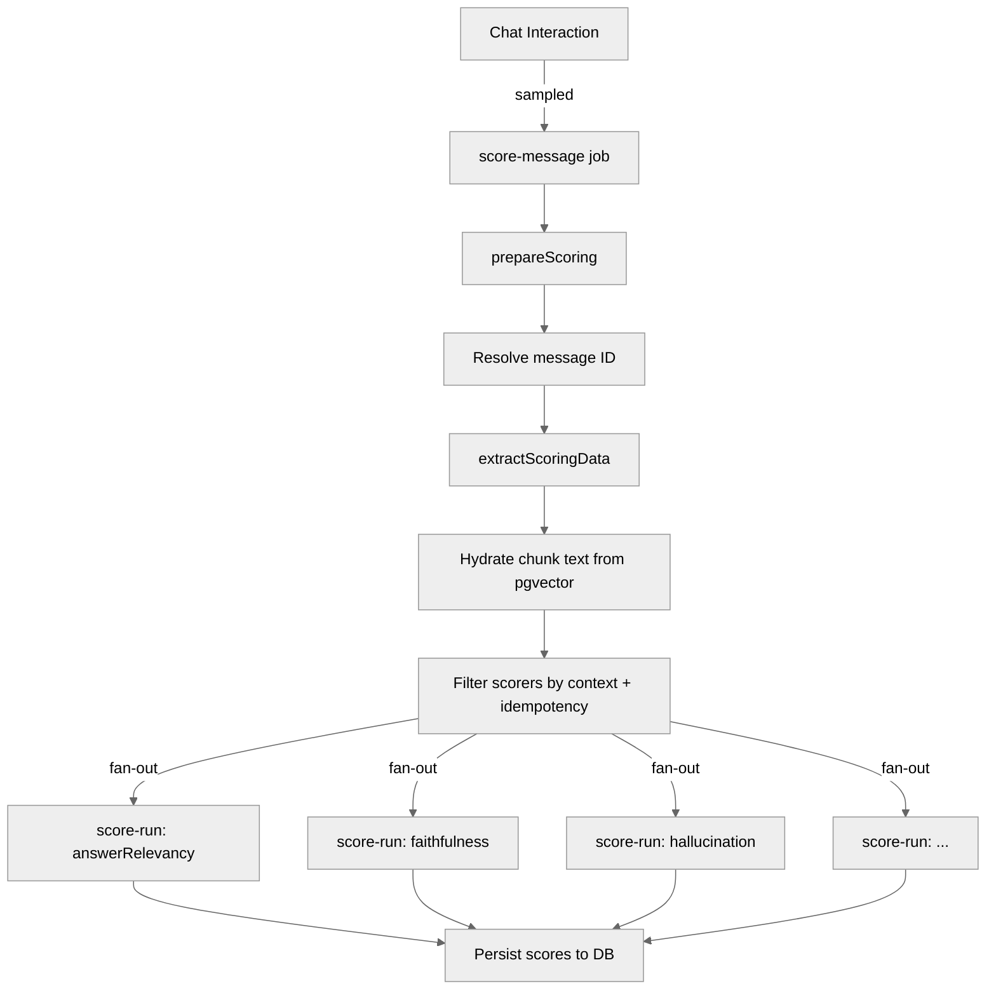

# @typhoon/evals

Evaluation and scoring infrastructure for RAG quality assessment. Provides scorer category config, scorer construction from database definitions, job handlers for both review scoring and experiment execution, and a standalone RAG evaluation runner.

## Architecture Context

```
apps/worker  ──>  @typhoon/evals  ──>  @mastra/evals (prebuilt scorers)
                       |              @mastra/core (scorer API, runEvals)
                       |              @typhoon/ai (model factories)
                       v
               BullMQ (reviews-queue: score-message, score-run)
               BullMQ (experiment-queue: experiment-setup, exp-item-process, experiment-complete)
```

`@typhoon/evals` is consumed exclusively by `apps/worker`, which wires the job handlers to BullMQ queues. The scoring pipeline runs asynchronously after chat interactions (sampled) and during experiment runs.

## Scorer Categories

Scorers are organized into two categories with independent averages:

| Category              | Scorers                                            | Runs When                          |
| --------------------- | -------------------------------------------------- | ---------------------------------- |
| **Response Quality**  | `answerRelevancy`, `faithfulness`, `hallucination` | Always (every scored message)      |
| **Retrieval Quality** | `contextRelevance`, `contextPrecision`             | Only when RAG context is non-empty |

Custom scorers (LLM-as-judge) are excluded from category averages.

### Inverted Hallucination Scale

The `hallucination` scorer uses an inverted scale: `1.0 = bad` (full hallucination), `0.0 = good` (no hallucination). Before inclusion in the Response Quality average, the score is inverted via `normalizeScoreForAvg()`:

```typescript
// hallucination raw score: 0.3 (30% hallucinated)
normalizeScoreForAvg('hallucination', 0.3); // returns 0.7 (70% faithful)
```

This ensures all scores in the category average follow the same direction: higher = better.

## Scoring Pipeline



### Review Scoring Flow

1. **`score-message` job** calls `prepareScoring()`:
   - Resolves the latest assistant message in the thread (if messageId not provided)
   - Extracts scoring data (response text, user question, chunk references) from message JSONB
   - Hydrates chunk text from pgvector if needed
   - Filters scorers by context availability and idempotency (skip already-scored)
2. **Fan-out:** Creates individual `score-run` child jobs (one per scorer)
3. **`score-run` jobs** call `runSingleScorer()`:
   - Constructs the scorer from its definition
   - Runs the scorer against extracted input/output
   - Persists the score to the database
   - Idempotency check on retry (BullMQ retry safety)

### Experiment Flow

1. **`experiment-setup` job** calls `setupExperiment()`:
   - Validates experiment status (must be `pending`)
   - Loads dataset items
   - Creates the BullMQ Flow (item jobs + completion job)
2. **`exp-item-process` jobs** (Step 1 -- `processExperimentItemStep1()`):
   - Calls the experiment agent with the dataset item's question
   - Extracts RAG context from agent tool results
   - Determines applicable scorers
   - Creates `score-run` child jobs, then moves to waiting-for-children
3. **`exp-item-process` jobs** (Step 2 -- `processExperimentItemStep2()`):
   - Collects scores from completed children
   - Saves experiment result with all scores
4. **`experiment-complete` job** calls `completeExperiment()`:
   - Aggregates results from all items
   - Sets final experiment status (`completed` or `failed`)

## Exports

### Scorer Categories

| Export                      | Signature                                      | Description                                  |
| --------------------------- | ---------------------------------------------- | -------------------------------------------- |
| `SCORER_CATEGORIES`         | `Record<string, { category, invertedScale? }>` | Category config for the 5 built-in scorers   |
| `RETRIEVAL_SCORERS`         | `Set<string>`                                  | Scorer types that require non-empty context  |
| `normalizeScoreForAvg()`    | `(scorerId, rawScore) => number`               | Inverts hallucination, passes others through |
| `computeCategoryAverages()` | `(scores) => { responseAvg, retrievalAvg }`    | Compute per-category weighted averages       |

### Scorer Construction

| Export               | Signature                                                                                         | Description                                    |
| -------------------- | ------------------------------------------------------------------------------------------------- | ---------------------------------------------- |
| `constructScorer()`  | `(definition, model, context) => { id, scorer } \| null`                                          | Construct a Mastra scorer from a DB definition |
| `mapScorerRows()`    | `(rows) => ScorerDefinitionVersion[]`                                                             | Map raw SQL rows to typed definitions          |
| `createRagScorers()` | `(model) => { faithfulness, hallucination, answerRelevancy, contextRelevance, contextPrecision }` | Create the standard set of 5 RAG scorers       |

### Scoring Job Handlers

| Export                | Signature                                                 | Description                                                    |
| --------------------- | --------------------------------------------------------- | -------------------------------------------------------------- |
| `prepareScoring()`    | `(input, deps, model, defs?) => Promise<PreparedScoring>` | Resolve message, extract content, determine applicable scorers |
| `runSingleScorer()`   | `(data, deps, model) => Promise<ScorerRunResult>`         | Run one scorer with optional persistence                       |
| `BUILTIN_SCORER_DEFS` | `ScorerDefinitionVersion[]`                               | Synthetic definitions for the 5 prebuilt scorers               |

### Experiment Handlers

| Export                         | Signature                                                                     | Description                                          |
| ------------------------------ | ----------------------------------------------------------------------------- | ---------------------------------------------------- |
| `setupExperiment()`            | `(experimentId, deps) => Promise<{ experiment, items }>`                      | Validate experiment, load dataset items              |
| `processExperimentItemStep1()` | `(item, experimentId, agent, model, defs, deps) => Promise<...>`              | Call agent, determine scorers                        |
| `processExperimentItemStep2()` | `(experimentId, itemId, ...) => Promise<{ succeeded, scorersFailed }>`        | Collect child scores, save result                    |
| `completeExperiment()`         | `(experimentId, childrenValues, failures, deps) => Promise<ExperimentResult>` | Aggregate and finalize                               |
| `extractContextFromSteps()`    | `(steps) => string[]`                                                         | Extract RAG context chunks from agent response steps |

### Scoring Data Extraction

| Export                 | Signature                                                | Description                                                                   |
| ---------------------- | -------------------------------------------------------- | ----------------------------------------------------------------------------- |
| `extractScoringData()` | `(assistantContent, userContent) => ScoringData \| null` | Extract response text, user question, and chunk references from message JSONB |

### RAG Evaluation Runner

| Export          | Signature                                               | Description                                                |
| --------------- | ------------------------------------------------------- | ---------------------------------------------------------- |
| `runRagEvals()` | `(agent, model, data) => Promise<{ results, summary }>` | Run all 5 RAG scorers against an agent with test questions |

### Types

| Export                        | Description                                                                      |
| ----------------------------- | -------------------------------------------------------------------------------- |
| `ScorerCategory`              | `'response' \| 'retrieval'`                                                      |
| `ScorerDefinitionVersion`     | DB-loaded scorer config (id, name, type, instructions, scoreRange, etc.)         |
| `ScoringInput`                | `{ messageId, threadId, agentId, traceId }`                                      |
| `ScoringDeps`                 | Dependency interface (fetchMessages, hydrateChunks, hasExistingScore, saveScore) |
| `PreparedScoring`             | `{ messageId, userQuestion, responseText, context, scorersToRun, skippedCount }` |
| `ScorerRunResult`             | `{ scorerId, score, reason, skipped? }`                                          |
| `ExperimentDeps`              | Dependency interface for experiment handlers                                     |
| `ExperimentResult`            | `{ succeeded, failed, cancelled }`                                               |
| `EvalInput` / `EvalResult`    | Types for `runRagEvals()`                                                        |
| `ChunkSource` / `ScoringData` | Extracted scoring data types                                                     |

## Custom Scorers

Custom scorers use the `type: 'custom'` definition with LLM-as-judge instructions:

```typescript
const definition: ScorerDefinitionVersion = {
  id: 'tone-checker',
  name: 'tone-checker',
  type: 'custom',
  description: 'Evaluates whether the response maintains a professional tone',
  instructions: 'Score 0-1 based on professional tone. Deduct for slang, jargon...',
  model: null, // Uses the shared scoring model
  scoreRange: { min: 0, max: 1 },
  presetConfig: null,
  defaultSampling: null,
};
```

The `constructScorer()` function handles both prebuilt and custom types:

- **Prebuilt** (`faithfulness`, `hallucination`, `answerRelevancy`, `contextRelevance`, `contextPrecision`): Delegates to `@mastra/evals/scorers/prebuilt` factories
- **Custom**: Creates an LLM-as-judge scorer via `createScorer()` from `@mastra/core/evals` with `generateScore` and `generateReason` prompts

## Internal Structure

```
src/
  index.ts                    -- Package entry point
  scorer-categories.ts         -- Category config, normalization, averages
  scorer-loader.ts             -- Scorer construction from DB definitions
  scorers.ts                   -- RAG scorer factory (5 prebuilt scorers)
  run.ts                       -- Standalone RAG evaluation runner
  handle-scoring-job.ts        -- prepareScoring + runSingleScorer
  handle-experiment-job.ts     -- Experiment lifecycle handlers
  extract-scoring-data.ts      -- Message JSONB parsing for scoring inputs
```

## Dependencies

| Package         | Purpose                                                       |
| --------------- | ------------------------------------------------------------- |
| `@mastra/core`  | Agent type, scorer API, `runEvals`, model config types        |
| `@mastra/evals` | Prebuilt scorer factories (faithfulness, hallucination, etc.) |
| `@typhoon/ai`      | Model factories for scoring                                   |
| `@typhoon/logger`  | Structured logging                                            |
| `@typhoon/types`   | Domain type definitions                                       |

## Cross-References

- Evaluation design: [../../docs/evaluation/](../../docs/evaluation/)
- Agent architecture (scored by evals): [../agents/README.md](../agents/README.md)
- Architecture overview: [../../docs/architecture.md](../../docs/architecture.md)
- Scoring service (API layer): [../services/README.md](../services/README.md)
