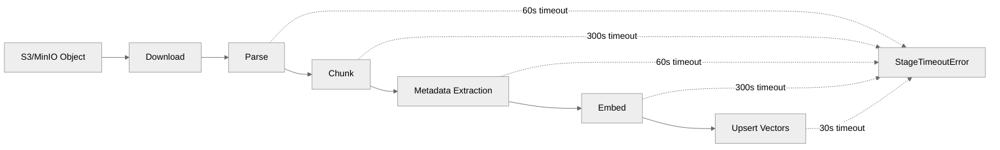

# @typhoon/ingestion

Document ingestion pipeline. Handles file parsing, chunking, embedding, metadata extraction, and vector storage, with async job processing via BullMQ. Supports PDF, DOCX, HTML, Excel, Markdown, CSV, JSON, and plain text.

## Architecture Context

```
apps/worker  ──>  @typhoon/ingestion  ──>  @typhoon/ai (models, embedding config)
apps/api              |                  @typhoon/db (PgVector, repos)
                      |                  @typhoon/blob-store (S3/MinIO download)
                      |                  @mastra/rag (MDocument, chunking)
                      v
              BullMQ (sync-queue, reports-queue)
              PostgreSQL + pgvector
              S3 / MinIO
```

`@typhoon/ingestion` is consumed by:

- **`apps/worker`** -- Runs BullMQ job handlers for file processing, sync scanning, and deletion
- **`apps/api`** -- Uses `registerSource()` / `registerSyncTarget()` at startup for credential and target management; `getParser()` for on-demand document content viewing
- **`@typhoon/services`** -- `DocumentService` and `SyncTargetService` import individual pipeline functions for vector operations and provider access

## Pipeline



Each stage has a configurable timeout (via `withTimeout()`) that is deliberately tighter than BullMQ's `lockDuration`, so a hung external call surfaces with a stage label before the job is considered stalled.

| Stage      | Timeout | Description                                               |
| ---------- | ------- | --------------------------------------------------------- |
| `parse`    | 60s     | Format-specific parsing (PDF, DOCX, HTML, Excel)          |
| `chunk`    | 300s    | Mastra `MDocument.chunk()` with LLM keyword extraction    |
| `metadata` | 60s     | LLM structured output for title/description/custom fields |
| `embed`    | 300s    | Per-chunk embedding with adaptive splitting and retry     |
| `upsert`   | 30s     | pgvector bulk upsert                                      |

### Cancellation Support

The pipeline checks an `isCancelled` callback before each expensive stage (chunk, metadata, embed, upsert). Job handlers wire this to BullMQ job status, enabling sync cancellation without waiting for the current stage to finish.

### Stage Progress

An optional `onStage` callback announces the current pipeline stage. Job handlers wire this to `job.updateProgress()` so the admin UI can show live progress via SSE.

## Supported Formats

| Extension               | Parser                              | Output Format | Chunking Strategy                                             |
| ----------------------- | ----------------------------------- | ------------- | ------------------------------------------------------------- |
| `.pdf`                  | `parsePdf` (unpdf, font-aware HTML) | `html`        | `html` -- headers (`h1`/`h2`/`h3`), maxSize, overlap 200      |
| `.docx`                 | `parseDocx` (mammoth)               | `html`        | `html` -- same as PDF                                         |
| `.html` / `.htm`        | `parseHtml` (turndown)              | `html`        | `html` -- same as PDF                                         |
| `.xlsx`                 | `parseXlsx` (SheetJS)               | `text`        | `sentence` -- maxSize 512, overlap 50                         |
| `.md` / `.mdx`          | Raw text (no parser)                | `markdown`    | `semantic-markdown` -- joinThreshold 500, maxSize, overlap 50 |
| `.json`                 | Raw text (no parser)                | `json`        | `token` -- maxSize 512, overlap 50                            |
| `.csv` / `.txt` / other | Raw text (no parser)                | `text`        | `sentence` -- maxSize 512, overlap 50                         |

All chunking strategies include LLM-based keyword extraction (5 keywords per chunk) via `extract: { keywords: { llm, keywords: 5 } }`.

### Chunk Size Enforcement

After Mastra's chunking, `enforceChunkSizeLimit()` splits any chunk exceeding `EMBEDDING_MAX_CHARS`:

1. Try paragraph boundaries (`\n\n`)
2. Fall back to sentence boundaries (`(?<=\.)\s+`)
3. Last resort: hard character split

## Adaptive Embedding

The `TokenRatioTracker` class monitors the chars-per-token ratio from successful embeddings and proactively splits oversized chunks before hitting the API's token limit:

```typescript
const adaptiveMax = Math.min(
  EMBEDDING_MAX_CHARS,
  ratioTracker.safeMaxChars(EMBEDDING_MAX_TOKENS), // 90% margin
);
```

When a chunk exceeds the adaptive max, it is split before embedding rather than relying on the API to reject it. This reduces retries and wasted API calls.

### Embedding Retry

On any embedding error, `embedChunkWithRetry()` splits the text in half and retries recursively (up to 3 levels deep). The retry count is tracked in OTel spans.

### Rate Limiting

A module-scope `embeddingLimiter` (shared across all concurrent workers in the process) limits concurrent embedding API calls and enforces a minimum interval between requests.

## Metadata Extraction

`generateDocumentMetadata()` uses a single `generateText()` + `Output.object()` call with a Zod schema to extract:

- **title** -- Short descriptive title
- **description** -- Single-sentence description
- **custom metadata** -- Template-defined fields (when `metadataSchema` is provided)

The schema is built dynamically by `buildDocumentMetadataSchema()` from `@typhoon/types`. Extraction failure is fatal (document goes to `error` status).

| Config                          | Default | Description                             |
| ------------------------------- | ------- | --------------------------------------- |
| `METADATA_EXTRACTION_MAX_CHARS` | 8000    | Max text sample size for LLM extraction |

## Exports

### Pipeline

| Export                           | Signature                                                                        | Description                                                  |
| -------------------------------- | -------------------------------------------------------------------------------- | ------------------------------------------------------------ |
| `processFile()`                  | `(input: ProcessFileInput, vectorStore: PgVector) => Promise<ProcessFileResult>` | Full ingestion pipeline for a single file                    |
| `deleteDocumentVectors()`        | `(vectorStore, documentId) => Promise<void>`                                     | Remove all vectors for a document                            |
| `updateDocumentVectorSource()`   | `(sql, documentId, newSource) => Promise<void>`                                  | Update source key in chunk metadata JSONB                    |
| `updateDocumentVectorMetadata()` | `(sql, documentId, metadata) => Promise<void>`                                   | Merge custom metadata into chunk JSONB                       |
| `updateDocumentVectorTitle()`    | `(sql, documentId, title) => Promise<void>`                                      | Update title in chunk metadata                               |
| `generateDocumentMetadata()`     | `(text, llm, schema?) => Promise<{ title, description, customMetadata }>`        | LLM-based metadata extraction via structured output          |
| `refreshDocumentSearchMeta()`    | `(sql, documentId, fieldSchema) => Promise<void>`                                | Recompute `_searchMeta_*` chunk fields via SQL (no re-embed) |

### Job Handlers

| Export                         | Description                                                                                                                                           |
| ------------------------------ | ----------------------------------------------------------------------------------------------------------------------------------------------------- |
| `handleProcessFileJob()`       | BullMQ handler for file processing (download, parse, chunk, embed, upsert). Supports `metaRefreshOnly` mode for lightweight search meta recomputation |
| `handleScanJob()`              | BullMQ handler for sync scanning (diff detection, job creation)                                                                                       |
| `handleDeleteFileJob()`        | BullMQ handler for file deletion (vectors + source object + DB)                                                                                       |
| `cancelSyncJob()`              | Cancel an in-progress sync by setting Redis flag                                                                                                      |
| `incrementSyncJobCompletion()` | Track per-sync completion counts for progress reporting                                                                                               |
| `managePartitions()`           | Time-based table partition management                                                                                                                 |

### Parsers and Providers

| Export                | Signature                                                | Description                                        |
| --------------------- | -------------------------------------------------------- | -------------------------------------------------- |
| `getParser()`         | `(filename) => ParserFn \| undefined`                    | Get format-specific parser by file extension       |
| `getMDocFormat()`     | `(filename) => 'text' \| 'html' \| 'markdown' \| 'json'` | Map filename to MDocument format                   |
| `needsCustomParser()` | `(filename) => boolean`                                  | Check if file needs a custom parser (vs. raw text) |
| `getProvider()`       | `(sourceType) => SourceProvider`                         | Get storage provider instance                      |

### Registries

| Export                                                 | Description                                                                      |
| ------------------------------------------------------ | -------------------------------------------------------------------------------- |
| `registerSource()` / `getSource()` / `listSources()`   | Named credential source registry (S3 endpoints, keys)                            |
| `registerSyncTarget()` / `listRegisteredSyncTargets()` | Code-defined sync target registry with Zod validation                            |
| `computeSyncDiff()`                                    | Compute new/updated/deleted/meta-dirty files between syncs (ETag + status-based) |

### Utilities

| Export                                    | Description                                           |
| ----------------------------------------- | ----------------------------------------------------- |
| `withTimeout()`                           | Per-stage timeout wrapper using `Promise.race`        |
| `StageTimeoutError`                       | Error class with `stage` and `ms` properties          |
| `isUnrecoverable()` / `asUnrecoverable()` | Classify errors as permanent vs. retryable for BullMQ |

### Types

| Export                                             | Description                                                               |
| -------------------------------------------------- | ------------------------------------------------------------------------- |
| `ProcessFileInput`                                 | Pipeline input (content, filename, documentId, callbacks, metadataSchema) |
| `ProcessFileResult`                                | `{ chunkCount, title, description, customMetadata }`                      |
| `ParseResult`                                      | `{ text, format, metadata: { title?, author?, pageCount? } }`             |
| `SyncDiff`                                         | `{ newFiles, updatedFiles, deletedDocumentIds }`                          |
| `NamedSource`                                      | `{ name, sourceType, credentials }`                                       |
| `SourceProvider` / `SourceObject` / `BrowseResult` | Storage provider interface and types                                      |
| `IngestionRepos`                                   | Repo dependencies for job handlers                                        |

## Environment Variables

| Variable                           | Default | Description                                  |
| ---------------------------------- | ------- | -------------------------------------------- |
| `EMBEDDING_RATE_LIMIT_CONCURRENT`  | `3`     | Max concurrent embedding API calls           |
| `EMBEDDING_RATE_LIMIT_INTERVAL_MS` | `200`   | Minimum interval between embedding requests  |
| `EMBEDDING_BATCH_SIZE`             | `1`     | Texts per `embedMany` call (1 = per-chunk)   |
| `METADATA_EXTRACTION_MAX_CHARS`    | `8000`  | Text sample size for metadata LLM extraction |

Additional embedding config (`EMBEDDING_MAX_CHARS`, `EMBEDDING_MAX_TOKENS`, `EMBEDDING_DIMENSION`) is defined in `@typhoon/ai`.

## Internal Structure

```
src/
  pipeline.ts              -- Core ingestion pipeline (parse, chunk, embed, upsert)
  sync.ts                  -- Sync diff computation (ETag + status-based)
  source-registry.ts       -- Named credential source management
  sync-target-registry.ts  -- Code-defined sync target validation + registration
  repos.ts                 -- IngestionRepos type definition
  jobs/
    process-file.ts        -- BullMQ file processing handler
    sync-scan.ts           -- BullMQ sync scan handler (list, diff, enqueue)
    delete-file.ts         -- BullMQ file deletion handler
    cancel-sync.ts         -- Sync cancellation via Redis flag
    complete-sync-job.ts   -- Per-sync completion tracking
    partition-management.ts -- Time-based table partition management
    queues.ts              -- Queue name constants
    scoring-queue.ts       -- Scoring queue name
    experiment-queue.ts    -- Experiment queue name
  parsers/
    pdf.ts                 -- PDF parser (unpdf, font-aware HTML generation)
    docx.ts                -- DOCX parser (mammoth)
    html.ts                -- HTML parser (turndown to markdown, then to HTML)
    xlsx.ts                -- Excel parser (SheetJS)
    registry.ts            -- Parser/format resolution by file extension
  providers/
    index.ts               -- Provider factory
    s3.ts                  -- S3/MinIO provider (list, download, delete, copy, browse)
    types.ts               -- SourceProvider interface
  util/
    classify-error.ts      -- Error classification (recoverable vs. unrecoverable)
    with-timeout.ts        -- Per-stage timeout wrapper
    rate-limiter.ts        -- Concurrent + interval rate limiter
    stage-metrics.ts       -- Stage duration recording
```

## Dependencies

| Package            | Purpose                                                      |
| ------------------ | ------------------------------------------------------------ |
| `@typhoon/ai`         | Embedding model, metadata extraction model, config constants |
| `@typhoon/blob-store` | S3/MinIO object storage                                      |
| `@typhoon/db`         | PgVector for vector upsert/delete, repo types                |
| `@typhoon/logger`     | Structured logging                                           |
| `@typhoon/telemetry`  | OTel tracing, embedding metrics                              |
| `@typhoon/types`      | Metadata validation, sync target schemas                     |
| `@mastra/rag`      | `MDocument` for chunking                                     |
| `ai`               | AI SDK v6 (`embed`, `embedMany`, `generateText`, `Output`)   |
| `bullmq`           | Job queue (consumed by handlers)                             |
| `unpdf`            | PDF text extraction                                          |
| `mammoth`          | DOCX to HTML conversion                                      |
| `turndown`         | HTML to Markdown conversion                                  |
| `xlsx`             | Excel file parsing                                           |

## Cross-References

- Ingestion and RAG design: [../../docs/ingestion-and-rag.md](../../docs/ingestion-and-rag.md)
- Architecture overview: [../../docs/architecture.md](../../docs/architecture.md)
- Environment variables: [../../docs/environment-variables.md](../../docs/environment-variables.md)
- Agent search tools (consumers of ingested vectors): [../agents/README.md](../agents/README.md)
- Database schemas: [../../docs/database/](../../docs/database/)
