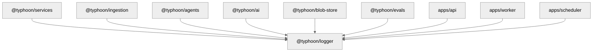

# @typhoon/logger

Structured logging with environment-aware formatting and OpenTelemetry trace context injection. JSON output in production, human-readable in development.

## Architecture Context

`@typhoon/logger` is a foundational package used by nearly every other package and app in the monorepo. It extends Mastra's `MastraLogger` for framework compatibility while adding structured output, trace correlation, and safe serialization of circular references.



## Internal Structure

```
src/
  index.ts                          -- Package entry: re-exports logger + factory
  logger.ts                         -- TyphoonLogger class, createAppLogger factory, formatting
  logger.test.ts                    -- Unit tests for level filtering, formatting, context
  observability-compat.test.ts      -- Tests for circular reference handling (OTel span proxies)
```

## Exports

| Export                  | Description                                                                                                                                              |
| ----------------------- | -------------------------------------------------------------------------------------------------------------------------------------------------------- |
| `createAppLogger(name)` | Factory function. Creates a named `TyphoonLogger` instance. Reads `LOG_LEVEL` and `NODE_ENV` from the environment. One logger per module is the convention. |
| `TyphoonLogger`            | Logger class extending Mastra's `MastraLogger`. Provides `debug()`, `info()`, `warn()`, `error()` methods with structured context support.               |

## Usage

```typescript
import { createAppLogger } from '@typhoon/logger';

const logger = createAppLogger('ingestion');

logger.info('Processing started', { documentId: 'doc-1', syncTargetId: 'target-1' });
logger.warn('Slow query detected', { durationMs: 1250, query: 'SELECT ...' });
logger.error('Pipeline failed', { error: err.message, stack: err.stack });
logger.debug('Chunk details', { chunkIndex: 3, charCount: 1024 });
```

### Logger method signatures

All methods follow the same pattern:

```typescript
logger.debug(message: string, ...args: unknown[]): void
logger.info(message: string, ...args: unknown[]): void
logger.warn(message: string, ...args: unknown[]): void
logger.error(message: string, ...args: unknown[]): void
```

When the first extra argument is a plain object, it is treated as structured context and merged into the log output. Otherwise, extra arguments are wrapped as `{ args: [...] }`.

## Output Formats

### Development (NODE_ENV !== 'production')

Human-readable, single-line format with local timestamp:

```
14:32:05 INFO  [ingestion] Processing started {"documentId":"doc-1","syncTargetId":"target-1"}
14:32:06 WARN  [ingestion] Slow query detected {"durationMs":1250,"query":"SELECT ..."}
14:32:07 ERROR [ingestion] Pipeline failed {"error":"Connection refused","stack":"..."}
```

Format: `HH:MM:SS LEVEL [name] message {context}`

### Production (NODE_ENV === 'production')

JSON lines format with ISO timestamp, service name, and OpenTelemetry trace context:

```json
{"ts":"2026-05-18T14:32:05.123Z","level":"info","service":"typhoon-api","name":"ingestion","msg":"Processing started","trace_id":"abc123...","span_id":"def456...","documentId":"doc-1","syncTargetId":"target-1"}
{"ts":"2026-05-18T14:32:06.456Z","level":"warn","service":"typhoon-api","name":"ingestion","msg":"Slow query detected","trace_id":"abc123...","span_id":"def456...","durationMs":1250}
```

Fields in production JSON output:

| Field        | Source                      | Description                                           |
| ------------ | --------------------------- | ----------------------------------------------------- |
| `ts`         | `new Date().toISOString()`  | ISO 8601 timestamp                                    |
| `level`      | Log method called           | `debug`, `info`, `warn`, `error`                      |
| `service`    | `OTEL_SERVICE_NAME` env var | Service identifier (omitted if not set)               |
| `name`       | Logger name                 | Module name passed to `createAppLogger()`             |
| `msg`        | First argument              | Log message                                           |
| `trace_id`   | Active OTel span            | W3C trace ID (omitted if no active span)              |
| `span_id`    | Active OTel span            | W3C span ID (omitted if no active span)               |
| `...context` | Extra arguments             | Structured context fields spread into the JSON object |

## OpenTelemetry Trace Context

In production mode, every log line automatically includes `trace_id` and `span_id` from the currently active OpenTelemetry span (via `@opentelemetry/api`). This allows correlating logs with distributed traces in your observability backend.

The trace context is only included when:

1. `NODE_ENV === 'production'` (production format is active)
2. An OTel span is active in the current async context
3. The trace ID is not the zero trace ID (`00000000000000000000000000000000`)

## Circular Reference Handling

The logger safely serializes objects with circular references (common with Mastra's OTel span proxies that contain parent-child cycles). Circular references are replaced with the string `[Circular]` instead of throwing a `TypeError`.

## Level Configuration

Log levels are ordered: `debug` < `info` < `warn` < `error` < `silent`.

Messages below the configured level are silently dropped (the formatting function is never called).

| Variable            | Default                     | Description                                                                 |
| ------------------- | --------------------------- | --------------------------------------------------------------------------- |
| `LOG_LEVEL`         | `info` (dev), `warn` (prod) | Minimum log level. Valid values: `debug`, `info`, `warn`, `error`, `silent` |
| `NODE_ENV`          | --                          | Controls output format. `production` = JSON, anything else = human-readable |
| `OTEL_SERVICE_NAME` | --                          | Service name included in production JSON output                             |

### Level resolution

1. If `LOG_LEVEL` is set and valid, use it
2. If `NODE_ENV === 'production'`, default to `warn`
3. Otherwise, default to `info`

### Explicit level override

```typescript
import { TyphoonLogger } from '@typhoon/logger';
import { LogLevel } from '@mastra/core/logger';

const verbose = new TyphoonLogger({ name: 'debug-module', level: LogLevel.DEBUG });
```

## Dependencies

| Package              | Purpose                                       |
| -------------------- | --------------------------------------------- |
| `@mastra/core`       | Base `MastraLogger` class and `LogLevel` enum |
| `@opentelemetry/api` | Trace context access for log correlation      |

## Cross-References

- [Infrastructure guide](../../docs/infrastructure.md)
- [Architecture overview](../../docs/architecture.md)
