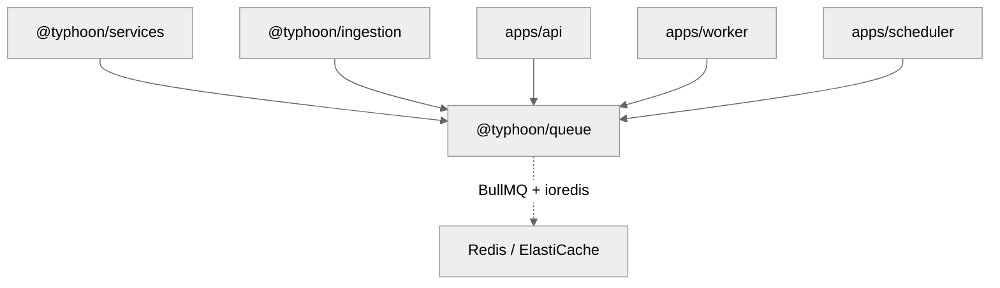

# @typhoon/queue

BullMQ job queue infrastructure for the Typhoon platform. Provides `RedisProvider` (centralised Redis connection and BullMQ factory), a shared queue registry, job data schemas, priority constants, and deterministic job ID generation.

## Architecture Context

`@typhoon/queue` is consumed by every backend app that enqueues or processes background jobs. The API server enqueues jobs, the worker processes them, and the scheduler triggers periodic scans.



## Internal Structure

```
src/
  index.ts                    -- Package entry: re-exports RedisProvider, registry, types, utils
  redis-provider.ts           -- RedisProvider: connection config + BullMQ factory methods
  redis-provider.test.ts      -- RedisProvider tests
  registry.ts                 -- QueueRegistry: lifecycle management with config-driven defaults
  registry.test.ts            -- Registry tests
  types.ts                    -- Job data interfaces for all queue types
  utils.ts                    -- makeJobId(), JOB_PRIORITY constants
  utils.test.ts               -- Utility tests
```

## RedisProvider

Centralised Redis configuration and BullMQ object factory. All BullMQ construction goes through this class — connection and prefix are injected automatically, making it impossible to forget.

```typescript
import { RedisProvider } from '@typhoon/queue';

const redis = new RedisProvider(); // reads REDIS_URL, REDIS_KEY_PREFIX, REDIS_CLUSTER from env

// BullMQ factories — connection + prefix always injected
const queue = redis.createQueue('sync', { attempts: 3 });
const worker = redis.createWorker('sync', processor, { concurrency: 5 });
const events = redis.createQueueEvents('sync');
const flow = redis.createFlowProducer();

// Non-BullMQ client (e.g. Better Auth) — ioredis keyPrefix for transparent prefixing
const client = redis.createClient(); // keys auto-prefixed with "typhoon:"
```

### Configuration

| Variable           | Required | Default | Description                                      |
| ------------------ | -------- | ------- | ------------------------------------------------ |
| `REDIS_URL`        | Yes      | --      | Redis connection string. Use `rediss://` for TLS |
| `REDIS_KEY_PREFIX` | No       | `typhoon`  | App-level prefix for all Redis keys              |
| `REDIS_CLUSTER`    | No       | `false` | Enable ioredis Cluster mode for AWS ElastiCache  |

TLS is auto-detected from the `rediss://` URL scheme. Cluster mode uses the URL as the ElastiCache configuration endpoint — ioredis auto-discovers all shards.

### Factory Methods

| Method                 | Returns          | Purpose                                      |
| ---------------------- | ---------------- | -------------------------------------------- |
| `createQueue()`        | `Queue`          | BullMQ Queue with prefix + connection        |
| `createWorker()`       | `Worker`         | BullMQ Worker with prefix + connection       |
| `createQueueEvents()`  | `QueueEvents`    | BullMQ QueueEvents with prefix + connection  |
| `createFlowProducer()` | `FlowProducer`   | BullMQ FlowProducer with prefix + connection |
| `createClient()`       | `Redis\|Cluster` | Raw ioredis client with `keyPrefix`          |

Never construct BullMQ objects directly — always use the factory methods.

## Queue Registry

The `QueueRegistry` manages queue lifecycle. Queue default job options are defined as static config — adding a new queue is a single entry.

```typescript
import { createQueueRegistry, RedisProvider } from '@typhoon/queue';

const redis = new RedisProvider();
const registry = createQueueRegistry();

// Initialize queues (idempotent — repeated calls return existing instance)
const syncQueue = registry.init('sync', redis);
const scoringQueue = registry.init('scoring', redis);

// Retrieve an initialized queue
const queue = registry.get('sync');

// List all initialized queues
const allQueues = registry.getAll(); // ReadonlyMap<string, Queue>

// Graceful shutdown (closes all connections)
await registry.shutdown();
```

### Custom queue defaults

The registry accepts additional queue default-job-options beyond the built-in ones:

```typescript
const registry = createQueueRegistry({
  'my-custom-queue': { attempts: 5, backoff: { type: 'exponential', delay: 1000 } },
});
const queue = registry.init('my-custom-queue', redis);
```

## Queues

### sync

Document ingestion pipeline. Processes file scanning, individual file processing, and file deletion.

| Setting                 | Value                                                                 |
| ----------------------- | --------------------------------------------------------------------- |
| Retry attempts          | 3                                                                     |
| Backoff                 | Exponential, 5s initial delay                                         |
| Completed job retention | 1 hour or 1,000 jobs                                                  |
| Failed job retention    | 4 hours (failures are archived to PostgreSQL via `failed_jobs` table) |

**Job types and data:**

| Job Name       | Data Interface       | Fields                                                                                                         |
| -------------- | -------------------- | -------------------------------------------------------------------------------------------------------------- |
| `scan`         | `ScanJobData`        | `syncTargetId: string`, `force?: boolean`                                                                      |
| `process-file` | `ProcessFileJobData` | `syncTargetId`, `documentId`, `sourceKey`, `sourceEtag`, `sourceType`, `sourceName?`, `isUpdate`, `syncJobId?` |
| `delete-file`  | `DeleteFileJobData`  | `documentId`, `sourceKey?`, `sourceType?`, `syncTargetId?`, `syncJobId?`                                       |

### reports

Report generation. Minimal configuration — no custom retry or cleanup settings.

| Setting        | Value                    |
| -------------- | ------------------------ |
| Retry attempts | Default (BullMQ default) |
| Backoff        | None                     |

### scoring

Generic scorer execution. Runs individual scorers as child jobs.

| Setting                 | Value                                                         |
| ----------------------- | ------------------------------------------------------------- |
| Retry attempts          | 3                                                             |
| Backoff                 | Exponential, 10s initial delay                                |
| Completed job retention | 24 hours or 10,000 jobs (aggregate jobs may re-read children) |
| Failed job retention    | 3 days                                                        |

**Job types and data:**

| Job Name    | Data Interface      | Fields                                                                                            |
| ----------- | ------------------- | ------------------------------------------------------------------------------------------------- |
| `score-run` | `ScoringRunJobData` | `scorerName`, `scorerDefinition`, `userQuestion`, `responseText`, `context: string[]`, `persist?` |
| `score`     | `ScoringJobData`    | `messageId`, `threadId`, `agentId`, `traceId`                                                     |

### reviews

Scoring preparation and aggregation. Extra retries for persistence-critical aggregate jobs.

| Setting                 | Value                          |
| ----------------------- | ------------------------------ |
| Retry attempts          | 5                              |
| Backoff                 | Exponential, 10s initial delay |
| Completed job retention | 1 hour or 5,000 jobs           |
| Failed job retention    | 3 days                         |

**Job types and data:**

| Job Name          | Data Interface            | Fields                                                    |
| ----------------- | ------------------------- | --------------------------------------------------------- |
| `score-aggregate` | `ScoringAggregateJobData` | `messageId`, `threadId`, `totalScorers`, `skippedScorers` |

### experiments

Evaluation experiment runs. No auto-retry because experiments are expensive.

| Setting                 | Value                |
| ----------------------- | -------------------- |
| Retry attempts          | 1 (no auto-retry)    |
| Backoff                 | None                 |
| Completed job retention | 24 hours or 100 jobs |
| Failed job retention    | 7 days               |

**Job types and data:**

| Job Name              | Data Interface              | Fields                                                                                                                                    |
| --------------------- | --------------------------- | ----------------------------------------------------------------------------------------------------------------------------------------- |
| `experiment`          | `ExperimentJobData`         | `experimentId`                                                                                                                            |
| `experiment-item`     | `ExperimentItemJobData`     | `experimentId`, `itemId`, `input`, `groundTruth?`, `step` (1=call agent, 2=collect scores), `responseText?`, `contextSkippedScorerNames?` |
| `experiment-complete` | `ExperimentCompleteJobData` | `experimentId`, `totalItems`                                                                                                              |

### maintenance

DB housekeeping (partition management). Always active regardless of feature flags.

| Setting                 | Value                         |
| ----------------------- | ----------------------------- |
| Retry attempts          | 3                             |
| Backoff                 | Exponential, 5s initial delay |
| Completed job retention | 24 hours or 100 jobs          |
| Failed job retention    | 3 days                        |

## Priority System

BullMQ uses lower numbers for higher priority. The `JOB_PRIORITY` constants define five tiers — scan jobs always outprioritize child jobs so a new scan from another source can jump the queue:

| Constant                    | Value | Use Case                                                |
| --------------------------- | ----- | ------------------------------------------------------- |
| `JOB_PRIORITY.MANUAL`       | `1`   | User-initiated scan                                     |
| `JOB_PRIORITY.UPLOAD`       | `2`   | Direct file uploads                                     |
| `JOB_PRIORITY.CRON`         | `3`   | Scheduled/cron-triggered scans                          |
| `JOB_PRIORITY.CHILD_MANUAL` | `10`  | Child jobs (process-file, delete-file) from manual scan |
| `JOB_PRIORITY.CHILD_CRON`   | `15`  | Child jobs from cron scan                               |

```typescript
import { JOB_PRIORITY } from '@typhoon/queue';

await syncQueue.add('scan', { syncTargetId: 'target-1', force: false }, { priority: JOB_PRIORITY.CRON });
```

## Job ID Generation

`makeJobId()` generates deterministic, UUID-formatted job IDs from input components using SHA-256 hashing. Same inputs always produce the same ID, enabling BullMQ deduplication.

```typescript
import { makeJobId } from '@typhoon/queue';

const jobId = makeJobId('sync', 'target-1', 'documents/report.pdf');
await syncQueue.add('process-file', data, { jobId });
```

## Job Data Interfaces

All job data types are exported for type-safe enqueuing and processing:

```typescript
import type {
  ScanJobData,
  ProcessFileJobData,
  DeleteFileJobData,
  ScoringJobData,
  ScoringRunJobData,
  ScoringAggregateJobData,
  ExperimentJobData,
  ExperimentItemJobData,
  ExperimentCompleteJobData,
} from '@typhoon/queue';
```

## Usage Examples

### Enqueuing a sync scan (API server)

```typescript
import { createQueueRegistry, RedisProvider, JOB_PRIORITY } from '@typhoon/queue';

const redis = new RedisProvider();
const registry = createQueueRegistry();
const syncQueue = registry.init('sync', redis);

await syncQueue.add('scan', { syncTargetId: 'target-uuid', force: false }, { priority: JOB_PRIORITY.CRON });
```

### Processing jobs (worker)

```typescript
import { RedisProvider } from '@typhoon/queue';
import type { ScanJobData, ProcessFileJobData, DeleteFileJobData } from '@typhoon/queue';

const redis = new RedisProvider();

const worker = redis.createWorker(
  'sync',
  async (job) => {
    switch (job.name) {
      case 'scan':
        return handleScan((job.data as ScanJobData).syncTargetId);
      case 'process-file':
        return handleProcessFile(job.data as ProcessFileJobData);
      case 'delete-file':
        return handleDeleteFile((job.data as DeleteFileJobData).documentId);
    }
  },
  { concurrency: 5 },
);
```

### Graceful shutdown

```typescript
process.on('SIGTERM', async () => {
  await registry.shutdown();
});
```

## Dependencies

| Package   | Purpose                                  |
| --------- | ---------------------------------------- |
| `bullmq`  | BullMQ queue and job management          |
| `ioredis` | Redis client (standalone + cluster mode) |

## Cross-References

- [Infrastructure guide](../../docs/infrastructure.md)
- [Architecture overview](../../docs/architecture.md)
- [Ingestion and RAG documentation](../../docs/ingestion-and-rag.md)
