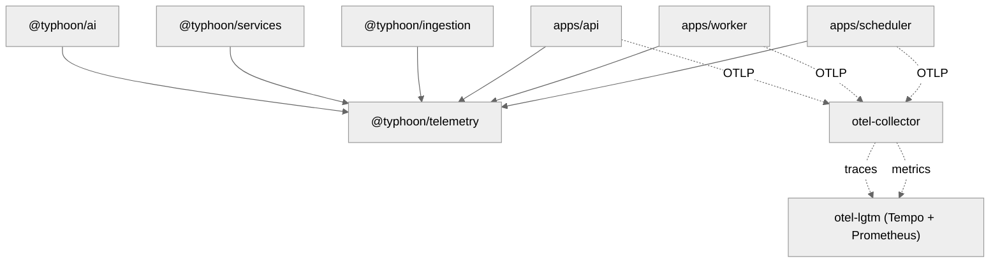

# @typhoon/telemetry

OpenTelemetry instrumentation for the Typhoon platform. Provides auto-instrumentation for PostgreSQL, Redis, BullMQ, and HTTP (Hono), plus a Mastra OTel bridge for agent/model/tool spans, and custom application metrics.

## Architecture Context

`@typhoon/telemetry` is imported by every backend app (API, worker, scheduler) and by `@typhoon/ai` for LLM request metrics. It provides the full observability stack: traces, metrics, and the Mastra bridge that connects framework-level spans to the OTel pipeline.



### Telemetry Pipeline

```
App (api/worker/scheduler)
  |  OTLP traces + metrics
  v
otel-collector
  +-- spanmetrics connector (derives LLM/queue metrics from span attributes)
  +-- forwards traces -> otel-lgtm (Tempo)
  +-- forwards metrics -> otel-lgtm (Prometheus)
```

LLM token usage, request duration, and queue job metrics are **not manually recorded** -- they are derived automatically from span attributes by the OTel Collector's `spanmetrics` connector. Only business metrics that don't correspond to spans are recorded manually in this package.

## Internal Structure

```
src/
  index.ts                      -- Package entry: tracer/meter factories, Mastra bridge, re-exports
  instrumentation.ts            -- OTel Node SDK initialization (must be first import)
  instrumentation.test.ts       -- Tests for SDK initialization
  hono-middleware.ts            -- Hono HTTP middleware (wraps @hono/otel)
  hono-middleware.test.ts       -- Middleware tests
  metrics.ts                    -- All custom application metric definitions
  metrics.test.ts               -- Metric definition tests
  index.test.ts                 -- Tests for tracer/meter/observability factories
```

The package exposes two entry points:

| Entry Point     | Import Path                       | Purpose                                                         |
| --------------- | --------------------------------- | --------------------------------------------------------------- |
| Main            | `@typhoon/telemetry`                 | Tracer/meter factories, Mastra bridge, Hono middleware, metrics |
| Instrumentation | `@typhoon/telemetry/instrumentation` | OTel Node SDK init (must be first import in app entrypoint)     |

## Setup

### Step 1: Initialize instrumentation (first import)

Import the instrumentation module **as the very first import** in your app entrypoint. This initializes the OpenTelemetry Node SDK before any other code loads, enabling auto-instrumentation of database drivers, Redis, and BullMQ.

```typescript
import '@typhoon/telemetry/instrumentation';

// ... rest of your app
```

### Step 2: Add Hono middleware (API server)

```typescript
import { otelMiddleware } from '@typhoon/telemetry';

app.use('*', otelMiddleware());
```

### Step 3: Configure Mastra observability

```typescript
import { createMastraObservability } from '@typhoon/telemetry';

const mastra = new Mastra({
  observability: createMastraObservability('typhoon-api'),
  // ...
});
```

## Auto-Instrumentations

The instrumentation module (`@typhoon/telemetry/instrumentation`) automatically instruments:

| Library           | Instrumentation Package                           | Configuration                      | Spans Created                                                |
| ----------------- | ------------------------------------------------- | ---------------------------------- | ------------------------------------------------------------ |
| PostgreSQL (`pg`) | `@opentelemetry/instrumentation-pg`               | `enhancedDatabaseReporting: false` | Query spans with db.statement                                |
| Redis (`ioredis`) | `@opentelemetry/instrumentation-ioredis`          | `requireParentSpan: true`          | Command spans (only when parent span exists, to avoid flood) |
| BullMQ            | `@appsignal/opentelemetry-instrumentation-bullmq` | Default                            | Job publish/process spans with producer-to-consumer linking  |

### SDK Configuration

| Component              | Setting                                                          |
| ---------------------- | ---------------------------------------------------------------- |
| Trace exporter         | OTLP/proto to `{endpoint}/v1/traces`                             |
| Metric exporter        | OTLP/proto to `{endpoint}/v1/metrics`                            |
| Metric export interval | 30 seconds                                                       |
| Span processor         | `BatchSpanProcessor`                                             |
| Context propagation    | `W3CTraceContextPropagator`                                      |
| Resource attributes    | `service.name`, `service.version`, `deployment.environment.name` |
| Graceful shutdown      | `SIGTERM` handler flushes pending spans/metrics                  |

## Exports

### Tracer and Meter Factories

```typescript
import { getTracer, getMeter } from '@typhoon/telemetry';

const tracer = getTracer('my-module'); // For creating manual spans
const meter = getMeter('my-module'); // For creating custom metrics
```

### Active Trace ID

```typescript
import { getActiveTraceId } from '@typhoon/telemetry';

// Capture trace context before an async boundary
const traceId = getActiveTraceId(); // string | null
```

### Hono Middleware

```typescript
import { otelMiddleware } from '@typhoon/telemetry';

app.use('*', otelMiddleware());
```

Wraps `@hono/otel` `httpInstrumentationMiddleware`. Creates HTTP server spans, records `http.server.request.duration` histogram and `http.server.active_requests` gauge, and propagates W3C trace context.

### Mastra Observability Bridge

```typescript
import { createMastraObservability } from '@typhoon/telemetry';

const observability = createMastraObservability('typhoon-api');
```

Creates a Mastra `Observability` instance with the `@mastra/otel-bridge`. Agent/model/tool spans become children of active OTel spans via `AsyncLocalStorage`. The bridge automatically sets GenAI semantic convention attributes:

- `gen_ai.usage.input_tokens` / `gen_ai.usage.output_tokens`
- `gen_ai.usage.cached_input_tokens`
- `gen_ai.request.model` / `gen_ai.provider.name`

These span attributes are converted to Prometheus metrics by the spanmetrics connector.

### SpanStatusCode

Re-exported from `@opentelemetry/api` for convenience when setting span status in custom instrumentation.

## Custom Application Metrics

All metrics are defined on a shared `typhoon` meter. Only metrics that cannot be derived from spans are defined here.

### Conversation Metrics

| Metric                 | Type    | Description                 | Attributes |
| ---------------------- | ------- | --------------------------- | ---------- |
| `conversation.started` | Counter | Total conversations started | `agent`    |

### Queue / Sync Metrics

| Metric                | Type            | Unit | Description                 | Attributes |
| --------------------- | --------------- | ---- | --------------------------- | ---------- |
| `sync.queue.depth`    | ObservableGauge | --   | Jobs waiting in sync queue  | --         |
| `sync.job.duration`   | Histogram       | ms   | Job processing duration     | `jobType`  |
| `sync.job.completed`  | Counter         | --   | Completed sync jobs         | `jobType`  |
| `sync.job.failed`     | Counter         | --   | Failed sync jobs            | `jobType`  |
| `sync.job.stalled`    | Counter         | --   | Stalled sync jobs           | --         |
| `sync.stage.duration` | Histogram       | ms   | Per-stage pipeline duration | `stage`    |

### Scoring Metrics

| Metric                         | Type      | Unit | Description                                   | Attributes |
| ------------------------------ | --------- | ---- | --------------------------------------------- | ---------- |
| `scoring.scorer.duration`      | Histogram | ms   | Individual scorer execution duration          | `scorer`   |
| `scoring.flow.partial_failure` | Counter   | --   | Scoring flows with at least one failed scorer | --         |

### Embedding Metrics

| Metric                   | Type      | Unit   | Description                                    | Attributes |
| ------------------------ | --------- | ------ | ---------------------------------------------- | ---------- |
| `embed.chunk.size_chars` | Histogram | chars  | Character count per chunk sent for embedding   | --         |
| `embed.retry`            | Counter   | --     | Embedding retries from token/size limit errors | --         |
| `embed.token_usage`      | Histogram | tokens | Tokens consumed per embedding call             | --         |

### LLM Provider Metrics

| Metric                 | Type      | Unit | Description                                  | Attributes          |
| ---------------------- | --------- | ---- | -------------------------------------------- | ------------------- |
| `llm.request.duration` | Histogram | ms   | LLM/embedding provider HTTP request duration | `status`            |
| `llm.request.retries`  | Counter   | --   | LLM provider request retries                 | `attempt`, `status` |

### Reranker Metrics

| Metric                   | Type    | Description                           | Attributes         |
| ------------------------ | ------- | ------------------------------------- | ------------------ |
| `rerank.search_units`    | Counter | Reranker billed search units (Cohere) | `model`            |
| `rerank.request.retries` | Counter | Reranker request retries              | `model`, `attempt` |

## Derived Metrics (via spanmetrics connector)

These Prometheus metrics are produced automatically by the OTel Collector from span data -- no application code required:

| Prometheus Metric                                                       | Source                        |
| ----------------------------------------------------------------------- | ----------------------------- |
| `traces_span_metrics_calls_total{span_name="chat ..."}`                 | Mastra MODEL_GENERATION spans |
| `traces_span_metrics_duration_milliseconds_*{span_name="chat ..."}`     | Span duration                 |
| `traces_span_metrics_calls_total{gen_ai_operation_name="invoke_agent"}` | Mastra AGENT_RUN spans        |
| `http_server_request_duration_seconds_*`                                | @hono/otel HTTP spans         |
| `http_server_active_requests`                                           | @hono/otel gauge              |

## Environment Variables

| Variable                      | Default                 | Description                                                                           |
| ----------------------------- | ----------------------- | ------------------------------------------------------------------------------------- |
| `OTEL_EXPORTER_OTLP_ENDPOINT` | `http://localhost:4318` | OTLP receiver URL                                                                     |
| `OTEL_SERVICE_NAME`           | `typhoon`                  | Service identifier (e.g., `typhoon-api`, `typhoon-worker`)                                  |
| `OTEL_SERVICE_VERSION`        | `0.0.0`                 | Service version                                                                       |
| `NODE_ENV`                    | `development`           | Deployment environment name (set as `deployment.environment.name` resource attribute) |

In Docker Compose, these are set per service and point to `otel-collector:4318`. For non-prod/prod K8s, override `OTEL_EXPORTER_OTLP_ENDPOINT` to point to your OTel-compatible provider.

## Dependencies

| Package                                           | Purpose                                           |
| ------------------------------------------------- | ------------------------------------------------- |
| `@opentelemetry/sdk-node`                         | OTel Node SDK for initialization                  |
| `@opentelemetry/sdk-trace-base`                   | `BatchSpanProcessor` for span export              |
| `@opentelemetry/sdk-metrics`                      | `PeriodicExportingMetricReader` for metric export |
| `@opentelemetry/exporter-trace-otlp-proto`        | OTLP/proto trace exporter                         |
| `@opentelemetry/exporter-metrics-otlp-proto`      | OTLP/proto metric exporter                        |
| `@opentelemetry/api`                              | Trace/metrics API, `SpanStatusCode`               |
| `@opentelemetry/core`                             | `W3CTraceContextPropagator`                       |
| `@opentelemetry/resources`                        | `Resource` with service attributes                |
| `@opentelemetry/semantic-conventions`             | Attribute name constants                          |
| `@opentelemetry/instrumentation-pg`               | PostgreSQL auto-instrumentation                   |
| `@opentelemetry/instrumentation-ioredis`          | Redis auto-instrumentation                        |
| `@appsignal/opentelemetry-instrumentation-bullmq` | BullMQ auto-instrumentation                       |
| `@hono/otel`                                      | Hono HTTP middleware                              |
| `@mastra/observability`                           | Mastra `Observability` class                      |
| `@mastra/otel-bridge`                             | Bridge connecting Mastra spans to OTel context    |
| `hono`                                            | Hono types for middleware                         |

## Cross-References

- [Infrastructure guide](../../docs/infrastructure.md)
- [Architecture overview](../../docs/architecture.md)
- [Environment variables reference](../../docs/environment-variables.md)
