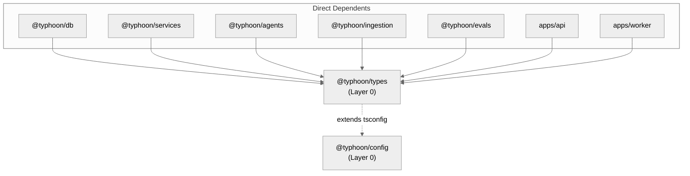

# @typhoon/types

Shared domain type definitions and Zod schemas for the Typhoon monorepo. Provides runtime validation schemas with TypeScript types inferred from them, ensuring that runtime checks and compile-time types are always in sync. This is a Layer 0 foundation package alongside `@typhoon/config`.

## Architecture Context



`@typhoon/types` is consumed by 7 direct dependents across the monorepo. It is the canonical location for all domain entity shapes -- repos, services, routes, and workers all validate against these schemas.

### How Dependents Use This Package

| Consumer          | What it imports                                                                                | Why                                                                           |
| ----------------- | ---------------------------------------------------------------------------------------------- | ----------------------------------------------------------------------------- |
| `@typhoon/db`        | `MetadataSchema`, `resolveTemplateSchema`                                                      | Metadata repo resolves template schemas for queries                           |
| `@typhoon/services`  | `validateCustomMetadata`, `resolveTemplateSchema`, `syncTargetConfigSchemas`                   | Business logic validation of documents and sync targets                       |
| `@typhoon/ingestion` | `configSyncTargetSchema`, `syncTargetConfigSchemas`, `applySchemaDefaults`, `ConfigSyncTarget` | Registry validates config-defined targets; pipeline applies metadata defaults |
| `@typhoon/agents`    | `MetadataSchema` (type)                                                                        | Knowledge agent metadata filter context                                       |
| `@typhoon/evals`     | Schema types for experiment dataset items                                                      | Scorer input validation                                                       |
| `apps/api`        | CRUD schemas (`create*`, `update*`), `ConfigSyncTarget`                                        | Route-level request body validation                                           |
| `apps/worker`     | Schema types for job payloads                                                                  | Worker input validation                                                       |

## Internal Structure

```
packages/types/
  src/
    index.ts            Re-exports all schemas, types, and utilities
    document.ts         Document entity schema and status enum
    feedback.ts         Feedback entity schema and rating enum
    sync-job.ts         Sync job entity schema and status enum
    sync-target.ts      Sync target schemas (DB row, create, update, config)
    metadata.ts         Metadata field definitions, templates, validation, Zod builders
    metadata.test.ts    Metadata unit tests (vitest)
  tsconfig.json         Extends @typhoon/config/tsconfig.lib.json
  package.json
```

## Domain Schemas

All TypeScript types are inferred from Zod schemas via `z.infer<typeof schema>`, so runtime validation and compile-time types stay in sync automatically.

### Document

Defined in `src/document.ts`. Represents an ingested document tracked by the system.

#### `documentStatusEnum`

```typescript
z.enum(['pending', 'processing', 'ready', 'error', 'deleted']);
```

Type: `DocumentStatus = 'pending' | 'processing' | 'ready' | 'error' | 'deleted'`

#### `documentSchema`

| Field            | Zod Type                            | Default     | Description                            |
| ---------------- | ----------------------------------- | ----------- | -------------------------------------- |
| `id`             | `z.string().uuid()`                 | --          | Primary key                            |
| `syncTargetId`   | `z.string().uuid()`                 | --          | Owning sync target                     |
| `sourceKey`      | `z.string().min(1)`                 | --          | S3 object key                          |
| `sourceEtag`     | `z.string().nullable()`             | `null`      | S3 ETag for change detection           |
| `mimeType`       | `z.string().nullable()`             | `null`      | Detected MIME type                     |
| `fileSize`       | `z.number().int().nullable()`       | `null`      | File size in bytes                     |
| `title`          | `z.string().nullable()`             | `null`      | Extracted or generated title           |
| `author`         | `z.string().nullable()`             | `null`      | Extracted author                       |
| `pageCount`      | `z.number().int().nullable()`       | `null`      | Page count (for PDFs)                  |
| `status`         | `documentStatusEnum`                | `'pending'` | Processing status                      |
| `errorMessage`   | `z.string().nullable()`             | `null`      | Error details when status is `'error'` |
| `chunkCount`     | `z.number().int()`                  | `0`         | Number of vector chunks created        |
| `customMetadata` | `z.record(z.string(), z.unknown())` | `{}`        | Template-defined metadata (JSONB)      |
| `contentHash`    | `z.string().nullable()`             | `null`      | Hash for deduplication                 |
| `lastSyncedAt`   | `z.date().nullable()`               | `null`      | Last successful sync timestamp         |
| `createdAt`      | `z.date()`                          | --          | Creation timestamp                     |
| `updatedAt`      | `z.date()`                          | --          | Last update timestamp                  |

### Feedback

Defined in `src/feedback.ts`. Represents user feedback (thumbs up/down) on agent responses.

#### `feedbackRatingEnum`

```typescript
z.enum(['positive', 'negative']);
```

Type: `FeedbackRating = 'positive' | 'negative'`

#### `feedbackSchema`

| Field       | Zod Type                | Default | Description                  |
| ----------- | ----------------------- | ------- | ---------------------------- |
| `id`        | `z.string().uuid()`     | --      | Primary key                  |
| `threadId`  | `z.string()`            | --      | Conversation thread ID       |
| `messageId` | `z.string()`            | --      | Message being rated          |
| `userId`    | `z.string()`            | --      | User who gave feedback       |
| `rating`    | `feedbackRatingEnum`    | --      | `'positive'` or `'negative'` |
| `comment`   | `z.string().nullable()` | `null`  | Optional text comment        |
| `createdAt` | `z.date()`              | --      | Creation timestamp           |

#### `createFeedbackSchema`

Derived via `feedbackSchema.omit({ id: true, createdAt: true })`. Used for API request body validation when submitting feedback.

Type: `CreateFeedback`

### Sync Job

Defined in `src/sync-job.ts`. Represents a document synchronization job execution.

#### `syncJobStatusEnum`

```typescript
z.enum(['running', 'completed', 'failed']);
```

Type: `SyncJobStatus = 'running' | 'completed' | 'failed'`

#### `syncJobSchema`

| Field          | Zod Type                | Default     | Description                             |
| -------------- | ----------------------- | ----------- | --------------------------------------- |
| `id`           | `z.string().uuid()`     | --          | Primary key                             |
| `syncTargetId` | `z.string().uuid()`     | --          | Owning sync target                      |
| `status`       | `syncJobStatusEnum`     | `'running'` | Job execution status                    |
| `filesScanned` | `z.number().int()`      | `0`         | Total files scanned in S3               |
| `filesNew`     | `z.number().int()`      | `0`         | New files detected                      |
| `filesUpdated` | `z.number().int()`      | `0`         | Changed files (by ETag)                 |
| `filesDeleted` | `z.number().int()`      | `0`         | Files removed from S3                   |
| `filesErrored` | `z.number().int()`      | `0`         | Files that failed processing            |
| `errorMessage` | `z.string().nullable()` | `null`      | Error details when status is `'failed'` |
| `startedAt`    | `z.date()`              | --          | Job start timestamp                     |
| `completedAt`  | `z.date().nullable()`   | `null`      | Job completion timestamp                |

### Sync Target

Defined in `src/sync-target.ts`. Represents a configured document source (e.g., an S3 bucket prefix).

#### `syncTargetSchema` (DB row)

| Field                 | Zod Type                                  | Default         | Description                                    |
| --------------------- | ----------------------------------------- | --------------- | ---------------------------------------------- |
| `id`                  | `z.string().uuid()`                       | --              | Primary key                                    |
| `name`                | `z.string().min(1)`                       | --              | Human-readable name                            |
| `sourceType`          | `z.string().min(1)`                       | --              | Source type identifier (e.g. `'s3'`)           |
| `config`              | `z.record(z.string(), z.unknown())`       | --              | Source-type-specific configuration             |
| `cronSchedule`        | `z.string()` (5-field cron)               | `'0 */6 * * *'` | Sync schedule (validated as 5-field cron)      |
| `isActive`            | `z.boolean()`                             | `true`          | Whether sync scheduling is enabled             |
| `managedBy`           | `z.enum(['config', 'manual']).nullable()` | `null`          | Whether created via config file or UI          |
| `source`              | `z.string().nullable()`                   | `null`          | Source identifier for config-managed targets   |
| `metadataTemplateId`  | `z.string().uuid().nullable()`            | `null`          | Optional metadata template assignment          |
| `autoExtractMetadata` | `z.boolean()`                             | `false`         | Enable LLM-based metadata extraction on ingest |
| `createdAt`           | `z.date()`                                | --              | Creation timestamp                             |
| `updatedAt`           | `z.date()`                                | --              | Last update timestamp                          |

#### `createSyncTargetSchema`

Derived via `syncTargetSchema.omit({ id: true, createdAt: true, updatedAt: true })`. Used for API create requests.

Type: `CreateSyncTarget`

#### `updateSyncTargetSchema`

Derived via `createSyncTargetSchema.partial()`. All fields optional for partial updates.

Type: `UpdateSyncTarget`

#### `configSyncTargetSchema`

Separate schema for sync targets defined in application configuration (used by `registerSyncTarget` at startup). Includes `source` as a required field and applies `trim()` to string inputs.

| Field          | Zod Type                            | Default         | Description                        |
| -------------- | ----------------------------------- | --------------- | ---------------------------------- |
| `name`         | `z.string().trim().min(1)`          | --              | Display name                       |
| `source`       | `z.string().trim().min(1)`          | --              | Unique source identifier           |
| `sourceType`   | `z.string().trim().min(1)`          | --              | Source type (e.g. `'s3'`)          |
| `config`       | `z.record(z.string(), z.unknown())` | --              | Source-type-specific configuration |
| `cronSchedule` | `z.string()` (5-field cron)         | `'0 */6 * * *'` | Sync schedule                      |
| `isActive`     | `z.boolean()`                       | `true`          | Whether sync scheduling is enabled |

Types: `ConfigSyncTarget` (output), `ConfigSyncTargetInput` (input, via `z.input<>`)

#### `syncTargetConfigSchemas`

Registry of per-source-type config validation schemas:

```typescript
syncTargetConfigSchemas: { s3: z.ZodType } & Record<string, z.ZodType | undefined>
```

Currently supports:

| Source Type | Schema Fields                                                    |
| ----------- | ---------------------------------------------------------------- |
| `s3`        | `bucket: z.string().min(1)`, `prefix: z.string()` (default `""`) |

This registry is extensible -- add new source types by adding entries with their config schemas. The schema is `.strict()`, so unknown config keys are rejected.

### Metadata

Defined in `src/metadata.ts`. Provides the complete metadata system for user-defined custom fields on documents. This is the most complex module, supporting field groups, templates, schema resolution, validation, and Zod schema generation for LLM structured output.

#### Core Types

##### `metadataFieldTypeEnum`

```typescript
z.enum(['string', 'number', 'boolean', 'string[]']);
```

Type: `MetadataFieldType = 'string' | 'number' | 'boolean' | 'string[]'`

##### `metadataFieldDefinitionSchema`

Defines a single metadata field:

| Field           | Zod Type                | Required | Description                                    |
| --------------- | ----------------------- | -------- | ---------------------------------------------- |
| `type`          | `metadataFieldTypeEnum` | Yes      | Field data type                                |
| `required`      | `z.boolean()`           | No       | Whether the field is required on documents     |
| `default`       | `z.unknown()`           | No       | Default value applied when field is missing    |
| `allowedValues` | `z.array(z.unknown())`  | No       | Enumerated list of allowed values              |
| `description`   | `z.string()`            | No       | Human-readable description (propagated to LLM) |

Type: `MetadataFieldDefinition`

##### `metadataSchemaSchema`

```typescript
z.record(z.string(), metadataFieldDefinitionSchema);
```

A record mapping field names to their definitions. Type: `MetadataSchema`

#### API Validation Schemas

##### `createMetadataFieldGroupSchema`

| Field         | Zod Type                            | Required | Description                          |
| ------------- | ----------------------------------- | -------- | ------------------------------------ |
| `name`        | `z.string().trim().min(1).max(100)` | Yes      | Group name (1--100 chars)            |
| `description` | `z.string().max(500).nullable()`    | No       | Optional description (max 500 chars) |
| `fields`      | `metadataSchemaSchema`              | Yes      | Field definitions                    |

##### `updateMetadataFieldGroupSchema`

Derived via `createMetadataFieldGroupSchema.partial()`. All fields optional.

##### `createMetadataTemplateSchema`

| Field           | Zod Type                            | Default | Description                                   |
| --------------- | ----------------------------------- | ------- | --------------------------------------------- |
| `name`          | `z.string().trim().min(1).max(100)` | --      | Template name (1--100 chars)                  |
| `description`   | `z.string().max(500).nullable()`    | --      | Optional description                          |
| `fieldGroupIds` | `z.array(z.string().uuid())`        | `[]`    | Referenced field group IDs (applied in order) |
| `customFields`  | `metadataSchemaSchema`              | `{}`    | Template-specific field definitions           |

##### `updateMetadataTemplateSchema`

Derived via `createMetadataTemplateSchema.partial()`. All fields optional.

#### Reserved Metadata Keys

The following keys are reserved for internal use by the vector chunk metadata system. Custom metadata fields must not use these names:

`text`, `documentId`, `syncTargetId`, `source`, `title`, `section`, `keywords`, `startIndex`

`validateCustomMetadata()` rejects any user data or schema field definitions that use reserved keys.

#### Utility Functions

##### `resolveTemplateSchema(template, groups)`

Merges fields from referenced field groups and template-specific custom fields into a single effective `MetadataSchema`.

```typescript
function resolveTemplateSchema(
  template: { fieldGroupIds: string[]; customFields: MetadataSchema },
  groups: Array<{ id: string; fields: MetadataSchema }>,
): MetadataSchema;
```

- Groups are applied in order of `fieldGroupIds`
- Later groups and custom fields override earlier ones on name collision
- Missing group IDs are silently skipped

##### `applySchemaDefaults(schema)`

Extracts all default values from a metadata schema, returning a record suitable for use as baseline `customMetadata` for new documents.

```typescript
function applySchemaDefaults(schema: MetadataSchema): Record<string, unknown>;
```

Returns only fields that have a `default` defined. Fields without defaults are omitted.

##### `validateCustomMetadata(data, schema)`

Validates user-supplied custom metadata against a resolved schema. Returns a `MetadataValidationResult`:

```typescript
interface MetadataValidationResult {
  valid: boolean;
  errors: string[];
  normalized: Record<string, unknown>; // Cleaned data with defaults applied
}
```

Behavior:

- Applies defaults for missing optional fields
- Type-checks all values against the schema definition
- Validates `allowedValues` constraints (including array element validation for `string[]`)
- Rejects reserved metadata keys in user data
- Rejects schema fields that conflict with reserved keys
- **Silently strips non-schema keys** -- only template-defined fields survive
- Returns all errors (does not short-circuit on the first failure)

##### `buildZodFromMetadataSchema(schema)`

Builds a Zod object schema from a `MetadataSchema`. Used for LLM structured output extraction.

```typescript
function buildZodFromMetadataSchema(schema: MetadataSchema): z.ZodObject<Record<string, z.ZodNullable<z.ZodTypeAny>>>;
```

- All fields are **nullable** (not optional) for OpenAI `json_schema` compatibility
- Fields with `allowedValues` produce `z.enum(...)` constraints
- `string[]` fields with `allowedValues` produce `z.array(z.enum(...))`
- Field `description` values are propagated via `.describe()` for LLM prompt context

##### `buildDocumentMetadataSchema(metadataSchema?)`

Builds a combined Zod schema for document metadata extraction during ingestion. Always includes `title` and `description` fields, with optional custom fields appended from the metadata schema.

```typescript
function buildDocumentMetadataSchema(metadataSchema?: MetadataSchema): z.ZodObject<Record<string, z.ZodTypeAny>>;
```

Used by the ingestion pipeline to define the structured output shape for LLM-based title/description/metadata extraction.

## Usage Examples

### Validating API request bodies in routes

```typescript
import { createSyncTargetSchema } from '@typhoon/types';

// In a Hono route handler
app.post('/v1/sync-targets', async (c) => {
  const body = createSyncTargetSchema.parse(await c.req.json());
  // body is fully typed as CreateSyncTarget
  const target = await syncTargetService.create(body);
  return c.json(target, 201);
});
```

### Validating document custom metadata in services

```typescript
import { validateCustomMetadata } from '@typhoon/types';
import type { MetadataSchema } from '@typhoon/types';

const schema: MetadataSchema = {
  country: { type: 'string', required: true, allowedValues: ['US', 'DE', 'UK'] },
  priority: { type: 'number', default: 1 },
  tags: { type: 'string[]', allowedValues: ['legal', 'support', 'faq'] },
};

const result = validateCustomMetadata({ country: 'US', tags: ['legal'], extraField: 'ignored' }, schema);
// result.valid === true
// result.normalized === { country: 'US', tags: ['legal'], priority: 1 }
// (extraField stripped, priority default applied)
```

### Resolving a template schema for document validation

```typescript
import { resolveTemplateSchema, validateCustomMetadata } from '@typhoon/types';

// Fetch template and groups from DB
const template = await metadataRepo.getTemplateById(templateId);
const groups = await metadataRepo.getFieldGroupsByIds(template.fieldGroupIds);

// Merge into a single effective schema
const effectiveSchema = resolveTemplateSchema(template, groups);

// Validate document metadata against it
const result = validateCustomMetadata(documentMetadata, effectiveSchema);
```

### Building a Zod schema for LLM structured output

```typescript
import { buildDocumentMetadataSchema } from '@typhoon/types';
import type { MetadataSchema } from '@typhoon/types';

const metadataSchema: MetadataSchema = {
  region: { type: 'string', allowedValues: ['us-east', 'eu-west'], description: 'AWS region' },
  confidential: { type: 'boolean', description: 'Whether the document is confidential' },
};

const zodSchema = buildDocumentMetadataSchema(metadataSchema);
// zodSchema.shape includes: title, description, region (nullable enum), confidential (nullable boolean)

// Use with AI SDK structured output
const result = await generateText({
  model,
  prompt: `Extract metadata from: ${text}`,
  output: Output.object({ schema: zodSchema }),
});
```

### Validating sync target config by source type

```typescript
import { syncTargetConfigSchemas } from '@typhoon/types';

const sourceType = 's3';
const configSchema = syncTargetConfigSchemas[sourceType];
if (configSchema) {
  const validatedConfig = configSchema.parse({ bucket: 'my-docs', prefix: 'legal/' });
  // validatedConfig: { bucket: 'my-docs', prefix: 'legal/' }
}
```

### Applying schema defaults for new documents

```typescript
import { applySchemaDefaults } from '@typhoon/types';
import type { MetadataSchema } from '@typhoon/types';

const schema: MetadataSchema = {
  country: { type: 'string', default: 'US' },
  active: { type: 'boolean', default: true },
  notes: { type: 'string' }, // no default
};

const defaults = applySchemaDefaults(schema);
// defaults === { country: 'US', active: true }
```

## Dependencies

| Dependency     | Purpose                                                             |
| -------------- | ------------------------------------------------------------------- |
| `zod`          | Schema definition, validation, and type inference                   |
| `@typhoon/config` | TypeScript config inheritance (tsconfig only -- no runtime imports) |

## Related Documentation

- [Architecture](../../docs/architecture.md) -- 3-layer dependency model and package summary
- [Environment Variables](../../docs/environment-variables.md) -- Env var reference (validated by `@typhoon/config`)
- [Ingestion and RAG](../../docs/ingestion-and-rag.md) -- Document pipeline that consumes these schemas
